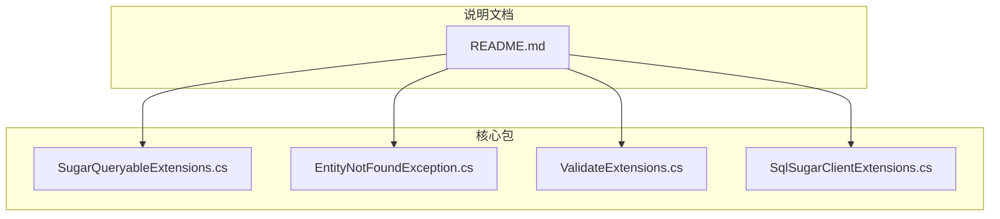
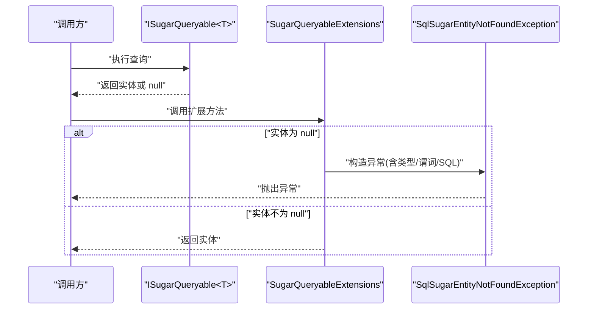
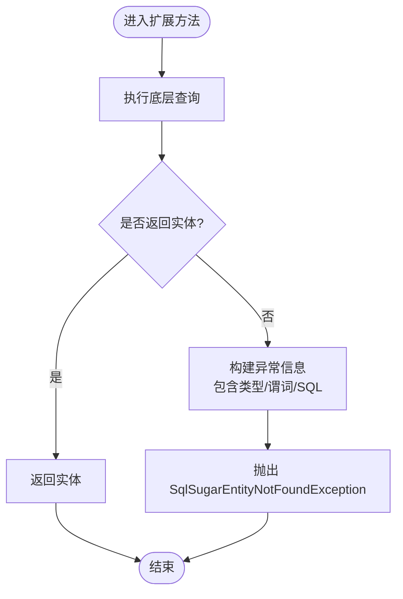
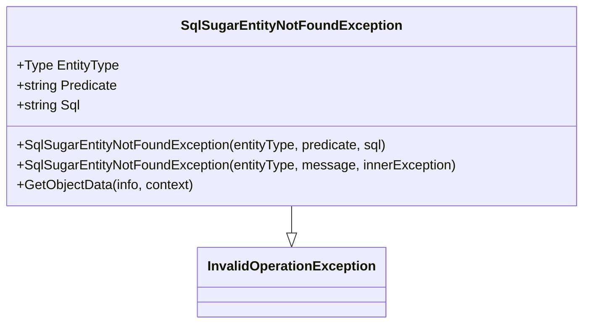
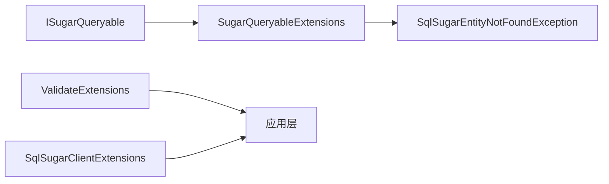

# API 参考

<cite>
**本文引用的文件**
- [EntityNotFoundException.cs](file://EasySharp.SqlSugarCore.Extensions/EntityNotFoundException.cs)
- [SugarQueryableExtensions.cs](file://EasySharp.SqlSugarCore.Extensions/SugarQueryableExtensions.cs)
- [ValidateExtensions.cs](file://ClassLibrary1/ValidateExtensions.cs)
- [SqlSugarClientExtensions.cs](file://ClassLibrary1/SqlSugarClientExtensions.cs)
- [README.md](file://README.md)
</cite>

## 目录
1. [简介](#简介)
2. [项目结构](#项目结构)
3. [核心组件](#核心组件)
4. [架构总览](#架构总览)
5. [详细组件分析](#详细组件分析)
6. [依赖关系分析](#依赖关系分析)
7. [性能考虑](#性能考虑)
8. [故障排查指南](#故障排查指南)
9. [结论](#结论)
10. [附录](#附录)

## 简介
本文件为 EasySharp.SqlSugarCore.Extensions 的完整 API 参考，覆盖以下内容：
- SugarQueryableExtensions 中的查询扩展方法（如 FirstRequiredAsync、InSingleRequired 等）的签名、参数、返回值与异常行为
- SqlSugarEntityNotFoundException 的属性与使用方式
- ValidateExtensions 与 SqlSugarClientExtensions 的工具方法说明
- 针对每个 API 的使用示例与注意事项，帮助开发者正确使用这些扩展接口

## 项目结构
该仓库包含多个版本的扩展包，以及一个核心包。核心 API 主要集中在以下文件中：
- 查询扩展：SugarQueryableExtensions.cs
- 异常类型：EntityNotFoundException.cs
- 工具扩展：ValidateExtensions.cs、SqlSugarClientExtensions.cs
- 使用说明与 API 表格：README.md

**图表来源**
- [README.md:1-117](file://README.md#L1-L117)
- [SugarQueryableExtensions.cs:1-94](file://EasySharp.SqlSugarCore.Extensions/SugarQueryableExtensions.cs#L1-L94)
- [EntityNotFoundException.cs:1-79](file://EasySharp.SqlSugarCore.Extensions/EntityNotFoundException.cs#L1-L79)
- [ValidateExtensions.cs:1-18](file://ClassLibrary1/ValidateExtensions.cs#L1-L18)
- [SqlSugarClientExtensions.cs:1-15](file://ClassLibrary1/SqlSugarClientExtensions.cs#L1-L15)

**章节来源**
- [README.md:1-117](file://README.md#L1-L117)

## 核心组件
本节概述所有公开 API 的职责与交互关系。

- SugarQueryableExtensions：提供基于 ISugarQueryable<T> 的强类型查询扩展，确保查询结果存在，否则抛出 SqlSugarEntityNotFoundException，并在可能的情况下附带 SQL 与谓词信息。
- SqlSugarEntityNotFoundException：继承自 InvalidOperationException，携带实体类型、查询谓词与 SQL 字段，便于定位问题。
- ValidateExtensions：提供 HasValue 与 IsNullOrEmpty 等校验扩展，统一空值判断逻辑。
- SqlSugarClientExtensions：提供 CopyContext 扩展，复制 SqlSugarClient 的映射与忽略配置，便于切换连接配置。

**章节来源**
- [SugarQueryableExtensions.cs:1-94](file://EasySharp.SqlSugarCore.Extensions/SugarQueryableExtensions.cs#L1-L94)
- [EntityNotFoundException.cs:1-79](file://EasySharp.SqlSugarCore.Extensions/EntityNotFoundException.cs#L1-L79)
- [ValidateExtensions.cs:1-18](file://ClassLibrary1/ValidateExtensions.cs#L1-L18)
- [SqlSugarClientExtensions.cs:1-15](file://ClassLibrary1/SqlSugarClientExtensions.cs#L1-L15)

## 架构总览
下图展示扩展方法与异常类型之间的调用关系与数据流向。

**图表来源**
- [SugarQueryableExtensions.cs:54-90](file://EasySharp.SqlSugarCore.Extensions/SugarQueryableExtensions.cs#L54-L90)
- [EntityNotFoundException.cs:13-33](file://EasySharp.SqlSugarCore.Extensions/EntityNotFoundException.cs#L13-L33)

## 详细组件分析

### SugarQueryableExtensions 查询扩展方法
本类提供强类型查询扩展，确保查询结果存在；若不存在，则抛出 SqlSugarEntityNotFoundException，并尽可能附带谓词与 SQL 信息。

- FirstRequiredAsync(this ISugarQueryable<T> queryable, string businessKey = null)
  - 方法签名路径：[SugarQueryableExtensions.cs:9-18](file://EasySharp.SqlSugarCore.Extensions/SugarQueryableExtensions.cs#L9-L18)
  - 参数
    - queryable: ISugarQueryable<T>，待查询对象
    - businessKey: string，业务键（作为谓词信息）
  - 返回值：Task<T>，实体实例（非 null）
  - 异常：当查询结果为 null 时，抛出 SqlSugarEntityNotFoundException
  - 适用场景：需要保证查询结果存在的异步场景，例如根据业务标识获取唯一记录
  - 注意事项：businessKey 将作为异常的谓词信息；若 ToSql 失败，SQL 信息可能为空

- FirstRequiredAsync(this ISugarQueryable<T> queryable, Expression<Func<T, bool>> expression)
  - 方法签名路径：[SugarQueryableExtensions.cs:20-29](file://EasySharp.SqlSugarCore.Extensions/SugarQueryableExtensions.cs#L20-L29)
  - 参数
    - queryable: ISugarQueryable<T>
    - expression: 表达式谓词
  - 返回值：Task<T>
  - 异常：当查询结果为 null 时，抛出 SqlSugarEntityNotFoundException
  - 适用场景：按表达式条件异步获取首条记录并断言存在
  - 注意事项：表达式字符串会被用作异常谓词；ToSql 失败时 SQL 信息可能为空

- InSingleRequired(this ISugarQueryable<T> queryable, object pkValue)
  - 方法签名路径：[SugarQueryableExtensions.cs:32-41](file://EasySharp.SqlSugarCore.Extensions/SugarQueryableExtensions.cs#L32-L41)
  - 参数
    - queryable: ISugarQueryable<T>
    - pkValue: object，主键值
  - 返回值：T
  - 异常：当查询结果为 null 时，抛出 SqlSugarEntityNotFoundException
  - 适用场景：按主键同步查询并断言存在
  - 注意事项：pkValue 转字符串后作为谓词；ToSql 失败时 SQL 信息可能为空

- InSingleRequiredAsync(this ISugarQueryable<T> queryable, object pkValue)
  - 方法签名路径：[SugarQueryableExtensions.cs:43-52](file://EasySharp.SqlSugarCore.Extensions/SugarQueryableExtensions.cs#L43-L52)
  - 参数
    - queryable: ISugarQueryable<T>
    - pkValue: object，主键值
  - 返回值：Task<T>
  - 异常：当查询结果为 null 时，抛出 SqlSugarEntityNotFoundException
  - 适用场景：按主键异步查询并断言存在
  - 注意事项：与同步版本一致，仅异步化

- 内部辅助方法
  - ThrowNotFound(ISugarQueryable<T>, string businessKey)：构造并抛出异常
    - 方法签名路径：[SugarQueryableExtensions.cs:54-63](file://EasySharp.SqlSugarCore.Extensions/SugarQueryableExtensions.cs#L54-L63)
  - ThrowNotFound(ISugarQueryable<T>, Expression)：构造并抛出异常
    - 方法签名路径：[SugarQueryableExtensions.cs:65-74](file://EasySharp.SqlSugarCore.Extensions/SugarQueryableExtensions.cs#L65-L74)
  - GetSqlString(ISugarQueryable<T>)：尝试获取 SQL 字符串，失败时返回 null
    - 方法签名路径：[SugarQueryableExtensions.cs:76-90](file://EasySharp.SqlSugarCore.Extensions/SugarQueryableExtensions.cs#L76-L90)

**图表来源**
- [SugarQueryableExtensions.cs:54-90](file://EasySharp.SqlSugarCore.Extensions/SugarQueryableExtensions.cs#L54-L90)
- [EntityNotFoundException.cs:53-77](file://EasySharp.SqlSugarCore.Extensions/EntityNotFoundException.cs#L53-L77)

**章节来源**
- [SugarQueryableExtensions.cs:1-94](file://EasySharp.SqlSugarCore.Extensions/SugarQueryableExtensions.cs#L1-L94)

### SqlSugarEntityNotFoundException 异常类型
- 继承关系：InvalidOperationException
- 公共属性
  - EntityType: Type，引发异常的实体类型
  - Predicate: string?，触发查询的谓词（可能为空）
  - Sql: string?，执行的 SQL 语句（可能为空）
- 构造函数
  - 重载1：传入 entityType、predicate、sql，内部拼接消息
    - 方法签名路径：[EntityNotFoundException.cs:13-22](file://EasySharp.SqlSugarCore.Extensions/EntityNotFoundException.cs#L13-L22)
  - 重载2：传入 entityType、message、innerException
    - 方法签名路径：[EntityNotFoundException.cs:24-33](file://EasySharp.SqlSugarCore.Extensions/EntityNotFoundException.cs#L24-L33)
  - 重载3：反序列化构造
    - 方法签名路径：[EntityNotFoundException.cs:35-43](file://EasySharp.SqlSugarCore.Extensions/EntityNotFoundException.cs#L35-L43)
- 序列化与反序列化
  - GetObjectData：写入 EntityType、Predicate、Sql
    - 方法签名路径：[EntityNotFoundException.cs:45-51](file://EasySharp.SqlSugarCore.Extensions/EntityNotFoundException.cs#L45-L51)
- 内部消息构建
  - BuildMessage：限制谓词与 SQL 最大长度，截断过长文本
    - 方法签名路径：[EntityNotFoundException.cs:53-77](file://EasySharp.SqlSugarCore.Extensions/EntityNotFoundException.cs#L53-L77)

**图表来源**
- [EntityNotFoundException.cs:7-51](file://EasySharp.SqlSugarCore.Extensions/EntityNotFoundException.cs#L7-L51)

**章节来源**
- [EntityNotFoundException.cs:1-79](file://EasySharp.SqlSugarCore.Extensions/EntityNotFoundException.cs#L1-L79)

### ValidateExtensions 工具扩展
- HasValue(this object? thisValue)
  - 判断对象是否非 null、非 DBNull、且字符串表示非空
  - 方法签名路径：[ValidateExtensions.cs:7-10](file://ClassLibrary1/ValidateExtensions.cs#L7-L10)
- IsNullOrEmpty(this object? thisValue)
  - 判断对象是否为 null、DBNull 或字符串表示为空
  - 方法签名路径：[ValidateExtensions.cs:12-15](file://ClassLibrary1/ValidateExtensions.cs#L12-L15)

注意：在较新版本中，IsNullOrEmpty 可能被移除，仅保留 HasValue。

**章节来源**
- [ValidateExtensions.cs:1-18](file://ClassLibrary1/ValidateExtensions.cs#L1-L18)

### SqlSugarClientExtensions 工具扩展
- CopyContext(this SqlSugarClient client, ConnectionConfig config)
  - 基于新的 ConnectionConfig 创建新的 SqlSugarClient，并复制 MappingColumns、MappingTables、IgnoreColumns 等上下文配置
  - 方法签名路径：[SqlSugarClientExtensions.cs:5-12](file://ClassLibrary1/SqlSugarClientExtensions.cs#L5-L12)

**章节来源**
- [SqlSugarClientExtensions.cs:1-15](file://ClassLibrary1/SqlSugarClientExtensions.cs#L1-L15)

## 依赖关系分析
- SugarQueryableExtensions 依赖 SqlSugar ORM 的 ISugarQueryable<T> 与 ToSqlString 能力，用于在异常中附带 SQL 信息
- 异常类型 SqlSugarEntityNotFoundException 由扩展方法在查询失败时抛出
- ValidateExtensions 与 SqlSugarClientExtensions 为独立工具类，分别提供空值判断与客户端上下文复制能力

**图表来源**
- [SugarQueryableExtensions.cs:76-90](file://EasySharp.SqlSugarCore.Extensions/SugarQueryableExtensions.cs#L76-L90)
- [EntityNotFoundException.cs:13-33](file://EasySharp.SqlSugarCore.Extensions/EntityNotFoundException.cs#L13-L33)
- [ValidateExtensions.cs:1-18](file://ClassLibrary1/ValidateExtensions.cs#L1-L18)
- [SqlSugarClientExtensions.cs:1-15](file://ClassLibrary1/SqlSugarClientExtensions.cs#L1-L15)

**章节来源**
- [SugarQueryableExtensions.cs:1-94](file://EasySharp.SqlSugarCore.Extensions/SugarQueryableExtensions.cs#L1-L94)
- [EntityNotFoundException.cs:1-79](file://EasySharp.SqlSugarCore.Extensions/EntityNotFoundException.cs#L1-L79)
- [ValidateExtensions.cs:1-18](file://ClassLibrary1/ValidateExtensions.cs#L1-L18)
- [SqlSugarClientExtensions.cs:1-15](file://ClassLibrary1/SqlSugarClientExtensions.cs#L1-L15)

## 性能考虑
- 异步方法优先：FirstRequiredAsync 与 InSingleRequiredAsync 提供异步版本，避免阻塞线程
- SQL 获取的容错：GetSqlString 在 ToSqlString 失败时静默忽略，避免影响主流程
- 异常信息裁剪：BuildMessage 对过长的谓词与 SQL 进行截断，控制异常消息大小
- 空值判断优化：HasValue 一次性完成 null、DBNull、空字符串判断，减少重复逻辑

[本节为通用建议，无需特定文件分析]

## 故障排查指南
- 当抛出 SqlSugarEntityNotFoundException 时，请检查以下字段：
  - EntityType：确认查询实体类型是否正确
  - Predicate：确认查询条件是否符合预期
  - Sql：确认生成的 SQL 是否正确
- 若 SQL 为空：可能是 ToSqlString 在当前查询条件下不可用，属预期容错
- 若谓词为空：可能传入了 null 的 businessKey 或表达式无法解析
- 建议在上层捕获异常并记录日志，结合 EntityType 与 Predicate 快速定位问题

**章节来源**
- [EntityNotFoundException.cs:53-77](file://EasySharp.SqlSugarCore.Extensions/EntityNotFoundException.cs#L53-L77)
- [SugarQueryableExtensions.cs:76-90](file://EasySharp.SqlSugarCore.Extensions/SugarQueryableExtensions.cs#L76-L90)

## 结论
本扩展库通过强类型的查询扩展与详细的异常信息，显著提升了数据库查询的健壮性与可观测性。开发者应优先使用异步扩展方法，并在上层妥善处理 SqlSugarEntityNotFoundException，以便快速定位问题。

[本节为总结，无需特定文件分析]

## 附录

### API 参考摘要（来自 README）
- SugarQueryableExtensions
  - FirstRequiredAsync<T>()
  - FirstRequiredAsync<T>(Expression<Func<T,bool>>)
  - InSingleRequired<T>(object pkValue)
  - InSingleRequiredAsync<T>(object pkValue)
- SqlSugarEntityNotFoundException
  - 属性：EntityType、Predicate、Sql

**章节来源**
- [README.md:92-117](file://README.md#L92-L117)