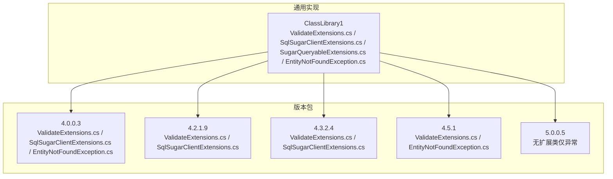
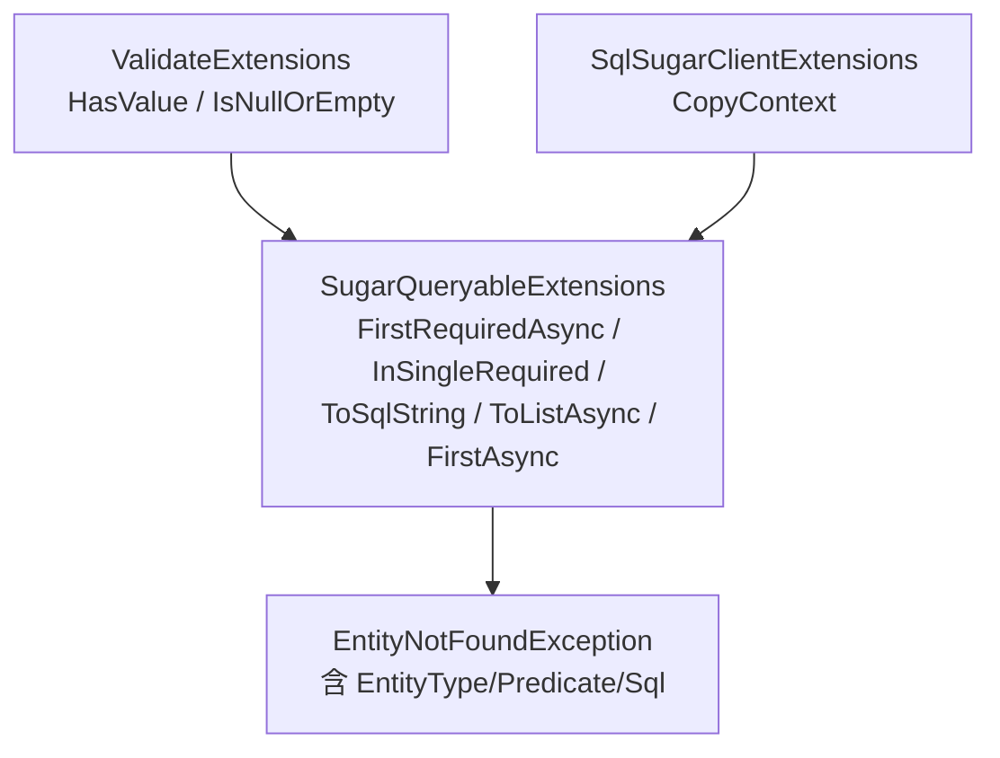
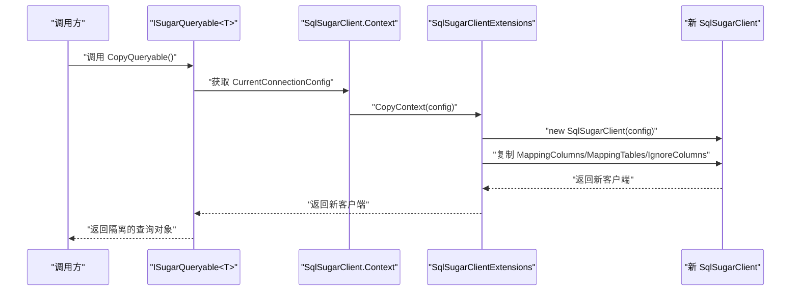
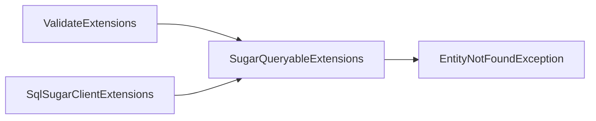

# 工具类扩展 API

<cite>
**本文引用的文件**
- [ValidateExtensions.cs](file://ClassLibrary1/ValidateExtensions.cs)
- [SqlSugarClientExtensions.cs](file://ClassLibrary1/SqlSugarClientExtensions.cs)
- [SugarQueryableExtensions.cs](file://ClassLibrary1/SugarQueryableExtensions.cs)
- [EntityNotFoundException.cs](file://ClassLibrary1/EntityNotFoundException.cs)
- [ValidateExtensions.cs（4.0.0.3）](file://EasySharp.SqlSugarCore.Extensions.4.0.0.3/ValidateExtensions.cs)
- [SqlSugarClientExtensions.cs（4.0.0.3）](file://EasySharp.SqlSugarCore.Extensions.4.0.0.3/SqlSugarClientExtensions.cs)
- [EntityNotFoundException.cs（4.0.0.3）](file://EasySharp.SqlSugarCore.Extensions.4.0.0.3/EntityNotFoundException.cs)
- [ValidateExtensions.cs（4.2.1.9）](file://EasySharp.SqlSugarCore.Extensions.4.2.1.9/ValidateExtensions.cs)
- [SqlSugarClientExtensions.cs（4.2.1.9）](file://EasySharp.SqlSugarCore.Extensions.4.2.1.9/SqlSugarClientExtensions.cs)
- [ValidateExtensions.cs（4.3.2.4）](file://EasySharp.SqlSugarCore.Extensions.4.3.2.4/ValidateExtensions.cs)
- [SqlSugarClientExtensions.cs（4.3.2.4）](file://EasySharp.SqlSugarCore.Extensions.4.3.2.4/SqlSugarClientExtensions.cs)
- [ValidateExtensions.cs（4.5.1）](file://EasySharp.SqlSugarCore.Extensions.4.5.1/ValidateExtensions.cs)
- [EntityNotFoundException.cs（4.5.1）](file://EasySharp.SqlSugarCore.Extensions.4.5.1/EntityNotFoundException.cs)
- [README.md](file://README.md)
</cite>

## 目录
1. [简介](#简介)
2. [项目结构](#项目结构)
3. [核心组件](#核心组件)
4. [架构总览](#架构总览)
5. [详细组件分析](#详细组件分析)
6. [依赖关系分析](#依赖关系分析)
7. [性能考量](#性能考量)
8. [故障排查指南](#故障排查指南)
9. [结论](#结论)
10. [附录](#附录)

## 简介
本文件面向工具类扩展 API 的使用者与维护者，系统化梳理 ValidateExtensions 与 SqlSugarClientExtensions 的工具方法，重点说明：
- ValidateExtensions.HasValue 与 IsNullOrEmpty 的判断逻辑与适用场景
- SqlSugarClientExtensions.CopyContext 的功能、参数与返回值，以及其在线程安全查询中的作用机制
- 各方法与核心查询功能（如 SugarQueryableExtensions）的配合方式与实际使用示例路径
- 多版本演进与兼容性说明

## 项目结构
该仓库按“版本分包”的方式组织，同一功能在不同 SqlSugar 版本下提供独立包，便于在不同运行环境中使用。核心扩展位于各版本子目录中，公共异常类型也随版本同步。

图表来源
- [ValidateExtensions.cs（4.0.0.3）:1-17](file://EasySharp.SqlSugarCore.Extensions.4.0.0.3/ValidateExtensions.cs#L1-L17)
- [SqlSugarClientExtensions.cs（4.0.0.3）:1-14](file://EasySharp.SqlSugarCore.Extensions.4.0.0.3/SqlSugarClientExtensions.cs#L1-L14)
- [ValidateExtensions.cs（4.2.1.9）:1-17](file://EasySharp.SqlSugarCore.Extensions.4.2.1.9/ValidateExtensions.cs#L1-L17)
- [SqlSugarClientExtensions.cs（4.2.1.9）:1-14](file://EasySharp.SqlSugarCore.Extensions.4.2.1.9/SqlSugarClientExtensions.cs#L1-L14)
- [ValidateExtensions.cs（4.3.2.4）:1-17](file://EasySharp.SqlSugarCore.Extensions.4.3.2.4/ValidateExtensions.cs#L1-L17)
- [SqlSugarClientExtensions.cs（4.3.2.4）:1-14](file://EasySharp.SqlSugarCore.Extensions.4.3.2.4/SqlSugarClientExtensions.cs#L1-L14)
- [ValidateExtensions.cs（4.5.1）:1-12](file://EasySharp.SqlSugarCore.Extensions.4.5.1/ValidateExtensions.cs#L1-L12)
- [EntityNotFoundException.cs（4.5.1）:1-79](file://EasySharp.SqlSugarCore.Extensions.4.5.1/EntityNotFoundException.cs#L1-L79)
- [README.md:28-37](file://README.md#L28-L37)

章节来源
- [README.md:28-37](file://README.md#L28-L37)

## 核心组件
- ValidateExtensions：提供对象值校验的扩展方法，用于判空与非空场景。
- SqlSugarClientExtensions：提供上下文复制能力，支撑线程安全查询。
- SugarQueryableExtensions：提供强类型查询扩展与异常增强，内部使用上述扩展与异常类型。
- EntityNotFoundException：统一的实体未找到异常类型，携带实体类型、谓词与 SQL 信息。

章节来源
- [ValidateExtensions.cs:1-17](file://ClassLibrary1/ValidateExtensions.cs#L1-L17)
- [SqlSugarClientExtensions.cs:1-14](file://ClassLibrary1/SqlSugarClientExtensions.cs#L1-L14)
- [SugarQueryableExtensions.cs:1-160](file://ClassLibrary1/SugarQueryableExtensions.cs#L1-L160)
- [EntityNotFoundException.cs:1-60](file://ClassLibrary1/EntityNotFoundException.cs#L1-L60)

## 架构总览
工具类扩展与核心查询的关系如下：ValidateExtensions 提供基础校验；SqlSugarClientExtensions 提供上下文复制，为并发/异步查询提供隔离；SugarQueryableExtensions 在查询链路中结合两者，确保强类型与异常信息的完整性。

图表来源
- [ValidateExtensions.cs:7-15](file://ClassLibrary1/ValidateExtensions.cs#L7-L15)
- [SqlSugarClientExtensions.cs:5-12](file://ClassLibrary1/SqlSugarClientExtensions.cs#L5-L12)
- [SugarQueryableExtensions.cs:13-99](file://ClassLibrary1/SugarQueryableExtensions.cs#L13-L99)
- [EntityNotFoundException.cs:12-21](file://ClassLibrary1/EntityNotFoundException.cs#L12-L21)

## 详细组件分析

### ValidateExtensions 工具方法
- HasValue(this object? thisValue)
  - 判断逻辑：对象不为空、不等于 DBNull、字符串表示不为空串时返回真。
  - 典型用途：避免对空引用或空字符串进行后续处理；常用于输入参数校验、字段非空判定。
  - 注意：对 DBNull 的显式判断有助于区分数据库空值与 .NET 空引用。
- IsNullOrEmpty(this object? thisValue)
  - 判断逻辑：对象为空、等于 DBNull 或字符串表示为空串时返回真。
  - 典型用途：快速判定集合/字符串/对象是否为空，适合前置校验与默认值处理。

使用示例（示例路径）
- 参数校验与默认值选择：[ValidateExtensions.cs:7-15](file://ClassLibrary1/ValidateExtensions.cs#L7-L15)
- 与查询条件组合：在 Where 条件前先用 IsNullOrEmpty 过滤无效条件，再拼接查询。

章节来源
- [ValidateExtensions.cs:7-15](file://ClassLibrary1/ValidateExtensions.cs#L7-L15)
- [ValidateExtensions.cs（4.0.0.3）:7-15](file://EasySharp.SqlSugarCore.Extensions.4.0.0.3/ValidateExtensions.cs#L7-L15)
- [ValidateExtensions.cs（4.2.1.9）:7-15](file://EasySharp.SqlSugarCore.Extensions.4.2.1.9/ValidateExtensions.cs#L7-L15)
- [ValidateExtensions.cs（4.3.2.4）:7-15](file://EasySharp.SqlSugarCore.Extensions.4.3.2.4/ValidateExtensions.cs#L7-L15)
- [ValidateExtensions.cs（4.5.1）:7-11](file://EasySharp.SqlSugarCore.Extensions.4.5.1/ValidateExtensions.cs#L7-L11)

### SqlSugarClientExtensions.CopyContext 方法
- 方法签名与参数
  - 接收者：SqlSugarClient
  - 参数：ConnectionConfig config
  - 返回：新的 SqlSugarClient 实例
- 功能说明
  - 基于传入连接配置创建新客户端，并复制原客户端的映射列、映射表与忽略列等上下文设置，保证新客户端具备相同的实体映射行为。
- 线程安全查询支持机制
  - SugarQueryableExtensions 内部通过 CopyContext 创建隔离的查询上下文，避免并发查询共享状态导致的竞争问题。
  - 复制后的新上下文启用自动关闭连接、日志事件等配置，确保异步查询的独立性与可观察性。
- 使用示例（示例路径）
  - 并发查询隔离：参考 [SugarQueryableExtensions.cs:119-142](file://ClassLibrary1/SugarQueryableExtensions.cs#L119-L142)，其中 CopyQueryable 调用 Context.CopyContext 完成上下文复制。

图表来源
- [SqlSugarClientExtensions.cs:5-12](file://ClassLibrary1/SqlSugarClientExtensions.cs#L5-L12)
- [SugarQueryableExtensions.cs:119-142](file://ClassLibrary1/SugarQueryableExtensions.cs#L119-L142)

章节来源
- [SqlSugarClientExtensions.cs:5-12](file://ClassLibrary1/SqlSugarClientExtensions.cs#L5-L12)
- [SugarQueryableExtensions.cs:119-142](file://ClassLibrary1/SugarQueryableExtensions.cs#L119-L142)

### 与核心查询功能的配合
- FirstRequiredAsync / InSingleRequired 系列
  - 当查询结果为空时，抛出包含实体类型、谓词与 SQL 的异常，提升调试效率。
  - 内部使用 ToSqlString 获取 SQL 字符串，便于异常定位。
- ToListAsync / FirstAsync
  - 通过 CopyQueryable 与 CopyContext 实现线程安全的异步查询，避免共享状态引发的问题。
- HasValue / IsNullOrEmpty 的配合
  - 在查询前先用 IsNullOrEmpty 过滤无效条件，减少无效查询；对可能为空的字段用 HasValue 避免误判。

使用示例（示例路径）
- 强类型查询与异常增强：[SugarQueryableExtensions.cs:13-99](file://ClassLibrary1/SugarQueryableExtensions.cs#L13-L99)
- SQL 字符串输出：[SugarQueryableExtensions.cs:96-99](file://ClassLibrary1/SugarQueryableExtensions.cs#L96-L99)
- 异步列表查询与上下文复制：[SugarQueryableExtensions.cs:108-142](file://ClassLibrary1/SugarQueryableExtensions.cs#L108-L142)

章节来源
- [SugarQueryableExtensions.cs:13-99](file://ClassLibrary1/SugarQueryableExtensions.cs#L13-L99)
- [SugarQueryableExtensions.cs:108-142](file://ClassLibrary1/SugarQueryableExtensions.cs#L108-L142)

## 依赖关系分析
- ValidateExtensions 与 SugarQueryableExtensions
  - SugarQueryableExtensions 在 FirstAsync 中使用 IsNullOrEmpty 判断排序模板是否需要设置默认值，体现对输入状态的稳健处理。
- SqlSugarClientExtensions 与 SugarQueryableExtensions
  - CopyContext 作为底层能力，被 CopyQueryable 复用，从而保障异步查询的上下文隔离。
- 异常类型
  - EntityNotFoundException 统一承载异常信息，便于上层捕获与日志记录。

图表来源
- [ValidateExtensions.cs:7-15](file://ClassLibrary1/ValidateExtensions.cs#L7-L15)
- [SqlSugarClientExtensions.cs:5-12](file://ClassLibrary1/SqlSugarClientExtensions.cs#L5-L12)
- [SugarQueryableExtensions.cs:149-157](file://ClassLibrary1/SugarQueryableExtensions.cs#L149-L157)
- [EntityNotFoundException.cs:12-21](file://ClassLibrary1/EntityNotFoundException.cs#L12-L21)

章节来源
- [SugarQueryableExtensions.cs:149-157](file://ClassLibrary1/SugarQueryableExtensions.cs#L149-L157)

## 性能考量
- CopyContext 与 CopyQueryable
  - 通过复制上下文创建独立查询实例，避免共享状态带来的锁竞争与数据竞争，适合高并发场景。
  - 复制过程中会复制映射与忽略列等配置，确保查询行为一致，但也会带来少量内存与初始化开销。
- ToListAsync 的任务启动策略
  - 通过手动启动 Task 并等待完成，简化了异步流程，但在极高并发下需关注线程池压力。
- HasValue / IsNullOrEmpty
  - 作为轻量级判断，建议在查询构建前尽早使用，减少无效查询次数，间接降低数据库压力。

## 故障排查指南
- 实体未找到异常
  - 现象：调用 FirstRequiredAsync / InSingleRequired 等方法时抛出异常。
  - 定位：检查 EntityType、Predicate 与 SQL 字段，确认查询条件与数据是否存在。
  - 参考：异常类型定义与消息格式见 [EntityNotFoundException.cs:12-21](file://ClassLibrary1/EntityNotFoundException.cs#L12-L21)。
- 查询结果为空的常见原因
  - 查询条件无效或 IsNullOrEmpty 导致被过滤。
  - 数据库中确实不存在匹配记录。
  - 排序模板缺失导致 FirstAsync 默认行为不符合预期。
- 上下文冲突与并发问题
  - 若出现并发查询互相影响，确认是否正确使用 CopyContext 与 CopyQueryable。

章节来源
- [EntityNotFoundException.cs:12-21](file://ClassLibrary1/EntityNotFoundException.cs#L12-L21)
- [SugarQueryableExtensions.cs:149-157](file://ClassLibrary1/SugarQueryableExtensions.cs#L149-L157)

## 结论
- ValidateExtensions 提供简洁可靠的空值判断能力，是查询前置校验与健壮性的基础。
- SqlSugarClientExtensions.CopyContext 为核心查询提供上下文隔离，是实现线程安全查询的关键。
- SugarQueryableExtensions 将上述能力整合到查询链路中，提供强类型、可诊断的查询体验。
- 多版本包满足不同 SqlSugar 版本需求，建议根据目标框架与版本选择对应包。

## 附录
- 版本兼容性与安装
  - 参见 [README.md:28-37](file://README.md#L28-L37) 与 [README.md:14-26](file://README.md#L14-L26)。
- API 参考
  - ValidateExtensions：HasValue / IsNullOrEmpty
  - SqlSugarClientExtensions：CopyContext
  - SugarQueryableExtensions：FirstRequiredAsync / InSingleRequired / ToSqlString / ToListAsync / FirstAsync
  - 异常类型：SqlSugarEntityNotFoundException（含 EntityType、Predicate、Sql）

章节来源
- [README.md:28-37](file://README.md#L28-L37)
- [README.md:92-110](file://README.md#L92-L110)