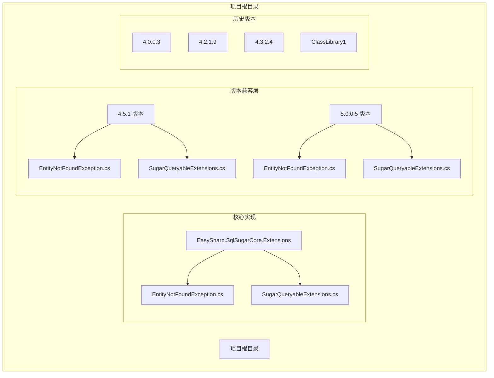
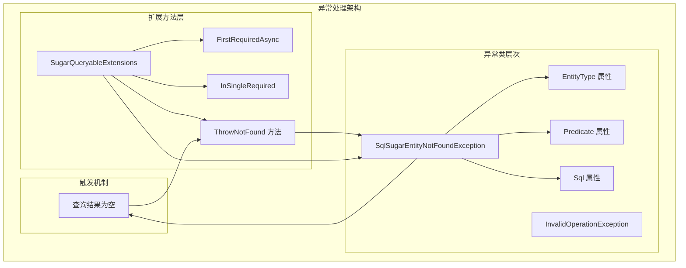
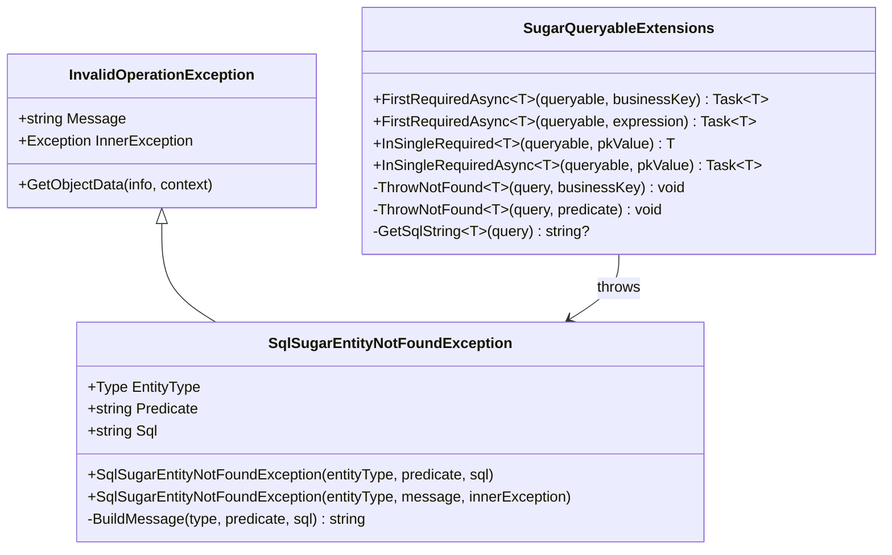
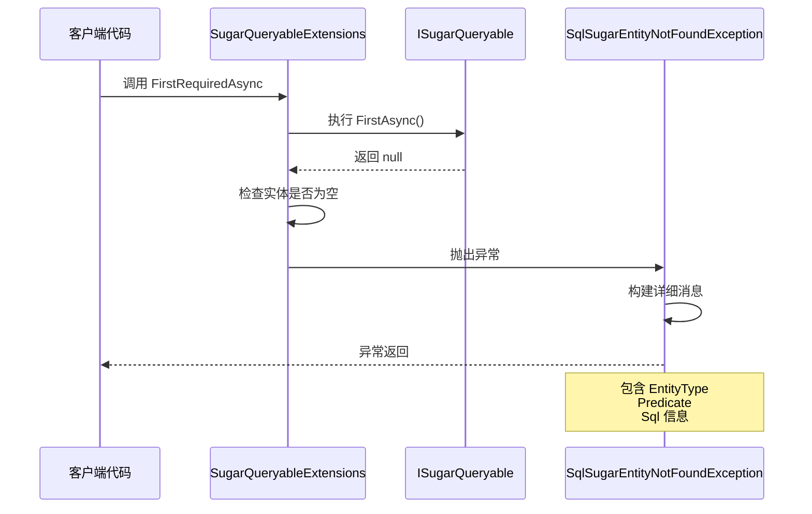
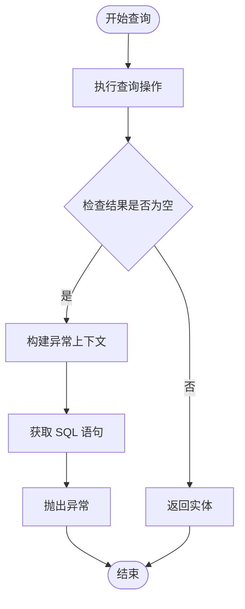
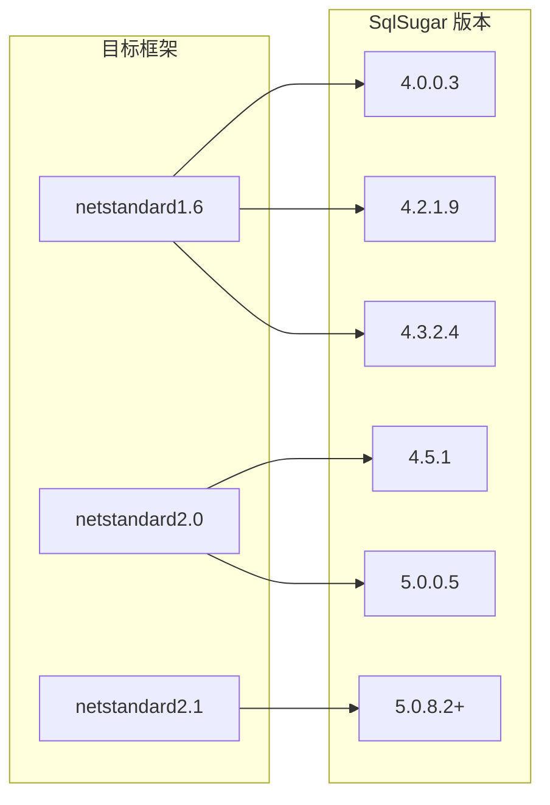

# 异常处理 API

<cite>
**本文引用的文件**
- [EntityNotFoundException.cs](file://EasySharp.SqlSugarCore.Extensions/EasySharp.SqlSugarCore.Extensions/EntityNotFoundException.cs)
- [SugarQueryableExtensions.cs](file://EasySharp.SqlSugarCore.Extensions/EasySharp.SqlSugarCore.Extensions/SugarQueryableExtensions.cs)
- [README.md](file://README.md)
- [EntityNotFoundException.cs（4.5.1）](file://EasySharp.SqlSugarCore.Extensions.4.5.1/EntityNotFoundException.cs)
- [SugarQueryableExtensions.cs（4.5.1）](file://EasySharp.SqlSugarCore.Extensions.4.5.1/SugarQueryableExtensions.cs)
- [EntityNotFoundException.cs（5.0.0.5）](file://EasySharp.SqlSugarCore.Extensions.5.0.0.5/EntityNotFoundException.cs)
- [SugarQueryableExtensions.cs（5.0.0.5）](file://EasySharp.SqlSugarCore.Extensions.5.0.0.5/SugarQueryableExtensions.cs)
- [EntityNotFoundException.cs（ClassLibrary1）](file://ClassLibrary1/EntityNotFoundException.cs)
- [SugarQueryableExtensions.cs（ClassLibrary1）](file://ClassLibrary1/SugarQueryableExtensions.cs)
</cite>

## 目录
1. [简介](#简介)
2. [项目结构](#项目结构)
3. [核心组件](#核心组件)
4. [架构概览](#架构概览)
5. [详细组件分析](#详细组件分析)
6. [依赖关系分析](#依赖关系分析)
7. [性能考量](#性能考量)
8. [故障排除指南](#故障排除指南)
9. [结论](#结论)

## 简介
本文件详细介绍了 EasySharp.SqlSugarCore.Extensions 库中的异常处理 API，重点围绕 SqlSugarEntityNotFoundException 类进行全面文档化。该异常类为 SqlSugar ORM 提供了强类型的实体未找到异常处理机制，通过 EntityType、Predicate、Sql 等属性提供丰富的上下文信息，帮助开发者快速定位和解决数据访问问题。

该库的核心价值在于：
- 提供强类型的查询扩展方法，确保查询结果的存在性
- 当实体未找到时，抛出包含详细上下文信息的异常
- 支持异步操作，提供完整的 API 覆盖
- 多版本兼容性，适配不同版本的 SqlSugar ORM

## 项目结构
该项目采用多版本兼容的目录结构设计，每个版本都有独立的实现文件：



**图表来源**
- [EntityNotFoundException.cs:1-79](file://EasySharp.SqlSugarCore.Extensions/EasySharp.SqlSugarCore.Extensions/EntityNotFoundException.cs#L1-L79)
- [SugarQueryableExtensions.cs:1-94](file://EasySharp.SqlSugarCore.Extensions/EasySharp.SqlSugarCore.Extensions/SugarQueryableExtensions.cs#L1-L94)

**章节来源**
- [README.md:1-117](file://README.md#L1-L117)

## 核心组件
本节详细介绍异常处理 API 的核心组件，包括异常类的设计理念和实现细节。

### SqlSugarEntityNotFoundException 类
SqlSugarEntityNotFoundException 是一个继承自 InvalidOperationException 的自定义异常类，专门用于处理实体未找到的场景。该类提供了三个关键属性：

#### 主要属性
- **EntityType**: Type 类型，表示发生异常的实体类型
- **Predicate**: string? 类型，表示触发异常的查询条件或业务键
- **Sql**: string? 类型，表示实际执行的 SQL 语句

#### 构造函数重载
该类提供了两种主要的构造函数模式：

1. **参数化构造函数**：
   ```csharp
   public SqlSugarEntityNotFoundException(
       Type entityType,
       string? predicate = null,
       string? sql = null)
   ```

2. **消息构造函数**：
   ```csharp
   public SqlSugarEntityNotFoundException(
       Type entityType,
       string message,
       Exception? innerException = null)
   ```

#### 异常信息格式化
异常类内置了智能的消息构建机制，包含以下特性：
- 实体类型信息的完整显示（使用 FullName）
- 查询条件的长度限制（最大 200 字符）
- SQL 语句的长度限制（最大 500 字符）
- 自动截断和省略号处理

**章节来源**
- [EntityNotFoundException.cs:1-79](file://EasySharp.SqlSugarCore.Extensions/EasySharp.SqlSugarCore.Extensions/EntityNotFoundException.cs#L1-L79)
- [EntityNotFoundException.cs（4.5.1）:1-79](file://EasySharp.SqlSugarCore.Extensions.4.5.1/EntityNotFoundException.cs#L1-L79)
- [EntityNotFoundException.cs（5.0.0.5）:1-79](file://EasySharp.SqlSugarCore.Extensions.5.0.0.5/EntityNotFoundException.cs#L1-L79)

## 架构概览
该异常处理 API 的整体架构基于扩展方法模式，通过静态扩展类为 ISugarQueryable<T> 提供强类型查询能力。



**图表来源**
- [EntityNotFoundException.cs:1-79](file://EasySharp.SqlSugarCore.Extensions/EasySharp.SqlSugarCore.Extensions/EntityNotFoundException.cs#L1-L79)
- [SugarQueryableExtensions.cs:1-94](file://EasySharp.SqlSugarCore.Extensions/EasySharp.SqlSugarCore.Extensions/SugarQueryableExtensions.cs#L1-L94)

## 详细组件分析

### 异常类设计分析

#### 类图结构


**图表来源**
- [EntityNotFoundException.cs:1-79](file://EasySharp.SqlSugarCore.Extensions/EasySharp.SqlSugarCore.Extensions/EntityNotFoundException.cs#L1-L79)
- [SugarQueryableExtensions.cs:1-94](file://EasySharp.SqlSugarCore.Extensions/EasySharp.SqlSugarCore.Extensions/SugarQueryableExtensions.cs#L1-L94)

#### 异常触发流程


**图表来源**
- [SugarQueryableExtensions.cs:9-52](file://EasySharp.SqlSugarCore.Extensions/EasySharp.SqlSugarCore.Extensions/SugarQueryableExtensions.cs#L9-L52)

### 查询扩展方法分析

#### 方法签名对比
| 方法名称 | 参数类型 | 返回类型 | 异步版本 |
|---------|---------|---------|---------|
| FirstRequiredAsync | ISugarQueryable<T>, string businessKey | Task<T> | ✅ |
| FirstRequiredAsync | ISugarQueryable<T>, Expression<Func<T,bool>> | Task<T> | ✅ |
| InSingleRequired | ISugarQueryable<T>, object pkValue | T | ❌ |
| InSingleRequiredAsync | ISugarQueryable<T>, object pkValue | Task<T> | ✅ |

#### 触发条件分析
异常触发的关键条件是查询结果为空（null）。扩展方法通过以下逻辑判断：



**图表来源**
- [SugarQueryableExtensions.cs:12-17](file://EasySharp.SqlSugarCore.Extensions/EasySharp.SqlSugarCore.Extensions/SugarQueryableExtensions.cs#L12-L17)

**章节来源**
- [SugarQueryableExtensions.cs:1-94](file://EasySharp.SqlSugarCore.Extensions/EasySharp.SqlSugarCore.Extensions/SugarQueryableExtensions.cs#L1-L94)

## 依赖关系分析

### 版本兼容性矩阵
该库提供了多个版本的兼容实现，确保与不同版本的 SqlSugar ORM 正确集成：



**图表来源**
- [README.md:28-37](file://README.md#L28-L37)

### 组件耦合度分析
- **低耦合设计**：异常类与查询扩展方法通过接口契约松散耦合
- **单一职责**：异常类专注于错误信息构建，扩展方法专注于查询逻辑
- **可测试性**：清晰的分离使得单元测试更加简单

**章节来源**
- [README.md:28-37](file://README.md#L28-L37)

## 性能考量

### 异常开销控制
1. **延迟 SQL 生成**：GetSqlString 方法使用 try-catch 包装，避免 SQL 生成失败影响正常查询
2. **字符串截断优化**：对 Predicate 和 SQL 进行长度限制，防止过长文本影响性能
3. **内存使用优化**：异常消息构建采用按需拼接的方式

### 最佳实践建议
- 在生产环境中合理使用异常处理，避免过度依赖异常控制流程
- 对于频繁查询的场景，考虑使用传统的空值检查而非异常
- 利用异常信息进行日志记录和监控

## 故障排除指南

### 常见问题诊断

#### 1. 异常信息不完整
**症状**：Predicate 或 Sql 字段显示为 null
**原因**：ToSqlString 调用失败或查询构建器状态异常
**解决方案**：检查查询构建器的状态，确保查询条件正确设置

#### 2. 性能问题
**症状**：异常处理导致查询性能下降
**原因**：频繁的异常抛出和 SQL 生成
**解决方案**：优化查询逻辑，减少不必要的异常触发

#### 3. 版本兼容性问题
**症状**：编译错误或运行时异常
**原因**：使用的 SqlSugar 版本与扩展库不匹配
**解决方案**：选择对应版本的扩展库包

### 调试技巧

#### 异常信息提取
```csharp
try
{
    var entity = await db.Queryable<MyEntity>()
        .FirstRequiredAsync();
}
catch (SqlSugarEntityNotFoundException ex)
{
    // 提取关键信息进行调试
    var entityType = ex.EntityType.Name;
    var predicate = ex.Predicate;
    var sql = ex.Sql;
    
    // 记录到日志系统
    Logger.LogError($"查询失败: {entityType}, 条件: {predicate}, SQL: {sql}");
}
```

#### 日志记录最佳实践
- 记录完整的异常堆栈信息
- 包含业务上下文信息
- 避免记录敏感数据
- 设置适当的日志级别

**章节来源**
- [README.md:70-90](file://README.md#L70-L90)

## 结论
EasySharp.SqlSugarCore.Extensions 提供了一个设计精良的异常处理 API，通过 SqlSugarEntityNotFoundException 类实现了强类型的实体未找到异常处理。该库的主要优势包括：

1. **完整的上下文信息**：EntityType、Predicate、Sql 三要素提供全面的调试信息
2. **多版本兼容**：支持从 4.0.0.3 到 5.0.8.2+ 的多个 SqlSugar 版本
3. **清晰的 API 设计**：简洁的方法签名和明确的职责分离
4. **性能优化**：智能的字符串截断和异常开销控制

对于需要精确控制数据访问异常的开发团队，该库提供了一个可靠且易于使用的解决方案。通过合理使用这些异常处理机制，可以显著提升应用程序的可维护性和调试效率。