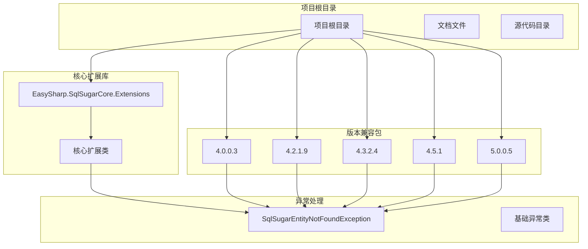
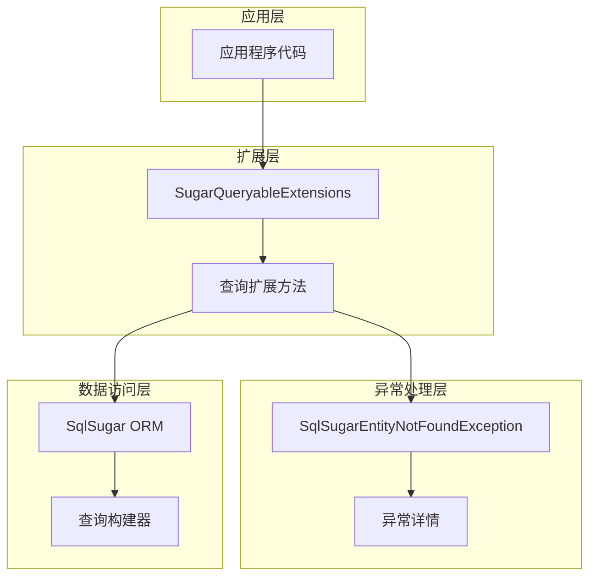
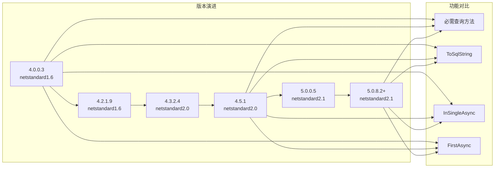

# 查询扩展 API

<cite>
**本文档引用的文件**
- [SugarQueryableExtensions.cs](file://EasySharp.SqlSugarCore.Extensions/SugarQueryableExtensions.cs)
- [EntityNotFoundException.cs](file://EasySharp.SqlSugarCore.Extensions/EntityNotFoundException.cs)
- [README.md](file://README.md)
- [SugarQueryableExtensions.cs](file://EasySharp.SqlSugarCore.Extensions.4.0.0.3/SugarQueryableExtensions.cs)
- [EntityNotFoundException.cs](file://EasySharp.SqlSugarCore.Extensions.4.0.0.3/EntityNotFoundException.cs)
- [SugarQueryableExtensions.cs](file://EasySharp.SqlSugarCore.Extensions.4.2.1.9/SugarQueryableExtensions.cs)
- [EntityNotFoundException.cs](file://EasySharp.SqlSugarCore.Extensions.4.2.1.9/EntityNotFoundException.cs)
- [SugarQueryableExtensions.cs](file://EasySharp.SqlSugarCore.Extensions.4.3.2.4/SugarQueryableExtensions.cs)
- [EntityNotFoundException.cs](file://EasySharp.SqlSugarCore.Extensions.4.3.2.4/EntityNotFoundException.cs)
- [SugarQueryableExtensions.cs](file://EasySharp.SqlSugarCore.Extensions.4.5.1/SugarQueryableExtensions.cs)
- [EntityNotFoundException.cs](file://EasySharp.SqlSugarCore.Extensions.4.5.1/EntityNotFoundException.cs)
- [SugarQueryableExtensions.cs](file://EasySharp.SqlSugarCore.Extensions.5.0.0.5/SugarQueryableExtensions.cs)
</cite>

## 目录
1. [简介](#简介)
2. [项目结构](#项目结构)
3. [核心组件](#核心组件)
4. [架构概览](#架构概览)
5. [详细组件分析](#详细组件分析)
6. [依赖分析](#依赖分析)
7. [性能考虑](#性能考虑)
8. [故障排除指南](#故障排除指南)
9. [结论](#结论)
10. [附录](#附录)

## 简介

EasySharp.SqlSugarCore.Extensions 是一个基于 SqlSugar ORM 的扩展库，专门提供强类型的查询扩展方法。该库的核心目标是简化数据库查询操作并增强错误处理机制，特别是通过必需实体查询方法确保查询结果的存在性。

该项目提供了多个版本的兼容包，支持从 SqlSugar 4.0.0.3 到 5.0.8.2+ 的不同版本，确保在各种环境中都能正常工作。

## 项目结构

项目采用按版本分层的组织结构，每个版本都有独立的实现文件和异常处理类：



**图表来源**
- [SugarQueryableExtensions.cs:1-94](file://EasySharp.SqlSugarCore.Extensions/SugarQueryableExtensions.cs#L1-L94)
- [README.md:28-38](file://README.md#L28-L38)

**章节来源**
- [README.md:1-117](file://README.md#L1-L117)

## 核心组件

### SugarQueryableExtensions 类

`SugarQueryableExtensions` 是整个库的核心静态类，提供了所有查询扩展方法。该类位于 `SqlSugar.Extensions` 命名空间下，为 `ISugarQueryable<T>` 提供了丰富的扩展功能。

### SqlSugarEntityNotFoundException 异常类

这是一个自定义的异常类，继承自 `InvalidOperationException`，专门用于处理实体未找到的情况。该异常类包含了实体类型、查询条件和执行的 SQL 语句等详细信息。

**章节来源**
- [SugarQueryableExtensions.cs:7-94](file://EasySharp.SqlSugarCore.Extensions/SugarQueryableExtensions.cs#L7-L94)
- [EntityNotFoundException.cs:7-79](file://EasySharp.SqlSugarCore.Extensions/EntityNotFoundException.cs#L7-L79)

## 架构概览

该库采用了清晰的分层架构设计，主要包含以下几个层次：



**图表来源**
- [SugarQueryableExtensions.cs:5-94](file://EasySharp.SqlSugarCore.Extensions/SugarQueryableExtensions.cs#L5-L94)

## 详细组件分析

### 必需实体查询方法

#### FirstRequiredAsync<T>()
**方法签名**: `public static async Task<T> FirstRequiredAsync<T>(this ISugarQueryable<T> queryable, string businessKey = null)`

**参数说明**:
- `queryable`: ISugarQueryable<T> 类型，表示要查询的可查询对象
- `businessKey`: string 类型，可选的业务键标识，默认为 null

**返回值**: `Task<T>` 类型，返回查询到的实体对象，保证非空

**异常处理机制**:
- 如果查询结果为 null，抛出 `SqlSugarEntityNotFoundException`
- 异常包含实体类型、业务键和执行的 SQL 语句信息

**适用场景**:
- 需要确保查询结果存在的业务场景
- 用户信息查询、订单状态验证等关键业务逻辑

**章节来源**
- [SugarQueryableExtensions.cs:9-18](file://EasySharp.SqlSugarCore.Extensions/SugarQueryableExtensions.cs#L9-L18)

#### FirstRequiredAsync<T>(Expression)
**方法签名**: `public static async Task<T> FirstRequiredAsync<T>(this ISugarQueryable<T> queryable, Expression<Func<T, bool>> expression)`

**参数说明**:
- `queryable`: ISugarQueryable<T> 类型，表示要查询的可查询对象
- `expression`: Expression<Func<T, bool>> 类型，查询条件表达式

**返回值**: `Task<T>` 类型，返回满足条件的实体对象

**异常处理机制**:
- 如果查询结果为 null，抛出 `SqlSugarEntityNotFoundException`
- 异常信息包含实体类型、表达式字符串和 SQL 语句

**适用场景**:
- 基于复杂条件的实体查询
- 条件验证和业务规则检查

**章节来源**
- [SugarQueryableExtensions.cs:20-29](file://EasySharp.SqlSugarCore.Extensions/SugarQueryableExtensions.cs#L20-L29)

#### InSingleRequired<T>(object)
**方法签名**: `public static T InSingleRequired<T>(this ISugarQueryable<T> queryable, object pkValue)`

**参数说明**:
- `queryable`: ISugarQueryable<T> 类型，表示要查询的可查询对象
- `pkValue`: object 类型，主键值

**返回值**: `T` 类型，返回根据主键查询到的实体对象

**异常处理机制**:
- 如果查询结果为 null，抛出 `SqlSugarEntityNotFoundException`
- 异常信息包含实体类型、主键值和 SQL 语句

**适用场景**:
- 基于主键的同步查询
- 性能敏感的场景

**章节来源**
- [SugarQueryableExtensions.cs:32-41](file://EasySharp.SqlSugarCore.Extensions/SugarQueryableExtensions.cs#L32-L41)

#### InSingleRequiredAsync<T>(object)
**方法签名**: `public static async Task<T> InSingleRequiredAsync<T>(this ISugarQueryable<T> queryable, object pkValue)`

**参数说明**:
- `queryable`: ISugarQueryable<T> 类型，表示要查询的可查询对象
- `pkValue`: object 类型，主键值

**返回值**: `Task<T>` 类型，返回根据主键查询到的实体对象

**异常处理机制**:
- 如果查询结果为 null，抛出 `SqlSugarEntityNotFoundException`
- 异常信息包含实体类型、主键值和 SQL 语句

**适用场景**:
- 基于主键的异步查询
- 异步 Web 应用程序

**章节来源**
- [SugarQueryableExtensions.cs:43-52](file://EasySharp.SqlSugarCore.Extensions/SugarQueryableExtensions.cs#L43-L52)

### 异步查询方法

#### ToSqlString<T>(this ISugarQueryable<T>)
**方法签名**: `public static string ToSqlString<T>(this ISugarQueryable<T> query)`

**参数说明**:
- `query`: ISugarQueryable<T> 类型，表示要转换的查询对象

**返回值**: `string` 类型，返回生成的 SQL 语句

**适用场景**:
- 调试和日志记录
- SQL 语句分析和优化

**章节来源**
- [SugarQueryableExtensions.cs:96-99](file://EasySharp.SqlSugarCore.Extensions/SugarQueryableExtensions.cs#L96-L99)

#### FirstAsync<T>(this ISugarQueryable<T>, Expression)
**方法签名**: `public static async Task<T?> FirstAsync<T>(this ISugarQueryable<T> queryable, Expression<Func<T, bool>> expression)`

**参数说明**:
- `queryable`: ISugarQueryable<T> 类型，表示要查询的可查询对象
- `expression`: Expression<Func<T, bool>> 类型，查询条件表达式

**返回值**: `Task<T?>` 类型，返回满足条件的实体对象或 null

**适用场景**:
- 基于条件的异步查询
- 需要处理可能为空结果的场景

**章节来源**
- [SugarQueryableExtensions.cs:144-147](file://EasySharp.SqlSugarCore.Extensions/SugarQueryableExtensions.cs#L144-L147)

#### FirstAsync<T>(this ISugarQueryable<T>)
**方法签名**: `public static async Task<T?> FirstAsync<T>(this ISugarQueryable<T> queryable)`

**参数说明**:
- `queryable`: ISugarQueryable<T> 类型，表示要查询的可查询对象

**返回值**: `Task<T?>` 类型，返回第一条实体对象或 null

**内部实现特点**:
- 自动添加默认排序
- 设置 Take=1 限制查询数量
- 使用 ToListAsync 获取结果

**适用场景**:
- 获取任意一条记录
- 性能优化的查询场景

**章节来源**
- [SugarQueryableExtensions.cs:149-157](file://EasySharp.SqlSugarCore.Extensions/SugarQueryableExtensions.cs#L149-L157)

#### InSingleAsync<T>(this ISugarQueryable<T>, object)
**方法签名**: `public static async Task<T?> InSingleAsync<T>(this ISugarQueryable<T> queryable, object pkValue)`

**参数说明**:
- `queryable`: ISugarQueryable<T> 类型，表示要查询的可查询对象
- `pkValue`: object 类型，主键值

**返回值**: `Task<T?>` 类型，返回根据主键查询到的实体对象或 null

**参数验证**:
- 检查是否与 Select 查询同时使用
- 抛出异常提示正确的使用方式

**适用场景**:
- 基于主键的异步查询
- 需要处理可能为空结果的场景

**章节来源**
- [SugarQueryableExtensions.cs:101-106](file://EasySharp.SqlSugarCore.Extensions/SugarQueryableExtensions.cs#L101-L106)

### 异常处理机制

#### SqlSugarEntityNotFoundException
**属性说明**:
- `EntityType`: Type 类型，实体类型信息
- `Predicate`: string? 类型，查询条件
- `Sql`: string? 类型，执行的 SQL 语句

**异常信息格式**:
- 基础消息: "Entity '{type.FullName}' was not found."
- Predicate: 查询条件（最大长度 200 字符）
- SQL: SQL 语句（最大长度 500 字符）

**章节来源**
- [EntityNotFoundException.cs:13-77](file://EasySharp.SqlSugarCore.Extensions/EntityNotFoundException.cs#L13-L77)

## 依赖分析

### 版本兼容性矩阵



**图表来源**
- [README.md:30-37](file://README.md#L30-L37)

### 外部依赖关系

该库主要依赖于：
1. **SqlSugarCore**: 主要的 ORM 框架
2. **System.Linq.Expressions**: 表达式树支持
3. **System.Threading.Tasks**: 异步编程支持

**章节来源**
- [README.md:113-117](file://README.md#L113-L117)

## 性能考虑

### 查询优化策略

1. **FirstAsync 内部优化**:
   - 自动设置默认排序避免不确定的结果
   - 显式设置 Take=1 限制查询范围
   - 使用 Skip=0 确保从第一条开始查询

2. **InSingleAsync 参数验证**:
   - 防止与 Select 查询同时使用导致的性能问题
   - 提供明确的错误信息指导正确使用

3. **异常处理优化**:
   - ToSqlString 在异常情况下优雅降级
   - 异常信息截断避免内存泄漏

### 最佳实践建议

1. **选择合适的查询方法**:
   - 需要确保结果存在时使用必需查询方法
   - 可能为空时使用标准异步查询方法

2. **性能优化技巧**:
   - 合理使用 FirstAsync 的自动优化
   - 避免不必要的复杂查询条件

3. **资源管理**:
   - 正确处理异步查询的生命周期
   - 注意异常情况下的资源清理

## 故障排除指南

### 常见问题及解决方案

#### 1. 实体未找到异常
**问题描述**: 使用必需查询方法时抛出 `SqlSugarEntityNotFoundException`

**解决方案**:
- 检查查询条件是否正确
- 验证数据是否存在
- 使用标准查询方法进行调试

**章节来源**
- [EntityNotFoundException.cs:53-77](file://EasySharp.SqlSugarCore.Extensions/EntityNotFoundException.cs#L53-L77)

#### 2. InSingleAsync 参数冲突
**问题描述**: 同时使用 InSingle 和 Select 查询导致异常

**解决方案**:
- 移除 Select 查询或使用 Single 方法
- 按照异常提示的正确方式重构查询

**章节来源**
- [SugarQueryableExtensions.cs:103-103](file://EasySharp.SqlSugarCore.Extensions/SugarQueryableExtensions.cs#L103-L103)

#### 3. 版本兼容性问题
**问题描述**: 不同版本间 API 差异导致的问题

**解决方案**:
- 确保使用的版本与目标框架兼容
- 参考对应版本的文档和示例

### 调试技巧

1. **使用 ToSqlString 进行调试**:
   ```csharp
   var sql = query.ToSqlString();
   ```

2. **异常信息分析**:
   - 检查 EntityType 确认实体类型
   - 分析 Predicate 了解查询条件
   - 查看 SQL 语句进行性能分析

**章节来源**
- [SugarQueryableExtensions.cs:76-90](file://EasySharp.SqlSugarCore.Extensions/SugarQueryableExtensions.cs#L76-L90)

## 结论

EasySharp.SqlSugarCore.Extensions 提供了一个强大而灵活的查询扩展系统，通过必需实体查询方法确保了查询结果的可靠性，并通过详细的异常信息增强了调试能力。该库的设计充分考虑了不同版本的兼容性和性能优化，为开发者提供了简单易用但功能强大的查询工具。

主要优势包括：
- 强类型安全的查询方法
- 详细的异常信息和调试支持
- 多版本兼容性
- 性能优化的内部实现

## 附录

### 版本更新历史

| 版本 | 主要变更 | 目标框架 |
|------|----------|----------|
| 4.0.0.3 | 初始版本，包含基本查询方法 | netstandard1.6 |
| 4.2.1.9 | 增加 ToSqlString 和 ToListAsync 方法 | netstandard1.6 |
| 4.3.2.4 | 改进异常序列化支持 | netstandard2.0 |
| 4.5.1 | 简化实现，移除部分方法 | netstandard2.0 |
| 5.0.0.5 | 适配新版本 SqlSugar | netstandard2.1 |
| 5.0.8.2+ | 最新版本支持 | netstandard2.1 |

### 使用示例

#### 基本查询示例
```csharp
// 使用 FirstRequiredAsync 查询用户
var user = await db.Queryable<User>()
    .Where(u => u.Id == 1)
    .FirstRequiredAsync();

// 使用 InSingleRequired 查询订单
var order = db.Queryable<Order>()
    .InSingleRequired(1001);
```

#### 异常处理示例
```csharp
try
{
    var user = await db.Queryable<User>()
        .FirstRequiredAsync(u => u.Id == 999);
}
catch (SqlSugarEntityNotFoundException ex)
{
    Console.WriteLine($"实体类型: {ex.EntityType}");
    Console.WriteLine($"查询条件: {ex.Predicate}");
    Console.WriteLine($"SQL: {ex.Sql}");
}
```

**章节来源**
- [README.md:43-90](file://README.md#L43-L90)