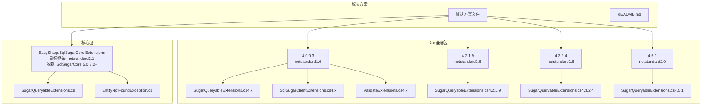
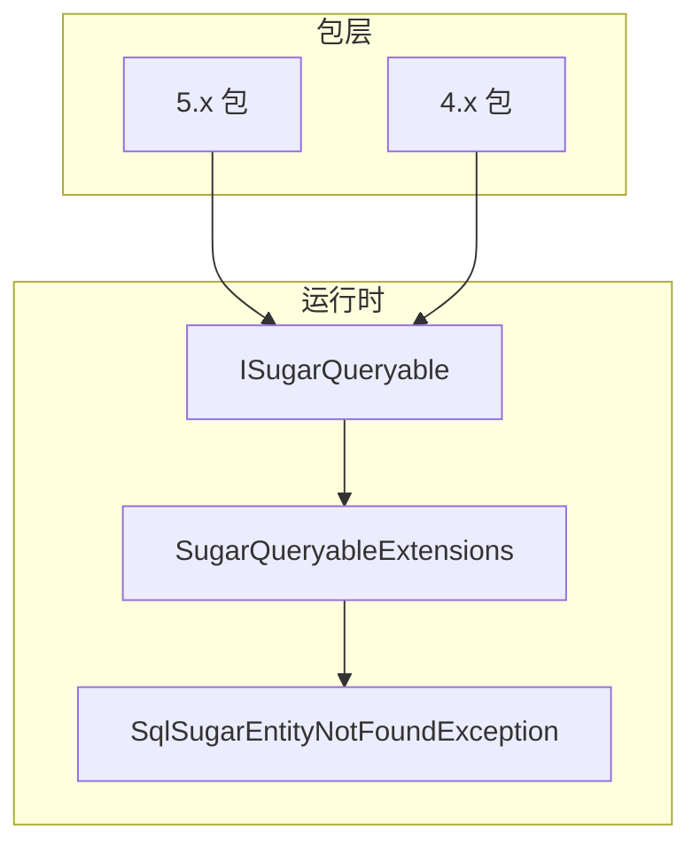
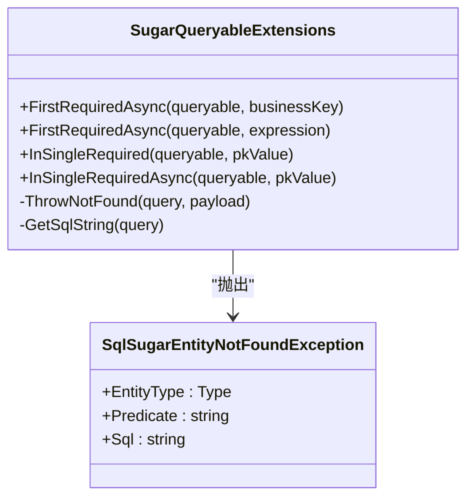
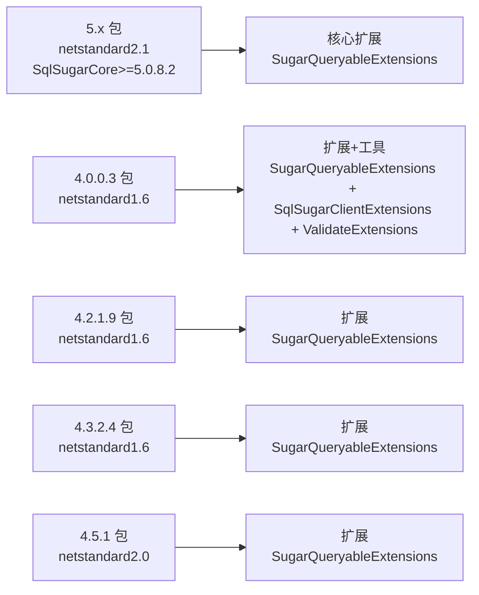
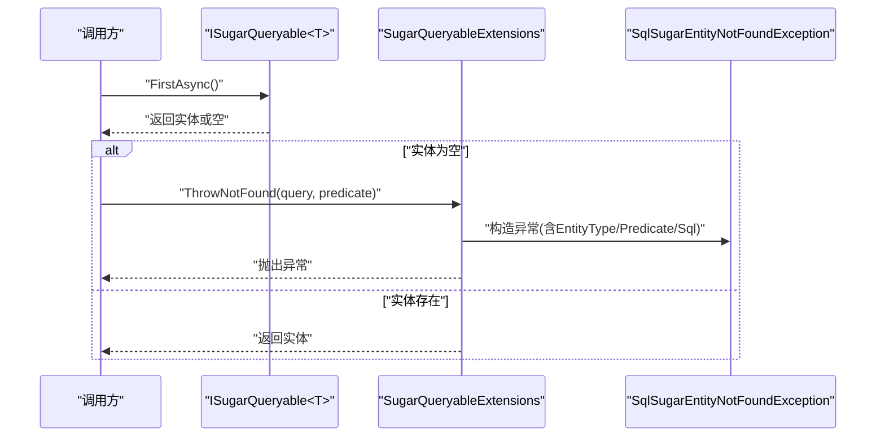
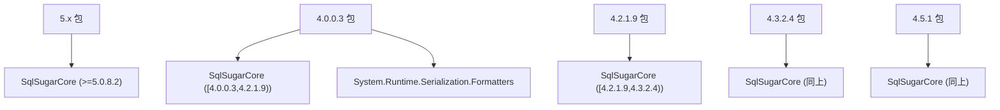

# 开发者指南

<cite>
**本文引用的文件**
- [README.md](file://README.md)
- [EasySharp.SqlSugarCore.Extensions.csproj](file://EasySharp.SqlSugarCore.Extensions/EasySharp.SqlSugarCore.Extensions.csproj)
- [SugarQueryableExtensions.cs](file://EasySharp.SqlSugarCore.Extensions/SugarQueryableExtensions.cs)
- [EntityNotFoundException.cs](file://EasySharp.SqlSugarCore.Extensions/EntityNotFoundException.cs)
- [ClassLibrary1.csproj](file://ClassLibrary1/ClassLibrary1.csproj)
- [SugarQueryableExtensions.cs（4.x）](file://EasySharp.SqlSugarCore.Extensions.4.0.0.3/SugarQueryableExtensions.cs)
- [SqlSugarClientExtensions.cs（4.x）](file://EasySharp.SqlSugarCore.Extensions.4.0.0.3/SqlSugarClientExtensions.cs)
- [ValidateExtensions.cs（4.x）](file://EasySharp.SqlSugarCore.Extensions.4.0.0.3/ValidateExtensions.cs)
- [SugarQueryableExtensions.cs（4.2.1.9）](file://EasySharp.SqlSugarCore.Extensions.4.2.1.9/SugarQueryableExtensions.cs)
- [SugarQueryableExtensions.cs（4.3.2.4）](file://EasySharp.SqlSugarCore.Extensions.4.3.2.4/SugarQueryableExtensions.cs)
- [SugarQueryableExtensions.cs（4.5.1）](file://EasySharp.SqlSugarCore.Extensions.4.5.1/SugarQueryableExtensions.cs)
- [SugarQueryableExtensions.cs（5.0.0.5）](file://EasySharp.SqlSugarCore.Extensions.5.0.0.5/SugarQueryableExtensions.cs)
</cite>

## 目录
1. [简介](#简介)
2. [项目结构](#项目结构)
3. [核心组件](#核心组件)
4. [架构总览](#架构总览)
5. [详细组件分析](#详细组件分析)
6. [依赖关系分析](#依赖关系分析)
7. [性能考虑](#性能考虑)
8. [故障排查指南](#故障排查指南)
9. [结论](#结论)
10. [附录](#附录)

## 简介
本指南面向希望参与 EasySharp.SqlSugarCore.Extensions 项目开发的贡献者，系统阐述项目内部结构、扩展方法模式与版本化架构的设计理念与实现方式；提供开发环境搭建、构建与发布流程、贡献流程与代码审查标准，帮助新成员快速融入并高质量交付功能。

## 项目结构
该项目采用“多版本并行”的包组织方式，为不同 SqlSugar 版本提供独立的 NuGet 包，确保向后兼容与最小升级成本。核心目录与文件如下：
- 根目录包含解决方案文件与说明文档
- 多个子项目按 SqlSugar 版本命名，每个项目包含相同的扩展类文件，但依赖与目标框架不同
- 主要扩展类集中在 SugarQueryableExtensions 中，异常类型统一为 SqlSugarEntityNotFoundException

图表来源
- [EasySharp.SqlSugarCore.Extensions.csproj:1-13](file://EasySharp.SqlSugarCore.Extensions/EasySharp.SqlSugarCore.Extensions.csproj#L1-L13)
- [ClassLibrary1.csproj:1-15](file://ClassLibrary1/ClassLibrary1.csproj#L1-L15)
- [SugarQueryableExtensions.cs:1-94](file://EasySharp.SqlSugarCore.Extensions/SugarQueryableExtensions.cs#L1-L94)
- [EntityNotFoundException.cs:1-79](file://EasySharp.SqlSugarCore.Extensions/EntityNotFoundException.cs#L1-L79)
- [SugarQueryableExtensions.cs（4.0.0.3）:1-161](file://EasySharp.SqlSugarCore.Extensions.4.0.0.3/SugarQueryableExtensions.cs#L1-L161)
- [SqlSugarClientExtensions.cs（4.0.0.3）:1-15](file://EasySharp.SqlSugarCore.Extensions.4.0.0.3/SqlSugarClientExtensions.cs#L1-L15)
- [ValidateExtensions.cs（4.0.0.3）:1-18](file://EasySharp.SqlSugarCore.Extensions.4.0.0.3/ValidateExtensions.cs#L1-L18)

章节来源
- [README.md:1-117](file://README.md#L1-L117)
- [EasySharp.SqlSugarCore.Extensions.csproj:1-13](file://EasySharp.SqlSugarCore.Extensions/EasySharp.SqlSugarCore.Extensions.csproj#L1-L13)
- [ClassLibrary1.csproj:1-15](file://ClassLibrary1/ClassLibrary1.csproj#L1-L15)

## 核心组件
- 扩展方法集合：以 SugarQueryableExtensions 为核心，提供 FirstRequiredAsync、InSingleRequired 等强类型查询扩展，确保查询结果存在，否则抛出带实体类型、谓词与 SQL 的异常
- 异常模型：SqlSugarEntityNotFoundException 统一承载实体未找到的上下文信息，便于定位问题
- 版本化扩展：在 4.x 版本中额外提供 ToSqlString、InSingleAsync、FirstAsync 等辅助方法，以及 CopyContext、HasValue/IsNullOrEmpty 等内部工具

章节来源
- [SugarQueryableExtensions.cs:1-94](file://EasySharp.SqlSugarCore.Extensions/SugarQueryableExtensions.cs#L1-L94)
- [EntityNotFoundException.cs:1-79](file://EasySharp.SqlSugarCore.Extensions/EntityNotFoundException.cs#L1-L79)
- [SugarQueryableExtensions.cs（4.0.0.3）:1-161](file://EasySharp.SqlSugarCore.Extensions.4.0.0.3/SugarQueryableExtensions.cs#L1-L161)
- [SqlSugarClientExtensions.cs（4.0.0.3）:1-15](file://EasySharp.SqlSugarCore.Extensions.4.0.0.3/SqlSugarClientExtensions.cs#L1-L15)
- [ValidateExtensions.cs（4.0.0.3）:1-18](file://EasySharp.SqlSugarCore.Extensions.4.0.0.3/ValidateExtensions.cs#L1-L18)

## 架构总览
项目采用“扩展方法 + 异常模型 + 版本化包”的架构设计：
- 扩展方法模式：通过静态扩展类 SugarQueryableExtensions 将强类型查询能力注入到 ISugarQueryable<T>，保持链式调用风格与强类型约束
- 异常模型：统一的 SqlSugarEntityNotFoundException 提供实体类型、谓词与 SQL 字段，便于日志与诊断
- 版本化架构：按 SqlSugar 版本拆分包，每个包维护与之匹配的依赖范围与目标框架，避免破坏性升级带来的兼容性问题

图表来源
- [SugarQueryableExtensions.cs:1-94](file://EasySharp.SqlSugarCore.Extensions/SugarQueryableExtensions.cs#L1-L94)
- [EntityNotFoundException.cs:1-79](file://EasySharp.SqlSugarCore.Extensions/EntityNotFoundException.cs#L1-L79)
- [EasySharp.SqlSugarCore.Extensions.csproj:1-13](file://EasySharp.SqlSugarCore.Extensions/EasySharp.SqlSugarCore.Extensions.csproj#L1-L13)
- [SugarQueryableExtensions.cs（4.0.0.3）:1-161](file://EasySharp.SqlSugarCore.Extensions.4.0.0.3/SugarQueryableExtensions.cs#L1-L161)

## 详细组件分析

### 扩展方法模式与实现要点
- FirstRequiredAsync：支持无参与带表达式两种重载，若查询为空则抛出异常，并携带谓词与 SQL
- InSingleRequired：基于主键查询，若为空则抛出异常
- 异常构造：统一从查询对象生成 SQL 字符串，捕获 ToSql 可能的异常并优雅降级
- 4.x 额外能力：ToSqlString、InSingleAsync、FirstAsync、CopyQueryable 等，提升兼容性与易用性

图表来源
- [SugarQueryableExtensions.cs:1-94](file://EasySharp.SqlSugarCore.Extensions/SugarQueryableExtensions.cs#L1-L94)
- [EntityNotFoundException.cs:1-79](file://EasySharp.SqlSugarCore.Extensions/EntityNotFoundException.cs#L1-L79)

章节来源
- [SugarQueryableExtensions.cs:1-94](file://EasySharp.SqlSugarCore.Extensions/SugarQueryableExtensions.cs#L1-L94)
- [EntityNotFoundException.cs:1-79](file://EasySharp.SqlSugarCore.Extensions/EntityNotFoundException.cs#L1-L79)

### 版本化架构与包管理
- 5.x 包：目标 netstandard2.1，依赖 SqlSugarCore >= 5.0.8.2
- 4.x 包：目标 netstandard1.6/2.0，按版本区间限定依赖范围，确保与对应 SqlSugar 版本兼容
- 4.x 包内含额外扩展与工具类，满足旧版本 API 差异

图表来源
- [EasySharp.SqlSugarCore.Extensions.csproj:1-13](file://EasySharp.SqlSugarCore.Extensions/EasySharp.SqlSugarCore.Extensions.csproj#L1-L13)
- [ClassLibrary1.csproj:1-15](file://ClassLibrary1/ClassLibrary1.csproj#L1-L15)
- [SugarQueryableExtensions.cs（4.0.0.3）:1-161](file://EasySharp.SqlSugarCore.Extensions.4.0.0.3/SugarQueryableExtensions.cs#L1-L161)
- [SqlSugarClientExtensions.cs（4.0.0.3）:1-15](file://EasySharp.SqlSugarCore.Extensions.4.0.0.3/SqlSugarClientExtensions.cs#L1-L15)
- [ValidateExtensions.cs（4.0.0.3）:1-18](file://EasySharp.SqlSugarCore.Extensions.4.0.0.3/ValidateExtensions.cs#L1-L18)
- [SugarQueryableExtensions.cs（4.2.1.9）](file://EasySharp.SqlSugarCore.Extensions.4.2.1.9/SugarQueryableExtensions.cs)
- [SugarQueryableExtensions.cs（4.3.2.4）](file://EasySharp.SqlSugarCore.Extensions.4.3.2.4/SugarQueryableExtensions.cs)
- [SugarQueryableExtensions.cs（4.5.1）](file://EasySharp.SqlSugarCore.Extensions.4.5.1/SugarQueryableExtensions.cs)

章节来源
- [README.md:28-37](file://README.md#L28-L37)
- [EasySharp.SqlSugarCore.Extensions.csproj:1-13](file://EasySharp.SqlSugarCore.Extensions/EasySharp.SqlSugarCore.Extensions.csproj#L1-L13)
- [ClassLibrary1.csproj:1-15](file://ClassLibrary1/ClassLibrary1.csproj#L1-L15)

### API 调用序列（示例）
以下序列图展示 FirstRequiredAsync 的典型调用路径与异常抛出逻辑：

图表来源
- [SugarQueryableExtensions.cs:1-94](file://EasySharp.SqlSugarCore.Extensions/SugarQueryableExtensions.cs#L1-L94)
- [EntityNotFoundException.cs:1-79](file://EasySharp.SqlSugarCore.Extensions/EntityNotFoundException.cs#L1-L79)

## 依赖关系分析
- 依赖来源：各包通过 PackageReference 指定 SqlSugarCore 版本范围，确保与目标框架兼容
- 内部依赖：4.x 包引入 System.Runtime.Serialization.Formatters 以支持序列化
- 外部依赖：SqlSugarCore 作为 ORM 核心，扩展方法围绕其查询接口进行封装

图表来源
- [EasySharp.SqlSugarCore.Extensions.csproj:9-11](file://EasySharp.SqlSugarCore.Extensions/EasySharp.SqlSugarCore.Extensions.csproj#L9-L11)
- [ClassLibrary1.csproj:10-12](file://ClassLibrary1/ClassLibrary1.csproj#L10-L12)
- [SugarQueryableExtensions.cs（4.0.0.3）:1-161](file://EasySharp.SqlSugarCore.Extensions.4.0.0.3/SugarQueryableExtensions.cs#L1-L161)

章节来源
- [README.md:28-37](file://README.md#L28-L37)
- [EasySharp.SqlSugarCore.Extensions.csproj:9-11](file://EasySharp.SqlSugarCore.Extensions/EasySharp.SqlSugarCore.Extensions.csproj#L9-L11)
- [ClassLibrary1.csproj:10-12](file://ClassLibrary1/ClassLibrary1.csproj#L10-L12)

## 性能考虑
- 异步优先：扩展方法均提供异步版本，避免阻塞线程，提升吞吐
- SQL 采集降级：在获取 SQL 字符串时捕获异常并降级为空值，避免影响正常流程
- 4.x 额外优化：通过复制查询上下文与参数，减少并发与上下文污染风险
- 建议：在高频查询场景下，优先使用 FirstRequiredAsync 与 InSingleRequired，减少不必要的列表加载

章节来源
- [SugarQueryableExtensions.cs:76-90](file://EasySharp.SqlSugarCore.Extensions/SugarQueryableExtensions.cs#L76-L90)
- [SugarQueryableExtensions.cs（4.0.0.3）:119-142](file://EasySharp.SqlSugarCore.Extensions.4.0.0.3/SugarQueryableExtensions.cs#L119-L142)

## 故障排查指南
- 异常定位：捕获 SqlSugarEntityNotFoundException，检查 EntityType、Predicate、Sql 字段快速定位问题
- SQL 分析：若异常中 SQL 为空，可能是 ToSql 在特定场景不可用，需结合业务条件与连接配置排查
- 版本选择：确认使用的包版本与 SqlSugarCore 版本匹配，避免 API 不一致导致的编译或运行时错误
- 4.x 兼容：如遇到 API 差异，参考对应版本的扩展方法与工具类

章节来源
- [EntityNotFoundException.cs:53-77](file://EasySharp.SqlSugarCore.Extensions/EntityNotFoundException.cs#L53-L77)
- [README.md:70-90](file://README.md#L70-L90)

## 结论
本项目通过扩展方法模式将强类型查询能力无缝集成到 SqlSugar 查询链路，配合统一异常模型与版本化包策略，在保证易用性的同时兼顾了长期兼容性。建议贡献者遵循本文档的开发与审查标准，确保新增功能与现有行为一致、异常信息完整、版本边界清晰。

## 附录

### 开发环境搭建
- 必备工具
  - .NET SDK（与目标框架匹配，如 netstandard1.6/2.0/2.1）
  - IDE（推荐 Visual Studio 或 VS Code）
  - Git
- 依赖安装
  - 直接打开解决方案文件加载工程
  - 还原 NuGet 包（SqlSugarCore 与系统库）
- 验证步骤
  - 编译所有包
  - 运行单元测试（如有）

章节来源
- [EasySharp.SqlSugarCore.Extensions.csproj:1-13](file://EasySharp.SqlSugarCore.Extensions/EasySharp.SqlSugarCore.Extensions.csproj#L1-L13)
- [ClassLibrary1.csproj:1-15](file://ClassLibrary1/ClassLibrary1.csproj#L1-L15)

### 构建与发布流程
- 构建
  - 使用 dotnet build 或 IDE 构建解决方案，确保各包成功生成
- 发布
  - 使用 dotnet pack 生成 NuGet 包
  - 使用 dotnet nuget push 发布至 NuGet.org（需凭据）
- 版本管理
  - 严格遵循语义化版本，变更记录在 README 或变更日志中
  - 对应 SqlSugar 版本更新时，同步调整包的依赖范围与目标框架

章节来源
- [README.md:1-117](file://README.md#L1-L117)

### 贡献指南
- 提交流程
  - Fork 仓库 -> 新建分支 -> 提交更改 -> 发起 Pull Request
- 代码规范
  - 遵循项目现有命名与文件组织风格
  - 扩展方法保持链式调用与强类型约束
  - 异常信息包含 EntityType、Predicate、Sql 关键字段
- 测试要求
  - 为新增扩展方法编写单元测试，覆盖空结果与异常路径
  - 针对版本差异补充兼容性测试
- 提交信息
  - 清晰描述变更内容与影响范围，引用相关 Issue

章节来源
- [README.md:1-117](file://README.md#L1-L117)

### 代码审查标准
- 正确性
  - 扩展方法行为与文档一致，异常抛出时机明确
- 可维护性
  - 代码简洁、注释清晰、模块职责单一
- 兼容性
  - 4.x 与 5.x 行为一致性，必要时提供条件编译或版本适配
- 文档与测试
  - 更新 README 或 API 文档，补充测试用例

章节来源
- [README.md:1-117](file://README.md#L1-L117)