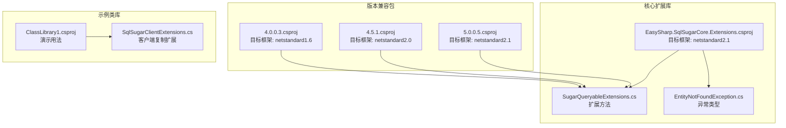
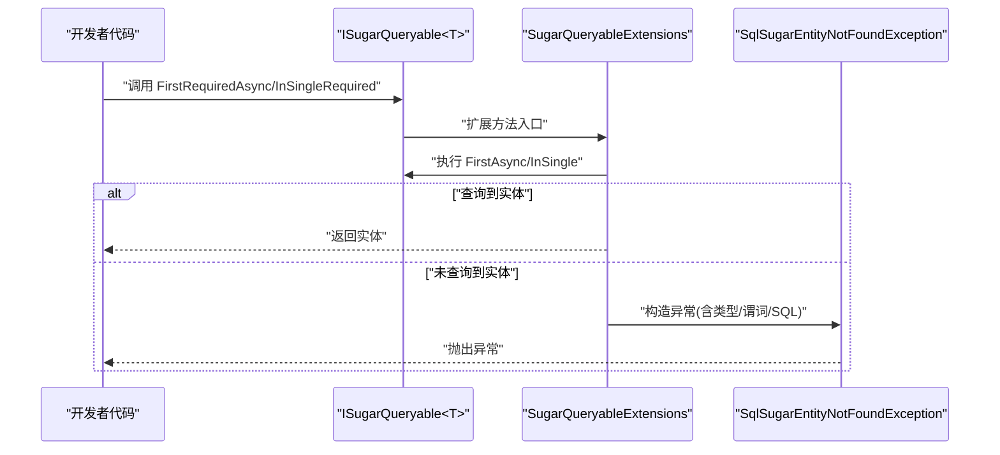
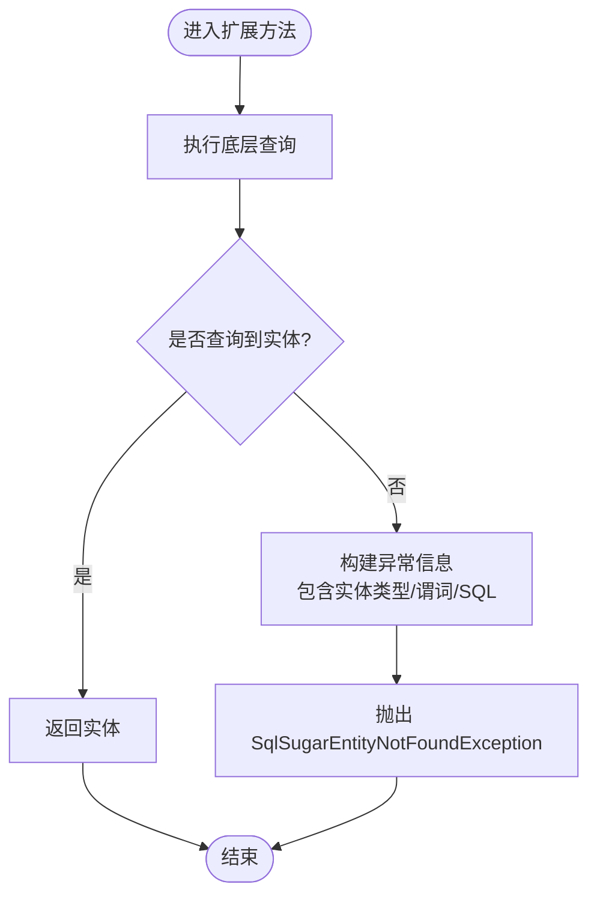
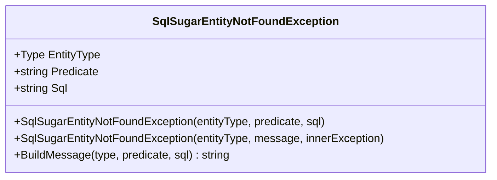
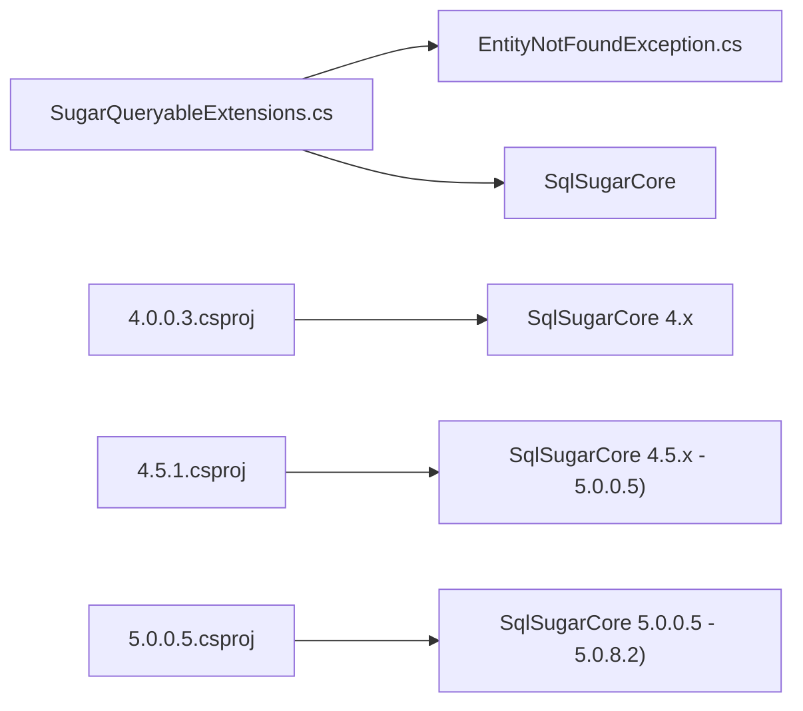

# 快速开始

<cite>
**本文引用的文件**
- [README.md](file://README.md)
- [EasySharp.SqlSugarCore.Extensions.csproj](file://EasySharp.SqlSugarCore.Extensions/EasySharp.SqlSugarCore.Extensions.csproj)
- [SugarQueryableExtensions.cs](file://EasySharp.SqlSugarCore.Extensions/SugarQueryableExtensions.cs)
- [EntityNotFoundException.cs](file://EasySharp.SqlSugarCore.Extensions/EntityNotFoundException.cs)
- [SqlSugarClientExtensions.cs](file://ClassLibrary1/SqlSugarClientExtensions.cs)
- [4.0.0.3.csproj](file://EasySharp.SqlSugarCore.Extensions.4.0.0.3/EasySharp.SqlSugarCore.Extensions.4.0.0.3.csproj)
- [4.5.1.csproj](file://EasySharp.SqlSugarCore.Extensions.4.5.1/EasySharp.SqlSugarCore.Extensions.4.5.1.csproj)
- [5.0.0.5.csproj](file://EasySharp.SqlSugarCore.Extensions.5.0.0.5/EasySharp.SqlSugarCore.Extensions.5.0.0.5.csproj)
</cite>

## 目录
1. [简介](#简介)
2. [项目结构](#项目结构)
3. [核心组件](#核心组件)
4. [架构总览](#架构总览)
5. [详细组件分析](#详细组件分析)
6. [依赖关系分析](#依赖关系分析)
7. [性能考虑](#性能考虑)
8. [故障排除指南](#故障排除指南)
9. [结论](#结论)
10. [附录](#附录)

## 简介
本指南面向首次使用 EasySharp.SqlSugarCore.Extensions 的开发者，帮助您在最短时间内完成安装、配置与首个查询示例。该扩展库为 SqlSugar ORM 提供强类型查询扩展方法，重点增强“必需实体”查询能力（如 FirstRequiredAsync、InSingleRequired），并在实体缺失时抛出包含实体类型、查询条件与 SQL 的详细异常，便于快速定位问题。

## 项目结构
仓库包含多个版本的扩展包工程，以及核心扩展库与示例类库：
- 核心扩展库：EasySharp.SqlSugarCore.Extensions（目标框架 netstandard2.1）
- 多版本兼容包：4.0.0.3、4.2.1.9、4.3.2.4、4.5.1、5.0.0.5
- 示例类库：ClassLibrary1（演示如何使用 SqlSugarClient 扩展）

图表来源
- [EasySharp.SqlSugarCore.Extensions.csproj:1-13](file://EasySharp.SqlSugarCore.Extensions/EasySharp.SqlSugarCore.Extensions.csproj#L1-L13)
- [4.0.0.3.csproj:1-15](file://EasySharp.SqlSugarCore.Extensions.4.0.0.3/EasySharp.SqlSugarCore.Extensions.4.0.0.3.csproj#L1-L15)
- [4.5.1.csproj:1-14](file://EasySharp.SqlSugarCore.Extensions.4.5.1/EasySharp.SqlSugarCore.Extensions.4.5.1.csproj#L1-L14)
- [5.0.0.5.csproj:1-13](file://EasySharp.SqlSugarCore.Extensions.5.0.0.5/EasySharp.SqlSugarCore.Extensions.5.0.0.5.csproj#L1-L13)
- [SqlSugarClientExtensions.cs:1-15](file://ClassLibrary1/SqlSugarClientExtensions.cs#L1-L15)

章节来源
- [README.md:1-117](file://README.md#L1-L117)
- [EasySharp.SqlSugarCore.Extensions.csproj:1-13](file://EasySharp.SqlSugarCore.Extensions/EasySharp.SqlSugarCore.Extensions.csproj#L1-L13)

## 核心组件
- 扩展方法集合：提供 FirstRequiredAsync、FirstRequiredAsync(带表达式)、InSingleRequired、InSingleRequiredAsync 等，确保查询结果存在，否则抛出详细异常。
- 异常类型：SqlSugarEntityNotFoundException，包含实体类型、查询谓词、SQL 等信息，便于调试。
- 版本兼容：针对不同 SqlSugarCore 版本提供独立包，确保在多种环境中可用。

章节来源
- [README.md:7-12](file://README.md#L7-L12)
- [SugarQueryableExtensions.cs:1-94](file://EasySharp.SqlSugarCore.Extensions/SugarQueryableExtensions.cs#L1-L94)
- [EntityNotFoundException.cs:1-79](file://EasySharp.SqlSugarCore.Extensions/EntityNotFoundException.cs#L1-L79)

## 架构总览
扩展库通过静态扩展方法为 ISugarQueryable<T> 添加“必需实体”查询能力，内部在查询无结果时构造异常并附带 SQL 信息；同时提供版本化工程以适配不同 SqlSugarCore 版本。

图表来源
- [SugarQueryableExtensions.cs:9-52](file://EasySharp.SqlSugarCore.Extensions/SugarQueryableExtensions.cs#L9-L52)
- [EntityNotFoundException.cs:13-22](file://EasySharp.SqlSugarCore.Extensions/EntityNotFoundException.cs#L13-L22)

## 详细组件分析

### 扩展方法：FirstRequiredAsync 与 InSingleRequired
- FirstRequiredAsync：异步获取第一条记录，若为空则抛出异常。
- FirstRequiredAsync(带表达式)：按条件异步获取第一条记录，若为空则抛出异常。
- InSingleRequired：根据主键同步获取记录，若为空则抛出异常。
- InSingleRequiredAsync：根据主键异步获取记录，若为空则抛出异常。

图表来源
- [SugarQueryableExtensions.cs:9-52](file://EasySharp.SqlSugarCore.Extensions/SugarQueryableExtensions.cs#L9-L52)

章节来源
- [SugarQueryableExtensions.cs:9-52](file://EasySharp.SqlSugarCore.Extensions/SugarQueryableExtensions.cs#L9-L52)

### 异常类型：SqlSugarEntityNotFoundException
- 属性：EntityType、Predicate、Sql。
- 行为：构造时拼接包含实体类型、谓词、SQL 的消息；对过长文本进行截断处理，避免日志膨胀。
- 用途：在查询不到必需实体时，提供清晰的上下文信息，便于快速定位问题。

图表来源
- [EntityNotFoundException.cs:7-51](file://EasySharp.SqlSugarCore.Extensions/EntityNotFoundException.cs#L7-L51)

章节来源
- [EntityNotFoundException.cs:7-79](file://EasySharp.SqlSugarCore.Extensions/EntityNotFoundException.cs#L7-L79)

### 版本兼容与工程差异
- 核心扩展库（netstandard2.1）：依赖 SqlSugarCore >= 5.0.8.2。
- 兼容包（netstandard1.6/2.0）：分别锁定 SqlSugarCore 的版本区间，确保在旧版本环境中稳定工作。
- 示例类库：演示如何复制 SqlSugarClient 上下文，便于在复杂场景中隔离或复用配置。

章节来源
- [EasySharp.SqlSugarCore.Extensions.csproj:1-13](file://EasySharp.SqlSugarCore.Extensions/EasySharp.SqlSugarCore.Extensions.csproj#L1-L13)
- [4.0.0.3.csproj:1-15](file://EasySharp.SqlSugarCore.Extensions.4.0.0.3/EasySharp.SqlSugarCore.Extensions.4.0.0.3.csproj#L1-L15)
- [4.5.1.csproj:1-14](file://EasySharp.SqlSugarCore.Extensions.4.5.1/EasySharp.SqlSugarCore.Extensions.4.5.1.csproj#L1-L14)
- [5.0.0.5.csproj:1-13](file://EasySharp.SqlSugarCore.Extensions.5.0.0.5/EasySharp.SqlSugarCore.Extensions.5.0.0.5.csproj#L1-L13)
- [SqlSugarClientExtensions.cs:5-12](file://ClassLibrary1/SqlSugarClientExtensions.cs#L5-L12)

## 依赖关系分析
- 核心扩展库依赖 SqlSugarCore（版本范围见项目文件）。
- 不同版本兼容包对 SqlSugarCore 的版本范围有明确约束，避免冲突。
- 扩展方法依赖 ISugarQueryable<T> 的异步查询能力，异常类型继承自 InvalidOperationException，便于统一捕获。

图表来源
- [SugarQueryableExtensions.cs:1-94](file://EasySharp.SqlSugarCore.Extensions/SugarQueryableExtensions.cs#L1-L94)
- [EntityNotFoundException.cs:1-79](file://EasySharp.SqlSugarCore.Extensions/EntityNotFoundException.cs#L1-L79)
- [4.0.0.3.csproj:10-12](file://EasySharp.SqlSugarCore.Extensions.4.0.0.3/EasySharp.SqlSugarCore.Extensions.4.0.0.3.csproj#L10-L12)
- [4.5.1.csproj:10-11](file://EasySharp.SqlSugarCore.Extensions.4.5.1/EasySharp.SqlSugarCore.Extensions.4.5.1.csproj#L10-L11)
- [5.0.0.5.csproj:9-11](file://EasySharp.SqlSugarCore.Extensions.5.0.0.5/EasySharp.SqlSugarCore.Extensions.5.0.0.5.csproj#L9-L11)

章节来源
- [README.md:111-117](file://README.md#L111-L117)
- [EasySharp.SqlSugarCore.Extensions.csproj:9-11](file://EasySharp.SqlSugarCore.Extensions/EasySharp.SqlSugarCore.Extensions.csproj#L9-L11)

## 性能考虑
- 异步查询：扩展方法均提供异步版本，建议在高并发场景优先使用异步方法，避免阻塞线程。
- SQL 生成：异常构造时尝试获取 SQL 字符串，若底层查询构建阶段无法生成 SQL 将被安全忽略，避免影响性能。
- 主键查询：InSingleRequired/Async 直接基于主键检索，通常具备较高性能；若需条件查询，请确保索引覆盖。

章节来源
- [SugarQueryableExtensions.cs:76-90](file://EasySharp.SqlSugarCore.Extensions/SugarQueryableExtensions.cs#L76-L90)

## 故障排除指南
- 安装后无法找到扩展方法
  - 确认已正确安装包并引入命名空间。
  - 检查目标框架与 SqlSugarCore 版本是否匹配（详见版本兼容表）。
- 查询不到实体抛出异常
  - 使用 try/catch 捕获 SqlSugarEntityNotFoundException，读取 EntityType、Predicate、Sql 字段定位问题。
- 版本冲突
  - 若使用较新 SqlSugarCore，请选择 netstandard2.1 对应的扩展包；若使用旧版，请选择对应版本兼容包。
- 日志中 SQL 过长
  - 异常消息中的 SQL 会被截断，可通过 Predicate 字段快速确认查询条件。

章节来源
- [README.md:14-26](file://README.md#L14-L26)
- [README.md:28-38](file://README.md#L28-L38)
- [README.md:70-90](file://README.md#L70-L90)
- [EntityNotFoundException.cs:53-77](file://EasySharp.SqlSugarCore.Extensions/EntityNotFoundException.cs#L53-L77)

## 结论
通过本快速开始指南，您已了解如何安装、选择合适版本、配置环境，并使用 FirstRequiredAsync 与 InSingleRequired 完成“必需实体”的查询。遇到问题时，利用异常中的详细信息可快速定位原因。建议在生产环境中结合异步查询与完善的异常处理策略，提升系统稳定性与可观测性。

## 附录

### 安装说明（NuGet 包管理器）
- 在包管理器控制台执行安装命令，选择目标项目后回车即可完成安装。

章节来源
- [README.md:16-20](file://README.md#L16-L20)

### 安装说明（.NET CLI）
- 在项目根目录执行 dotnet add 命令，自动解析依赖并添加到项目文件。

章节来源
- [README.md:22-26](file://README.md#L22-L26)

### 版本兼容性对照
- 核心扩展库（netstandard2.1）：SqlSugarCore >= 5.0.8.2
- 兼容包（netstandard1.6）：SqlSugarCore 4.0.0.3 - 4.2.1.9
- 兼容包（netstandard2.0）：SqlSugarCore 4.5.1 - 5.0.0.5

章节来源
- [README.md:28-37](file://README.md#L28-L37)
- [EasySharp.SqlSugarCore.Extensions.csproj:9-11](file://EasySharp.SqlSugarCore.Extensions/EasySharp.SqlSugarCore.Extensions.csproj#L9-L11)
- [4.0.0.3.csproj:10-12](file://EasySharp.SqlSugarCore.Extensions.4.0.0.3/EasySharp.SqlSugarCore.Extensions.4.0.0.3.csproj#L10-L12)
- [4.5.1.csproj:10-11](file://EasySharp.SqlSugarCore.Extensions.4.5.1/EasySharp.SqlSugarCore.Extensions.4.5.1.csproj#L10-L11)
- [5.0.0.5.csproj:9-11](file://EasySharp.SqlSugarCore.Extensions.5.0.0.5/EasySharp.SqlSugarCore.Extensions.5.0.0.5.csproj#L9-L11)

### 基本配置与设置
- 引入命名空间：确保使用扩展方法前已引入扩展所在命名空间。
- 初始化 SqlSugarClient：请参考 SqlSugarCore 官方文档完成连接配置与实体映射。
- 选择扩展包：根据 SqlSugarCore 版本选择对应的扩展包，避免版本不匹配导致的编译或运行时问题。

章节来源
- [README.md:111-117](file://README.md#L111-L117)

### 第一个查询示例（路径指引）
- 使用 FirstRequiredAsync 获取单条记录（带业务键或表达式）
  - 路径参考：[SugarQueryableExtensions.cs:9-29](file://EasySharp.SqlSugarCore.Extensions/SugarQueryableExtensions.cs#L9-L29)
- 使用 InSingleRequired 根据主键获取记录
  - 路径参考：[SugarQueryableExtensions.cs:32-52](file://EasySharp.SqlSugarCore.Extensions/SugarQueryableExtensions.cs#L32-L52)
- 异常处理示例（捕获 SqlSugarEntityNotFoundException 并读取属性）
  - 路径参考：[EntityNotFoundException.cs:13-22](file://EasySharp.SqlSugarCore.Extensions/EntityNotFoundException.cs#L13-L22)
  - 路径参考：[README.md:78-90](file://README.md#L78-L90)

### API 参考摘要
- FirstRequiredAsync<T>()
- FirstRequiredAsync<T>(Expression)
- InSingleRequired<T>(object)
- InSingleRequiredAsync<T>(object)
- 异常：SqlSugarEntityNotFoundException（包含 EntityType、Predicate、Sql）

章节来源
- [README.md:92-110](file://README.md#L92-L110)
- [SugarQueryableExtensions.cs:9-52](file://EasySharp.SqlSugarCore.Extensions/SugarQueryableExtensions.cs#L9-L52)
- [EntityNotFoundException.cs:9-11](file://EasySharp.SqlSugarCore.Extensions/EntityNotFoundException.cs#L9-L11)