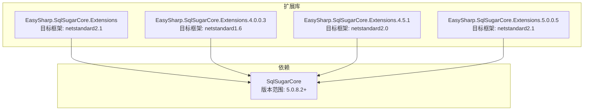
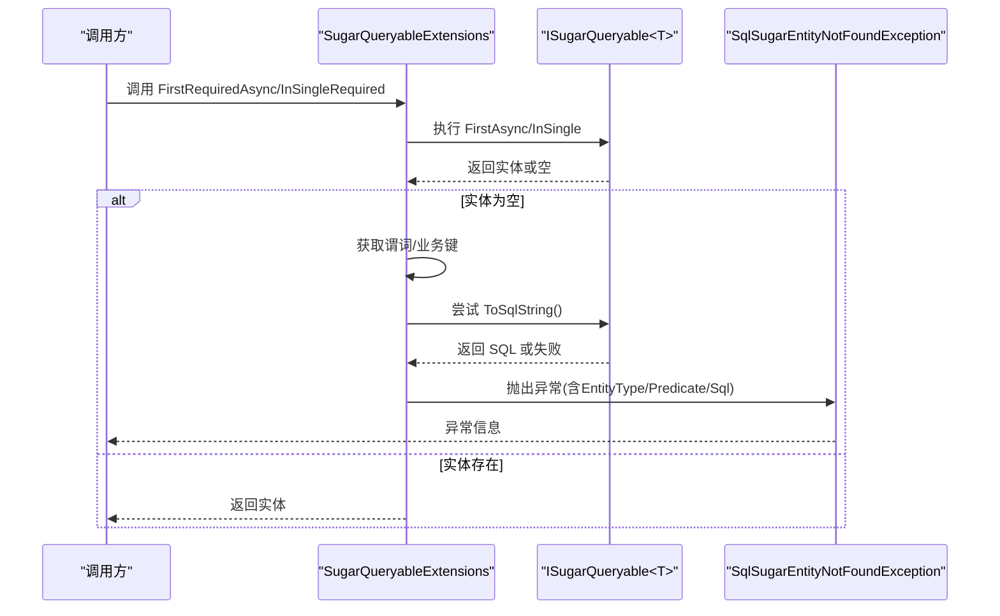
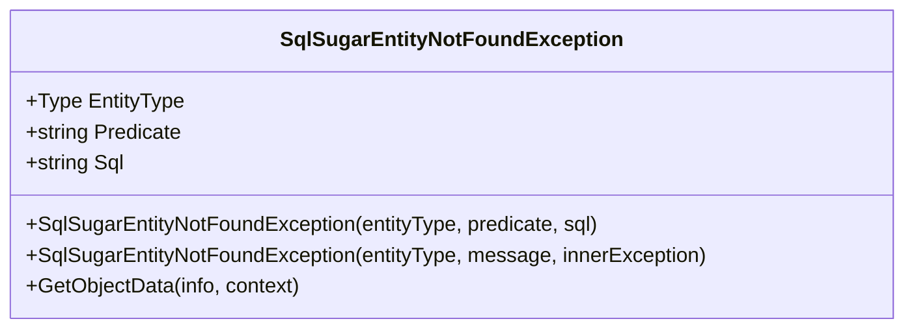
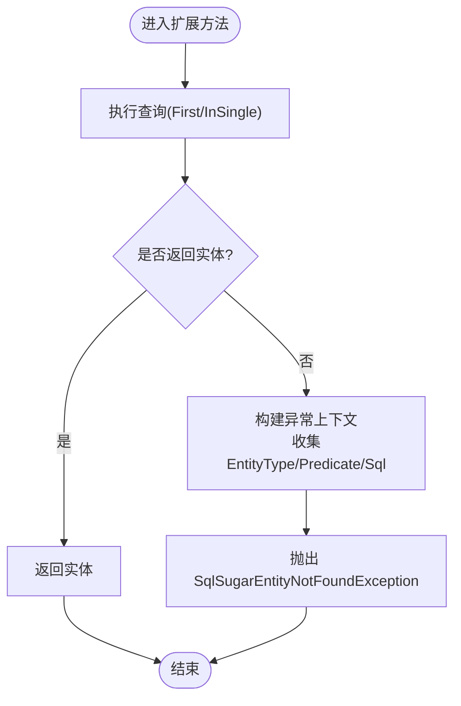
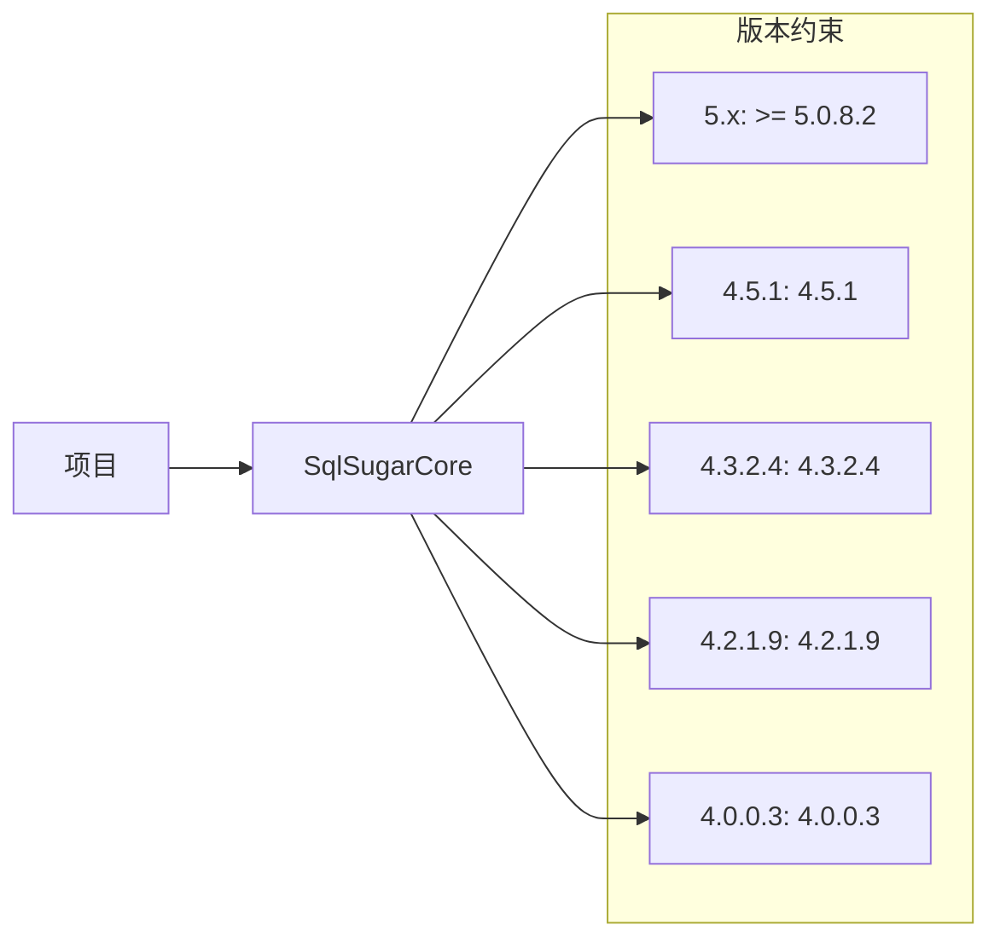

# 故障排除

<cite>
**本文引用的文件**
- [README.md](file://README.md)
- [EntityNotFoundException.cs](file://EasySharp.SqlSugarCore.Extensions/EntityNotFoundException.cs)
- [SugarQueryableExtensions.cs](file://EasySharp.SqlSugarCore.Extensions/SugarQueryableExtensions.cs)
- [EntityNotFoundException.cs（4.0.0.3）](file://EasySharp.SqlSugarCore.Extensions.4.0.0.3/EntityNotFoundException.cs)
- [SugarQueryableExtensions.cs（4.0.0.3）](file://EasySharp.SqlSugarCore.Extensions.4.0.0.3/SugarQueryableExtensions.cs)
- [EntityNotFoundException.cs（4.5.1）](file://EasySharp.SqlSugarCore.Extensions.4.5.1/EntityNotFoundException.cs)
- [SugarQueryableExtensions.cs（4.5.1）](file://EasySharp.SqlSugarCore.Extensions.4.5.1/SugarQueryableExtensions.cs)
- [EntityNotFoundException.cs（5.0.0.5）](file://EasySharp.SqlSugarCore.Extensions.5.0.0.5/EntityNotFoundException.cs)
- [EasySharp.SqlSugarCore.Extensions.csproj](file://EasySharp.SqlSugarCore.Extensions/EasySharp.SqlSugarCore.Extensions.csproj)
- [EasySharp.SqlSugarCore.Extensions.4.0.0.3.csproj](file://EasySharp.SqlSugarCore.Extensions.4.0.0.3/EasySharp.SqlSugarCore.Extensions.4.0.0.3.csproj)
</cite>

## 目录
1. [简介](#简介)
2. [项目结构](#项目结构)
3. [核心组件](#核心组件)
4. [架构总览](#架构总览)
5. [详细组件分析](#详细组件分析)
6. [依赖关系分析](#依赖关系分析)
7. [性能考虑](#性能考虑)
8. [故障排除指南](#故障排除指南)
9. [结论](#结论)
10. [附录](#附录)

## 简介
本指南面向使用 EasySharp.SqlSugarCore.Extensions 的开发者，聚焦于在实际开发中可能遇到的问题与解决方案，涵盖版本兼容性、查询异常、性能问题、调试技巧、日志与监控建议，以及社区支持渠道。文档中的所有技术细节均基于仓库内源码与说明文件进行归纳总结，确保可追溯与可验证。

## 项目结构
该项目为 SqlSugar ORM 的扩展库，提供强类型查询扩展方法，并在实体未找到时抛出包含实体类型、查询条件与 SQL 的详细异常。项目同时维护多个版本分支以适配不同 SqlSugar 版本，便于在不同运行时环境中使用。

图表来源
- [EasySharp.SqlSugarCore.Extensions.csproj:1-13](file://EasySharp.SqlSugarCore.Extensions/EasySharp.SqlSugarCore.Extensions.csproj#L1-L13)
- [EasySharp.SqlSugarCore.Extensions.4.0.0.3.csproj:1-15](file://EasySharp.SqlSugarCore.Extensions.4.0.0.3/EasySharp.SqlSugarCore.Extensions.4.0.0.3.csproj#L1-L15)

章节来源
- [README.md:1-117](file://README.md#L1-L117)
- [EasySharp.SqlSugarCore.Extensions.csproj:1-13](file://EasySharp.SqlSugarCore.Extensions/EasySharp.SqlSugarCore.Extensions.csproj#L1-L13)
- [EasySharp.SqlSugarCore.Extensions.4.0.0.3.csproj:1-15](file://EasySharp.SqlSugarCore.Extensions.4.0.0.3/EasySharp.SqlSugarCore.Extensions.4.0.0.3.csproj#L1-L15)

## 核心组件
- 强类型查询扩展：提供 FirstRequiredAsync、InSingleRequired 等方法，确保查询结果存在；若不存在则抛出包含详细信息的异常。
- 异常类型：SqlSugarEntityNotFoundException，包含实体类型、查询条件与 SQL 字段，便于快速定位问题。
- 多版本支持：针对不同 SqlSugar 版本提供独立包，确保在不同运行时环境下的兼容性。

章节来源
- [README.md:7-12](file://README.md#L7-L12)
- [README.md:92-110](file://README.md#L92-L110)

## 架构总览
扩展库通过扩展方法在查询链路中注入“必需存在”检查逻辑。当查询返回空值时，捕获当前查询上下文并生成异常，异常中携带实体类型、谓词表达式或业务键、以及最终执行的 SQL 字符串（尽可能获取）。

图表来源
- [SugarQueryableExtensions.cs:9-52](file://EasySharp.SqlSugarCore.Extensions/SugarQueryableExtensions.cs#L9-L52)
- [EntityNotFoundException.cs:13-22](file://EasySharp.SqlSugarCore.Extensions/EntityNotFoundException.cs#L13-L22)

## 详细组件分析

### 异常类型：SqlSugarEntityNotFoundException
- 角色：当扩展方法检测到查询结果不存在时抛出，承载实体类型、查询条件与 SQL 信息。
- 关键属性：EntityType、Predicate、Sql。
- 序列化支持：在较新版本中提供受保护构造函数与 GetObjectData，以支持序列化场景。

图表来源
- [EntityNotFoundException.cs:6-51](file://EasySharp.SqlSugarCore.Extensions/EntityNotFoundException.cs#L6-L51)

章节来源
- [EntityNotFoundException.cs:1-79](file://EasySharp.SqlSugarCore.Extensions/EntityNotFoundException.cs#L1-L79)
- [EntityNotFoundException.cs（4.0.0.3）:1-60](file://EasySharp.SqlSugarCore.Extensions.4.0.0.3/EntityNotFoundException.cs#L1-L60)
- [EntityNotFoundException.cs（4.5.1）:1-79](file://EasySharp.SqlSugarCore.Extensions.4.5.1/EntityNotFoundException.cs#L1-L79)
- [EntityNotFoundException.cs（5.0.0.5）:1-79](file://EasySharp.SqlSugarCore.Extensions.5.0.0.5/EntityNotFoundException.cs#L1-L79)

### 扩展方法：SugarQueryableExtensions
- FirstRequiredAsync：按条件或业务键查询首条记录，不存在则抛异常。
- InSingleRequired：按主键查询单条记录，不存在则抛异常。
- ToSqlString：尝试获取当前查询对应的 SQL 字符串，失败时静默忽略。
- 兼容性差异：不同版本中 ToSqlString 的实现与内部调用略有差异，但行为一致。

图表来源
- [SugarQueryableExtensions.cs:9-52](file://EasySharp.SqlSugarCore.Extensions/SugarQueryableExtensions.cs#L9-L52)
- [SugarQueryableExtensions.cs（4.0.0.3）:13-78](file://EasySharp.SqlSugarCore.Extensions.4.0.0.3/SugarQueryableExtensions.cs#L13-L78)
- [SugarQueryableExtensions.cs（4.5.1）:11-76](file://EasySharp.SqlSugarCore.Extensions.4.5.1/SugarQueryableExtensions.cs#L11-L76)

章节来源
- [SugarQueryableExtensions.cs:1-94](file://EasySharp.SqlSugarCore.Extensions/SugarQueryableExtensions.cs#L1-L94)
- [SugarQueryableExtensions.cs（4.0.0.3）:1-161](file://EasySharp.SqlSugarCore.Extensions.4.0.0.3/SugarQueryableExtensions.cs#L1-L161)
- [SugarQueryableExtensions.cs（4.5.1）:1-108](file://EasySharp.SqlSugarCore.Extensions.4.5.1/SugarQueryableExtensions.cs#L1-L108)

## 依赖关系分析
- 统一依赖：所有版本均依赖 SqlSugarCore，且 5.x 分支要求版本不低于 5.0.8.2。
- 目标框架：不同版本对应不同 netstandard 版本，选择时需匹配运行时环境。
- 版本矩阵：README 提供了清晰的版本与框架对照表，便于选型。

图表来源
- [README.md:28-37](file://README.md#L28-L37)
- [EasySharp.SqlSugarCore.Extensions.csproj:9-11](file://EasySharp.SqlSugarCore.Extensions/EasySharp.SqlSugarCore.Extensions.csproj#L9-L11)
- [EasySharp.SqlSugarCore.Extensions.4.0.0.3.csproj:10-12](file://EasySharp.SqlSugarCore.Extensions.4.0.0.3/EasySharp.SqlSugarCore.Extensions.4.0.0.3.csproj#L10-L12)

章节来源
- [README.md:28-37](file://README.md#L28-L37)
- [EasySharp.SqlSugarCore.Extensions.csproj:9-11](file://EasySharp.SqlSugarCore.Extensions/EasySharp.SqlSugarCore.Extensions.csproj#L9-L11)
- [EasySharp.SqlSugarCore.Extensions.4.0.0.3.csproj:10-12](file://EasySharp.SqlSugarCore.Extensions.4.0.0.3/EasySharp.SqlSugarCore.Extensions.4.0.0.3.csproj#L10-L12)

## 性能考虑
- 查询开销：扩展方法在查询后进行空值判断，若查询链路复杂，建议在调用前尽量缩小数据集（如添加 Where 条件、限制字段、分页）。
- SQL 生成：ToSqlString 在某些场景可能失败，扩展方法已做容错处理；若需要精确 SQL，可在调试阶段单独调用 ToSqlString 并捕获异常。
- 异步与并发：扩展方法提供异步版本，避免阻塞线程；在高并发场景下注意连接池与事务边界。
- 日志与监控：结合 SqlSugar 的日志事件机制，开启 SQL 输出与执行时间统计，有助于定位慢查询。

## 故障排除指南

### 1. 版本兼容性问题
- 症状：编译报错或运行时异常，提示找不到类型或方法。
- 排查步骤：
  - 对照 README 的版本矩阵，确认所选扩展包与 SqlSugarCore 版本匹配。
  - 若使用 .NET Standard 1.x 运行时，优先选择 4.x 分支；若使用较新的运行时，优先选择 5.x 分支。
- 解决方案：
  - 更换扩展包版本，确保 SqlSugarCore 版本满足最低要求。
  - 清理并重新生成解决方案，避免缓存导致的引用不一致。

章节来源
- [README.md:28-37](file://README.md#L28-L37)
- [EasySharp.SqlSugarCore.Extensions.csproj:9-11](file://EasySharp.SqlSugarCore.Extensions/EasySharp.SqlSugarCore.Extensions.csproj#L9-L11)
- [EasySharp.SqlSugarCore.Extensions.4.0.0.3.csproj:10-12](file://EasySharp.SqlSugarCore.Extensions.4.0.0.3/EasySharp.SqlSugarCore.Extensions.4.0.0.3.csproj#L10-L12)

### 2. 查询异常：SqlSugarEntityNotFoundException
- 症状：抛出异常，包含实体类型、查询条件与 SQL。
- 快速定位：
  - 从异常对象读取 EntityType，确认实体映射正确。
  - 从 Predicate 识别查询条件（表达式或业务键），核对数据是否存在。
  - 从 Sql 查看最终执行的 SQL，检查表名、字段名、参数绑定是否正确。
- 常见原因：
  - 查询条件过于宽泛导致无结果。
  - 主键值错误或数据被删除。
  - 业务键不唯一或重复。
- 预防措施：
  - 使用 FirstRequiredAsync/InSingleRequired 前先验证条件或主键有效性。
  - 在开发环境开启 SQL 日志，观察实际执行语句。

章节来源
- [README.md:70-90](file://README.md#L70-L90)
- [EntityNotFoundException.cs:13-22](file://EasySharp.SqlSugarCore.Extensions/EntityNotFoundException.cs#L13-L22)
- [SugarQueryableExtensions.cs:54-74](file://EasySharp.SqlSugarCore.Extensions/SugarQueryableExtensions.cs#L54-L74)

### 3. 查询性能问题
- 症状：查询响应慢、数据库负载高。
- 排查步骤：
  - 使用 ToSqlString 获取 SQL，结合数据库执行计划分析索引使用情况。
  - 检查 Where 条件是否命中索引，避免在 WHERE 中对列进行函数运算。
  - 控制返回字段数量，避免 SELECT *。
  - 对大数据量分页查询时，使用游标或键集分页策略。
- 工具建议：
  - 开启 SqlSugar 的日志事件，记录 SQL 与执行时间。
  - 结合数据库自带的慢查询日志与性能分析工具。

章节来源
- [SugarQueryableExtensions.cs:76-90](file://EasySharp.SqlSugarCore.Extensions/SugarQueryableExtensions.cs#L76-L90)
- [SugarQueryableExtensions.cs（4.0.0.3）:96-99](file://EasySharp.SqlSugarCore.Extensions.4.0.0.3/SugarQueryableExtensions.cs#L96-L99)
- [SugarQueryableExtensions.cs（4.5.1）:94-97](file://EasySharp.SqlSugarCore.Extensions.4.5.1/SugarQueryableExtensions.cs#L94-L97)

### 4. 调试技巧与方法
- 快速复现：
  - 在异常捕获处打印 EntityType、Predicate、Sql，形成最小可复现示例。
  - 将异常中的 SQL 直接粘贴到数据库客户端执行，验证语义与数据状态。
- 条件排查：
  - 将表达式拆分为更小片段，逐步缩小问题范围。
  - 对比 InSingleRequired 与 FirstRequiredAsync 的行为差异，确认是否为主键问题。
- 日志与监控：
  - 启用 SqlSugar 的日志事件回调，统一采集 SQL、参数、耗时。
  - 在应用层记录请求上下文 ID，将异常与请求关联，便于回溯。

章节来源
- [README.md:70-90](file://README.md#L70-L90)
- [EntityNotFoundException.cs:53-77](file://EasySharp.SqlSugarCore.Extensions/EntityNotFoundException.cs#L53-L77)

### 5. 特定异常：SqlSugarEntityNotFoundException 的调试方法
- 如何查看实体类型：从异常的 EntityType 属性获取完整类型名，确认实体映射与命名空间。
- 如何查看查询条件：从异常的 Predicate 属性获取表达式字符串或业务键，核对传入参数。
- 如何查看 SQL 语句：从异常的 Sql 属性获取最终执行的 SQL；若为空，可能是 ToSqlString 失败，需在安全环境下单独调用并捕获异常。

章节来源
- [EntityNotFoundException.cs:9-11](file://EasySharp.SqlSugarCore.Extensions/EntityNotFoundException.cs#L9-L11)
- [SugarQueryableExtensions.cs:59-74](file://EasySharp.SqlSugarCore.Extensions/SugarQueryableExtensions.cs#L59-L74)

### 6. 日志记录与监控建议
- 开启日志事件：
  - 利用 SqlSugar 的日志事件回调，输出 SQL 与参数，便于审计与排障。
- 指标采集：
  - 记录每条查询的耗时、受影响行数、异常次数。
  - 对高频异常（如实体未找到）设置阈值告警。
- 上下文追踪：
  - 为每个请求生成唯一标识，贯穿日志与异常，支持端到端追踪。

章节来源
- [SugarQueryableExtensions.cs:76-90](file://EasySharp.SqlSugarCore.Extensions/SugarQueryableExtensions.cs#L76-L90)

### 7. 社区支持与获取帮助
- 官方资源：参考 README 中的许可证与依赖项信息，了解项目背景与生态。
- 版本矩阵：通过 README 的版本表格选择合适包，避免因版本不匹配引发问题。
- 问题反馈：在遵循 MIT 许可的前提下，结合仓库说明进行问题定位与反馈。

章节来源
- [README.md:111-117](file://README.md#L111-L117)
- [README.md:28-37](file://README.md#L28-L37)

## 结论
通过合理选择扩展包版本、利用扩展方法提供的强类型查询与异常信息、配合日志与监控，可以高效定位并解决大多数与 EasySharp.SqlSugarCore.Extensions 相关的问题。建议在开发与生产环境中均启用 SQL 日志与异常追踪，形成闭环的质量保障体系。

## 附录
- 快速检查清单：
  - 是否选择了与 SqlSugarCore 版本匹配的扩展包？
  - 查询条件是否明确且能命中索引？
  - 是否在异常中记录了 EntityType、Predicate、Sql？
  - 是否开启了日志事件并采集关键指标？