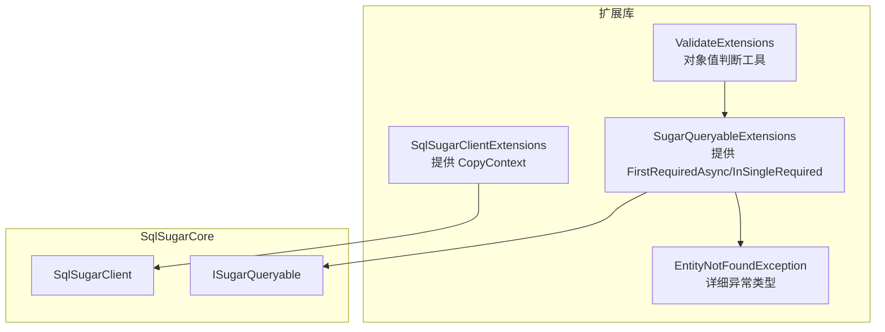
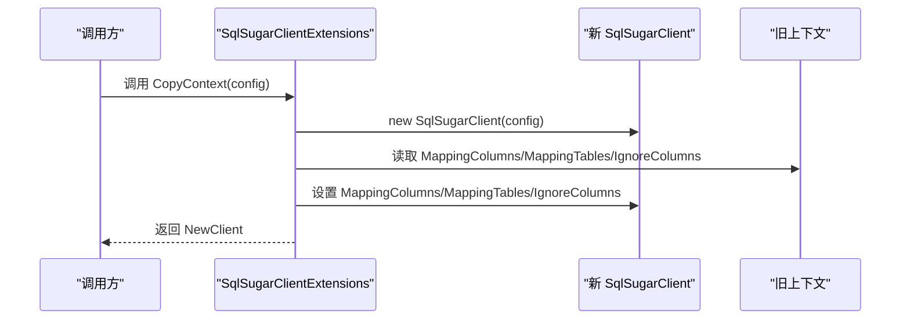
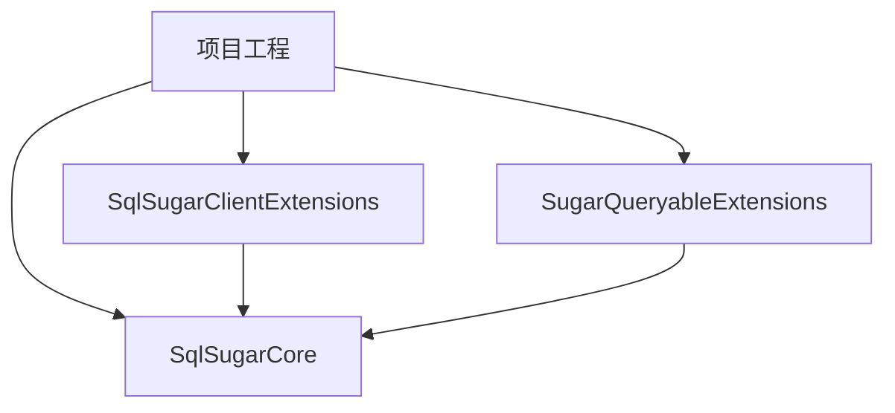

# 客户端扩展工具

<cite>
**本文引用的文件**
- [SqlSugarClientExtensions.cs](file://ClassLibrary1/SqlSugarClientExtensions.cs)
- [SqlSugarClientExtensions.cs](file://EasySharp.SqlSugarCore.Extensions.4.0.0.3/SqlSugarClientExtensions.cs)
- [SqlSugarClientExtensions.cs](file://EasySharp.SqlSugarCore.Extensions.4.2.1.9/SqlSugarClientExtensions.cs)
- [SqlSugarClientExtensions.cs](file://EasySharp.SqlSugarCore.Extensions.4.3.2.4/SqlSugarClientExtensions.cs)
- [SugarQueryableExtensions.cs](file://ClassLibrary1/SugarQueryableExtensions.cs)
- [SugarQueryableExtensions.cs](file://EasySharp.SqlSugarCore.Extensions.4.5.1/SugarQueryableExtensions.cs)
- [SugarQueryableExtensions.cs](file://EasySharp.SqlSugarCore.Extensions.5.0.0.5/SugarQueryableExtensions.cs)
- [EntityNotFoundException.cs](file://ClassLibrary1/EntityNotFoundException.cs)
- [ValidateExtensions.cs](file://ClassLibrary1/ValidateExtensions.cs)
- [README.md](file://README.md)
- [EasySharp.SqlSugarCore.Extensions.csproj](file://EasySharp.SqlSugarCore.Extensions/EasySharp.SqlSugarCore.Extensions.csproj)
</cite>

## 目录
1. [简介](#简介)
2. [项目结构](#项目结构)
3. [核心组件](#核心组件)
4. [架构总览](#架构总览)
5. [详细组件分析](#详细组件分析)
6. [依赖关系分析](#依赖关系分析)
7. [性能考量](#性能考量)
8. [故障排查指南](#故障排查指南)
9. [结论](#结论)
10. [附录](#附录)

## 简介
本项目是 SqlSugar ORM 的扩展库，提供强类型查询扩展方法与完善的异常信息输出，帮助开发者在异步查询中确保结果存在并获得清晰的错误定位。同时，项目提供了 CopyContext 上下文复制能力，使在并发查询场景下能够安全地创建独立的 SqlSugarClient 实例，避免共享状态带来的线程安全问题。

## 项目结构
该项目采用按版本分包的组织方式，核心扩展位于多个版本目录中，统一通过静态扩展类提供功能：
- 扩展入口：SqlSugarClientExtensions（提供 CopyContext）
- 查询扩展：SugarQueryableExtensions（提供 FirstRequiredAsync、InSingleRequired 等）
- 异常类型：SqlSugarEntityNotFoundException（带实体类型、谓词、SQL 的详细异常）
- 工具扩展：ValidateExtensions（对象值判断）

图表来源
- [SqlSugarClientExtensions.cs:1-15](file://ClassLibrary1/SqlSugarClientExtensions.cs#L1-L15)
- [SugarQueryableExtensions.cs:1-161](file://ClassLibrary1/SugarQueryableExtensions.cs#L1-L161)
- [EntityNotFoundException.cs:1-60](file://ClassLibrary1/EntityNotFoundException.cs#L1-L60)
- [ValidateExtensions.cs:1-18](file://ClassLibrary1/ValidateExtensions.cs#L1-L18)

章节来源
- [README.md:1-117](file://README.md#L1-L117)
- [EasySharp.SqlSugarCore.Extensions.csproj:1-13](file://EasySharp.SqlSugarCore.Extensions/EasySharp.SqlSugarCore.Extensions.csproj#L1-L13)

## 核心组件
- CopyContext 扩展方法：基于传入的连接配置创建新的 SqlSugarClient，并复制映射列、映射表、忽略列等上下文配置，返回独立实例。
- 查询扩展方法：提供 FirstRequiredAsync、InSingleRequired 等强类型查询，若无结果则抛出包含实体类型、谓词、SQL 的异常。
- 异常类型：SqlSugarEntityNotFoundException，便于定位未找到实体的查询问题。
- 工具扩展：ValidateExtensions 提供 HasValue/IsNullOrEmpty 等便捷判断。

章节来源
- [SqlSugarClientExtensions.cs:1-15](file://ClassLibrary1/SqlSugarClientExtensions.cs#L1-L15)
- [SugarQueryableExtensions.cs:1-161](file://ClassLibrary1/SugarQueryableExtensions.cs#L1-L161)
- [EntityNotFoundException.cs:1-60](file://ClassLibrary1/EntityNotFoundException.cs#L1-L60)
- [ValidateExtensions.cs:1-18](file://ClassLibrary1/ValidateExtensions.cs#L1-L18)

## 架构总览
CopyContext 的工作流程如下：
- 输入：现有 SqlSugarClient 与新的 ConnectionConfig
- 处理：创建新客户端，复制 MappingColumns、MappingTables、IgnoreColumns
- 输出：返回独立的 SqlSugarClient 实例，可用于并发查询

图表来源
- [SqlSugarClientExtensions.cs:5-12](file://ClassLibrary1/SqlSugarClientExtensions.cs#L5-L12)

## 详细组件分析

### CopyContext 方法实现与线程安全特性
- 实现机制
  - 基于传入的 ConnectionConfig 创建新的 SqlSugarClient 实例，确保与原实例隔离。
  - 复制 MappingColumns、MappingTables、IgnoreColumns 等上下文配置，保证新实例具备相同的映射与忽略规则。
  - 返回新实例，避免与原实例共享内部状态，从而规避并发访问冲突。

- 线程安全特性
  - 新实例拥有独立的上下文状态，避免多线程同时修改同一上下文导致的数据竞争。
  - 在并发查询场景下，每个线程可持有自己的 SqlSugarClient 实例，降低锁竞争与上下文污染风险。

- 内存管理与资源分配
  - 每次调用都会创建新的 SqlSugarClient，需要在使用后及时释放，避免内存泄漏。
  - 若频繁调用，建议结合池化或缓存策略，减少重复创建的开销。

- 并发查询使用方法与注意事项
  - 每个并发任务/请求应使用独立的 SqlSugarClient 实例。
  - 避免跨线程共享同一个 SqlSugarClient 实例。
  - 注意 ConnectionConfig 的生命周期与连接池配置，确保连接正确关闭。

- 性能影响与内存开销
  - 创建新实例带来额外的初始化成本，但换来线程安全与隔离性。
  - 对于高并发场景，建议评估实例复用与连接池策略以平衡性能与安全性。

- 单例模式结合的最佳实践
  - 不推荐将 SqlSugarClient 设计为全局单例用于并发查询。
  - 推荐在 DI 容器中按作用域注册（如 ASP.NET Core 的 Scoped），每次请求获取独立实例。
  - 如需共享只读配置，可将 ConnectionConfig 作为单例注入，再通过 CopyContext 生成独立实例。

- Web 应用与桌面应用的不同场景
  - Web 应用：建议按请求作用域创建实例，避免跨请求污染；可结合连接池与超时配置。
  - 桌面应用：可按用户会话或窗口生命周期管理实例；注意在退出时释放资源。

章节来源
- [SqlSugarClientExtensions.cs:5-12](file://ClassLibrary1/SqlSugarClientExtensions.cs#L5-L12)
- [SugarQueryableExtensions.cs:119-142](file://ClassLibrary1/SugarQueryableExtensions.cs#L119-L142)

### 查询扩展与异常处理
- FirstRequiredAsync/InSingleRequired
  - 当查询结果为空时，抛出 SqlSugarEntityNotFoundException，包含实体类型、谓词与 SQL 信息，便于快速定位问题。
  - 支持同步与异步版本，满足不同场景需求。

- 异常信息截断策略
  - 为防止异常消息过大，对谓词与 SQL 进行长度截断，保留尾部关键信息。

- ToSqlString 辅助方法
  - 提供 ToSqlString 将查询转换为 SQL 字符串，便于日志与调试。

章节来源
- [SugarQueryableExtensions.cs:13-56](file://ClassLibrary1/SugarQueryableExtensions.cs#L13-L56)
- [EntityNotFoundException.cs:34-58](file://ClassLibrary1/EntityNotFoundException.cs#L34-L58)

### CopyQueryable 并发查询辅助
- CopyQueryable 逻辑
  - 基于当前查询构建一个新的上下文，复制查询构建器的关键属性（如 Take、Skip、WhereInfos、Parameters 等）。
  - 设置 IsAutoCloseConnection 为 true，确保查询完成后自动关闭连接。
  - 通过 Queryable<ExpandoObject>().Select<T>(string.Empty) 构建可重写的查询对象，避免与原始查询共享状态。

- 并发场景下的优势
  - 每个并发任务拥有独立的查询上下文，避免参数污染与状态共享。
  - 适合在高并发读取场景中提升稳定性与可维护性。

章节来源
- [SugarQueryableExtensions.cs:119-142](file://ClassLibrary1/SugarQueryableExtensions.cs#L119-L142)

## 依赖关系分析
- 项目依赖 SqlSugarCore，版本范围从 4.0.0.3 到 5.0.8.2+，支持 netstandard1.6 至 netstandard2.1。
- 扩展方法依赖 SqlSugarClient 与 ISugarQueryable 的公共接口，确保跨版本兼容性。

图表来源
- [EasySharp.SqlSugarCore.Extensions.csproj:9-11](file://EasySharp.SqlSugarCore.Extensions/EasySharp.SqlSugarCore.Extensions.csproj#L9-L11)
- [README.md:32-37](file://README.md#L32-L37)

章节来源
- [README.md:28-37](file://README.md#L28-L37)
- [EasySharp.SqlSugarCore.Extensions.csproj:1-13](file://EasySharp.SqlSugarCore.Extensions/EasySharp.SqlSugarCore.Extensions.csproj#L1-L13)

## 性能考量
- CopyContext 成本
  - 每次创建新实例涉及对象初始化与配置复制，建议在高并发场景中评估实例复用策略。
- 连接池与超时
  - 合理设置连接池大小与命令超时，避免阻塞与资源耗尽。
- 查询优化
  - 使用 FirstRequiredAsync/InSingleRequired 等方法减少不必要的数据传输，提高响应速度。
- 日志与诊断
  - 通过 ToSqlString 获取 SQL，结合异常信息快速定位性能瓶颈。

## 故障排查指南
- 未找到实体异常
  - 使用 FirstRequiredAsync/InSingleRequired 抛出 SqlSugarEntityNotFoundException，检查实体类型、谓词与 SQL。
  - 异常消息包含实体类型、谓词与 SQL，便于定位问题。

- 查询无结果
  - 确认查询条件是否正确，必要时打印 ToSqlString 进行验证。
  - 检查 MappingColumns/MappingTables/IgnoreColumns 是否影响了查询结果。

- 并发问题
  - 避免跨线程共享 SqlSugarClient 实例，使用 CopyContext 为每个线程创建独立实例。
  - 确保连接正确关闭，避免连接泄漏。

章节来源
- [EntityNotFoundException.cs:1-60](file://ClassLibrary1/EntityNotFoundException.cs#L1-L60)
- [SugarQueryableExtensions.cs:58-94](file://ClassLibrary1/SugarQueryableExtensions.cs#L58-L94)

## 结论
本扩展库通过 CopyContext 与一系列强类型查询扩展，为并发场景提供了可靠的线程安全方案。结合异常信息与查询辅助方法，显著提升了开发效率与问题定位能力。在实际应用中，建议遵循按作用域创建实例的原则，并结合连接池与超时配置，以获得最佳的性能与稳定性表现。

## 附录
- 版本兼容性
  - 支持 SqlSugarCore 4.0.0.3 至 5.0.8.2+，目标框架从 netstandard1.6 到 netstandard2.1。
- 安装与使用
  - 通过 NuGet 安装包并引入命名空间即可使用扩展方法。
- 最佳实践
  - Web 应用：按请求作用域注册实例；桌面应用：按用户会话管理实例。
  - 高并发场景：评估实例复用与连接池策略，避免频繁创建销毁。

章节来源
- [README.md:14-26](file://README.md#L14-L26)
- [README.md:28-37](file://README.md#L28-L37)
- [README.md:92-117](file://README.md#L92-L117)