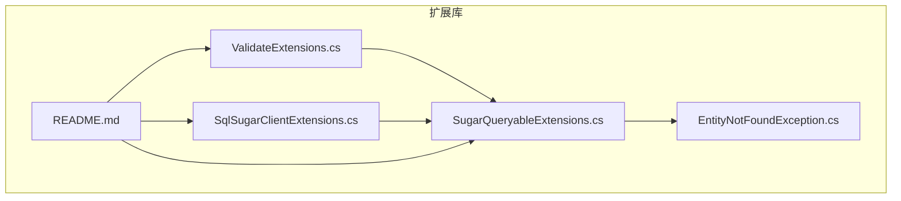
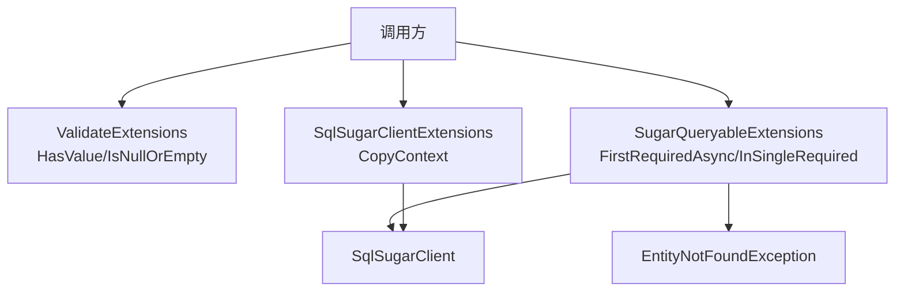
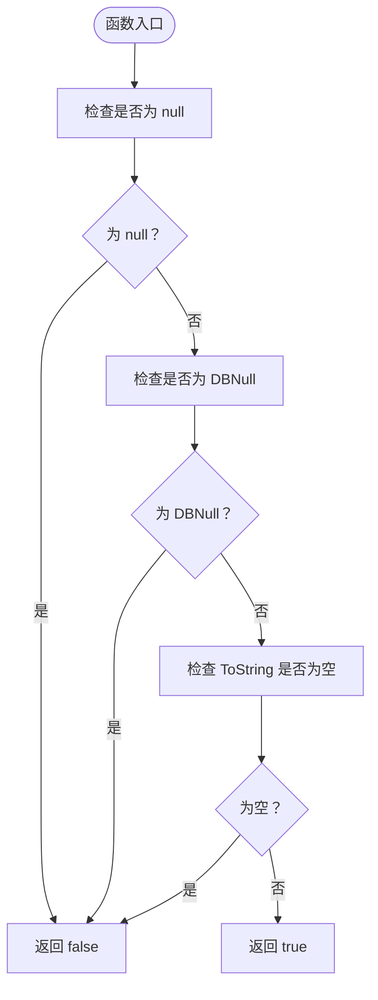
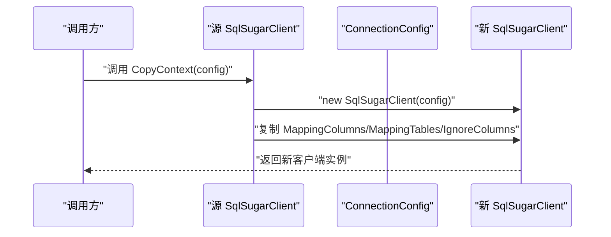
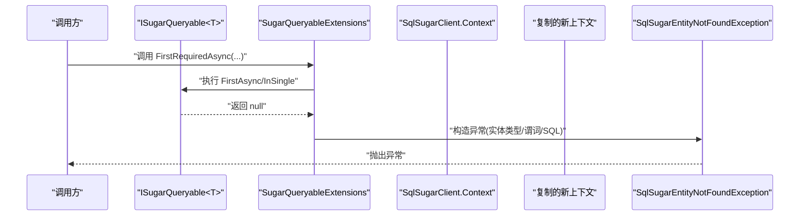
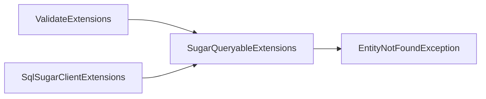

# 工具类功能

<cite>
**本文引用的文件**
- [ValidateExtensions.cs](file://ClassLibrary1/ValidateExtensions.cs)
- [SqlSugarClientExtensions.cs](file://ClassLibrary1/SqlSugarClientExtensions.cs)
- [SugarQueryableExtensions.cs](file://ClassLibrary1/SugarQueryableExtensions.cs)
- [EntityNotFoundException.cs](file://ClassLibrary1/EntityNotFoundException.cs)
- [README.md](file://README.md)
</cite>

## 目录
1. [简介](#简介)
2. [项目结构](#项目结构)
3. [核心组件](#核心组件)
4. [架构总览](#架构总览)
5. [详细组件分析](#详细组件分析)
6. [依赖关系分析](#依赖关系分析)
7. [性能考量](#性能考量)
8. [故障排查指南](#故障排查指南)
9. [结论](#结论)
10. [附录](#附录)

## 简介
本文件聚焦于工具类功能，系统化阐述以下要点：
- ValidateExtensions 中 HasValue 与 IsNullOrEmpty 的实现原理与使用场景
- SqlSugarClientExtensions 中 CopyContext 的上下文复制机制与线程安全考量
- 这些工具类如何与核心查询功能（SugarQueryableExtensions）协同工作
- 具体使用示例与集成方式
- 设计原则、扩展性考虑、性能影响与使用建议

## 项目结构
该仓库包含多个版本的扩展包，但核心工具类在各版本中保持稳定。本次文档以 ClassLibrary1 作为主要参考，其包含以下关键文件：
- ValidateExtensions.cs：提供对象值校验的扩展方法
- SqlSugarClientExtensions.cs：提供 SqlSugarClient 上下文复制能力
- SugarQueryableExtensions.cs：提供强类型查询扩展与异常增强
- EntityNotFoundException.cs：查询不到实体时的专用异常类型
- README.md：安装、使用与 API 参考说明

**图表来源**
- [ValidateExtensions.cs:1-18](file://ClassLibrary1/ValidateExtensions.cs#L1-L18)
- [SqlSugarClientExtensions.cs:1-15](file://ClassLibrary1/SqlSugarClientExtensions.cs#L1-L15)
- [SugarQueryableExtensions.cs:1-161](file://ClassLibrary1/SugarQueryableExtensions.cs#L1-L161)
- [EntityNotFoundException.cs:1-60](file://ClassLibrary1/EntityNotFoundException.cs#L1-L60)
- [README.md:1-117](file://README.md#L1-L117)

**章节来源**
- [README.md:1-117](file://README.md#L1-L117)

## 核心组件
- ValidateExtensions：提供 HasValue 与 IsNullOrEmpty 两个扩展方法，统一处理 null、DBNull 与空字符串的判断逻辑，便于在数据访问层进行健壮性校验。
- SqlSugarClientExtensions：提供 CopyContext 方法，基于给定连接配置创建新的 SqlSugarClient，并复制映射与忽略配置，用于隔离或复用查询上下文。
- SugarQueryableExtensions：提供 FirstRequiredAsync、InSingleRequired 等强类型查询扩展，结合 EntityNotFoundException 提供更友好的“未找到”错误信息；内部通过复制上下文实现异步查询的安全执行。
- EntityNotFoundException：自定义异常类型，携带实体类型、谓词与 SQL 信息，便于定位问题。

**章节来源**
- [ValidateExtensions.cs:1-18](file://ClassLibrary1/ValidateExtensions.cs#L1-L18)
- [SqlSugarClientExtensions.cs:1-15](file://ClassLibrary1/SqlSugarClientExtensions.cs#L1-L15)
- [SugarQueryableExtensions.cs:1-161](file://ClassLibrary1/SugarQueryableExtensions.cs#L1-L161)
- [EntityNotFoundException.cs:1-60](file://ClassLibrary1/EntityNotFoundException.cs#L1-L60)

## 架构总览
工具类与核心查询功能的协作关系如下：
- ValidateExtensions 在查询前对输入参数或返回值进行校验，减少后续异常概率
- SqlSugarClientExtensions 负责复制上下文，保证并发场景下的隔离性
- SugarQueryableExtensions 将上述能力整合到查询链路中，提供强类型、带异常信息的查询体验

**图表来源**
- [ValidateExtensions.cs:1-18](file://ClassLibrary1/ValidateExtensions.cs#L1-L18)
- [SqlSugarClientExtensions.cs:1-15](file://ClassLibrary1/SqlSugarClientExtensions.cs#L1-L15)
- [SugarQueryableExtensions.cs:1-161](file://ClassLibrary1/SugarQueryableExtensions.cs#L1-L161)
- [EntityNotFoundException.cs:1-60](file://ClassLibrary1/EntityNotFoundException.cs#L1-L60)

## 详细组件分析

### ValidateExtensions：HasValue 与 IsNullOrEmpty
- 设计目标
  - 统一处理对象是否为空/空字符串的判断，避免重复代码
  - 显式排除 DBNull.Value，确保与数据库层交互时的正确性
- 实现要点
  - HasValue：要求对象非 null、非 DBNull、且 ToString 非空
  - IsNullOrEmpty：任一条件满足即为真
- 使用场景
  - 查询前参数校验（如主键、业务键）
  - 结果集判空与默认值处理
  - 避免因空字符串导致的误判

**图表来源**
- [ValidateExtensions.cs:7-15](file://ClassLibrary1/ValidateExtensions.cs#L7-L15)

**章节来源**
- [ValidateExtensions.cs:1-18](file://ClassLibrary1/ValidateExtensions.cs#L1-L18)

### SqlSugarClientExtensions：CopyContext 上下文复制机制与线程安全
- 复制内容
  - 映射列、映射表、忽略列等配置从源客户端上下文复制到新客户端
- 并发与线程安全
  - 通过创建独立的 SqlSugarClient 实例，避免共享状态引发的竞争条件
  - 适用于需要隔离查询上下文的场景（如异步任务、多租户、事务边界）
- 性能权衡
  - 创建新实例带来少量开销，但换来更好的隔离性与可维护性
  - 对于高频复制场景，可评估缓存或池化策略（需谨慎设计）

**图表来源**
- [SqlSugarClientExtensions.cs:5-12](file://ClassLibrary1/SqlSugarClientExtensions.cs#L5-L12)

**章节来源**
- [SqlSugarClientExtensions.cs:1-15](file://ClassLibrary1/SqlSugarClientExtensions.cs#L1-L15)

### 与核心查询功能的协同：SugarQueryableExtensions
- 强类型查询扩展
  - FirstRequiredAsync/FirstRequiredAsync(Expression)：若无结果则抛出包含实体类型、谓词与 SQL 的异常
  - InSingleRequired/InSingleRequiredAsync：按主键查询，不存在时同样抛出异常
- 异步查询与上下文复制
  - 内部通过 CopyQueryable 复制查询构建器状态（Skip/Take/Select/Where/Join 等），并基于新上下文执行查询
  - 复制过程中同步日志事件开关与回调，保证异步执行的一致性
- 错误信息增强
  - ToSqlString 提供 SQL 字符串输出，便于诊断
  - 异常类型 SqlSugarEntityNotFoundException 携带实体类型、谓词与 SQL，便于快速定位问题

**图表来源**
- [SugarQueryableExtensions.cs:13-78](file://ClassLibrary1/SugarQueryableExtensions.cs#L13-L78)
- [EntityNotFoundException.cs:12-58](file://ClassLibrary1/EntityNotFoundException.cs#L12-L58)

**章节来源**
- [SugarQueryableExtensions.cs:1-161](file://ClassLibrary1/SugarQueryableExtensions.cs#L1-L161)
- [EntityNotFoundException.cs:1-60](file://ClassLibrary1/EntityNotFoundException.cs#L1-L60)

## 依赖关系分析
- ValidateExtensions 与 SugarQueryableExtensions 的耦合
  - SugarQueryableExtensions 在部分路径上直接使用 IsNullOrEmpty 判断排序与分页参数，体现工具类对查询层的支撑作用
- SqlSugarClientExtensions 与 SugarQueryableExtensions 的耦合
  - CopyQueryable 步骤依赖 CopyContext，从而将上下文复制能力与查询扩展紧密绑定
- 异常类型依赖
  - SugarQueryableExtensions 抛出 SqlSugarEntityNotFoundException，形成清晰的错误契约

**图表来源**
- [ValidateExtensions.cs:1-18](file://ClassLibrary1/ValidateExtensions.cs#L1-L18)
- [SqlSugarClientExtensions.cs:1-15](file://ClassLibrary1/SqlSugarClientExtensions.cs#L1-L15)
- [SugarQueryableExtensions.cs:1-161](file://ClassLibrary1/SugarQueryableExtensions.cs#L1-L161)
- [EntityNotFoundException.cs:1-60](file://ClassLibrary1/EntityNotFoundException.cs#L1-L60)

**章节来源**
- [SugarQueryableExtensions.cs:108-142](file://ClassLibrary1/SugarQueryableExtensions.cs#L108-L142)

## 性能考量
- HasValue/IsNullOrEmpty
  - 时间复杂度 O(1)，空间复杂度 O(1)，开销极低
  - 建议在高频路径（如参数校验、循环内）使用，提升可读性与健壮性
- CopyContext/CopyQueryable
  - 创建新客户端与复制查询构建器带来一定内存与 CPU 开销
  - 适用于需要隔离的场景；对于高并发、短生命周期的查询，建议评估是否需要缓存或复用上下文
- 异步查询优化
  - ToListAsync 通过复制上下文执行，避免阻塞主线程；注意控制并发数量，防止上下文爆炸
- 日志与诊断
  - 异常中包含 SQL，有助于快速定位问题，但应避免在生产环境过度打印长 SQL

[本节为通用性能讨论，不直接分析具体文件]

## 故障排查指南
- “实体未找到”异常
  - 现象：调用 FirstRequiredAsync/InSingleRequired 等方法时抛出 SqlSugarEntityNotFoundException
  - 排查要点：检查实体类型、谓词表达式、SQL 输出；确认数据是否存在、索引是否可用
  - 参考实现：异常构造与消息拼接逻辑
- 参数为空或空字符串
  - 现象：查询无结果或出现意外行为
  - 排查要点：使用 HasValue/IsNullOrEmpty 对输入进行显式校验
- 并发与上下文冲突
  - 现象：异步查询互相干扰、日志事件异常
  - 排查要点：确认是否正确使用 CopyContext/CopyQueryable；避免共享上下文状态

**章节来源**
- [EntityNotFoundException.cs:34-58](file://ClassLibrary1/EntityNotFoundException.cs#L34-L58)
- [SugarQueryableExtensions.cs:58-94](file://ClassLibrary1/SugarQueryableExtensions.cs#L58-L94)

## 结论
- ValidateExtensions 提供了简洁可靠的值校验能力，是数据访问层健壮性的基础
- SqlSugarClientExtensions 的 CopyContext 为并发与隔离提供了基础设施
- SugarQueryableExtensions 将上述能力整合到查询链路，显著提升了错误诊断与使用体验
- 建议在实际项目中：
  - 在参数与结果处广泛使用 HasValue/IsNullOrEmpty
  - 在需要隔离的场景使用 CopyContext/CopyQueryable
  - 通过异常类型与 SQL 输出快速定位问题

[本节为总结性内容，不直接分析具体文件]

## 附录

### 使用示例与集成方式
- 安装与版本
  - 参见 README 的安装与版本兼容性说明
- 查询与异常处理
  - 参见 README 的使用方法与 API 参考，了解 FirstRequiredAsync、InSingleRequired 等方法的典型用法
- 集成步骤
  - 在查询前使用 HasValue/IsNullOrEmpty 进行参数校验
  - 在需要隔离的查询中使用 CopyContext/CopyQueryable
  - 捕获 SqlSugarEntityNotFoundException 获取详细错误信息

**章节来源**
- [README.md:14-117](file://README.md#L14-L117)