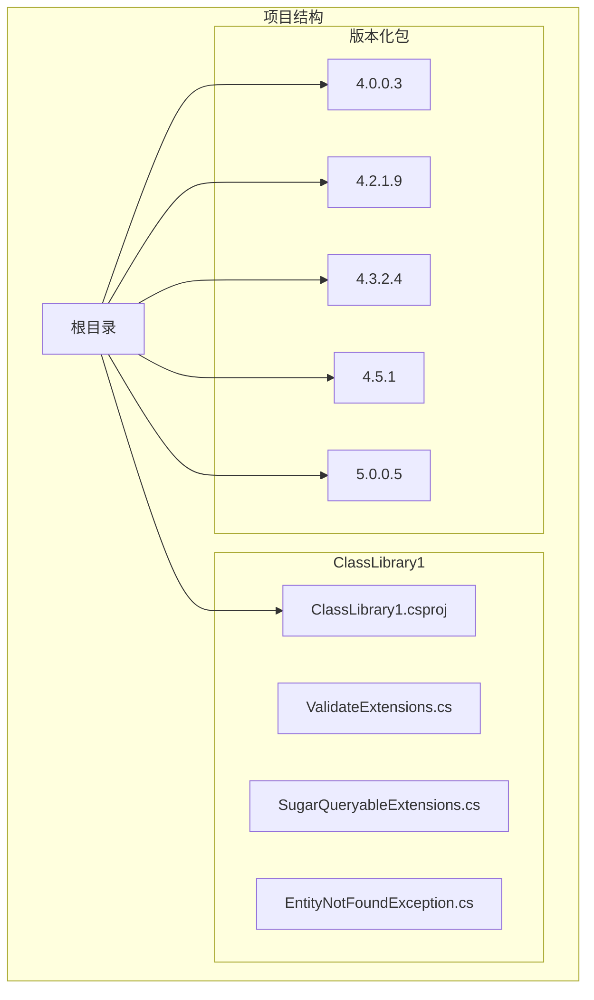
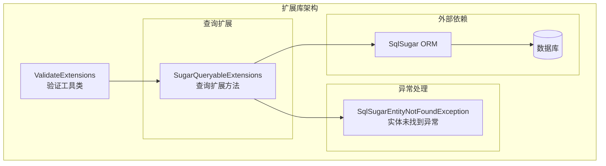
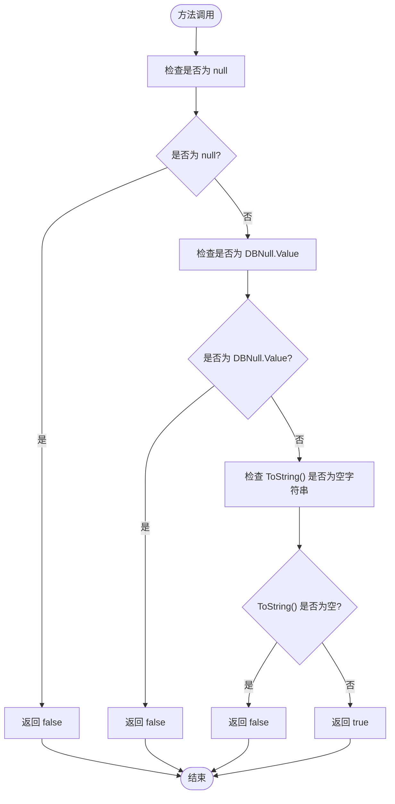
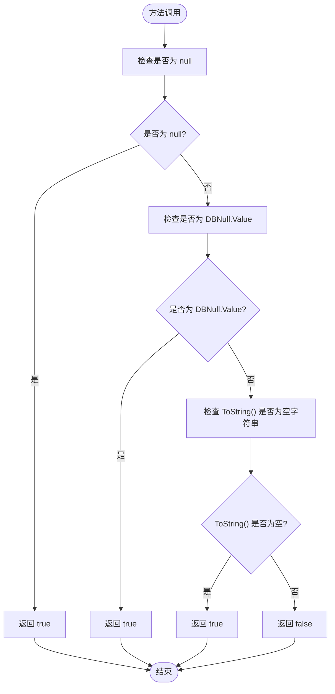
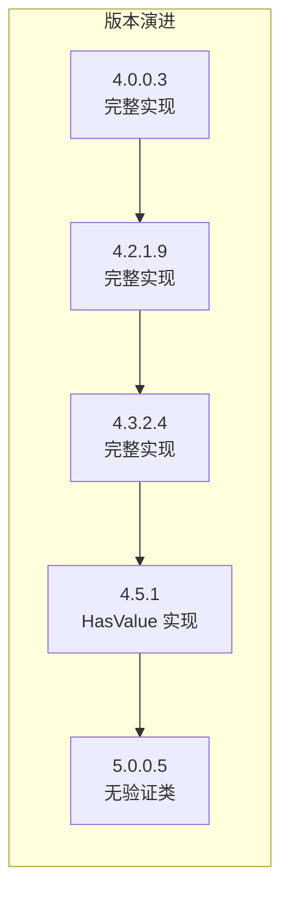
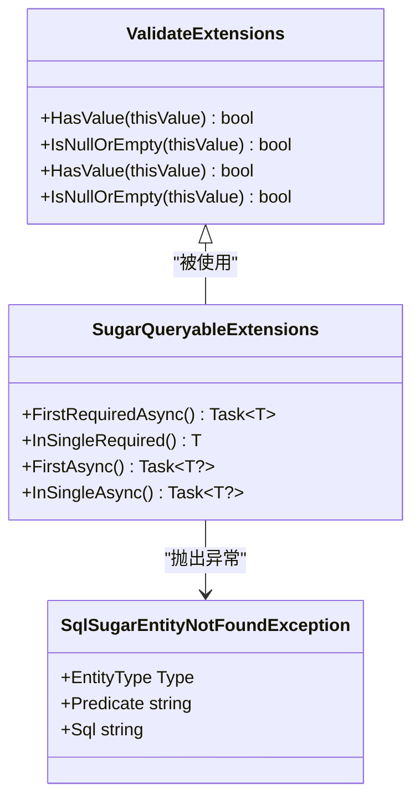

# 验证工具类

<cite>
**本文引用的文件**
- [ValidateExtensions.cs](file://ClassLibrary1/ValidateExtensions.cs)
- [ValidateExtensions.cs](file://EasySharp.SqlSugarCore.Extensions.4.0.0.3/ValidateExtensions.cs)
- [ValidateExtensions.cs](file://EasySharp.SqlSugarCore.Extensions.4.2.1.9/ValidateExtensions.cs)
- [ValidateExtensions.cs](file://EasySharp.SqlSugarCore.Extensions.4.3.2.4/ValidateExtensions.cs)
- [ValidateExtensions.cs](file://EasySharp.SqlSugarCore.Extensions.4.5.1/ValidateExtensions.cs)
- [SugarQueryableExtensions.cs](file://ClassLibrary1/SugarQueryableExtensions.cs)
- [EntityNotFoundException.cs](file://ClassLibrary1/EntityNotFoundException.cs)
- [README.md](file://README.md)
</cite>

## 目录
1. [简介](#简介)
2. [项目结构](#项目结构)
3. [核心组件](#核心组件)
4. [架构概览](#架构概览)
5. [详细组件分析](#详细组件分析)
6. [依赖关系分析](#依赖关系分析)
7. [性能考虑](#性能考虑)
8. [故障排除指南](#故障排除指南)
9. [结论](#结论)
10. [附录](#附录)

## 简介
ValidateExtensions 验证工具类是 EasySharp.SqlSugarCore.Extensions 扩展库的核心组件之一，专门用于处理数据库查询结果和用户输入中的空值验证。该工具类提供了两个关键的扩展方法：HasValue 和 IsNullOrEmpty，它们能够智能地处理 null、DBNull.Value 和空字符串的判断逻辑，为开发者提供了一种更加健壮和一致的空值检查方式。

该工具类的设计理念是为 SqlSugar ORM 提供更完善的空值处理能力，特别是在处理数据库查询结果时，能够准确区分数据库层的空值表示（DBNull.Value）和应用程序层的 null 值，避免常见的空值检查陷阱。

## 项目结构
EasySharp.SqlSugarCore.Extensions 项目采用了多版本兼容的结构设计，为不同版本的 SqlSugar ORM 提供了相应的扩展包：



**图表来源**
- [README.md:28-37](file://README.md#L28-L37)

每个版本的包都包含了相同的 ValidateExtensions.cs 文件，确保了功能的一致性和向后兼容性。这种设计使得开发者可以根据自己的 SqlSugar 版本选择合适的扩展包。

**章节来源**
- [README.md:28-37](file://README.md#L28-L37)

## 核心组件
ValidateExtensions 验证工具类包含两个核心扩展方法，它们都是静态方法，可以作为任何对象的扩展方法使用：

### HasValue 扩展方法
HasValue 方法用于判断一个对象是否具有有效值。它会检查对象是否不为 null、不等于 DBNull.Value，并且其字符串表示不为空字符串。

### IsNullOrEmpty 扩展方法
IsNullOrEmpty 方法用于判断一个对象是否为空或无效。它会检查对象是否为 null、等于 DBNull.Value 或其字符串表示为空字符串。

这两个方法的设计巧妙地利用了 ToString() 方法的特性，确保了对各种数据类型的统一处理。

**章节来源**
- [ValidateExtensions.cs:7-15](file://ClassLibrary1/ValidateExtensions.cs#L7-L15)

## 架构概览
ValidateExtensions 在整个扩展库中扮演着基础设施的角色，为其他组件提供基础的验证能力：



**图表来源**
- [SugarQueryableExtensions.cs:10-161](file://ClassLibrary1/SugarQueryableExtensions.cs#L10-L161)
- [EntityNotFoundException.cs:5-60](file://ClassLibrary1/EntityNotFoundException.cs#L5-L60)

ValidateExtensions 通过提供统一的空值检查机制，简化了上层组件的逻辑复杂度，使得查询扩展方法和异常处理能够专注于各自的职责。

## 详细组件分析

### HasValue 方法实现分析

HasValue 方法的实现体现了对多种空值情况的综合考虑：



**图表来源**
- [ValidateExtensions.cs:7-10](file://ClassLibrary1/ValidateExtensions.cs#L7-L10)

#### 实现原理
HasValue 方法的判断逻辑遵循以下优先级：
1. 首先检查对象是否为 null
2. 然后检查对象是否等于 DBNull.Value
3. 最后检查对象的字符串表示是否为空字符串

这种方法确保了对数据库查询结果的准确处理，因为数据库中的空值通常以 DBNull.Value 表示，而不是 null。

#### 使用场景
- 数据库查询结果验证
- 用户输入验证
- 配置参数检查
- API 响应数据验证

### IsNullOrEmpty 方法实现分析

IsNullOrEmpty 方法与 HasValue 方法形成互补，提供了相反的判断逻辑：



**图表来源**
- [ValidateExtensions.cs:12-15](file://ClassLibrary1/ValidateExtensions.cs#L12-L15)

#### 实现原理
IsNullOrEmpty 方法的判断逻辑同样遵循三层检查：
1. 对象为 null 时返回 true
2. 对象等于 DBNull.Value 时返回 true
3. 对象的字符串表示为空字符串时返回 true

这种方法确保了在需要快速判断对象是否为空时的简洁性。

#### 使用场景
- 条件判断中的空值检查
- 数据验证前的预检查
- 默认值设置逻辑
- 条件渲染控制

### 版本兼容性分析

从 4.0.0.3 到 4.5.1 版本的演进过程中，ValidateExtensions 的实现保持了高度的一致性：



**图表来源**
- [ValidateExtensions.cs:7-15](file://ClassLibrary1/ValidateExtensions.cs#L7-L15)
- [ValidateExtensions.cs:7-10](file://EasySharp.SqlSugarCore.Extensions.4.5.1/ValidateExtensions.cs#L7-L10)

从 4.5.1 版本开始，ValidateExtensions 类被移除，这表明后续版本可能采用了不同的实现策略或将其功能集成到其他组件中。

**章节来源**
- [ValidateExtensions.cs:7-15](file://ClassLibrary1/ValidateExtensions.cs#L7-L15)
- [ValidateExtensions.cs:7-10](file://EasySharp.SqlSugarCore.Extensions.4.5.1/ValidateExtensions.cs#L7-L10)

## 依赖关系分析

ValidateExtensions 与其他组件之间的依赖关系体现了清晰的分层架构：



**图表来源**
- [ValidateExtensions.cs:5-16](file://ClassLibrary1/ValidateExtensions.cs#L5-L16)
- [SugarQueryableExtensions.cs:10-161](file://ClassLibrary1/SugarQueryableExtensions.cs#L10-L161)
- [EntityNotFoundException.cs:5-60](file://ClassLibrary1/EntityNotFoundException.cs#L5-L60)

### 依赖关系说明
1. **ValidateExtensions 依赖关系**：该类本身不依赖其他组件，是一个纯函数式的工具类
2. **SugarQueryableExtensions 依赖关系**：查询扩展方法使用 ValidateExtensions 进行空值检查
3. **异常处理依赖关系**：当查询结果为空时，查询扩展方法抛出 SqlSugarEntityNotFoundException

这种设计确保了验证逻辑的独立性和可重用性，同时保持了查询扩展方法的职责单一性。

**章节来源**
- [SugarQueryableExtensions.cs:101-157](file://ClassLibrary1/SugarQueryableExtensions.cs#L101-L157)

## 性能考虑

### 时间复杂度分析
两个扩展方法的时间复杂度均为 O(1)，因为它们只进行简单的比较操作：
- null 检查：O(1)
- DBNull.Value 检查：O(1)
- ToString() 调用：O(n)，其中 n 为对象字符串表示的长度
- 字符串比较：O(m)，其中 m 为字符串长度

### 空间复杂度分析
空间复杂度为 O(1)，因为方法只使用固定的局部变量，不创建额外的数据结构。

### 性能优化建议

#### 1. 避免不必要的 ToString() 调用
对于已知基本类型的对象，可以直接进行类型检查，避免 ToString() 的开销：

```csharp
// 推荐：直接类型检查
if (value is string stringValue)
{
    return !string.IsNullOrEmpty(stringValue);
}

// 不推荐：总是调用 ToString()
return value.HasValue();
```

#### 2. 缓存 ToString() 结果
对于可能重复使用的对象，可以缓存 ToString() 的结果：

```csharp
// 推荐：缓存结果
var stringValue = value.ToString();
return !string.IsNullOrEmpty(stringValue);
```

#### 3. 批量处理优化
在处理大量数据时，考虑使用 LINQ 的 Any() 或 All() 方法：

```csharp
// 推荐：批量检查
var hasValues = items.Where(item => item.HasValue()).ToList();
```

### 大型项目使用建议

#### 1. 组件内聚性
在大型项目中，建议将验证逻辑封装在专门的服务类中，而不是直接使用扩展方法：

```csharp
public class DataValidator
{
    public static bool IsValid(object value)
    {
        return value.HasValue();
    }
}
```

#### 2. 性能监控
在高并发场景下，建议监控验证方法的执行时间：

```csharp
public class PerformanceMonitor
{
    public static bool MonitorHasValue(object value)
    {
        var stopwatch = Stopwatch.StartNew();
        var result = value.HasValue();
        stopwatch.Stop();
        
        if (stopwatch.ElapsedMilliseconds > 100)
        {
            Log.Warn($"HasValue took {stopwatch.ElapsedMilliseconds}ms");
        }
        
        return result;
    }
}
```

#### 3. 内存使用优化
对于大量短生命周期的对象，注意避免频繁的 ToString() 调用：

```csharp
// 推荐：复用字符串
private static readonly string EmptyString = string.Empty;

public static bool IsNullOrEmpty(object value)
{
    return value == null || value == DBNull.Value || value.ToString() == EmptyString;
}
```

## 故障排除指南

### 常见问题及解决方案

#### 1. DBNull.Value 与 null 的混淆
**问题描述**：在数据库查询中，null 和 DBNull.Value 可能导致不同的行为

**解决方案**：
```csharp
// 正确的处理方式
if (result.HasValue())
{
    // 处理有效值
}

// 或者显式检查
if (result != null && result != DBNull.Value)
{
    // 处理有效值
}
```

#### 2. ToString() 性能问题
**问题描述**：频繁调用 ToString() 可能影响性能

**解决方案**：
```csharp
// 对于已知字符串类型，直接使用字符串检查
if (value is string str)
{
    return !string.IsNullOrEmpty(str);
}

// 对于其他类型，考虑缓存策略
var stringValue = value.ToString();
return !string.IsNullOrEmpty(stringValue);
```

#### 3. 异常处理不当
**问题描述**：在使用查询扩展方法时没有正确处理异常

**解决方案**：
```csharp
try
{
    var entity = await db.Queryable<MyEntity>()
        .FirstRequiredAsync(x => x.Id == id);
}
catch (SqlSugarEntityNotFoundException ex)
{
    // 记录详细日志
    Logger.Error($"查询失败: {ex.Message}");
    Logger.Error($"实体类型: {ex.EntityType}");
    Logger.Error($"查询条件: {ex.Predicate}");
    Logger.Error($"SQL 语句: {ex.Sql}");
    
    // 返回适当的错误响应
    return NotFound();
}
```

### 最佳实践指导

#### 1. 明确的命名约定
```csharp
// 推荐：明确的方法命名
public static bool HasValidValue(this object value)
{
    return value.HasValue();
}

public static bool IsNullOrInvalid(this object value)
{
    return value.IsNullOrEmpty();
}
```

#### 2. 文档化使用场景
```csharp
/// <summary>
/// 检查对象是否具有有效值
/// </summary>
/// <param name="value">要检查的对象</param>
/// <returns>如果对象有效且非空返回 true，否则返回 false</returns>
public static bool HasValue(this object value)
{
    // 实现代码
}
```

#### 3. 单元测试覆盖
```csharp
[Test]
public void HasValue_Should_Return_True_For_Valid_String()
{
    // Arrange
    var validString = "test";
    
    // Act
    var result = validString.HasValue();
    
    // Assert
    Assert.IsTrue(result);
}

[Test]
public void HasValue_Should_Return_False_For_Null()
{
    // Arrange
    object nullValue = null;
    
    // Act
    var result = nullValue.HasValue();
    
    // Assert
    Assert.IsFalse(result);
}
```

#### 4. 错误处理策略
```csharp
public static bool SafeHasValue(this object value)
{
    try
    {
        return value.HasValue();
    }
    catch (Exception ex)
    {
        Logger.Error($"HasValue failed for value: {value}", ex);
        return false;
    }
}
```

**章节来源**
- [EntityNotFoundException.cs:34-58](file://ClassLibrary1/EntityNotFoundException.cs#L34-L58)

## 结论
ValidateExtensions 验证工具类通过提供 HasValue 和 IsNullOrEmpty 两个扩展方法，为 SqlSugar ORM 提供了强大而灵活的空值处理能力。该工具类的设计充分考虑了数据库查询的特殊需求，能够准确处理 null、DBNull.Value 和空字符串等各种空值情况。

在大型项目中，该工具类展现了良好的性能特征和可维护性，通过清晰的接口设计和稳定的实现，为上层组件提供了可靠的基础设施支持。随着 SqlSugar 版本的演进，该工具类也在不断优化，体现了项目的持续改进和发展。

对于开发者而言，理解该工具类的实现原理和使用场景，有助于编写更加健壮和高效的代码，特别是在处理数据库查询结果和用户输入验证时。

## 附录

### 使用示例路径参考

#### 数据库查询结果验证
- [SugarQueryableExtensions.cs:13-33](file://ClassLibrary1/SugarQueryableExtensions.cs#L13-L33)
- [SugarQueryableExtensions.cs:36-56](file://ClassLibrary1/SugarQueryableExtensions.cs#L36-L56)

#### 用户输入验证
- [ValidateExtensions.cs:7-15](file://ClassLibrary1/ValidateExtensions.cs#L7-L15)

#### 异常处理示例
- [EntityNotFoundException.cs:79-90](file://ClassLibrary1/EntityNotFoundException.cs#L79-L90)

### 版本兼容性矩阵

| 版本 | HasValue | IsNullOrEmpty | 主要变化 |
|------|----------|---------------|----------|
| 4.0.0.3 | ✅ 完整实现 | ✅ 完整实现 | 初始版本 |
| 4.2.1.9 | ✅ 完整实现 | ✅ 完整实现 | 功能保持 |
| 4.3.2.4 | ✅ 完整实现 | ✅ 完整实现 | 功能保持 |
| 4.5.1 | ✅ 仅 HasValue | ❌ 移除 | 功能精简 |
| 5.0.0.5 | ❌ 移除 | ❌ 移除 | 功能迁移 |

**章节来源**
- [README.md:30-37](file://README.md#L30-L37)