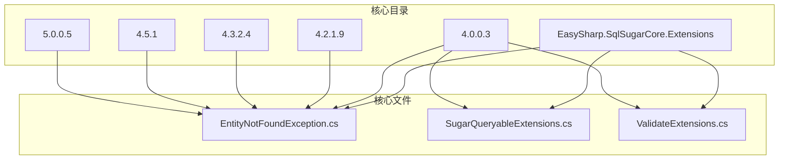
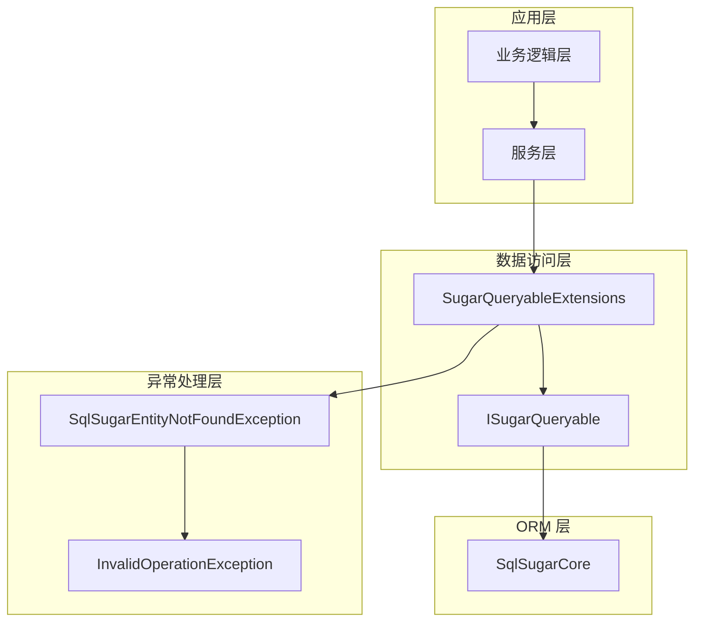
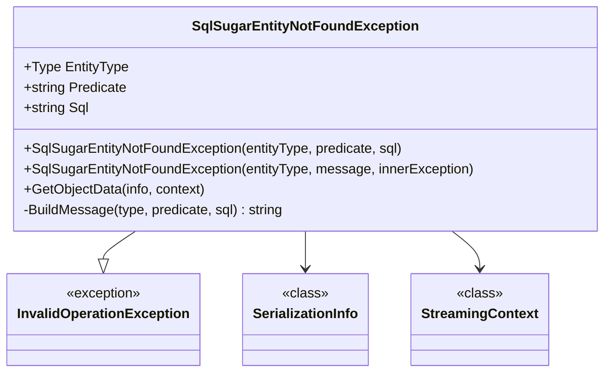
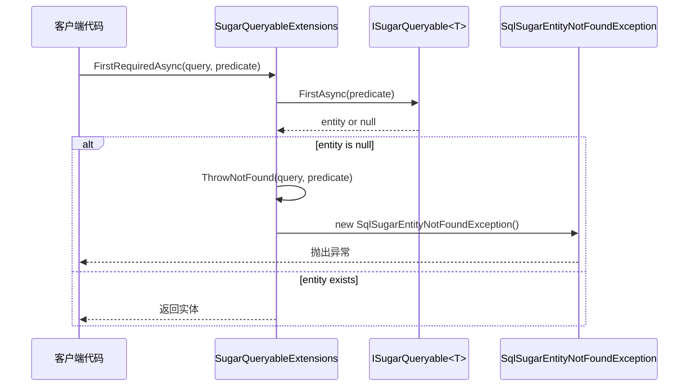
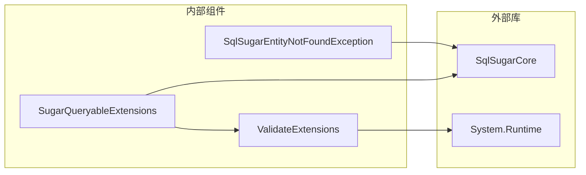
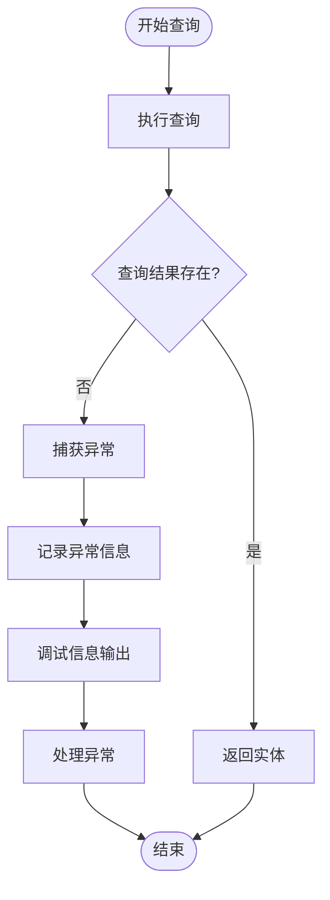

# 异常处理系统

<cite>
**本文档引用的文件**
- [EntityNotFoundException.cs](file://EasySharp.SqlSugarCore.Extensions/EntityNotFoundException.cs)
- [SugarQueryableExtensions.cs](file://EasySharp.SqlSugarCore.Extensions/SugarQueryableExtensions.cs)
- [EntityNotFoundException.cs](file://EasySharp.SqlSugarCore.Extensions.4.0.0.3/EntityNotFoundException.cs)
- [SugarQueryableExtensions.cs](file://EasySharp.SqlSugarCore.Extensions.4.0.0.3/SugarQueryableExtensions.cs)
- [ValidateExtensions.cs](file://EasySharp.SqlSugarCore.Extensions.4.0.0.3/ValidateExtensions.cs)
- [EntityNotFoundException.cs](file://EasySharp.SqlSugarCore.Extensions.4.2.1.9/EntityNotFoundException.cs)
- [EntityNotFoundException.cs](file://EasySharp.SqlSugarCore.Extensions.4.3.2.4/EntityNotFoundException.cs)
- [EntityNotFoundException.cs](file://EasySharp.SqlSugarCore.Extensions.4.5.1/EntityNotFoundException.cs)
- [EntityNotFoundException.cs](file://EasySharp.SqlSugarCore.Extensions.5.0.0.5/EntityNotFoundException.cs)
- [README.md](file://README.md)
</cite>

## 目录
1. [简介](#简介)
2. [项目结构](#项目结构)
3. [核心组件](#核心组件)
4. [架构概览](#架构概览)
5. [详细组件分析](#详细组件分析)
6. [依赖关系分析](#依赖关系分析)
7. [性能考虑](#性能考虑)
8. [故障排除指南](#故障排除指南)
9. [结论](#结论)

## 简介

EasySharp.SqlSugarCore.Extensions 是一个基于 SqlSugar ORM 的扩展库，专门提供异常处理功能。该库的核心是 `SqlSugarEntityNotFoundException` 异常类，它在实体查询失败时提供详细的上下文信息，帮助开发者快速定位和解决问题。

该异常处理系统的主要目标是：
- 提供强类型的实体查询扩展方法
- 在实体不存在时抛出包含丰富上下文信息的异常
- 支持异步和同步查询操作
- 兼容多个 SqlSugar 版本

## 项目结构

该项目采用按版本分层的组织结构，每个主要版本都有独立的实现：

**图表来源**
- [EntityNotFoundException.cs:1-79](file://EasySharp.SqlSugarCore.Extensions/EntityNotFoundException.cs#L1-L79)
- [SugarQueryableExtensions.cs:1-94](file://EasySharp.SqlSugarCore.Extensions/SugarQueryableExtensions.cs#L1-L94)

**章节来源**
- [README.md:1-117](file://README.md#L1-L117)

## 核心组件

### SqlSugarEntityNotFoundException 异常类

`SqlSugarEntityNotFoundException` 是整个异常处理系统的核心，继承自 `InvalidOperationException`，提供了以下关键特性：

- **强类型实体信息**：存储查询失败的实体类型
- **查询条件追踪**：记录导致查询失败的谓词或业务键
- **SQL 语句记录**：捕获实际执行的 SQL 语句
- **序列化支持**：支持异常对象的序列化和反序列化

### SugarQueryableExtensions 查询扩展

提供一组强类型的查询扩展方法，确保查询结果的存在性：

- `FirstRequiredAsync<T>()`：异步获取第一条记录，不存在则抛出异常
- `InSingleRequired<T>(object pkValue)`：根据主键获取记录，不存在则抛出异常
- 支持表达式和业务键两种查询模式

**章节来源**
- [EntityNotFoundException.cs:7-79](file://EasySharp.SqlSugarCore.Extensions/EntityNotFoundException.cs#L7-L79)
- [SugarQueryableExtensions.cs:7-94](file://EasySharp.SqlSugarCore.Extensions/SugarQueryableExtensions.cs#L7-L94)

## 架构概览

该系统采用分层架构设计，从底层的异常定义到上层的查询扩展：

**图表来源**
- [SugarQueryableExtensions.cs:9-94](file://EasySharp.SqlSugarCore.Extensions/SugarQueryableExtensions.cs#L9-L94)
- [EntityNotFoundException.cs:7-79](file://EasySharp.SqlSugarCore.Extensions/EntityNotFoundException.cs#L7-L79)

## 详细组件分析

### SqlSugarEntityNotFoundException 设计分析

#### 类结构设计

**图表来源**
- [EntityNotFoundException.cs:7-79](file://EasySharp.SqlSugarCore.Extensions/EntityNotFoundException.cs#L7-L79)

#### 属性结构详解

| 属性名 | 类型 | 描述 | 最大长度限制 |
|--------|------|------|-------------|
| EntityType | Type | 实体类型信息 | 无限制 |
| Predicate | string? | 查询条件或业务键 | 200字符 |
| Sql | string? | 实际执行的SQL语句 | 500字符 |

#### 构造函数设计

系统提供三种构造函数以适应不同的使用场景：

1. **完整信息构造函数**：提供实体类型、查询条件和SQL语句
2. **消息构造函数**：提供自定义消息和内部异常
3. **序列化构造函数**：支持异常对象的序列化恢复

**章节来源**
- [EntityNotFoundException.cs:13-51](file://EasySharp.SqlSugarCore.Extensions/EntityNotFoundException.cs#L13-L51)

### SugarQueryableExtensions 查询扩展分析

#### 方法设计模式

**图表来源**
- [SugarQueryableExtensions.cs:9-74](file://EasySharp.SqlSugarCore.Extensions/SugarQueryableExtensions.cs#L9-L74)

#### 查询方法对比

| 方法名 | 同步版本 | 异步版本 | 主要用途 |
|--------|----------|----------|----------|
| FirstRequired | ❌ | ✅ | 获取第一条记录 |
| FirstRequired | ✅ | ❌ | 获取第一条记录 |
| InSingleRequired | ✅ | ❌ | 根据主键查询 |
| InSingleRequired | ❌ | ✅ | 根据主键查询 |

**章节来源**
- [SugarQueryableExtensions.cs:9-52](file://EasySharp.SqlSugarCore.Extensions/SugarQueryableExtensions.cs#L9-L52)

### 版本演进分析

#### 4.0.0.3 版本（基础版本）

- 最初的异常定义
- 基础的字符串截断逻辑
- 简单的消息构建机制

#### 4.3.2.4 版本（序列化支持）

- 添加了完整的序列化支持
- 改进了字符串截断算法
- 增强了异常对象的持久化能力

#### 5.0.0.5 版本（现代化改进）

- 使用现代 C# 语法特性
- 优化了字符串截断逻辑
- 改进了代码可读性和维护性

**章节来源**
- [EntityNotFoundException.cs:34-58](file://EasySharp.SqlSugarCore.Extensions.4.0.0.3/EntityNotFoundException.cs#L34-L58)
- [EntityNotFoundException.cs:53-77](file://EasySharp.SqlSugarCore.Extensions.4.3.2.4/EntityNotFoundException.cs#L53-L77)
- [EntityNotFoundException.cs:53-77](file://EasySharp.SqlSugarCore.Extensions.5.0.0.5/EntityNotFoundException.cs#L53-L77)

## 依赖关系分析

### 外部依赖

**图表来源**
- [SugarQueryableExtensions.cs:1-3](file://EasySharp.SqlSugarCore.Extensions/SugarQueryableExtensions.cs#L1-L3)
- [ValidateExtensions.cs:1-18](file://EasySharp.SqlSugarCore.Extensions.4.0.0.3/ValidateExtensions.cs#L1-L18)

### 内部依赖关系

- `SugarQueryableExtensions` 依赖 `SqlSugarEntityNotFoundException`
- `ValidateExtensions` 提供辅助验证功能
- 所有版本共享相同的异常定义模式

**章节来源**
- [SugarQueryableExtensions.cs:54-90](file://EasySharp.SqlSugarCore.Extensions/SugarQueryableExtensions.cs#L54-L90)
- [ValidateExtensions.cs:5-16](file://EasySharp.SqlSugarCore.Extensions.4.0.0.3/ValidateExtensions.cs#L5-L16)

## 性能考虑

### 异常开销控制

1. **延迟 SQL 生成**：只有在需要时才调用 `ToSqlString()` 方法
2. **字符串截断优化**：限制异常消息大小，避免内存浪费
3. **异常捕获策略**：对 SQL 生成失败进行优雅降级

### 内存使用优化

- 异常消息大小限制（200字符谓词 + 500字符 SQL）
- 可空属性设计，避免不必要的内存分配
- 序列化支持的内存效率考虑

## 故障排除指南

### 常见问题诊断

#### 1. 异常信息不完整

**症状**：异常消息中缺少 SQL 语句
**原因**：`ToSqlString()` 调用失败
**解决方案**：检查查询构建器状态，确认连接配置正确

#### 2. 性能问题

**症状**：频繁抛出异常影响性能
**原因**：查询条件不当或数据量过大
**解决方案**：优化查询条件，添加适当的索引

#### 3. 版本兼容性问题

**症状**：不同版本行为不一致
**原因**：字符串截断算法差异
**解决方案**：统一使用最新版本或明确指定版本

### 调试最佳实践

#### 异常捕获模式

#### 调试信息收集

1. **实体类型信息**：用于确认查询的实体类型
2. **查询条件**：帮助定位问题的业务逻辑
3. **SQL 语句**：用于数据库层面的问题排查

**章节来源**
- [README.md:70-90](file://README.md#L70-L90)

## 结论

EasySharp.SqlSugarCore.Extensions 提供了一个设计精良的异常处理系统，通过 `SqlSugarEntityNotFoundException` 为实体查询失败提供了丰富的上下文信息。该系统的主要优势包括：

1. **强类型安全**：编译时类型检查确保正确的实体类型使用
2. **详细错误信息**：包含实体类型、查询条件和 SQL 语句
3. **版本兼容性**：支持多个 SqlSugar 版本的无缝迁移
4. **性能优化**：合理的异常开销控制和内存使用
5. **易于使用**：简洁的 API 设计和清晰的错误信息

该异常处理系统特别适用于需要精确错误诊断的企业级应用，能够显著提高开发和运维效率。