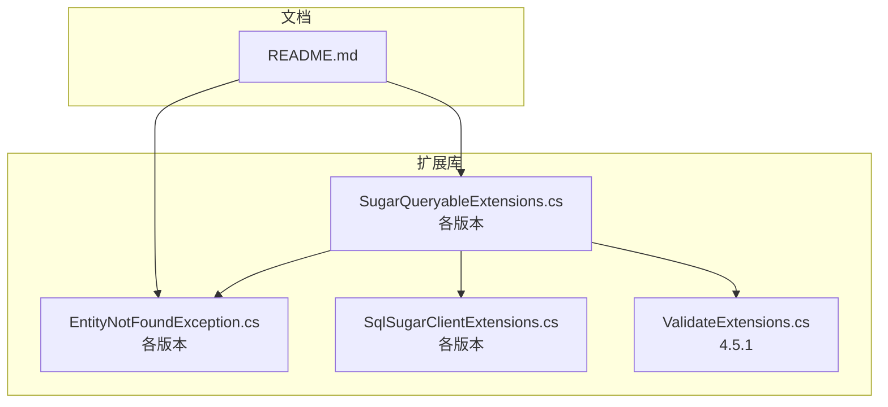
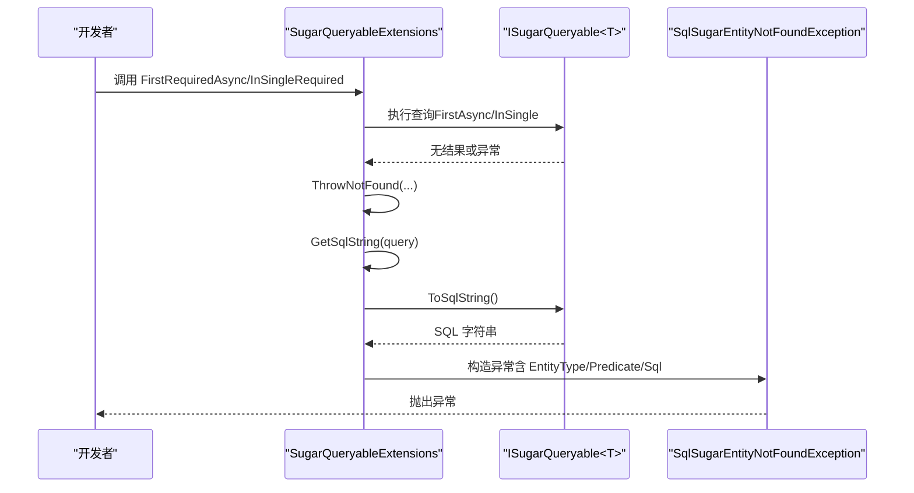
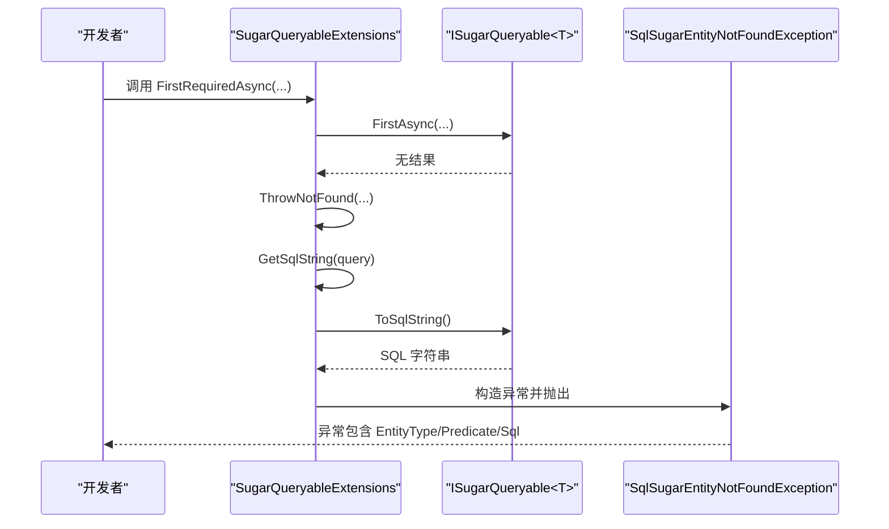
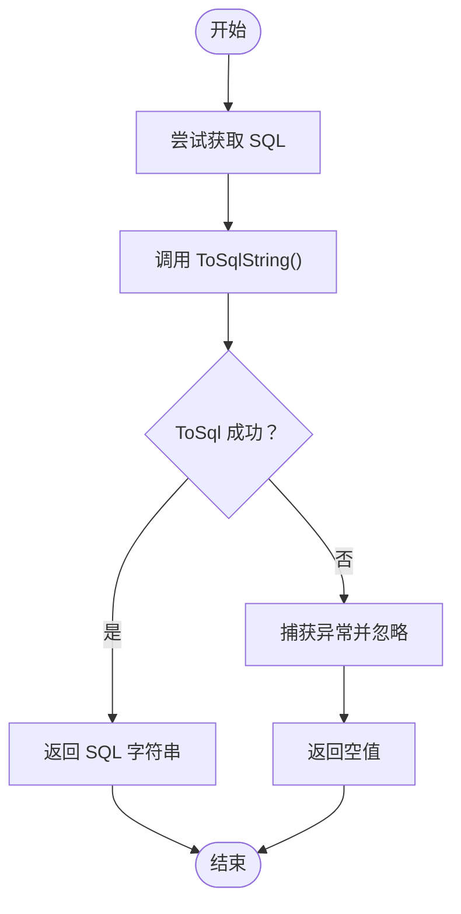
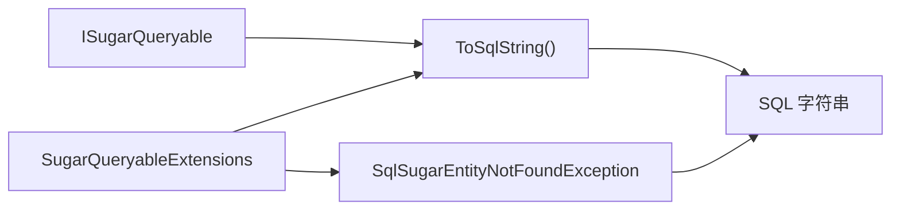

# SQL调试方法

<cite>
**本文引用的文件**
- [SugarQueryableExtensions.cs（5.0.0.5）](file://EasySharp.SqlSugarCore.Extensions.5.0.0.5/SugarQueryableExtensions.cs)
- [EntityNotFoundException.cs（5.0.0.5）](file://EasySharp.SqlSugarCore.Extensions.5.0.0.5/EntityNotFoundException.cs)
- [SugarQueryableExtensions.cs（4.5.1）](file://EasySharp.SqlSugarCore.Extensions.4.5.1/SugarQueryableExtensions.cs)
- [EntityNotFoundException.cs（4.5.1）](file://EasySharp.SqlSugarCore.Extensions.4.5.1/EntityNotFoundException.cs)
- [SugarQueryableExtensions.cs（4.3.2.4）](file://EasySharp.SqlSugarCore.Extensions.4.3.2.4/SugarQueryableExtensions.cs)
- [EntityNotFoundException.cs（4.3.2.4）](file://EasySharp.SqlSugarCore.Extensions.4.3.2.4/EntityNotFoundException.cs)
- [SugarQueryableExtensions.cs（4.2.1.9）](file://EasySharp.SqlSugarCore.Extensions.4.2.1.9/SugarQueryableExtensions.cs)
- [EntityNotFoundException.cs（4.2.1.9）](file://EasySharp.SqlSugarCore.Extensions.4.2.1.9/EntityNotFoundException.cs)
- [SugarQueryableExtensions.cs（4.0.0.3）](file://EasySharp.SqlSugarCore.Extensions.4.0.0.3/SugarQueryableExtensions.cs)
- [EntityNotFoundException.cs（4.0.0.3）](file://EasySharp.SqlSugarCore.Extensions.4.0.0.3/EntityNotFoundException.cs)
- [SqlSugarClientExtensions.cs（4.0.0.3）](file://EasySharp.SqlSugarCore.Extensions.4.0.0.3/SqlSugarClientExtensions.cs)
- [SqlSugarClientExtensions.cs（4.2.1.9）](file://EasySharp.SqlSugarCore.Extensions.4.2.1.9/SqlSugarClientExtensions.cs)
- [SqlSugarClientExtensions.cs（4.3.2.4）](file://EasySharp.SqlSugarCore.Extensions.4.3.2.4/SqlSugarClientExtensions.cs)
- [ValidateExtensions.cs（4.5.1）](file://EasySharp.SqlSugarCore.Extensions.4.5.1/ValidateExtensions.cs)
- [README.md](file://README.md)
</cite>

## 目录
1. [简介](#简介)
2. [项目结构](#项目结构)
3. [核心组件](#核心组件)
4. [架构总览](#架构总览)
5. [详细组件分析](#详细组件分析)
6. [依赖关系分析](#依赖关系分析)
7. [性能考量](#性能考量)
8. [故障排查指南](#故障排查指南)
9. [结论](#结论)
10. [附录](#附录)

## 简介
本技术文档围绕 SQL 调试方法展开，重点解释 ToSqlString 与 GetSqlString 的实现原理、使用场景与安全策略，并结合异常处理机制，给出在开发与调试过程中的最佳实践与常见问题解决方案。文档同时涵盖 SQL 生成的内部机制、参数化查询、以及如何利用生成的 SQL 进行性能分析与查询优化。

## 项目结构
该仓库为 SqlSugar ORM 的扩展库，提供强类型查询扩展与异常增强能力，按 SqlSugar 版本分包维护，便于多版本兼容。核心扩展集中在 SugarQueryableExtensions 中，异常类型集中于 EntityNotFoundException。

图表来源
- [SugarQueryableExtensions.cs（4.0.0.3）:1-161](file://EasySharp.SqlSugarCore.Extensions.4.0.0.3/SugarQueryableExtensions.cs#L1-L161)
- [EntityNotFoundException.cs（4.0.0.3）:1-60](file://EasySharp.SqlSugarCore.Extensions.4.0.0.3/EntityNotFoundException.cs#L1-L60)
- [SqlSugarClientExtensions.cs（4.0.0.3）:1-15](file://EasySharp.SqlSugarCore.Extensions.4.0.0.3/SqlSugarClientExtensions.cs#L1-L15)
- [ValidateExtensions.cs（4.5.1）:1-13](file://EasySharp.SqlSugarCore.Extensions.4.5.1/ValidateExtensions.cs#L1-L13)
- [README.md:1-117](file://README.md#L1-L117)

章节来源
- [README.md:1-117](file://README.md#L1-L117)

## 核心组件
- ToSqlString 扩展方法：将查询对象转换为可调试的 SQL 字符串，便于日志记录与性能分析。
- GetSqlString 辅助方法：封装 ToSqlString 的调用，提供异常保护，避免因某些场景下 ToSql 失败导致业务中断。
- 异常类型 SqlSugarEntityNotFoundException：在实体未找到时抛出，携带实体类型、查询条件与 SQL 语句，便于快速定位问题。
- FirstRequiredAsync/InSingleRequired 系列方法：在查询无结果时自动抛出带 SQL 的异常，提升调试效率。

章节来源
- [SugarQueryableExtensions.cs（4.0.0.3）:76-99](file://EasySharp.SqlSugarCore.Extensions.4.0.0.3/SugarQueryableExtensions.cs#L76-L99)
- [EntityNotFoundException.cs（4.0.0.3）:1-60](file://EasySharp.SqlSugarCore.Extensions.4.0.0.3/EntityNotFoundException.cs#L1-L60)
- [SugarQueryableExtensions.cs（4.5.1）:78-97](file://EasySharp.SqlSugarCore.Extensions.4.5.1/SugarQueryableExtensions.cs#L78-L97)

## 架构总览
ToSqlString 与 GetSqlString 的调用链路如下：当查询无结果时，扩展方法通过 GetSqlString 获取当前查询对应的 SQL；GetSqlString 再调用 ToSqlString；ToSqlString 最终委托底层 ToSql 返回 Key（SQL 文本）。异常类 SqlSugarEntityNotFoundException 在构造时拼接实体类型、查询条件与 SQL，形成完整诊断信息。

图表来源
- [SugarQueryableExtensions.cs（4.0.0.3）:54-99](file://EasySharp.SqlSugarCore.Extensions.4.0.0.3/SugarQueryableExtensions.cs#L54-L99)
- [EntityNotFoundException.cs（4.0.0.3）:13-77](file://EasySharp.SqlSugarCore.Extensions.4.0.0.3/EntityNotFoundException.cs#L13-L77)

## 详细组件分析

### ToSqlString 方法
- 作用：将查询对象转换为 SQL 字符串，供调试与日志使用。
- 实现要点：
  - 通过 ToSql 获取 Key（SQL 文本），返回字符串形式。
  - 位于 SugarQueryableExtensions 中，作为扩展方法对 ISugarQueryable<T> 提供。
- 使用场景：
  - 日志记录：在关键路径输出 SQL，便于审计与排错。
  - 性能分析：对比不同查询条件下的 SQL 形态与参数，辅助索引优化。
  - 调试验证：在单元测试中断言生成的 SQL 是否符合预期。

章节来源
- [SugarQueryableExtensions.cs（4.0.0.3）:96-99](file://EasySharp.SqlSugarCore.Extensions.4.0.0.3/SugarQueryableExtensions.cs#L96-L99)
- [SugarQueryableExtensions.cs（4.2.1.9）:96-99](file://EasySharp.SqlSugarCore.Extensions.4.2.1.9/SugarQueryableExtensions.cs#L96-L99)
- [SugarQueryableExtensions.cs（4.3.2.4）:96-99](file://EasySharp.SqlSugarCore.Extensions.4.3.2.4/SugarQueryableExtensions.cs#L96-L99)
- [SugarQueryableExtensions.cs（4.5.1）:94-97](file://EasySharp.SqlSugarCore.Extensions.4.5.1/SugarQueryableExtensions.cs#L94-L97)
- [SugarQueryableExtensions.cs（5.0.0.5）:94-97](file://EasySharp.SqlSugarCore.Extensions.5.0.0.5/SugarQueryableExtensions.cs#L94-L97)

### GetSqlString 方法
- 作用：安全地获取 SQL 字符串，避免异常影响业务流程。
- 实现要点：
  - 包裹 ToSqlString 调用在 try/catch 中，捕获任何异常并返回空值。
  - 当底层 ToSql 不可用或不可用时，仍保证上层逻辑不中断。
- 使用场景：
  - 在异常处理中附加 SQL 信息，但不打断异常传播。
  - 在日志记录前进行兜底，防止 SQL 获取失败导致日志丢失。

章节来源
- [SugarQueryableExtensions.cs（4.0.0.3）:80-94](file://EasySharp.SqlSugarCore.Extensions.4.0.0.3/SugarQueryableExtensions.cs#L80-L94)
- [SugarQueryableExtensions.cs（4.2.1.9）:80-94](file://EasySharp.SqlSugarCore.Extensions.4.2.1.9/SugarQueryableExtensions.cs#L80-L94)
- [SugarQueryableExtensions.cs（4.3.2.4）:78-92](file://EasySharp.SqlSugarCore.Extensions.4.3.2.4/SugarQueryableExtensions.cs#L78-L92)
- [SugarQueryableExtensions.cs（4.5.1）:78-92](file://EasySharp.SqlSugarCore.Extensions.4.5.1/SugarQueryableExtensions.cs#L78-L92)
- [SugarQueryableExtensions.cs（5.0.0.5）:78-92](file://EasySharp.SqlSugarCore.Extensions.5.0.0.5/SugarQueryableExtensions.cs#L78-L92)

### 异常处理与安全策略
- SqlSugarEntityNotFoundException：
  - 携带 EntityType、Predicate、Sql 三要素，便于快速定位问题。
  - 对 Predicate 与 Sql 进行长度截断，避免过长文本影响日志与序列化。
- GetSqlString 的异常保护：
  - 即使底层 ToSql 失败，也不会影响上层业务逻辑。
- ValidateExtensions.HasValue：
  - 通用的空值判断工具，用于避免空值引发的异常或误判。

章节来源
- [EntityNotFoundException.cs（4.0.0.3）:13-77](file://EasySharp.SqlSugarCore.Extensions.4.0.0.3/EntityNotFoundException.cs#L13-L77)
- [EntityNotFoundException.cs（4.2.1.9）:13-77](file://EasySharp.SqlSugarCore.Extensions.4.2.1.9/EntityNotFoundException.cs#L13-L77)
- [EntityNotFoundException.cs（4.3.2.4）:13-77](file://EasySharp.SqlSugarCore.Extensions.4.3.2.4/EntityNotFoundException.cs#L13-L77)
- [EntityNotFoundException.cs（4.5.1）:13-77](file://EasySharp.SqlSugarCore.Extensions.4.5.1/EntityNotFoundException.cs#L13-L77)
- [ValidateExtensions.cs（4.5.1）:7-10](file://EasySharp.SqlSugarCore.Extensions.4.5.1/ValidateExtensions.cs#L7-L10)

### SQL 生成内部机制
- ToSqlString 委托底层 ToSql 返回 Key（SQL 文本），参数与占位符由底层 QueryBuilder 维护。
- 参数化查询：查询构建器会将参数保存在 Parameters 集合中，避免 SQL 注入风险。
- 多版本差异：
  - 4.x 版本中，GetSqlString 与 ToSqlString 的实现保持一致，均通过 ToSql().Key 获取 SQL。
  - 5.x 版本延续该模式，保持向后兼容。

章节来源
- [SugarQueryableExtensions.cs（4.0.0.3）:96-99](file://EasySharp.SqlSugarCore.Extensions.4.0.0.3/SugarQueryableExtensions.cs#L96-L99)
- [SugarQueryableExtensions.cs（4.2.1.9）:96-99](file://EasySharp.SqlSugarCore.Extensions.4.2.1.9/SugarQueryableExtensions.cs#L96-L99)
- [SugarQueryableExtensions.cs（4.3.2.4）:96-99](file://EasySharp.SqlSugarCore.Extensions.4.3.2.4/SugarQueryableExtensions.cs#L96-L99)
- [SugarQueryableExtensions.cs（4.5.1）:94-97](file://EasySharp.SqlSugarCore.Extensions.4.5.1/SugarQueryableExtensions.cs#L94-L97)
- [SugarQueryableExtensions.cs（5.0.0.5）:94-97](file://EasySharp.SqlSugarCore.Extensions.5.0.0.5/SugarQueryableExtensions.cs#L94-L97)

### 典型调用流程（序列图）

图表来源
- [SugarQueryableExtensions.cs（4.0.0.3）:54-99](file://EasySharp.SqlSugarCore.Extensions.4.0.0.3/SugarQueryableExtensions.cs#L54-L99)
- [EntityNotFoundException.cs（4.0.0.3）:13-77](file://EasySharp.SqlSugarCore.Extensions.4.0.0.3/EntityNotFoundException.cs#L13-L77)

### SQL 生成算法流程（流程图）

图表来源
- [SugarQueryableExtensions.cs（4.0.0.3）:80-94](file://EasySharp.SqlSugarCore.Extensions.4.0.0.3/SugarQueryableExtensions.cs#L80-L94)

## 依赖关系分析
- 扩展方法依赖底层 ISugarQueryable<T> 的 ToSql/ToSqlString 能力。
- 异常类型依赖系统异常基类，提供序列化支持。
- 多版本包保持 API 一致性，仅在内部实现细节上略有差异。

图表来源
- [SugarQueryableExtensions.cs（4.0.0.3）:96-99](file://EasySharp.SqlSugarCore.Extensions.4.0.0.3/SugarQueryableExtensions.cs#L96-L99)
- [EntityNotFoundException.cs（4.0.0.3）:13-77](file://EasySharp.SqlSugarCore.Extensions.4.0.0.3/EntityNotFoundException.cs#L13-L77)

章节来源
- [SugarQueryableExtensions.cs（4.0.0.3）:1-161](file://EasySharp.SqlSugarCore.Extensions.4.0.0.3/SugarQueryableExtensions.cs#L1-L161)
- [EntityNotFoundException.cs（4.0.0.3）:1-60](file://EasySharp.SqlSugarCore.Extensions.4.0.0.3/EntityNotFoundException.cs#L1-L60)

## 性能考量
- SQL 获取成本：ToSqlString/ToSql 会触发查询构建器的 SQL 生成，通常开销较小，但在高频调试场景应避免在生产路径频繁调用。
- 参数化查询：底层使用参数化，避免 SQL 注入，同时有利于计划缓存复用。
- 日志与采样：建议在开发环境开启 SQL 输出，在生产环境通过采样或条件开关控制输出频率。
- 查询优化建议：
  - 使用生成的 SQL 分析执行计划，识别缺失索引或全表扫描。
  - 对复杂表达式进行拆分，减少动态 SQL 的不确定性。
  - 关注参数化查询的参数嗅探问题，必要时使用局部变量或 OPTION(OPTIMIZE FOR UNKNOWN) 等技巧。

## 故障排查指南
- 现象：ToSql 获取失败导致异常传播
  - 处理：GetSqlString 已内置 try/catch 并返回空值，不影响业务流程。
  - 建议：在日志中记录异常堆栈，定位具体场景。
- 现象：异常信息中 SQL 过长
  - 处理：异常类会对 SQL 进行长度截断，避免日志膨胀。
  - 建议：在调试阶段临时放宽限制，生产环境保持默认截断策略。
- 现象：多版本行为不一致
  - 处理：确认使用的扩展库版本，确保 ToSqlString 与 GetSqlString 的行为一致。
- 现象：空值判断导致误判
  - 处理：使用 HasValue 工具进行统一空值判断，避免空字符串与 DBNull 的混淆。

章节来源
- [EntityNotFoundException.cs（4.0.0.3）:53-77](file://EasySharp.SqlSugarCore.Extensions.4.0.0.3/EntityNotFoundException.cs#L53-L77)
- [ValidateExtensions.cs（4.5.1）:7-10](file://EasySharp.SqlSugarCore.Extensions.4.5.1/ValidateExtensions.cs#L7-L10)

## 结论
ToSqlString 与 GetSqlString 为 SQL 调试提供了低成本、高价值的能力。通过异常类的三元信息（实体类型、查询条件、SQL）与安全的 SQL 获取策略，开发者可以在不破坏业务流程的前提下，快速定位问题并进行性能优化。建议在开发与测试环境充分使用这些能力，在生产环境谨慎采样输出，确保可观测性与安全性并重。

## 附录
- 版本兼容性与 API 变更：
  - 4.x 与 5.x 版本在 ToSqlString/GetSqlString 的实现上保持一致，便于迁移。
  - 异常类在不同版本中保持相同字段与行为，便于统一处理。
- 使用示例参考：
  - FirstRequiredAsync/InSingleRequired 的使用与异常处理示例，请参阅 README 中的示例与 API 参考。

章节来源
- [README.md:39-117](file://README.md#L39-L117)