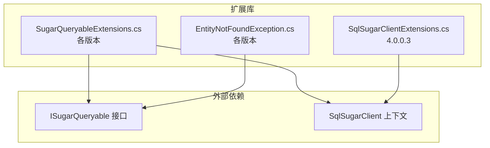
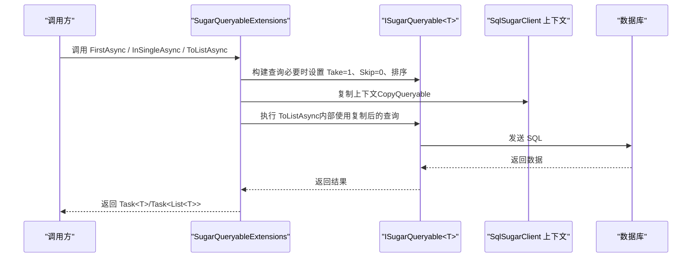
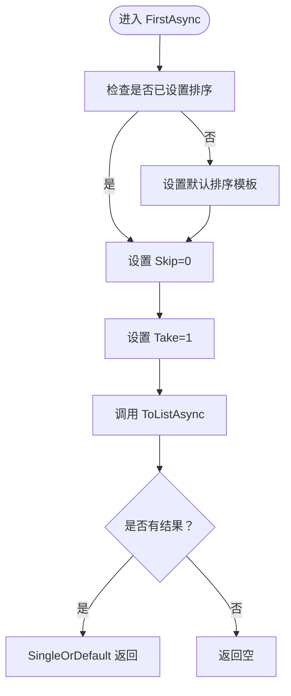
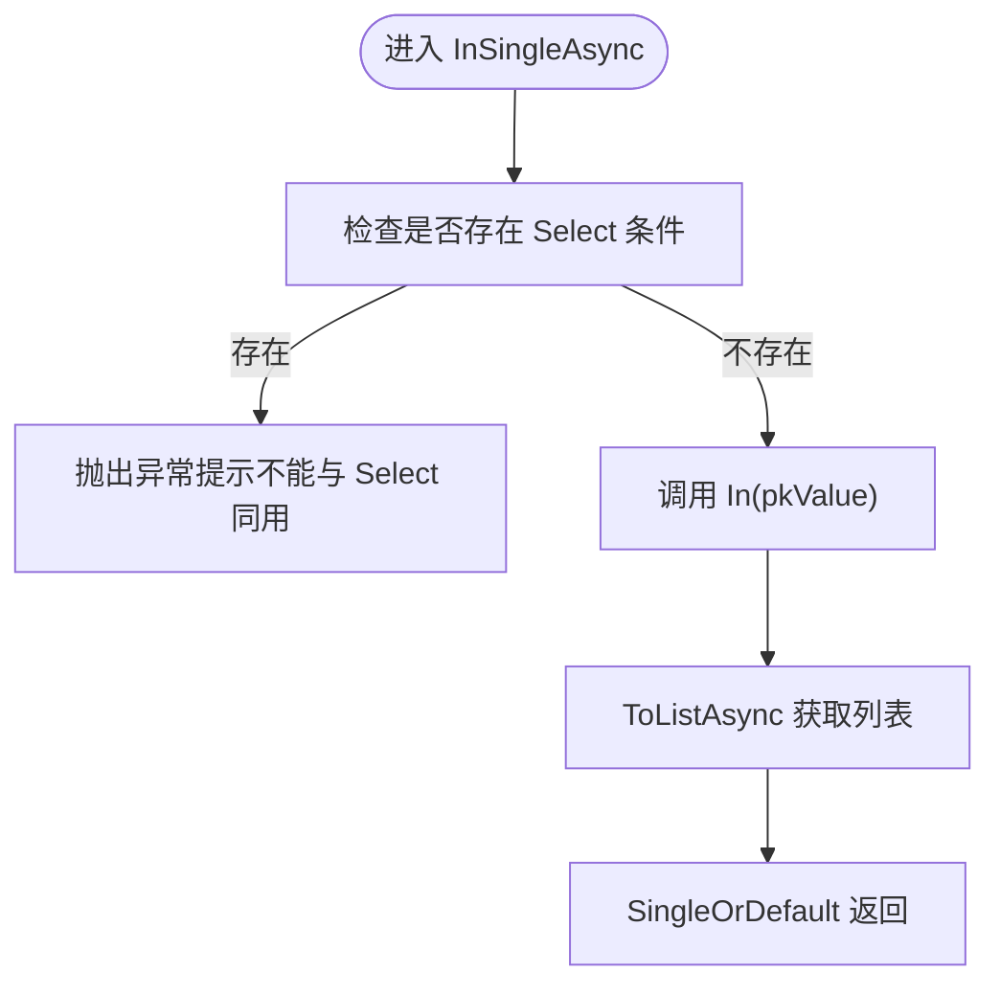
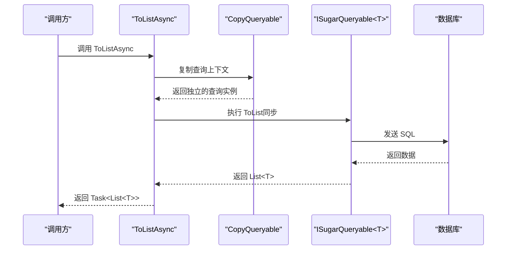
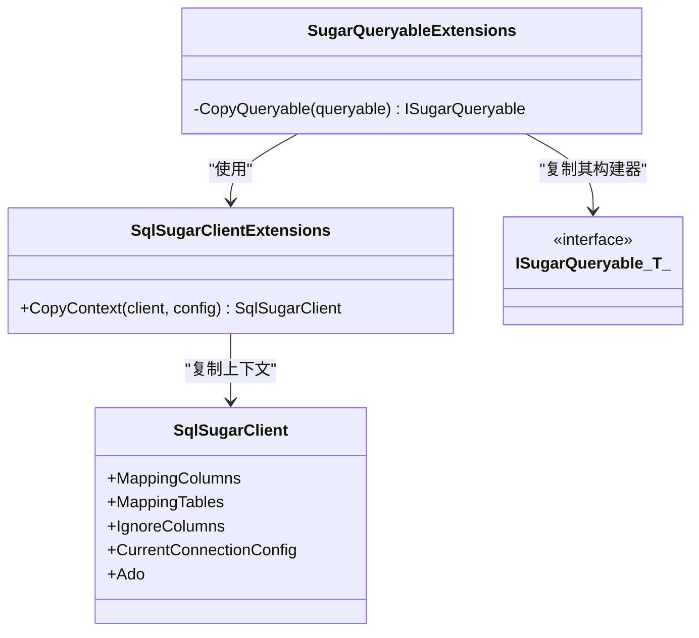
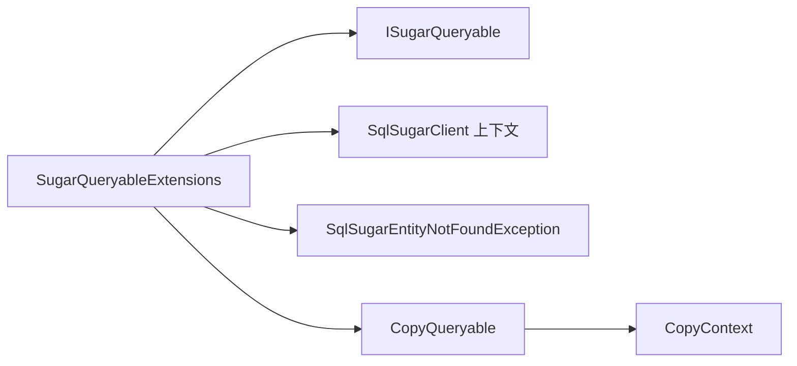

# 异步查询方法

<cite>
**本文引用的文件**
- [SugarQueryableExtensions.cs（5.0.0.5）](file://EasySharp.SqlSugarCore.Extensions.5.0.0.5/SugarQueryableExtensions.cs)
- [SugarQueryableExtensions.cs（4.5.1）](file://EasySharp.SqlSugarCore.Extensions.4.5.1/SugarQueryableExtensions.cs)
- [SugarQueryableExtensions.cs（4.3.2.4）](file://EasySharp.SqlSugarCore.Extensions.4.3.2.4/SugarQueryableExtensions.cs)
- [SugarQueryableExtensions.cs（4.2.1.9）](file://EasySharp.SqlSugarCore.Extensions.4.2.1.9/SugarQueryableExtensions.cs)
- [SugarQueryableExtensions.cs（4.0.0.3）](file://EasySharp.SqlSugarCore.Extensions.4.0.0.3/SugarQueryableExtensions.cs)
- [EntityNotFoundException.cs（4.0.0.3）](file://EasySharp.SqlSugarCore.Extensions.4.0.0.3/EntityNotFoundException.cs)
- [EntityNotFoundException.cs（当前版本）](file://EasySharp.SqlSugarCore.Extensions/EntityNotFoundException.cs)
- [SqlSugarClientExtensions.cs（4.0.0.3）](file://EasySharp.SqlSugarCore.Extensions.4.0.0.3/SqlSugarClientExtensions.cs)
- [README.md](file://README.md)
</cite>

## 目录
1. [简介](#简介)
2. [项目结构](#项目结构)
3. [核心组件](#核心组件)
4. [架构总览](#架构总览)
5. [详细组件分析](#详细组件分析)
6. [依赖关系分析](#依赖关系分析)
7. [性能考量](#性能考量)
8. [故障排查指南](#故障排查指南)
9. [结论](#结论)
10. [附录](#附录)

## 简介
本技术文档聚焦于异步查询方法的实现与使用，重点覆盖以下方法：
- FirstAsync：获取满足条件或默认条件的首条记录
- InSingleAsync：按主键进行单值查询
- ToListAsync：异步获取列表
- FirstRequiredAsync / InSingleRequiredAsync：带“必须存在”语义的异步查询，不存在时抛出带上下文的异常

文档将从实现原理、参数与返回值、线程安全机制、高并发使用建议、性能优化策略、错误处理与常见问题等方面进行系统化阐述，并结合 CopyQueryable 的实现与线程安全保证机制给出最佳实践。

## 项目结构
该仓库为 SqlSugarCore 的扩展库，提供一组强类型扩展方法以简化查询与增强错误信息。不同版本目录对应不同 SqlSugar 版本的适配，核心扩展集中在 SugarQueryableExtensions 中，异常类型统一由 EntityNotFoundException 提供。

图表来源
- [SugarQueryableExtensions.cs（4.2.1.9）:10-158](file://EasySharp.SqlSugarCore.Extensions.4.2.1.9/SugarQueryableExtensions.cs#L10-L158)
- [EntityNotFoundException.cs（当前版本）:7-79](file://EasySharp.SqlSugarCore.Extensions/EntityNotFoundException.cs#L7-L79)
- [SqlSugarClientExtensions.cs（4.0.0.3）:5-12](file://EasySharp.SqlSugarCore.Extensions.4.0.0.3/SqlSugarClientExtensions.cs#L5-L12)

章节来源
- [README.md:1-117](file://README.md#L1-L117)

## 核心组件
- 异步查询扩展类：SugarQueryableExtensions，提供 FirstAsync、InSingleAsync、ToListAsync、FirstRequiredAsync、InSingleRequiredAsync 等扩展方法。
- 异常类型：SqlSugarEntityNotFoundException，用于在“必须存在”的查询中提供实体类型、谓词与 SQL 的详细信息。
- 上下文复制工具：SqlSugarClientExtensions.CopyContext，配合 CopyQueryable 实现线程安全的异步查询上下文隔离。

章节来源
- [SugarQueryableExtensions.cs（4.2.1.9）:10-158](file://EasySharp.SqlSugarCore.Extensions.4.2.1.9/SugarQueryableExtensions.cs#L10-L158)
- [EntityNotFoundException.cs（当前版本）:7-79](file://EasySharp.SqlSugarCore.Extensions/EntityNotFoundException.cs#L7-L79)
- [SqlSugarClientExtensions.cs（4.0.0.3）:5-12](file://EasySharp.SqlSugarCore.Extensions.4.0.0.3/SqlSugarClientExtensions.cs#L5-L12)

## 架构总览
异步查询方法围绕 ISugarQueryable<T> 进行扩展，内部通过复制查询构建器与上下文，避免共享状态引发的竞态；同时提供“必须存在”的语义包装，统一异常输出。

图表来源
- [SugarQueryableExtensions.cs（4.2.1.9）:108-157](file://EasySharp.SqlSugarCore.Extensions.4.2.1.9/SugarQueryableExtensions.cs#L108-L157)
- [SugarQueryableExtensions.cs（4.0.0.3）:119-142](file://EasySharp.SqlSugarCore.Extensions.4.0.0.3/SugarQueryableExtensions.cs#L119-L142)

## 详细组件分析

### FirstAsync 与 FirstRequiredAsync
- 功能概述
  - FirstAsync：在无显式条件时，自动设置排序、跳过与取数限制，再通过 ToListAsync 获取首条记录；若无记录则返回空。
  - FirstRequiredAsync：在 FirstAsync 成功后，若结果为空，抛出包含实体类型、谓词与 SQL 的异常。
- 参数与返回值
  - FirstAsync：
    - 参数：ISugarQueryable<T> 自身（可选表达式重载）
    - 返回：Task<T?>
  - FirstRequiredAsync：
    - 参数：ISugarQueryable<T> 自身（可选表达式重载），以及可选业务键字符串
    - 返回：Task<T>（非空）
- 线程安全机制
  - 通过 ToListAsync 内部的 CopyQueryable 创建独立的查询上下文，避免并发读写共享构建器导致的竞争。
- 使用场景
  - 需要“首条记录”且允许不存在的场景使用 FirstAsync；
  - 需要“必须存在”的场景使用 FirstRequiredAsync，便于快速定位缺失数据问题。
- 性能要点
  - 默认设置 Take=1、Skip=0，减少不必要的数据传输；
  - 若已有明确排序，可避免重复设置默认排序模板。

图表来源
- [SugarQueryableExtensions.cs（4.2.1.9）:149-157](file://EasySharp.SqlSugarCore.Extensions.4.2.1.9/SugarQueryableExtensions.cs#L149-L157)

章节来源
- [SugarQueryableExtensions.cs（4.2.1.9）:144-157](file://EasySharp.SqlSugarCore.Extensions.4.2.1.9/SugarQueryableExtensions.cs#L144-L157)
- [SugarQueryableExtensions.cs（4.0.0.3）:144-157](file://EasySharp.SqlSugarCore.Extensions.4.0.0.3/SugarQueryableExtensions.cs#L144-L157)
- [SugarQueryableExtensions.cs（4.3.2.4）:145-158](file://EasySharp.SqlSugarCore.Extensions.4.3.2.4/SugarQueryableExtensions.cs#L145-L158)
- [SugarQueryableExtensions.cs（4.5.1）:11-31](file://EasySharp.SqlSugarCore.Extensions.4.5.1/SugarQueryableExtensions.cs#L11-L31)
- [SugarQueryableExtensions.cs（5.0.0.5）:9-29](file://EasySharp.SqlSugarCore.Extensions.5.0.0.5/SugarQueryableExtensions.cs#L9-L29)

### InSingleAsync 与 InSingleRequiredAsync
- 功能概述
  - InSingleAsync：对给定主键值执行 In 条件查询，再通过 ToListAsync 获取列表并取单一元素（SingleOrDefault）。
  - InSingleRequiredAsync：在 InSingleAsync 成功后，若结果为空，抛出包含实体类型、谓词与 SQL 的异常。
- 参数与返回值
  - InSingleAsync：
    - 参数：ISugarQueryable<T> 与主键值对象
    - 返回：Task<T?>
  - InSingleRequiredAsync：
    - 参数：ISugarQueryable<T> 与主键值对象
    - 返回：Task<T>（非空）
- 线程安全机制
  - 与 FirstAsync 类似，内部通过 CopyQueryable 复制上下文，避免并发冲突。
- 使用场景
  - 按主键查询单条记录，且需要“必须存在”的严格约束时使用 InSingleRequiredAsync。
- 性能要点
  - 先 In 再 ToList，避免额外的 Where 条件拼接；注意 Select 与 In 的组合限制。

图表来源
- [SugarQueryableExtensions.cs（4.2.1.9）:101-106](file://EasySharp.SqlSugarCore.Extensions.4.2.1.9/SugarQueryableExtensions.cs#L101-L106)
- [SugarQueryableExtensions.cs（4.0.0.3）:101-106](file://EasySharp.SqlSugarCore.Extensions.4.0.0.3/SugarQueryableExtensions.cs#L101-L106)

章节来源
- [SugarQueryableExtensions.cs（4.2.1.9）:101-106](file://EasySharp.SqlSugarCore.Extensions.4.2.1.9/SugarQueryableExtensions.cs#L101-L106)
- [SugarQueryableExtensions.cs（4.0.0.3）:101-106](file://EasySharp.SqlSugarCore.Extensions.4.0.0.3/SugarQueryableExtensions.cs#L101-L106)
- [SugarQueryableExtensions.cs（4.3.2.4）:101-104](file://EasySharp.SqlSugarCore.Extensions.4.3.2.4/SugarQueryableExtensions.cs#L101-L104)
- [SugarQueryableExtensions.cs（4.5.1）:99-104](file://EasySharp.SqlSugarCore.Extensions.4.5.1/SugarQueryableExtensions.cs#L99-L104)
- [SugarQueryableExtensions.cs（5.0.0.5）:43-52](file://EasySharp.SqlSugarCore.Extensions.5.0.0.5/SugarQueryableExtensions.cs#L43-L52)

### ToListAsync
- 功能概述
  - 将同步 ToList 调用包装为 Task，通过复制查询上下文避免并发共享状态。
- 参数与返回值
  - 参数：ISugarQueryable<T>
  - 返回：Task<List<T>?>
- 线程安全机制
  - 使用 CopyQueryable 复制 SqlSugarClient 上下文与查询构建器，确保并发安全。
- 使用场景
  - 需要异步获取列表，且不希望阻塞调用线程的场景。
- 性能要点
  - 复制上下文有额外开销，应仅在需要并发安全时使用；对于只读查询可直接使用同步 ToList。

图表来源
- [SugarQueryableExtensions.cs（4.2.1.9）:108-117](file://EasySharp.SqlSugarCore.Extensions.4.2.1.9/SugarQueryableExtensions.cs#L108-L117)
- [SugarQueryableExtensions.cs（4.0.0.3）:108-117](file://EasySharp.SqlSugarCore.Extensions.4.0.0.3/SugarQueryableExtensions.cs#L108-L117)

章节来源
- [SugarQueryableExtensions.cs（4.2.1.9）:108-117](file://EasySharp.SqlSugarCore.Extensions.4.2.1.9/SugarQueryableExtensions.cs#L108-L117)
- [SugarQueryableExtensions.cs（4.0.0.3）:108-117](file://EasySharp.SqlSugarCore.Extensions.4.0.0.3/SugarQueryableExtensions.cs#L108-L117)
- [SugarQueryableExtensions.cs（4.3.2.4）:108-117](file://EasySharp.SqlSugarCore.Extensions.4.3.2.4/SugarQueryableExtensions.cs#L108-L117)
- [SugarQueryableExtensions.cs（4.5.1）:94-97](file://EasySharp.SqlSugarCore.Extensions.4.5.1/SugarQueryableExtensions.cs#L94-L97)
- [SugarQueryableExtensions.cs（5.0.0.5）:92-95](file://EasySharp.SqlSugarCore.Extensions.5.0.0.5/SugarQueryableExtensions.cs#L92-L95)

### CopyQueryable 实现原理与线程安全
- 实现原理
  - 复制 SqlSugarClient：通过 SqlSugarClientExtensions.CopyContext 创建新客户端，继承映射与忽略配置。
  - 复制查询构建器：将原查询的 Take、Skip、Select、Where、Join、参数等完整复制到新的查询实例。
  - 隔离日志事件：复制日志事件起止回调，保持异步查询的可观测性。
- 线程安全保证
  - 通过复制上下文与查询构建器，避免多个并发任务共享同一构建器导致的状态竞争。
  - 设置 IsAutoCloseConnection=true，确保异步查询完成后连接自动关闭，降低资源泄漏风险。
- 版本差异
  - 4.0.0.3/4.2.1.9/4.3.2.4：保留 ProcessingEventStartingSQL 日志事件字段；
  - 4.5.1/5.0.0.5：移除该字段，简化上下文复制。

图表来源
- [SqlSugarClientExtensions.cs（4.0.0.3）:5-12](file://EasySharp.SqlSugarCore.Extensions.4.0.0.3/SqlSugarClientExtensions.cs#L5-L12)
- [SugarQueryableExtensions.cs（4.2.1.9）:119-142](file://EasySharp.SqlSugarCore.Extensions.4.2.1.9/SugarQueryableExtensions.cs#L119-L142)
- [SugarQueryableExtensions.cs（4.3.2.4）:119-142](file://EasySharp.SqlSugarCore.Extensions.4.3.2.4/SugarQueryableExtensions.cs#L119-L142)

章节来源
- [SqlSugarClientExtensions.cs（4.0.0.3）:5-12](file://EasySharp.SqlSugarCore.Extensions.4.0.0.3/SqlSugarClientExtensions.cs#L5-L12)
- [SugarQueryableExtensions.cs（4.2.1.9）:119-142](file://EasySharp.SqlSugarCore.Extensions.4.2.1.9/SugarQueryableExtensions.cs#L119-L142)
- [SugarQueryableExtensions.cs（4.3.2.4）:119-142](file://EasySharp.SqlSugarCore.Extensions.4.3.2.4/SugarQueryableExtensions.cs#L119-L142)
- [SugarQueryableExtensions.cs（4.5.1）:94-97](file://EasySharp.SqlSugarCore.Extensions.4.5.1/SugarQueryableExtensions.cs#L94-L97)
- [SugarQueryableExtensions.cs（5.0.0.5）:92-95](file://EasySharp.SqlSugarCore.Extensions.5.0.0.5/SugarQueryableExtensions.cs#L92-L95)

## 依赖关系分析
- 组件耦合
  - SugarQueryableExtensions 依赖 ISugarQueryable<T> 与 SqlSugarClient 上下文；
  - 异常类型 SqlSugarEntityNotFoundException 作为统一错误载体，贯穿“必须存在”系列方法；
  - CopyQueryable 依赖 SqlSugarClientExtensions.CopyContext 与查询构建器属性。
- 外部依赖
  - SqlSugarCore（目标框架随版本变化，见 README）。
- 版本演进
  - 4.x 系列逐步引入 ToSqlString、InSingleAsync、ToListAsync、FirstAsync 等方法；
  - 5.x 系列精简了部分日志事件字段，保持 API 稳定性。

图表来源
- [SugarQueryableExtensions.cs（4.2.1.9）:10-158](file://EasySharp.SqlSugarCore.Extensions.4.2.1.9/SugarQueryableExtensions.cs#L10-L158)
- [EntityNotFoundException.cs（当前版本）:7-79](file://EasySharp.SqlSugarCore.Extensions/EntityNotFoundException.cs#L7-L79)
- [SqlSugarClientExtensions.cs（4.0.0.3）:5-12](file://EasySharp.SqlSugarCore.Extensions.4.0.0.3/SqlSugarClientExtensions.cs#L5-L12)

章节来源
- [README.md:28-37](file://README.md#L28-L37)

## 性能考量
- 并发安全与开销
  - ToListAsync 通过复制上下文实现并发安全，但复制成本较高，仅在需要并发访问时使用；
  - 对于只读、单线程场景，可直接使用同步 ToList 以减少复制开销。
- 查询优化
  - FirstAsync 默认设置 Take=1、Skip=0，避免不必要的数据传输；
  - InSingleAsync 在执行 In 条件后直接取单一结果，减少后续筛选成本。
- 连接管理
  - 复制上下文中启用 IsAutoCloseConnection=true，确保异步查询结束后连接自动释放，降低连接池压力。

章节来源
- [SugarQueryableExtensions.cs（4.2.1.9）:108-157](file://EasySharp.SqlSugarCore.Extensions.4.2.1.9/SugarQueryableExtensions.cs#L108-L157)
- [SugarQueryableExtensions.cs（4.0.0.3）:119-142](file://EasySharp.SqlSugarCore.Extensions.4.0.0.3/SugarQueryableExtensions.cs#L119-L142)

## 故障排查指南
- 常见异常：SqlSugarEntityNotFoundException
  - 触发条件：FirstRequiredAsync / InSingleRequiredAsync 在查询结果为空时抛出；
  - 异常信息：包含实体类型、谓词与 SQL，便于快速定位问题。
- 建议处理流程
  - 捕获异常后，优先检查谓词与 SQL 是否符合预期；
  - 若 SQL 不正确，检查查询链路与参数绑定；
  - 对于 InSingle 场景，确认主键值是否有效且唯一。
- 日志与诊断
  - 复制上下文保留日志事件回调，可在异步查询中继续观察 SQL 输出；
  - 若 ToSql 失败，GetSqlString 已做容错处理，不影响查询执行。

章节来源
- [EntityNotFoundException.cs（当前版本）:53-77](file://EasySharp.SqlSugarCore.Extensions/EntityNotFoundException.cs#L53-L77)
- [SugarQueryableExtensions.cs（4.2.1.9）:54-94](file://EasySharp.SqlSugarCore.Extensions.4.2.1.9/SugarQueryableExtensions.cs#L54-L94)

## 结论
- 异步查询扩展提供了强类型、线程安全、可诊断的查询能力；
- FirstAsync/InSingleAsync/ToListAsync 构成异步查询的核心基元；
- FirstRequiredAsync/InSingleRequiredAsync 提供“必须存在”的语义保障，配合 SqlSugarEntityNotFoundException 提升调试效率；
- CopyQueryable 通过复制上下文与查询构建器，确保并发安全；
- 在高并发场景下，应权衡复制开销与并发需求，合理选择同步或异步路径。

## 附录
- 版本兼容性与目标框架
  - 5.0.0.5：SqlSugar 5.0.0.5，netstandard2.1
  - 4.5.1：SqlSugar 4.5.1，netstandard2.0
  - 4.3.2.4：SqlSugar 4.3.2.4，netstandard2.0
  - 4.2.1.9：SqlSugar 4.2.1.9，netstandard1.6
  - 4.0.0.3：SqlSugar 4.0.0.3，netstandard1.6
- 使用示例参考
  - FirstRequiredAsync / InSingleRequiredAsync 的使用与异常处理示例，请参阅 README 的使用方法与 API 参考章节。

章节来源
- [README.md:28-117](file://README.md#L28-L117)