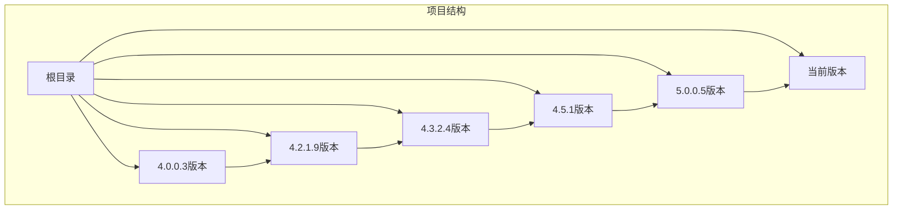
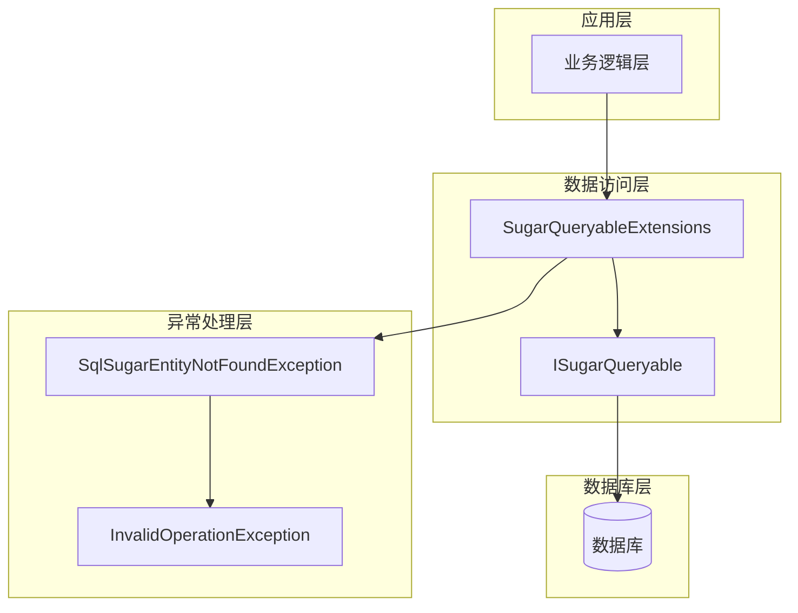
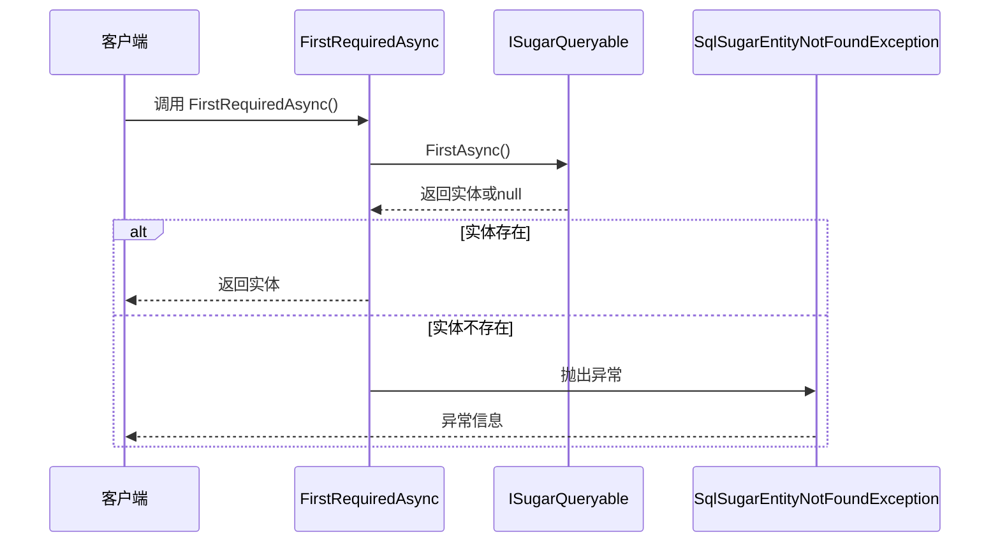
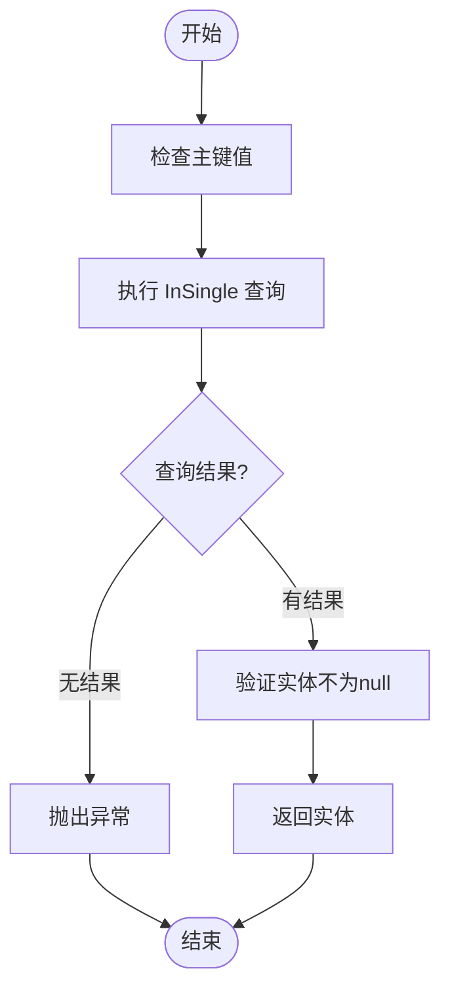
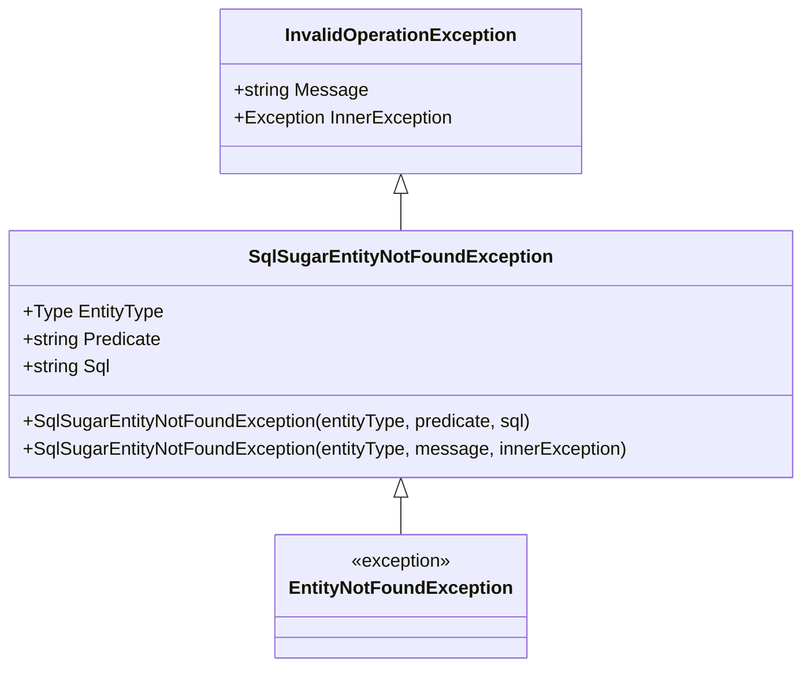
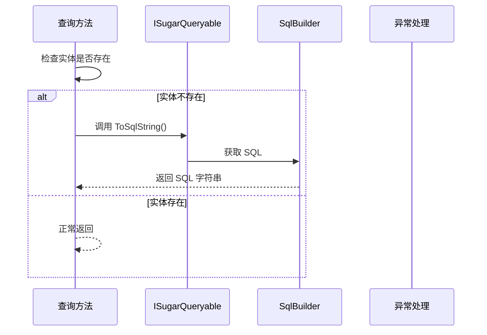
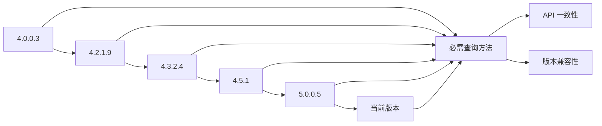

# 必需查询方法

<cite>
**本文档引用的文件**
- [SugarQueryableExtensions.cs](file://EasySharp.SqlSugarCore.Extensions/SugarQueryableExtensions.cs)
- [EntityNotFoundException.cs](file://EasySharp.SqlSugarCore.Extensions/EntityNotFoundException.cs)
- [README.md](file://README.md)
- [SugarQueryableExtensions.cs](file://EasySharp.SqlSugarCore.Extensions.4.0.0.3/SugarQueryableExtensions.cs)
- [SugarQueryableExtensions.cs](file://EasySharp.SqlSugarCore.Extensions.4.2.1.9/SugarQueryableExtensions.cs)
- [SugarQueryableExtensions.cs](file://EasySharp.SqlSugarCore.Extensions.4.3.2.4/SugarQueryableExtensions.cs)
- [SugarQueryableExtensions.cs](file://EasySharp.SqlSugarCore.Extensions.4.5.1/SugarQueryableExtensions.cs)
- [SugarQueryableExtensions.cs](file://EasySharp.SqlSugarCore.Extensions.5.0.0.5/SugarQueryableExtensions.cs)
</cite>

## 目录
1. [简介](#简介)
2. [项目结构](#项目结构)
3. [核心组件](#核心组件)
4. [架构概览](#架构概览)
5. [详细组件分析](#详细组件分析)
6. [依赖关系分析](#依赖关系分析)
7. [性能考虑](#性能考虑)
8. [故障排除指南](#故障排除指南)
9. [结论](#结论)

## 简介

`EasySharp.SqlSugarCore.Extensions` 是一个基于 SqlSugar ORM 的扩展库，专门提供了强类型的查询扩展方法，用于简化数据库查询操作并增强错误处理能力。本文档重点介绍其中的两个核心必需查询方法：`FirstRequiredAsync` 和 `InSingleRequired`。

这些方法的设计目标是确保查询结果的存在性，当实体不存在时会抛出 `SqlSugarEntityNotFoundException` 异常，为开发者提供清晰的错误信息和调试支持。

## 项目结构

该项目采用多版本兼容的结构设计，针对不同版本的 SqlSugar Core 提供了相应的扩展实现：

**图表来源**
- [README.md:30-37](file://README.md#L30-L37)

每个版本都保持了 API 的一致性，同时针对不同版本的 SqlSugar 进行了适配和优化。

**章节来源**
- [README.md:28-37](file://README.md#L28-L37)

## 核心组件

### 必需查询扩展类

`SugarQueryableExtensions` 是整个扩展库的核心，提供了四个主要的必需查询方法：

| 方法名称 | 返回类型 | 描述 |
|---------|---------|------|
| `FirstRequiredAsync<T>()` | `Task<T>` | 异步获取第一条记录，不存在则抛出异常 |
| `FirstRequiredAsync<T>(Expression)` | `Task<T>` | 根据条件异步获取第一条记录，不存在则抛出异常 |
| `InSingleRequired<T>(object)` | `T` | 根据主键获取记录，不存在则抛出异常 |
| `InSingleRequiredAsync<T>(object)` | `Task<T>` | 异步根据主键获取记录，不存在则抛出异常 |

### 异常处理组件

`SqlSugarEntityNotFoundException` 是自定义异常类，继承自 `InvalidOperationException`，提供了丰富的错误信息：

- **EntityType**: 实体类型信息
- **Predicate**: 查询条件信息  
- **Sql**: 执行的 SQL 语句

**章节来源**
- [SugarQueryableExtensions.cs:7-52](file://EasySharp.SqlSugarCore.Extensions/SugarQueryableExtensions.cs#L7-L52)
- [EntityNotFoundException.cs:7-79](file://EasySharp.SqlSugarCore.Extensions/EntityNotFoundException.cs#L7-L79)

## 架构概览

该扩展库采用了分层架构设计，确保了良好的可维护性和扩展性：

**图表来源**
- [SugarQueryableExtensions.cs:9-52](file://EasySharp.SqlSugarCore.Extensions/SugarQueryableExtensions.cs#L9-L52)
- [EntityNotFoundException.cs:7-22](file://EasySharp.SqlSugarCore.Extensions/EntityNotFoundException.cs#L7-L22)

## 详细组件分析

### FirstRequiredAsync 方法

`FirstRequiredAsync` 方法提供了两种重载形式，用于确保查询结果的存在性：

#### 方法实现原理

**图表来源**
- [SugarQueryableExtensions.cs:9-29](file://EasySharp.SqlSugarCore.Extensions/SugarQueryableExtensions.cs#L9-L29)

#### 核心实现逻辑

1. **异步查询**: 调用底层的 `FirstAsync()` 方法执行查询
2. **结果检查**: 检查返回的实体是否为 null
3. **异常处理**: 如果实体不存在，调用 `ThrowNotFound` 方法
4. **返回结果**: 返回非空的实体对象

#### 使用场景

- 用户登录验证
- 数据权限检查
- 业务规则验证

**章节来源**
- [SugarQueryableExtensions.cs:9-29](file://EasySharp.SqlSugarCore.Extensions/SugarQueryableExtensions.cs#L9-L29)

### InSingleRequired 方法

`InSingleRequired` 方法专门用于主键查询，确保通过主键获取的实体存在：

#### 方法实现原理

**图表来源**
- [SugarQueryableExtensions.cs:32-41](file://EasySharp.SqlSugarCore.Extensions/SugarQueryableExtensions.cs#L32-L41)

#### 核心实现逻辑

1. **主键查询**: 使用 `InSingle(pkValue)` 方法进行主键查询
2. **结果验证**: 检查查询结果是否为 null
3. **异常处理**: 如果结果为空，抛出包含详细信息的异常
4. **类型安全**: 使用 `!` 操作符确保编译器知道返回值非空

#### 使用场景

- 主键数据读取
- 关联数据加载
- 缓存穿透防护

**章节来源**
- [SugarQueryableExtensions.cs:32-41](file://EasySharp.SqlSugarCore.Extensions/SugarQueryableExtensions.cs#L32-L41)

### 异常处理机制

#### 异常类设计

**图表来源**
- [EntityNotFoundException.cs:7-79](file://EasySharp.SqlSugarCore.Extensions/EntityNotFoundException.cs#L7-L79)

#### 异常信息构建

异常类提供了智能的消息构建功能：

1. **实体类型**: 显示完整的类型信息
2. **查询条件**: 显示查询谓词（带长度限制）
3. **SQL 语句**: 显示执行的 SQL（带长度限制）

**章节来源**
- [EntityNotFoundException.cs:53-77](file://EasySharp.SqlSugarCore.Extensions/EntityNotFoundException.cs#L53-L77)

### SQL 生成逻辑

#### SQL 获取机制

**图表来源**
- [SugarQueryableExtensions.cs:76-90](file://EasySharp.SqlSugarCore.Extensions/SugarQueryableExtensions.cs#L76-L90)

#### 安全的 SQL 获取

为了防止某些场景下 `ToSql` 方法失败，实现了安全的 SQL 获取机制：

1. **异常捕获**: 使用 try-catch 包装 SQL 获取
2. **失败降级**: 当获取失败时返回 null 而不是抛出异常
3. **信息保留**: 即使获取失败，其他异常信息仍然有效

**章节来源**
- [SugarQueryableExtensions.cs:76-90](file://EasySharp.SqlSugarCore.Extensions/SugarQueryableExtensions.cs#L76-L90)

## 依赖关系分析

### 版本演进关系

**图表来源**
- [README.md:30-37](file://README.md#L30-L37)

### 多版本支持策略

每个版本的扩展方法都保持了相同的 API 接口，但针对不同版本的 SqlSugar 进行了内部适配：

| 版本 | 主要变化 | 兼容性 |
|------|----------|--------|
| 4.0.0.3 | 基础功能实现 | 最低版本支持 |
| 4.2.1.9 | 异步方法优化 | 基础异步支持 |
| 4.3.2.4 | 内部方法调整 | 中等版本支持 |
| 4.5.1 | 简化实现 | 较新版本支持 |
| 5.0.0.5 | 最简实现 | 最新版本支持 |

**章节来源**
- [README.md:30-37](file://README.md#L30-L37)

## 性能考虑

### 查询优化建议

1. **索引优化**: 确保查询条件涉及的列上有适当的索引
2. **选择性查询**: 使用更精确的查询条件减少扫描范围
3. **批量查询**: 对于多个查询场景，考虑使用批量查询减少往返次数

### 内存使用优化

- **流式处理**: 对于大数据集，考虑使用流式处理避免内存峰值
- **延迟加载**: 利用 SqlSugar 的延迟加载特性减少不必要的数据传输

### 异步操作最佳实践

- **避免阻塞**: 在 ASP.NET Core 中始终使用异步方法
- **超时控制**: 为长时间运行的查询设置适当的超时时间
- **连接池管理**: 合理配置连接池大小以优化资源使用

## 故障排除指南

### 常见问题及解决方案

#### 1. 查询结果为空

**问题**: 使用必需查询方法时总是得到异常
**解决方案**: 
- 检查数据是否存在
- 验证查询条件的正确性
- 确认数据库连接状态

#### 2. 异常信息不完整

**问题**: 异常消息中缺少 SQL 信息
**原因**: SQL 获取失败或某些场景下无法生成 SQL
**解决方案**: 
- 检查数据库连接
- 验证查询构建器状态
- 查看日志输出

#### 3. 性能问题

**问题**: 查询响应时间过长
**解决方案**:
- 分析执行计划
- 添加必要的索引
- 优化查询条件

### 调试技巧

1. **启用日志**: 配置 SqlSugar 的日志输出以查看实际执行的 SQL
2. **异常捕获**: 捕获 `SqlSugarEntityNotFoundException` 并记录详细信息
3. **单元测试**: 为关键查询编写单元测试确保行为正确

**章节来源**
- [README.md:78-90](file://README.md#L78-L90)

## 结论

`EasySharp.SqlSugarCore.Extensions` 通过提供 `FirstRequiredAsync` 和 `InSingleRequired` 等必需查询方法，显著提升了数据访问层的健壮性和开发效率。这些方法的核心价值在于：

1. **强制约束**: 确保查询结果的存在性，避免空引用异常
2. **详细错误**: 提供包含实体类型、查询条件和 SQL 的完整异常信息
3. **类型安全**: 利用 C# 的可空引用类型系统确保编译时安全
4. **版本兼容**: 支持多个 SqlSugar 版本，满足不同项目需求

通过合理使用这些方法，开发者可以构建更加健壮和可维护的数据访问层，同时获得更好的错误处理体验和调试支持。