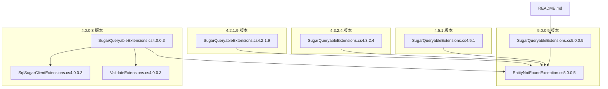
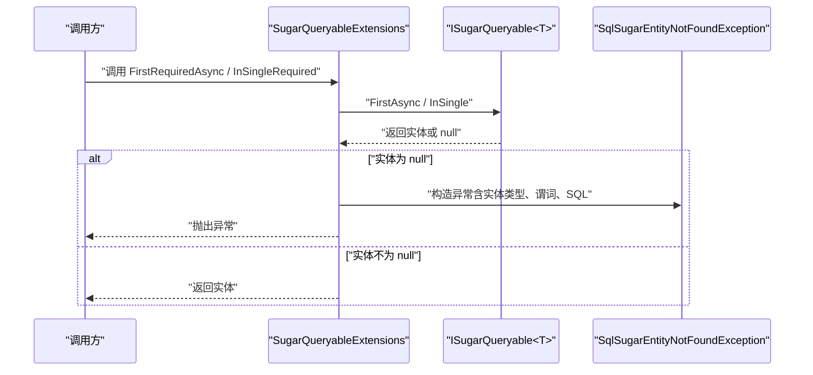
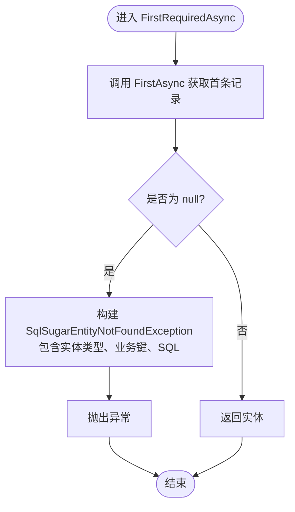
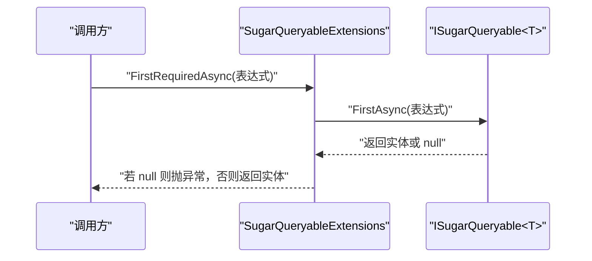
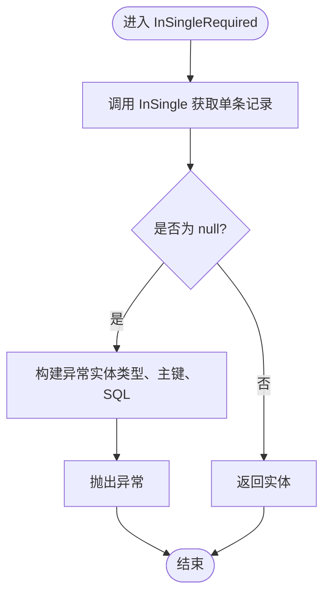
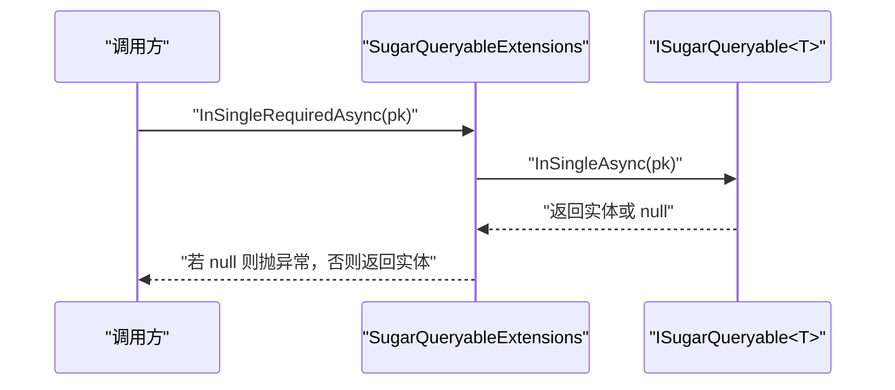
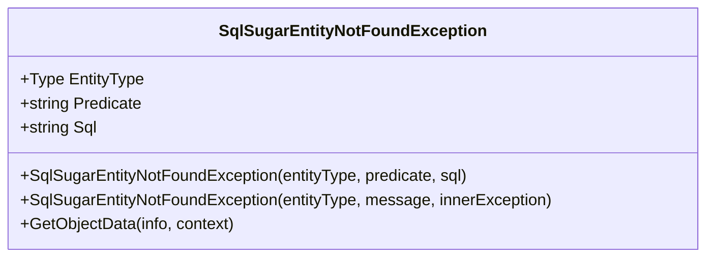
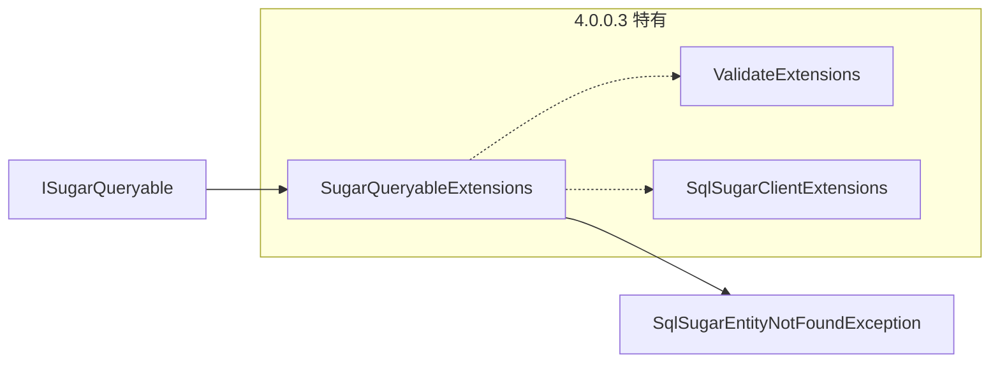

# 查询扩展方法

<cite>
**本文引用的文件**
- [SugarQueryableExtensions.cs（5.0.0.5）](file://EasySharp.SqlSugarCore.Extensions.5.0.0.5/SugarQueryableExtensions.cs)
- [EntityNotFoundException.cs（5.0.0.5）](file://EasySharp.SqlSugarCore.Extensions.5.0.0.5/EntityNotFoundException.cs)
- [README.md](file://README.md)
- [SugarQueryableExtensions.cs（4.5.1）](file://EasySharp.SqlSugarCore.Extensions.4.5.1/SugarQueryableExtensions.cs)
- [SugarQueryableExtensions.cs（4.3.2.4）](file://EasySharp.SqlSugarCore.Extensions.4.3.2.4/SugarQueryableExtensions.cs)
- [SugarQueryableExtensions.cs（4.2.1.9）](file://EasySharp.SqlSugarCore.Extensions.4.2.1.9/SugarQueryableExtensions.cs)
- [SugarQueryableExtensions.cs（4.0.0.3）](file://EasySharp.SqlSugarCore.Extensions.4.0.0.3/SugarQueryableExtensions.cs)
- [ValidateExtensions.cs（4.0.0.3）](file://EasySharp.SqlSugarCore.Extensions.4.0.0.3/ValidateExtensions.cs)
- [ValidateExtensions.cs（4.2.1.9）](file://EasySharp.SqlSugarCore.Extensions.4.2.1.9/ValidateExtensions.cs)
- [ValidateExtensions.cs（4.3.2.4）](file://EasySharp.SqlSugarCore.Extensions.4.3.2.4/ValidateExtensions.cs)
- [ValidateExtensions.cs（4.5.1）](file://EasySharp.SqlSugarCore.Extensions.4.5.1/ValidateExtensions.cs)
- [SqlSugarClientExtensions.cs（4.0.0.3）](file://EasySharp.SqlSugarCore.Extensions.4.0.0.3/SqlSugarClientExtensions.cs)
- [SqlSugarClientExtensions.cs（4.2.1.9）](file://EasySharp.SqlSugarCore.Extensions.4.2.1.9/SqlSugarClientExtensions.cs)
</cite>

## 目录
1. [简介](#简介)
2. [项目结构](#项目结构)
3. [核心组件](#核心组件)
4. [架构总览](#架构总览)
5. [详细组件分析](#详细组件分析)
6. [依赖关系分析](#依赖关系分析)
7. [性能考量](#性能考量)
8. [故障排查指南](#故障排查指南)
9. [结论](#结论)
10. [附录](#附录)

## 简介
本文件面向使用 SqlSugarCore 的开发者，系统化阐述查询扩展方法的实现与用法，重点覆盖以下方法：
- FirstRequiredAsync：异步获取第一条记录，不存在则抛出带详细上下文的异常
- InSingleRequired：根据主键同步获取单条记录，不存在则抛出异常
- FirstRequiredAsync（带表达式）：按条件异步获取第一条记录，不存在则抛出异常
- InSingleRequiredAsync：根据主键异步获取单条记录，不存在则抛出异常

同时，文档解释各方法的参数、返回值、异常处理机制，给出 SQL 生成逻辑与性能优化策略，并提供最佳实践与常见问题解决方案。

## 项目结构
该仓库按“版本分包”组织，同一功能在不同 SqlSugar 版本中保持 API 一致性，但内部实现细节略有差异。核心文件集中在各版本目录下的 SugarQueryableExtensions.cs 与 EntityNotFoundException.cs，另有验证与客户端上下文复制辅助类。

图示来源
- [SugarQueryableExtensions.cs（5.0.0.5）:1-99](file://EasySharp.SqlSugarCore.Extensions.5.0.0.5/SugarQueryableExtensions.cs#L1-L99)
- [EntityNotFoundException.cs（5.0.0.5）:1-79](file://EasySharp.SqlSugarCore.Extensions.5.0.0.5/EntityNotFoundException.cs#L1-L79)
- [SugarQueryableExtensions.cs（4.5.1）:1-108](file://EasySharp.SqlSugarCore.Extensions.4.5.1/SugarQueryableExtensions.cs#L1-L108)
- [SugarQueryableExtensions.cs（4.3.2.4）:1-162](file://EasySharp.SqlSugarCore.Extensions.4.3.2.4/SugarQueryableExtensions.cs#L1-L162)
- [SugarQueryableExtensions.cs（4.2.1.9）:1-161](file://EasySharp.SqlSugarCore.Extensions.4.2.1.9/SugarQueryableExtensions.cs#L1-L161)
- [SugarQueryableExtensions.cs（4.0.0.3）:1-161](file://EasySharp.SqlSugarCore.Extensions.4.0.0.3/SugarQueryableExtensions.cs#L1-L161)
- [ValidateExtensions.cs（4.0.0.3）:1-18](file://EasySharp.SqlSugarCore.Extensions.4.0.0.3/ValidateExtensions.cs#L1-L18)
- [SqlSugarClientExtensions.cs（4.0.0.3）:1-15](file://EasySharp.SqlSugarCore.Extensions.4.0.0.3/SqlSugarClientExtensions.cs#L1-L15)
- [README.md:1-117](file://README.md#L1-L117)

章节来源
- [README.md:1-117](file://README.md#L1-L117)

## 核心组件
本节聚焦四个查询扩展方法及其配套异常类型，说明其职责、参数、返回值与异常行为。

- FirstRequiredAsync<T>()
  - 职责：异步获取第一条记录；若无结果，抛出包含实体类型、谓词与 SQL 的异常
  - 参数：ISugarQueryable<T> 调用方对象
  - 返回值：Task<T>，非空（若无结果则抛异常）
  - 异常：SqlSugarEntityNotFoundException
  - 版本一致性：5.0.0.5、4.5.1、4.3.2.4、4.2.1.9、4.0.0.3 均提供相同签名与行为

- FirstRequiredAsync<T>(Expression<Func<T,bool>>)
  - 职责：按条件表达式异步获取第一条记录；若无结果，抛出异常
  - 参数：ISugarQueryable<T> + 表达式谓词
  - 返回值：Task<T>
  - 异常：SqlSugarEntityNotFoundException
  - 版本一致性：同上

- InSingleRequired<T>(object pkValue)
  - 职责：根据主键同步获取单条记录；若无结果，抛出异常
  - 参数：ISugarQueryable<T> + 主键值
  - 返回值：T
  - 异常：SqlSugarEntityNotFoundException
  - 版本一致性：同上

- InSingleRequiredAsync<T>(object pkValue)
  - 职责：根据主键异步获取单条记录；若无结果，抛出异常
  - 参数：ISugarQueryable<T> + 主键值
  - 返回值：Task<T>
  - 异常：SqlSugarEntityNotFoundException
  - 版本一致性：同上

- SqlSugarEntityNotFoundException
  - 字段：EntityType、Predicate、Sql
  - 用途：在实体未找到时提供可诊断的详细信息
  - 版本一致性：5.0.0.5、4.5.1、4.3.2.4、4.2.1.9、4.0.0.3 均提供相同字段与构造方式

章节来源
- [SugarQueryableExtensions.cs（5.0.0.5）:9-52](file://EasySharp.SqlSugarCore.Extensions.5.0.0.5/SugarQueryableExtensions.cs#L9-L52)
- [EntityNotFoundException.cs（5.0.0.5）:7-51](file://EasySharp.SqlSugarCore.Extensions.5.0.0.5/EntityNotFoundException.cs#L7-L51)
- [README.md:92-110](file://README.md#L92-L110)

## 架构总览
下图展示了查询扩展方法在调用链中的位置与异常抛出路径，以及 SQL 生成的辅助流程。

图示来源
- [SugarQueryableExtensions.cs（5.0.0.5）:9-52](file://EasySharp.SqlSugarCore.Extensions.5.0.0.5/SugarQueryableExtensions.cs#L9-L52)
- [EntityNotFoundException.cs（5.0.0.5）:13-22](file://EasySharp.SqlSugarCore.Extensions.5.0.0.5/EntityNotFoundException.cs#L13-L22)

## 详细组件分析

### FirstRequiredAsync<T>()
- 功能要点
  - 内部委托给 FirstAsync 获取首条记录
  - 若返回 null，则调用私有方法生成异常并附带 SQL
- 参数与返回
  - 输入：ISugarQueryable<T> + 可选业务键（用于异常消息）
  - 输出：Task<T> 非空
- 异常处理
  - 抛出 SqlSugarEntityNotFoundException，包含实体类型、业务键与 SQL
- SQL 生成
  - 通过 ToSqlString 获取当前查询的 SQL 文本，失败时静默忽略
- 性能与优化
  - 仅一次数据库往返；避免额外筛选与排序
  - 若已存在 OrderBy/Where/Join 等，仍只取一条，减少数据传输

图示来源
- [SugarQueryableExtensions.cs（5.0.0.5）:9-18](file://EasySharp.SqlSugarCore.Extensions.5.0.0.5/SugarQueryableExtensions.cs#L9-L18)
- [SugarQueryableExtensions.cs（4.5.1）:11-20](file://EasySharp.SqlSugarCore.Extensions.4.5.1/SugarQueryableExtensions.cs#L11-L20)
- [SugarQueryableExtensions.cs（4.3.2.4）:13-22](file://EasySharp.SqlSugarCore.Extensions.4.3.2.4/SugarQueryableExtensions.cs#L13-L22)
- [SugarQueryableExtensions.cs（4.2.1.9）:13-22](file://EasySharp.SqlSugarCore.Extensions.4.2.1.9/SugarQueryableExtensions.cs#L13-L22)
- [SugarQueryableExtensions.cs（4.0.0.3）:13-22](file://EasySharp.SqlSugarCore.Extensions.4.0.0.3/SugarQueryableExtensions.cs#L13-L22)

章节来源
- [SugarQueryableExtensions.cs（5.0.0.5）:9-18](file://EasySharp.SqlSugarCore.Extensions.5.0.0.5/SugarQueryableExtensions.cs#L9-L18)
- [SugarQueryableExtensions.cs（4.5.1）:11-20](file://EasySharp.SqlSugarCore.Extensions.4.5.1/SugarQueryableExtensions.cs#L11-L20)
- [SugarQueryableExtensions.cs（4.3.2.4）:13-22](file://EasySharp.SqlSugarCore.Extensions.4.3.2.4/SugarQueryableExtensions.cs#L13-L22)
- [SugarQueryableExtensions.cs（4.2.1.9）:13-22](file://EasySharp.SqlSugarCore.Extensions.4.2.1.9/SugarQueryableExtensions.cs#L13-L22)
- [SugarQueryableExtensions.cs（4.0.0.3）:13-22](file://EasySharp.SqlSugarCore.Extensions.4.0.0.3/SugarQueryableExtensions.cs#L13-L22)

### FirstRequiredAsync<T>(Expression<Func<T,bool>>)
- 功能要点
  - 先应用 Where 条件，再 FirstAsync 获取首条记录
  - 无结果时抛出异常，异常消息包含表达式字符串与 SQL
- 参数与返回
  - 输入：ISugarQueryable<T> + 表达式谓词
  - 输出：Task<T> 非空
- SQL 生成
  - 通过 ToSqlString 获取最终 SQL 文本

图示来源
- [SugarQueryableExtensions.cs（5.0.0.5）:20-29](file://EasySharp.SqlSugarCore.Extensions.5.0.0.5/SugarQueryableExtensions.cs#L20-L29)
- [SugarQueryableExtensions.cs（4.5.1）:22-31](file://EasySharp.SqlSugarCore.Extensions.4.5.1/SugarQueryableExtensions.cs#L22-L31)
- [SugarQueryableExtensions.cs（4.3.2.4）:24-33](file://EasySharp.SqlSugarCore.Extensions.4.3.2.4/SugarQueryableExtensions.cs#L24-L33)
- [SugarQueryableExtensions.cs（4.2.1.9）:24-33](file://EasySharp.SqlSugarCore.Extensions.4.2.1.9/SugarQueryableExtensions.cs#L24-L33)
- [SugarQueryableExtensions.cs（4.0.0.3）:24-33](file://EasySharp.SqlSugarCore.Extensions.4.0.0.3/SugarQueryableExtensions.cs#L24-L33)

章节来源
- [SugarQueryableExtensions.cs（5.0.0.5）:20-29](file://EasySharp.SqlSugarCore.Extensions.5.0.0.5/SugarQueryableExtensions.cs#L20-L29)
- [SugarQueryableExtensions.cs（4.5.1）:22-31](file://EasySharp.SqlSugarCore.Extensions.4.5.1/SugarQueryableExtensions.cs#L22-L31)
- [SugarQueryableExtensions.cs（4.3.2.4）:24-33](file://EasySharp.SqlSugarCore.Extensions.4.3.2.4/SugarQueryableExtensions.cs#L24-L33)
- [SugarQueryableExtensions.cs（4.2.1.9）:24-33](file://EasySharp.SqlSugarCore.Extensions.4.2.1.9/SugarQueryableExtensions.cs#L24-L33)
- [SugarQueryableExtensions.cs（4.0.0.3）:24-33](file://EasySharp.SqlSugarCore.Extensions.4.0.0.3/SugarQueryableExtensions.cs#L24-L33)

### InSingleRequired<T>(object pkValue)
- 功能要点
  - 使用 InSingle 根据主键直接定位单条记录
  - 无结果时抛出异常，异常消息包含主键与 SQL
- 参数与返回
  - 输入：ISugarQueryable<T> + 主键值
  - 输出：T 非空
- SQL 生成
  - 通过 ToSqlString 获取 SQL 文本

图示来源
- [SugarQueryableExtensions.cs（5.0.0.5）:32-41](file://EasySharp.SqlSugarCore.Extensions.5.0.0.5/SugarQueryableExtensions.cs#L32-L41)
- [SugarQueryableExtensions.cs（4.5.1）:34-43](file://EasySharp.SqlSugarCore.Extensions.4.5.1/SugarQueryableExtensions.cs#L34-L43)
- [SugarQueryableExtensions.cs（4.3.2.4）:36-45](file://EasySharp.SqlSugarCore.Extensions.4.3.2.4/SugarQueryableExtensions.cs#L36-L45)
- [SugarQueryableExtensions.cs（4.2.1.9）:36-45](file://EasySharp.SqlSugarCore.Extensions.4.2.1.9/SugarQueryableExtensions.cs#L36-L45)
- [SugarQueryableExtensions.cs（4.0.0.3）:36-45](file://EasySharp.SqlSugarCore.Extensions.4.0.0.3/SugarQueryableExtensions.cs#L36-L45)

章节来源
- [SugarQueryableExtensions.cs（5.0.0.5）:32-41](file://EasySharp.SqlSugarCore.Extensions.5.0.0.5/SugarQueryableExtensions.cs#L32-L41)
- [SugarQueryableExtensions.cs（4.5.1）:34-43](file://EasySharp.SqlSugarCore.Extensions.4.5.1/SugarQueryableExtensions.cs#L34-L43)
- [SugarQueryableExtensions.cs（4.3.2.4）:36-45](file://EasySharp.SqlSugarCore.Extensions.4.3.2.4/SugarQueryableExtensions.cs#L36-L45)
- [SugarQueryableExtensions.cs（4.2.1.9）:36-45](file://EasySharp.SqlSugarCore.Extensions.4.2.1.9/SugarQueryableExtensions.cs#L36-L45)
- [SugarQueryableExtensions.cs（4.0.0.3）:36-45](file://EasySharp.SqlSugarCore.Extensions.4.0.0.3/SugarQueryableExtensions.cs#L36-L45)

### InSingleRequiredAsync<T>(object pkValue)
- 功能要点
  - 使用 InSingleAsync 根据主键异步获取单条记录
  - 无结果时抛出异常，异常消息包含主键与 SQL
- 参数与返回
  - 输入：ISugarQueryable<T> + 主键值
  - 输出：Task<T> 非空
- SQL 生成
  - 通过 ToSqlString 获取 SQL 文本

图示来源
- [SugarQueryableExtensions.cs（5.0.0.5）:43-52](file://EasySharp.SqlSugarCore.Extensions.5.0.0.5/SugarQueryableExtensions.cs#L43-L52)
- [SugarQueryableExtensions.cs（4.5.1）:45-54](file://EasySharp.SqlSugarCore.Extensions.4.5.1/SugarQueryableExtensions.cs#L45-L54)
- [SugarQueryableExtensions.cs（4.3.2.4）:47-56](file://EasySharp.SqlSugarCore.Extensions.4.3.2.4/SugarQueryableExtensions.cs#L47-L56)
- [SugarQueryableExtensions.cs（4.2.1.9）:47-56](file://EasySharp.SqlSugarCore.Extensions.4.2.1.9/SugarQueryableExtensions.cs#L47-L56)
- [SugarQueryableExtensions.cs（4.0.0.3）:47-56](file://EasySharp.SqlSugarCore.Extensions.4.0.0.3/SugarQueryableExtensions.cs#L47-L56)

章节来源
- [SugarQueryableExtensions.cs（5.0.0.5）:43-52](file://EasySharp.SqlSugarCore.Extensions.5.0.0.5/SugarQueryableExtensions.cs#L43-L52)
- [SugarQueryableExtensions.cs（4.5.1）:45-54](file://EasySharp.SqlSugarCore.Extensions.4.5.1/SugarQueryableExtensions.cs#L45-L54)
- [SugarQueryableExtensions.cs（4.3.2.4）:47-56](file://EasySharp.SqlSugarCore.Extensions.4.3.2.4/SugarQueryableExtensions.cs#L47-L56)
- [SugarQueryableExtensions.cs（4.2.1.9）:47-56](file://EasySharp.SqlSugarCore.Extensions.4.2.1.9/SugarQueryableExtensions.cs#L47-L56)
- [SugarQueryableExtensions.cs（4.0.0.3）:47-56](file://EasySharp.SqlSugarCore.Extensions.4.0.0.3/SugarQueryableExtensions.cs#L47-L56)

### 异常类型：SqlSugarEntityNotFoundException
- 字段
  - EntityType：引发异常的实体类型
  - Predicate：查询谓词（表达式字符串或业务键）
  - Sql：实际执行的 SQL 文本（可能为空）
- 构造与序列化
  - 支持多种构造方式，包含序列化支持
- 用途
  - 在实体未找到时提供可诊断的完整上下文，便于日志与排障

图示来源
- [EntityNotFoundException.cs（5.0.0.5）:7-51](file://EasySharp.SqlSugarCore.Extensions.5.0.0.5/EntityNotFoundException.cs#L7-L51)

章节来源
- [EntityNotFoundException.cs（5.0.0.5）:7-51](file://EasySharp.SqlSugarCore.Extensions.5.0.0.5/EntityNotFoundException.cs#L7-L51)

## 依赖关系分析
- 组件内聚与耦合
  - SugarQueryableExtensions 仅依赖 SqlSugar 的查询接口与异常类型，内聚度高
  - 异常类型独立封装，便于统一处理
- 外部依赖
  - 依赖 SqlSugarCore 的 ISugarQueryable<T> 与相关查询能力
  - 在 4.0.0.3 版本中引入了验证与上下文复制辅助类，用于更复杂的异步场景

图示来源
- [SugarQueryableExtensions.cs（4.0.0.3）:1-161](file://EasySharp.SqlSugarCore.Extensions.4.0.0.3/SugarQueryableExtensions.cs#L1-L161)
- [ValidateExtensions.cs（4.0.0.3）:1-18](file://EasySharp.SqlSugarCore.Extensions.4.0.0.3/ValidateExtensions.cs#L1-L18)
- [SqlSugarClientExtensions.cs（4.0.0.3）:1-15](file://EasySharp.SqlSugarCore.Extensions.4.0.0.3/SqlSugarClientExtensions.cs#L1-L15)

章节来源
- [SugarQueryableExtensions.cs（4.0.0.3）:1-161](file://EasySharp.SqlSugarCore.Extensions.4.0.0.3/SugarQueryableExtensions.cs#L1-L161)
- [ValidateExtensions.cs（4.0.0.3）:1-18](file://EasySharp.SqlSugarCore.Extensions.4.0.0.3/ValidateExtensions.cs#L1-L18)
- [SqlSugarClientExtensions.cs（4.0.0.3）:1-15](file://EasySharp.SqlSugarCore.Extensions.4.0.0.3/SqlSugarClientExtensions.cs#L1-L15)

## 性能考量
- 单条记录优先策略
  - 所有方法均通过 FirstAsync/InSingle* 获取首条记录，避免不必要的全表扫描
- SQL 生成与日志
  - ToSqlString 用于异常上下文，内部捕获异常避免影响正常流程
- 异步与线程安全
  - 4.0.0.3 版本提供了 ToListAsync 的自定义实现，通过复制上下文避免并发冲突
- 最佳实践
  - 优先使用 InSingleRequired/InSingleRequiredAsync 进行主键查询，性能最优
  - 对于复杂条件查询，尽量在 Where 中加入索引列，减少扫描范围
  - 避免在查询链中叠加不必要的 Select/Join，减少 SQL 复杂度

## 故障排查指南
- 常见问题
  - 实体未找到：检查业务键或主键是否正确；查看异常中的 Predicate 与 SQL
  - SQL 为空：某些场景 ToSql 可能失败，属预期行为，不影响查询
  - 并发或上下文问题：4.0.0.3 提供了上下文复制与验证工具，可参考其实现思路
- 排查步骤
  1. 捕获 SqlSugarEntityNotFoundException，读取 EntityType/Predicate/Sql
  2. 核对业务键与主键是否匹配
  3. 将异常中的 SQL 直接在数据库客户端执行验证
  4. 如涉及复杂查询，逐步简化 Where/Join 条件定位问题

章节来源
- [EntityNotFoundException.cs（5.0.0.5）:53-77](file://EasySharp.SqlSugarCore.Extensions.5.0.0.5/EntityNotFoundException.cs#L53-L77)
- [SugarQueryableExtensions.cs（4.0.0.3）:80-94](file://EasySharp.SqlSugarCore.Extensions.4.0.0.3/SugarQueryableExtensions.cs#L80-L94)

## 结论
本扩展方法库以“强类型 + 详尽异常”的设计原则，显著提升了查询场景的健壮性与可观测性。通过 InSingleRequired/InSingleRequiredAsync 与 FirstRequiredAsync 系列方法，开发者可以在保证性能的同时获得清晰的错误上下文，从而快速定位问题并修复。

## 附录
- 使用示例与 API 参考请参阅项目自述文件中的“使用方法”与“API 参考”章节
- 版本兼容性与安装方式请参阅自述文件中的“版本兼容性”与“安装”章节

章节来源
- [README.md:39-117](file://README.md#L39-L117)