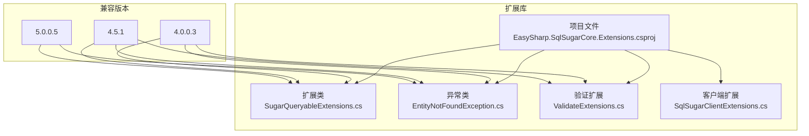
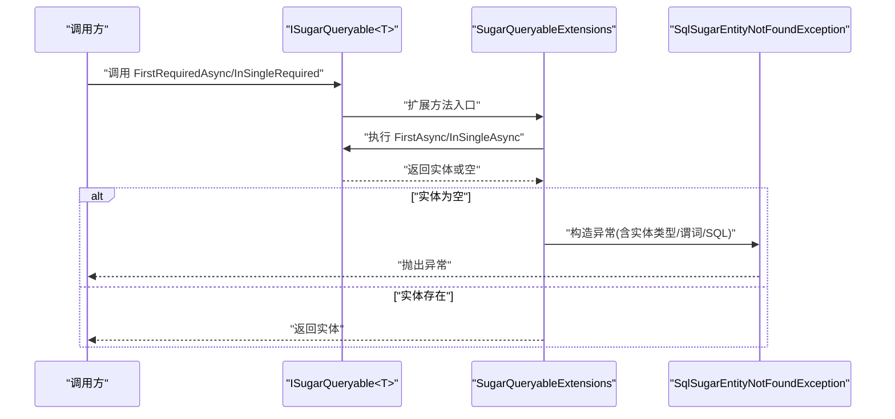
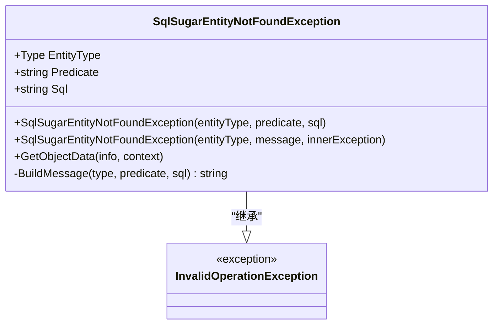
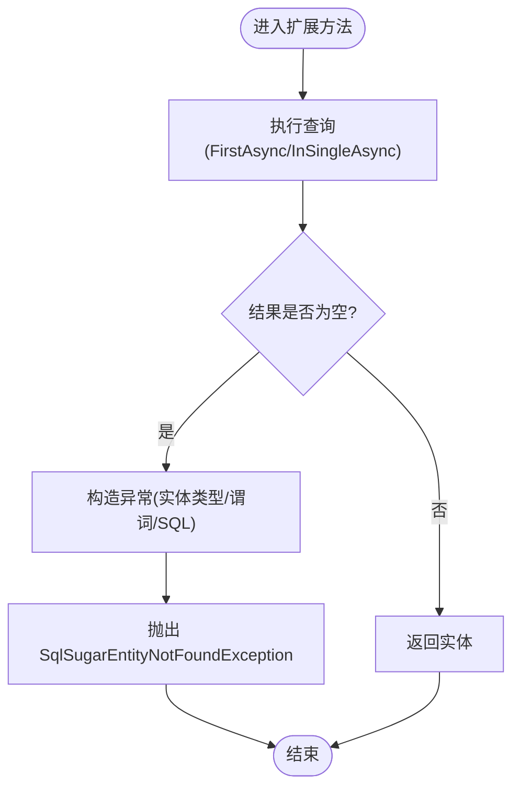
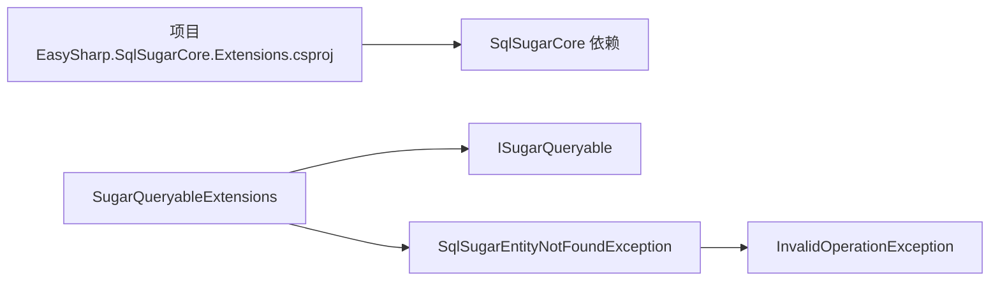

# 核心功能

<cite>
**本文引用的文件**
- [EntityNotFoundException.cs](file://EasySharp.SqlSugarCore.Extensions/EntityNotFoundException.cs)
- [SugarQueryableExtensions.cs](file://EasySharp.SqlSugarCore.Extensions/SugarQueryableExtensions.cs)
- [README.md](file://README.md)
- [EasySharp.SqlSugarCore.Extensions.csproj](file://EasySharp.SqlSugarCore.Extensions/EasySharp.SqlSugarCore.Extensions.csproj)
- [EntityNotFoundException.cs（4.0.0.3）](file://EasySharp.SqlSugarCore.Extensions.4.0.0.3/EntityNotFoundException.cs)
- [SugarQueryableExtensions.cs（4.0.0.3）](file://EasySharp.SqlSugarCore.Extensions.4.0.0.3/SugarQueryableExtensions.cs)
- [SugarQueryableExtensions.cs（4.5.1）](file://EasySharp.SqlSugarCore.Extensions.4.5.1/SugarQueryableExtensions.cs)
- [SugarQueryableExtensions.cs（5.0.0.5）](file://EasySharp.SqlSugarCore.Extensions.5.0.0.5/SugarQueryableExtensions.cs)
- [ValidateExtensions.cs（4.0.0.3）](file://EasySharp.SqlSugarCore.Extensions.4.0.0.3/ValidateExtensions.cs)
- [ValidateExtensions.cs（4.5.1）](file://EasySharp.SqlSugarCore.Extensions.4.5.1/ValidateExtensions.cs)
- [SqlSugarClientExtensions.cs（4.0.0.3）](file://EasySharp.SqlSugarCore.Extensions.4.0.0.3/SqlSugarClientExtensions.cs)
</cite>

## 目录
1. [简介](#简介)
2. [项目结构](#项目结构)
3. [核心组件](#核心组件)
4. [架构总览](#架构总览)
5. [详细组件分析](#详细组件分析)
6. [依赖关系分析](#依赖关系分析)
7. [性能考量](#性能考量)
8. [故障排查指南](#故障排查指南)
9. [结论](#结论)
10. [附录](#附录)

## 简介
本文件面向 EasySharp.SqlSugarCore.Extensions 的核心功能，系统化介绍强类型查询扩展方法的设计与实现，重点覆盖：
- FirstRequiredAsync、InSingleRequired 等关键扩展方法的实现原理与使用场景
- 异常信息处理机制，尤其是 SqlSugarEntityNotFoundException 的设计思路与属性含义
- 异步操作支持的特点与优势
- 完整 API 参考（方法签名、参数说明、返回值、异常处理）
- 实际代码示例路径（以“章节来源”形式给出）
- 性能考虑与最佳实践建议

## 项目结构
该项目是一个针对 SqlSugarCore 的扩展库，提供强类型查询扩展与异常增强能力。核心文件位于根目录下的扩展项目中，同时维护了多个版本的兼容包以适配不同 SqlSugar 版本。

图表来源
- [EasySharp.SqlSugarCore.Extensions.csproj:1-13](file://EasySharp.SqlSugarCore.Extensions/EasySharp.SqlSugarCore.Extensions.csproj#L1-L13)
- [SugarQueryableExtensions.cs:1-94](file://EasySharp.SqlSugarCore.Extensions/SugarQueryableExtensions.cs#L1-L94)
- [EntityNotFoundException.cs:1-79](file://EasySharp.SqlSugarCore.Extensions/EntityNotFoundException.cs#L1-L79)
- [ValidateExtensions.cs（4.0.0.3）:1-18](file://EasySharp.SqlSugarCore.Extensions.4.0.0.3/ValidateExtensions.cs#L1-L18)
- [SqlSugarClientExtensions.cs（4.0.0.3）:1-15](file://EasySharp.SqlSugarCore.Extensions.4.0.0.3/SqlSugarClientExtensions.cs#L1-L15)

章节来源
- [README.md:1-117](file://README.md#L1-L117)
- [EasySharp.SqlSugarCore.Extensions.csproj:1-13](file://EasySharp.SqlSugarCore.Extensions/EasySharp.SqlSugarCore.Extensions.csproj#L1-L13)

## 核心组件
- 强类型查询扩展：在 ISugarQueryable<T> 上提供 FirstRequiredAsync、FirstRequiredAsync(Expression)、InSingleRequired、InSingleRequiredAsync 等扩展方法，确保查询结果存在，否则抛出详细异常。
- 异常增强：SqlSugarEntityNotFoundException 提供实体类型、查询谓词、SQL 语句等上下文信息，便于定位问题。
- 异步支持：所有关键查询方法均提供异步版本，提升并发与吞吐能力。
- 多版本兼容：提供多个版本的扩展包，适配不同 SqlSugar 版本。

章节来源
- [README.md:7-12](file://README.md#L7-L12)
- [SugarQueryableExtensions.cs:7-94](file://EasySharp.SqlSugarCore.Extensions/SugarQueryableExtensions.cs#L7-L94)
- [EntityNotFoundException.cs:7-79](file://EasySharp.SqlSugarCore.Extensions/EntityNotFoundException.cs#L7-L79)

## 架构总览
扩展方法围绕 ISugarQueryable<T> 进行链式调用，先执行查询，再判断结果是否为空；若为空，则构造 SqlSugarEntityNotFoundException 并附带谓词与 SQL 信息。异常类继承自 InvalidOperationException，具备序列化支持与消息格式化逻辑。

图表来源
- [SugarQueryableExtensions.cs:9-52](file://EasySharp.SqlSugarCore.Extensions/SugarQueryableExtensions.cs#L9-L52)
- [EntityNotFoundException.cs:13-33](file://EasySharp.SqlSugarCore.Extensions/EntityNotFoundException.cs#L13-L33)

## 详细组件分析

### 异常类：SqlSugarEntityNotFoundException
- 设计目标：在实体未找到时提供可诊断的详细信息，包括实体类型、查询谓词与执行的 SQL。
- 关键属性
  - EntityType：引发异常的实体类型
  - Predicate：查询谓词字符串（如表达式或业务键）
  - Sql：ToSqlString 输出的 SQL 字符串（可能为空）
- 消息构建：限制谓词与 SQL 的最大长度，避免日志膨胀；对异常进行序列化支持。
- 继承体系：继承 InvalidOperationException，便于统一捕获与区分业务异常。

图表来源
- [EntityNotFoundException.cs:7-79](file://EasySharp.SqlSugarCore.Extensions/EntityNotFoundException.cs#L7-L79)
- [EntityNotFoundException.cs（4.0.0.3）:6-59](file://EasySharp.SqlSugarCore.Extensions.4.0.0.3/EntityNotFoundException.cs#L6-L59)

章节来源
- [EntityNotFoundException.cs:7-79](file://EasySharp.SqlSugarCore.Extensions/EntityNotFoundException.cs#L7-L79)
- [README.md:70-90](file://README.md#L70-L90)

### 查询扩展：SugarQueryableExtensions
- FirstRequiredAsync
  - 重载1：无参数，基于当前查询条件获取首条记录；若为空则抛出异常。
  - 重载2：接受表达式谓词，先应用 Where 再 FirstAsync。
  - 返回：非空实体；异常：SqlSugarEntityNotFoundException。
- InSingleRequired
  - 同步版本：基于主键 InSingle 获取单条记录；若为空则抛出异常。
- InSingleRequiredAsync
  - 异步版本：基于主键 InSingleAsync 获取单条记录；若为空则抛出异常。
- 异常触发点：当查询结果为空时，调用私有方法构造异常并附带谓词与 SQL。
- SQL 采集：尝试调用 ToSqlString 获取 SQL；若失败则忽略，保证扩展方法健壮性。

图表来源
- [SugarQueryableExtensions.cs:9-52](file://EasySharp.SqlSugarCore.Extensions/SugarQueryableExtensions.cs#L9-L52)

章节来源
- [SugarQueryableExtensions.cs:7-94](file://EasySharp.SqlSugarCore.Extensions/SugarQueryableExtensions.cs#L7-L94)
- [README.md:39-90](file://README.md#L39-L90)

### 版本演进与兼容性
- 4.0.0.3 版本
  - 提供 ToSqlString、InSingleAsync、FirstAsync 等辅助方法，以及 CopyQueryable 与 SqlSugarClientExtensions 支持异步上下文复制。
  - 异常类与扩展方法结构与后续版本一致，但 ToSqlString 的实现细节略有差异。
- 4.5.1/5.0.0.5 版本
  - 保持扩展方法与异常类的稳定接口，移除部分辅助方法，聚焦核心查询扩展。
  - 保持 ToSqlString 的可用性，便于调试与日志输出。

章节来源
- [SugarQueryableExtensions.cs（4.0.0.3）:96-157](file://EasySharp.SqlSugarCore.Extensions.4.0.0.3/SugarQueryableExtensions.cs#L96-L157)
- [SugarQueryableExtensions.cs（4.5.1）:94-104](file://EasySharp.SqlSugarCore.Extensions.4.5.1/SugarQueryableExtensions.cs#L94-L104)
- [SugarQueryableExtensions.cs（5.0.0.5）:92-95](file://EasySharp.SqlSugarCore.Extensions.5.0.0.5/SugarQueryableExtensions.cs#L92-L95)

## 依赖关系分析
- 项目依赖 SqlSugarCore，目标框架随版本演进从 netstandard1.6 升级到 netstandard2.1。
- 扩展方法依赖 ISugarQueryable<T> 的 FirstAsync、InSingleAsync、ToSqlString 等能力。
- 异常类作为独立类型被扩展方法直接抛出，不引入额外耦合。

图表来源
- [EasySharp.SqlSugarCore.Extensions.csproj:9-11](file://EasySharp.SqlSugarCore.Extensions/EasySharp.SqlSugarCore.Extensions.csproj#L9-L11)
- [SugarQueryableExtensions.cs:1-94](file://EasySharp.SqlSugarCore.Extensions/SugarQueryableExtensions.cs#L1-L94)
- [EntityNotFoundException.cs:1-79](file://EasySharp.SqlSugarCore.Extensions/EntityNotFoundException.cs#L1-L79)

章节来源
- [EasySharp.SqlSugarCore.Extensions.csproj:3-11](file://EasySharp.SqlSugarCore.Extensions/EasySharp.SqlSugarCore.Extensions.csproj#L3-L11)
- [README.md:111-117](file://README.md#L111-L117)

## 性能考量
- 异步查询的优势
  - 避免阻塞线程，提高并发吞吐；适合高负载服务端场景。
  - 与 FirstRequiredAsync/InSingleRequiredAsync 配合，减少空值分支与重复查询。
- SQL 采集成本
  - ToSqlString 在某些复杂查询或动态拼接场景可能失败或开销较大；扩展方法已做容错处理，避免影响主流程。
- 主键查询优化
  - InSingleRequired/Async 直接基于主键定位，避免全表扫描；建议优先使用主键查询。
- 谓词与 SQL 截断
  - 异常消息中的谓词与 SQL 会被截断，避免日志过大；生产环境建议结合日志系统统一收集。

章节来源
- [README.md:9-11](file://README.md#L9-L11)
- [SugarQueryableExtensions.cs:76-90](file://EasySharp.SqlSugarCore.Extensions/SugarQueryableExtensions.cs#L76-L90)

## 故障排查指南
- 现象：调用扩展方法后抛出 SqlSugarEntityNotFoundException
  - 排查要点
    - 检查 EntityType 是否正确映射到实际实体
    - 查看 Predicate 与 SQL 字段，确认查询条件与生成的 SQL 是否符合预期
    - 若 ToSqlString 失败，可能是查询条件过于复杂或动态拼接导致；可临时关闭 SQL 采集或简化条件
- 建议
  - 在上层统一捕获 SqlSugarEntityNotFoundException 并记录日志
  - 对于高频查询，优先使用主键 InSingleRequired/Async，减少条件查询带来的不确定性

章节来源
- [EntityNotFoundException.cs:53-77](file://EasySharp.SqlSugarCore.Extensions/EntityNotFoundException.cs#L53-L77)
- [README.md:70-90](file://README.md#L70-L90)

## 结论
EasySharp.SqlSugarCore.Extensions 通过简洁而强大的扩展方法，将“确保查询结果存在”的常见需求标准化，并以详细异常信息提升可观测性与可维护性。配合异步查询与主键查询策略，可在保证性能的同时显著降低业务层的样板代码与出错概率。

## 附录

### API 参考

- FirstRequiredAsync<T>()
  - 描述：异步获取第一条记录，不存在则抛出异常
  - 参数：无
  - 返回：T（非空）
  - 异常：SqlSugarEntityNotFoundException
  - 章节来源
    - [SugarQueryableExtensions.cs:9-18](file://EasySharp.SqlSugarCore.Extensions/SugarQueryableExtensions.cs#L9-L18)
    - [README.md:41-56](file://README.md#L41-L56)

- FirstRequiredAsync<T>(Expression<Func<T, bool>>)
  - 描述：根据条件异步获取第一条记录，不存在则抛出异常
  - 参数：expression（查询条件）
  - 返回：T（非空）
  - 异常：SqlSugarEntityNotFoundException
  - 章节来源
    - [SugarQueryableExtensions.cs:20-29](file://EasySharp.SqlSugarCore.Extensions/SugarQueryableExtensions.cs#L20-L29)
    - [README.md:41-56](file://README.md#L41-L56)

- InSingleRequired<T>(object pkValue)
  - 描述：根据主键获取记录，不存在则抛出异常
  - 参数：pkValue（主键值）
  - 返回：T（非空）
  - 异常：SqlSugarEntityNotFoundException
  - 章节来源
    - [SugarQueryableExtensions.cs:32-41](file://EasySharp.SqlSugarCore.Extensions/SugarQueryableExtensions.cs#L32-L41)
    - [README.md:58-68](file://README.md#L58-L68)

- InSingleRequiredAsync<T>(object pkValue)
  - 描述：异步根据主键获取记录，不存在则抛出异常
  - 参数：pkValue（主键值）
  - 返回：T（非空）
  - 异常：SqlSugarEntityNotFoundException
  - 章节来源
    - [SugarQueryableExtensions.cs:43-52](file://EasySharp.SqlSugarCore.Extensions/SugarQueryableExtensions.cs#L43-L52)
    - [README.md:58-68](file://README.md#L58-L68)

- SqlSugarEntityNotFoundException
  - 属性
    - EntityType：实体类型
    - Predicate：查询条件
    - Sql：SQL 语句
  - 章节来源
    - [EntityNotFoundException.cs:9-11](file://EasySharp.SqlSugarCore.Extensions/EntityNotFoundException.cs#L9-L11)
    - [README.md:70-90](file://README.md#L70-L90)

### 使用示例（代码片段路径）
- 条件查询（FirstRequiredAsync）
  - 示例路径：[README.md:48-51](file://README.md#L48-L51)
- 带业务键的查询（FirstRequiredAsync）
  - 示例路径：[README.md:53-55](file://README.md#L53-L55)
- 主键查询（InSingleRequired/Async）
  - 示例路径：[README.md:62-67](file://README.md#L62-L67)
- 异常处理（捕获 SqlSugarEntityNotFoundException）
  - 示例路径：[README.md:78-89](file://README.md#L78-L89)