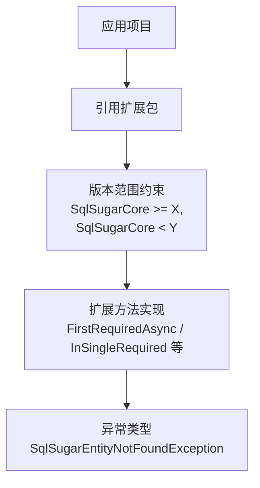
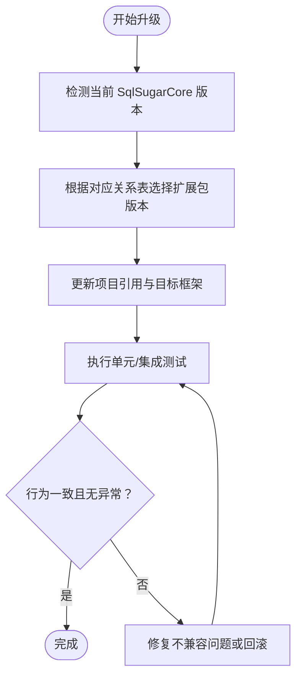
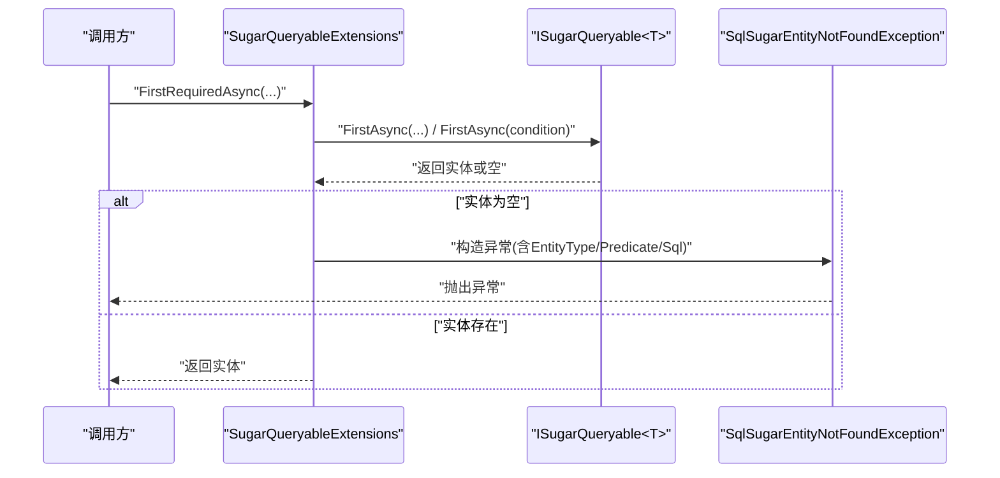
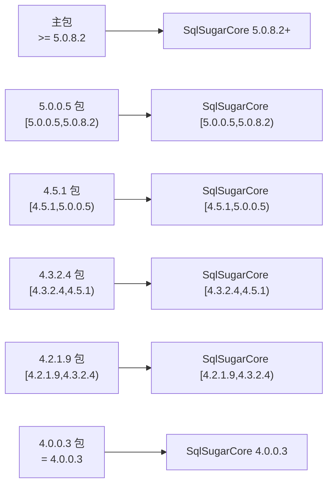

# 版本兼容性

<cite>
**本文引用的文件**
- [README.md](file://README.md)
- [EasySharp.SqlSugarCore.Extensions.csproj](file://EasySharp.SqlSugarCore.Extensions/EasySharp.SqlSugarCore.Extensions.csproj)
- [SugarQueryableExtensions.cs](file://EasySharp.SqlSugarCore.Extensions/SugarQueryableExtensions.cs)
- [EntityNotFoundException.cs](file://EasySharp.SqlSugarCore.Extensions/EntityNotFoundException.cs)
- [ClassLibrary1.csproj](file://ClassLibrary1/ClassLibrary1.csproj)
- [EasySharp.SqlSugarCore.Extensions.4.0.0.3.csproj](file://EasySharp.SqlSugarCore.Extensions.4.0.0.3/EasySharp.SqlSugarCore.Extensions.4.0.0.3.csproj)
- [EasySharp.SqlSugarCore.Extensions.4.2.1.9.csproj](file://EasySharp.SqlSugarCore.Extensions.4.2.1.9/EasySharp.SqlSugarCore.Extensions.4.2.1.9.csproj)
- [EasySharp.SqlSugarCore.Extensions.4.3.2.4.csproj](file://EasySharp.SqlSugarCore.Extensions.4.3.2.4/EasySharp.SqlSugarCore.Extensions.4.3.2.4.csproj)
- [EasySharp.SqlSugarCore.Extensions.4.5.1.csproj](file://EasySharp.SqlSugarCore.Extensions.4.5.1/EasySharp.SqlSugarCore.Extensions.4.5.1.csproj)
- [EasySharp.SqlSugarCore.Extensions.5.0.0.5.csproj](file://EasySharp.SqlSugarCore.Extensions.5.0.0.5/EasySharp.SqlSugarCore.Extensions.5.0.0.5.csproj)
- [SqlSugarClientExtensions.cs](file://EasySharp.SqlSugarCore.Extensions.4.0.0.3/SqlSugarClientExtensions.cs)
- [ValidateExtensions.cs](file://EasySharp.SqlSugarCore.Extensions.4.0.0.3/ValidateExtensions.cs)
- [SugarQueryableExtensions.cs（4.0.0.3）](file://EasySharp.SqlSugarCore.Extensions.4.0.0.3/SugarQueryableExtensions.cs)
- [EntityNotFoundException.cs（4.0.0.3）](file://EasySharp.SqlSugarCore.Extensions.4.0.0.3/EntityNotFoundException.cs)
- [SugarQueryableExtensions.cs（4.2.1.9）](file://EasySharp.SqlSugarCore.Extensions.4.2.1.9/SugarQueryableExtensions.cs)
- [SqlSugarClientExtensions.cs（4.2.1.9）](file://EasySharp.SqlSugarCore.Extensions.4.2.1.9/SqlSugarClientExtensions.cs)
- [SugarQueryableExtensions.cs（4.3.2.4）](file://EasySharp.SqlSugarCore.Extensions.4.3.2.4/SugarQueryableExtensions.cs)
- [SugarQueryableExtensions.cs（5.0.0.5）](file://EasySharp.SqlSugarCore.Extensions.5.0.0.5/SugarQueryableExtensions.cs)
</cite>

## 目录
1. [简介](#简介)
2. [项目结构](#项目结构)
3. [核心组件](#核心组件)
4. [架构总览](#架构总览)
5. [详细组件分析](#详细组件分析)
6. [依赖关系分析](#依赖关系分析)
7. [性能考量](#性能考量)
8. [故障排查指南](#故障排查指南)
9. [结论](#结论)
10. [附录](#附录)

## 简介
本文件为 EasySharp.SqlSugarCore.Extensions 的版本兼容性与升级指南，覆盖以下内容：
- 完整的版本对应关系表（包名、SqlSugar 版本范围、目标框架）
- 如何依据项目中的 SqlSugarCore 版本选择合适扩展包
- 升级注意事项与迁移步骤
- 不同版本的功能差异与限制
- 版本兼容性测试建议与验证方法

## 项目结构
该仓库采用“按 SqlSugar 版本分包”的组织方式，每个版本一个独立项目，便于在不同 SqlSugarCore 版本下复用相同 API 与行为。

```mermaid
graph TB
Root["根目录"] --> ExtMain["EasySharp.SqlSugarCore.Extensions<br/>目标框架: netstandard2.1<br/>依赖: SqlSugarCore >= 5.0.8.2"]
Root --> Ext4003["EasySharp.SqlSugarCore.Extensions.4.0.0.3<br/>目标框架: netstandard1.6<br/>依赖: 4.0.0.3 <= SqlSugarCore < 4.2.1.9"]
Root --> Ext4219["EasySharp.SqlSugarCore.Extensions.4.2.1.9<br/>目标框架: netstandard1.6<br/>依赖: 4.2.1.9 <= SqlSugarCore < 4.3.2.4"]
Root --> Ext4324["EasySharp.SqlSugarCore.Extensions.4.3.2.4<br/>目标框架: netstandard2.0<br/>依赖: 4.3.2.4 <= SqlSugarCore < 4.5.1"]
Root --> Ext451["EasySharp.SqlSugarCore.Extensions.4.5.1<br/>目标框架: netstandard2.0<br/>依赖: 4.5.1 <= SqlSugarCore < 5.0.0.5"]
Root --> Ext5005["EasySharp.SqlSugarCore.Extensions.5.0.0.5<br/>目标框架: netstandard2.1<br/>依赖: 5.0.0.5 <= SqlSugarCore < 5.0.8.2"]
Root --> ClassLib["ClassLibrary1<br/>目标框架: netstandard1.6<br/>依赖: SqlSugarCore 4.0.0.3"]
```

图表来源
- [EasySharp.SqlSugarCore.Extensions.csproj:1-13](file://EasySharp.SqlSugarCore.Extensions/EasySharp.SqlSugarCore.Extensions.csproj#L1-L13)
- [EasySharp.SqlSugarCore.Extensions.4.0.0.3.csproj:1-15](file://EasySharp.SqlSugarCore.Extensions.4.0.0.3/EasySharp.SqlSugarCore.Extensions.4.0.0.3.csproj#L1-L15)
- [EasySharp.SqlSugarCore.Extensions.4.2.1.9.csproj:1-15](file://EasySharp.SqlSugarCore.Extensions.4.2.1.9/EasySharp.SqlSugarCore.Extensions.4.2.1.9.csproj#L1-L15)
- [EasySharp.SqlSugarCore.Extensions.4.3.2.4.csproj:1-14](file://EasySharp.SqlSugarCore.Extensions.4.3.2.4/EasySharp.SqlSugarCore.Extensions.4.3.2.4.csproj#L1-L14)
- [EasySharp.SqlSugarCore.Extensions.4.5.1.csproj:1-14](file://EasySharp.SqlSugarCore.Extensions.4.5.1/EasySharp.SqlSugarCore.Extensions.4.5.1.csproj#L1-L14)
- [EasySharp.SqlSugarCore.Extensions.5.0.0.5.csproj:1-13](file://EasySharp.SqlSugarCore.Extensions.5.0.0.5/EasySharp.SqlSugarCore.Extensions.5.0.0.5.csproj#L1-L13)
- [ClassLibrary1.csproj:1-15](file://ClassLibrary1/ClassLibrary1.csproj#L1-L15)

章节来源
- [README.md:28-38](file://README.md#L28-L38)
- [EasySharp.SqlSugarCore.Extensions.csproj:1-13](file://EasySharp.SqlSugarCore.Extensions/EasySharp.SqlSugarCore.Extensions.csproj#L1-L13)
- [EasySharp.SqlSugarCore.Extensions.4.0.0.3.csproj:1-15](file://EasySharp.SqlSugarCore.Extensions.4.0.0.3/EasySharp.SqlSugarCore.Extensions.4.0.0.3.csproj#L1-L15)
- [EasySharp.SqlSugarCore.Extensions.4.2.1.9.csproj:1-15](file://EasySharp.SqlSugarCore.Extensions.4.2.1.9/EasySharp.SqlSugarCore.Extensions.4.2.1.9.csproj#L1-L15)
- [EasySharp.SqlSugarCore.Extensions.4.3.2.4.csproj:1-14](file://EasySharp.SqlSugarCore.Extensions.4.3.2.4/EasySharp.SqlSugarCore.Extensions.4.3.2.4.csproj#L1-L14)
- [EasySharp.SqlSugarCore.Extensions.4.5.1.csproj:1-14](file://EasySharp.SqlSugarCore.Extensions.4.5.1/EasySharp.SqlSugarCore.Extensions.4.5.1.csproj#L1-L14)
- [EasySharp.SqlSugarCore.Extensions.5.0.0.5.csproj:1-13](file://EasySharp.SqlSugarCore.Extensions.5.0.0.5/EasySharp.SqlSugarCore.Extensions.5.0.0.5.csproj#L1-L13)
- [ClassLibrary1.csproj:1-15](file://ClassLibrary1/ClassLibrary1.csproj#L1-L15)

## 核心组件
- 扩展方法集：统一提供 FirstRequiredAsync、FirstRequiredAsync(带条件)、InSingleRequired、InSingleRequiredAsync 等强类型查询扩展，保证查询结果存在，否则抛出包含实体类型、谓词与 SQL 的异常。
- 异常类型：SqlSugarEntityNotFoundException，携带 EntityType、Predicate、Sql 等上下文信息，便于定位问题。
- 版本化实现：不同版本包内实现一致，但依赖范围与目标框架不同，以适配不同 SqlSugarCore 版本。

章节来源
- [README.md:92-110](file://README.md#L92-L110)
- [SugarQueryableExtensions.cs:1-94](file://EasySharp.SqlSugarCore.Extensions/SugarQueryableExtensions.cs#L1-L94)
- [EntityNotFoundException.cs:1-79](file://EasySharp.SqlSugarCore.Extensions/EntityNotFoundException.cs#L1-L79)

## 架构总览
扩展库通过 NuGet 包形式发布，每个版本包声明对 SqlSugarCore 的版本范围约束，运行时由项目引用决定加载哪个版本包。核心 API 在各版本包中保持一致，确保跨版本兼容。

图表来源
- [README.md:28-38](file://README.md#L28-L38)
- [EasySharp.SqlSugarCore.Extensions.csproj:9-11](file://EasySharp.SqlSugarCore.Extensions/EasySharp.SqlSugarCore.Extensions.csproj#L9-L11)
- [EasySharp.SqlSugarCore.Extensions.4.0.0.3.csproj:10-12](file://EasySharp.SqlSugarCore.Extensions.4.0.0.3/EasySharp.SqlSugarCore.Extensions.4.0.0.3.csproj#L10-L12)
- [EasySharp.SqlSugarCore.Extensions.4.2.1.9.csproj:10-12](file://EasySharp.SqlSugarCore.Extensions.4.2.1.9/EasySharp.SqlSugarCore.Extensions.4.2.1.9.csproj#L10-L12)
- [EasySharp.SqlSugarCore.Extensions.4.3.2.4.csproj:10-11](file://EasySharp.SqlSugarCore.Extensions.4.3.2.4/EasySharp.SqlSugarCore.Extensions.4.3.2.4.csproj#L10-L11)
- [EasySharp.SqlSugarCore.Extensions.4.5.1.csproj:10-11](file://EasySharp.SqlSugarCore.Extensions.4.5.1/EasySharp.SqlSugarCore.Extensions.4.5.1.csproj#L10-L11)
- [EasySharp.SqlSugarCore.Extensions.5.0.0.5.csproj:9-11](file://EasySharp.SqlSugarCore.Extensions.5.0.0.5/EasySharp.SqlSugarCore.Extensions.5.0.0.5.csproj#L9-L11)

## 详细组件分析

### 版本对应关系与选择指南
- 版本对应关系表（摘自项目文档）：
  - EasySharp.SqlSugarCore.Extensions：SqlSugarCore >= 5.0.8.2，目标框架 netstandard2.1
  - EasySharp.SqlSugarCore.Extensions.5.0.0.5：SqlSugarCore 范围 [5.0.0.5, 5.0.8.2)，目标 netstandard2.1
  - EasySharp.SqlSugarCore.Extensions.4.5.1：SqlSugarCore 范围 [4.5.1, 5.0.0.5)，目标 netstandard2.0
  - EasySharp.SqlSugarCore.Extensions.4.3.2.4：SqlSugarCore 范围 [4.3.2.4, 4.5.1)，目标 netstandard2.0
  - EasySharp.SqlSugarCore.Extensions.4.2.1.9：SqlSugarCore 范围 [4.2.1.9, 4.3.2.4)，目标 netstandard1.6
  - EasySharp.SqlSugarCore.Extensions.4.0.0.3：SqlSugarCore = 4.0.0.3，目标 netstandard1.6
  - ClassLibrary1：SqlSugarCore = 4.0.0.3，目标 netstandard1.6

- 选择策略：
  - 若项目 SqlSugarCore 版本 ≥ 5.0.8.2，请使用 EasySharp.SqlSugarCore.Extensions（netstandard2.1）。
  - 若项目 SqlSugarCore 版本位于 [5.0.0.5, 5.0.8.2)，请使用 EasySharp.SqlSugarCore.Extensions.5.0.0.5（netstandard2.1）。
  - 若项目 SqlSugarCore 版本位于 [4.5.1, 5.0.0.5），请使用 EasySharp.SqlSugarCore.Extensions.4.5.1（netstandard2.0）。
  - 若项目 SqlSugarCore 版本位于 [4.3.2.4, 4.5.1），请使用 EasySharp.SqlSugarCore.Extensions.4.3.2.4（netstandard2.0）。
  - 若项目 SqlSugarCore 版本位于 [4.2.1.9, 4.3.2.4），请使用 EasySharp.SqlSugarCore.Extensions.4.2.1.9（netstandard1.6）。
  - 若项目 SqlSugarCore 版本为 4.0.0.3，请使用 EasySharp.SqlSugarCore.Extensions.4.0.0.3 或 ClassLibrary1（netstandard1.6）。

章节来源
- [README.md:28-38](file://README.md#L28-L38)
- [EasySharp.SqlSugarCore.Extensions.csproj:3-7](file://EasySharp.SqlSugarCore.Extensions/EasySharp.SqlSugarCore.Extensions.csproj#L3-L7)
- [EasySharp.SqlSugarCore.Extensions.5.0.0.5.csproj:3-7](file://EasySharp.SqlSugarCore.Extensions.5.0.0.5/EasySharp.SqlSugarCore.Extensions.5.0.0.5.csproj#L3-L7)
- [EasySharp.SqlSugarCore.Extensions.4.5.1.csproj:3-7](file://EasySharp.SqlSugarCore.Extensions.4.5.1/EasySharp.SqlSugarCore.Extensions.4.5.1.csproj#L3-L7)
- [EasySharp.SqlSugarCore.Extensions.4.3.2.4.csproj:3-7](file://EasySharp.SqlSugarCore.Extensions.4.3.2.4/EasySharp.SqlSugarCore.Extensions.4.3.2.4.csproj#L3-L7)
- [EasySharp.SqlSugarCore.Extensions.4.2.1.9.csproj:3-7](file://EasySharp.SqlSugarCore.Extensions.4.2.1.9/EasySharp.SqlSugarCore.Extensions.4.2.1.9.csproj#L3-L7)
- [EasySharp.SqlSugarCore.Extensions.4.0.0.3.csproj:3-7](file://EasySharp.SqlSugarCore.Extensions.4.0.0.3/EasySharp.SqlSugarCore.Extensions.4.0.0.3.csproj#L3-L7)
- [ClassLibrary1.csproj:3-4](file://ClassLibrary1/ClassLibrary1.csproj#L3-L4)

### API 行为一致性（跨版本）
- 统一的扩展方法族：FirstRequiredAsync、FirstRequiredAsync(带条件)、InSingleRequired、InSingleRequiredAsync。
- 统一的异常类型：SqlSugarEntityNotFoundException，包含 EntityType、Predicate、Sql 字段。
- 一致性验证路径：
  - 扩展方法定义与调用入口：[SugarQueryableExtensions.cs:7-52](file://EasySharp.SqlSugarCore.Extensions/SugarQueryableExtensions.cs#L7-L52)
  - 异常类型定义与消息构建：[EntityNotFoundException.cs:6-51](file://EasySharp.SqlSugarCore.Extensions/EntityNotFoundException.cs#L6-L51)
  - 其他版本的等价实现：
    - [SugarQueryableExtensions.cs（4.0.0.3）:10-94](file://EasySharp.SqlSugarCore.Extensions.4.0.0.3/SugarQueryableExtensions.cs#L10-L94)
    - [SugarQueryableExtensions.cs（4.2.1.9）:10-94](file://EasySharp.SqlSugarCore.Extensions.4.2.1.9/SugarQueryableExtensions.cs#L10-L94)
    - [SugarQueryableExtensions.cs（4.3.2.4）:10-94](file://EasySharp.SqlSugarCore.Extensions.4.3.2.4/SugarQueryableExtensions.cs#L10-L94)
    - [SugarQueryableExtensions.cs（5.0.0.5）:7-95](file://EasySharp.SqlSugarCore.Extensions.5.0.0.5/SugarQueryableExtensions.cs#L7-L95)

章节来源
- [SugarQueryableExtensions.cs:7-94](file://EasySharp.SqlSugarCore.Extensions/SugarQueryableExtensions.cs#L7-L94)
- [EntityNotFoundException.cs:6-78](file://EasySharp.SqlSugarCore.Extensions/EntityNotFoundException.cs#L6-L78)
- [SugarQueryableExtensions.cs（4.0.0.3）:10-161](file://EasySharp.SqlSugarCore.Extensions.4.0.0.3/SugarQueryableExtensions.cs#L10-L161)
- [SugarQueryableExtensions.cs（4.2.1.9）:10-161](file://EasySharp.SqlSugarCore.Extensions.4.2.1.9/SugarQueryableExtensions.cs#L10-L161)
- [SugarQueryableExtensions.cs（4.3.2.4）:10-162](file://EasySharp.SqlSugarCore.Extensions.4.3.2.4/SugarQueryableExtensions.cs#L10-L162)
- [SugarQueryableExtensions.cs（5.0.0.5）:7-99](file://EasySharp.SqlSugarCore.Extensions.5.0.0.5/SugarQueryableExtensions.cs#L7-L99)

### 版本差异与限制
- 目标框架差异：
  - 4.0.0.3/4.2.1.9：netstandard1.6
  - 4.3.2.4/4.5.1：netstandard2.0
  - 5.0.0.5/主包：netstandard2.1
- 依赖范围差异：
  - 主包要求 SqlSugarCore ≥ 5.0.8.2；其他版本包严格限定范围，避免与更高版本冲突。
- 实现差异点（基于已对比文件）：
  - 4.0.0.3 版本包含 ToSqlString、InSingleAsync、ToListAsync、FirstAsync 等辅助方法与内部工具类（SqlSugarClientExtensions、ValidateExtensions），并在部分返回值处理上存在细微差异。
  - 4.2.1.9/4.3.2.4/5.0.0.5 版本移除了上述辅助方法与内部工具类，仅保留核心扩展方法族。
  - 4.3.2.4 版本在日志事件处理字段上新增了 ProcessingEventStartingSQL 的同步。

章节来源
- [README.md:28-38](file://README.md#L28-L38)
- [EasySharp.SqlSugarCore.Extensions.4.0.0.3.csproj:3-7](file://EasySharp.SqlSugarCore.Extensions.4.0.0.3/EasySharp.SqlSugarCore.Extensions.4.0.0.3.csproj#L3-L7)
- [EasySharp.SqlSugarCore.Extensions.4.2.1.9.csproj:3-7](file://EasySharp.SqlSugarCore.Extensions.4.2.1.9/EasySharp.SqlSugarCore.Extensions.4.2.1.9.csproj#L3-L7)
- [EasySharp.SqlSugarCore.Extensions.4.3.2.4.csproj:3-7](file://EasySharp.SqlSugarCore.Extensions.4.3.2.4/EasySharp.SqlSugarCore.Extensions.4.3.2.4.csproj#L3-L7)
- [EasySharp.SqlSugarCore.Extensions.4.5.1.csproj:3-7](file://EasySharp.SqlSugarCore.Extensions.4.5.1/EasySharp.SqlSugarCore.Extensions.4.5.1.csproj#L3-L7)
- [EasySharp.SqlSugarCore.Extensions.5.0.0.5.csproj:3-7](file://EasySharp.SqlSugarCore.Extensions.5.0.0.5/EasySharp.SqlSugarCore.Extensions.5.0.0.5.csproj#L3-L7)
- [SugarQueryableExtensions.cs（4.0.0.3）:96-157](file://EasySharp.SqlSugarCore.Extensions.4.0.0.3/SugarQueryableExtensions.cs#L96-L157)
- [SqlSugarClientExtensions.cs（4.0.0.3）:3-12](file://EasySharp.SqlSugarCore.Extensions.4.0.0.3/SqlSugarClientExtensions.cs#L3-L12)
- [ValidateExtensions.cs（4.0.0.3）:5-15](file://EasySharp.SqlSugarCore.Extensions.4.0.0.3/ValidateExtensions.cs#L5-L15)
- [SugarQueryableExtensions.cs（4.3.2.4）:126-127](file://EasySharp.SqlSugarCore.Extensions.4.3.2.4/SugarQueryableExtensions.cs#L126-L127)
- [SugarQueryableExtensions.cs（4.2.1.9）:103-106](file://EasySharp.SqlSugarCore.Extensions.4.2.1.9/SugarQueryableExtensions.cs#L103-L106)
- [SugarQueryableExtensions.cs（4.3.2.4）:103-106](file://EasySharp.SqlSugarCore.Extensions.4.3.2.4/SugarQueryableExtensions.cs#L103-L106)
- [SugarQueryableExtensions.cs（5.0.0.5）:92-95](file://EasySharp.SqlSugarCore.Extensions.5.0.0.5/SugarQueryableExtensions.cs#L92-L95)

### 升级流程与迁移步骤
- 步骤概览：
  1) 确认当前项目使用的 SqlSugarCore 版本。
  2) 根据“版本对应关系表”选择匹配的扩展包版本。
  3) 更新项目引用（NuGet 包）与目标框架（如需要）。
  4) 运行单元测试与集成测试，验证扩展方法行为一致。
  5) 如从 4.0.0.3 升级至更高版本，注意移除对内部工具类与辅助方法的依赖。
- 关键检查点：
  - 依赖范围是否满足（避免与更高版本冲突）。
  - 目标框架是否满足项目最低要求。
  - 异常信息字段（EntityType/Predicate/Sql）是否满足监控与日志需求。

图表来源
- [README.md:28-38](file://README.md#L28-L38)
- [EasySharp.SqlSugarCore.Extensions.csproj:9-11](file://EasySharp.SqlSugarCore.Extensions/EasySharp.SqlSugarCore.Extensions.csproj#L9-L11)
- [EasySharp.SqlSugarCore.Extensions.4.0.0.3.csproj:10-12](file://EasySharp.SqlSugarCore.Extensions.4.0.0.3/EasySharp.SqlSugarCore.Extensions.4.0.0.3.csproj#L10-L12)
- [EasySharp.SqlSugarCore.Extensions.4.2.1.9.csproj:10-12](file://EasySharp.SqlSugarCore.Extensions.4.2.1.9/EasySharp.SqlSugarCore.Extensions.4.2.1.9.csproj#L10-L12)
- [EasySharp.SqlSugarCore.Extensions.4.3.2.4.csproj:10-11](file://EasySharp.SqlSugarCore.Extensions.4.3.2.4/EasySharp.SqlSugarCore.Extensions.4.3.2.4.csproj#L10-L11)
- [EasySharp.SqlSugarCore.Extensions.4.5.1.csproj:10-11](file://EasySharp.SqlSugarCore.Extensions.4.5.1/EasySharp.SqlSugarCore.Extensions.4.5.1.csproj#L10-L11)
- [EasySharp.SqlSugarCore.Extensions.5.0.0.5.csproj:9-11](file://EasySharp.SqlSugarCore.Extensions.5.0.0.5/EasySharp.SqlSugarCore.Extensions.5.0.0.5.csproj#L9-L11)

章节来源
- [README.md:28-38](file://README.md#L28-L38)
- [SugarQueryableExtensions.cs（4.0.0.3）:96-157](file://EasySharp.SqlSugarCore.Extensions.4.0.0.3/SugarQueryableExtensions.cs#L96-L157)
- [SugarQueryableExtensions.cs（4.2.1.9）:103-106](file://EasySharp.SqlSugarCore.Extensions.4.2.1.9/SugarQueryableExtensions.cs#L103-L106)
- [SugarQueryableExtensions.cs（4.3.2.4）:126-127](file://EasySharp.SqlSugarCore.Extensions.4.3.2.4/SugarQueryableExtensions.cs#L126-L127)

### API 调用序列（以核心扩展为例）

图表来源
- [SugarQueryableExtensions.cs:9-29](file://EasySharp.SqlSugarCore.Extensions/SugarQueryableExtensions.cs#L9-L29)
- [EntityNotFoundException.cs:13-22](file://EasySharp.SqlSugarCore.Extensions/EntityNotFoundException.cs#L13-L22)

## 依赖关系分析
- 依赖约束：
  - 主包：SqlSugarCore >= 5.0.8.2
  - 4.0.0.3 版本包：SqlSugarCore 范围 [4.0.0.3, 4.2.1.9)
  - 4.2.1.9 版本包：SqlSugarCore 范围 [4.2.1.9, 4.3.2.4)
  - 4.3.2.4 版本包：SqlSugarCore 范围 [4.3.2.4, 4.5.1)
  - 4.5.1 版本包：SqlSugarCore 范围 [4.5.1, 5.0.0.5)
  - 5.0.0.5 版本包：SqlSugarCore 范围 [5.0.0.5, 5.0.8.2)
- 目标框架：
  - netstandard1.6（4.0.0.3/4.2.1.9）
  - netstandard2.0（4.3.2.4/4.5.1）
  - netstandard2.1（5.0.0.5/主包）

图表来源
- [EasySharp.SqlSugarCore.Extensions.csproj:9-11](file://EasySharp.SqlSugarCore.Extensions/EasySharp.SqlSugarCore.Extensions.csproj#L9-L11)
- [EasySharp.SqlSugarCore.Extensions.5.0.0.5.csproj:9-11](file://EasySharp.SqlSugarCore.Extensions.5.0.0.5/EasySharp.SqlSugarCore.Extensions.5.0.0.5.csproj#L9-L11)
- [EasySharp.SqlSugarCore.Extensions.4.5.1.csproj:9-11](file://EasySharp.SqlSugarCore.Extensions.4.5.1/EasySharp.SqlSugarCore.Extensions.4.5.1.csproj#L9-L11)
- [EasySharp.SqlSugarCore.Extensions.4.3.2.4.csproj:9-11](file://EasySharp.SqlSugarCore.Extensions.4.3.2.4/EasySharp.SqlSugarCore.Extensions.4.3.2.4.csproj#L9-L11)
- [EasySharp.SqlSugarCore.Extensions.4.2.1.9.csproj:9-11](file://EasySharp.SqlSugarCore.Extensions.4.2.1.9/EasySharp.SqlSugarCore.Extensions.4.2.1.9.csproj#L9-L11)
- [EasySharp.SqlSugarCore.Extensions.4.0.0.3.csproj:9-11](file://EasySharp.SqlSugarCore.Extensions.4.0.0.3/EasySharp.SqlSugarCore.Extensions.4.0.0.3.csproj#L9-L11)

章节来源
- [README.md:28-38](file://README.md#L28-L38)
- [EasySharp.SqlSugarCore.Extensions.csproj:9-11](file://EasySharp.SqlSugarCore.Extensions/EasySharp.SqlSugarCore.Extensions.csproj#L9-L11)
- [EasySharp.SqlSugarCore.Extensions.5.0.0.5.csproj:9-11](file://EasySharp.SqlSugarCore.Extensions.5.0.0.5/EasySharp.SqlSugarCore.Extensions.5.0.0.5.csproj#L9-L11)
- [EasySharp.SqlSugarCore.Extensions.4.5.1.csproj:9-11](file://EasySharp.SqlSugarCore.Extensions.4.5.1/EasySharp.SqlSugarCore.Extensions.4.5.1.csproj#L9-L11)
- [EasySharp.SqlSugarCore.Extensions.4.3.2.4.csproj:9-11](file://EasySharp.SqlSugarCore.Extensions.4.3.2.4/EasySharp.SqlSugarCore.Extensions.4.3.2.4.csproj#L9-L11)
- [EasySharp.SqlSugarCore.Extensions.4.2.1.9.csproj:9-11](file://EasySharp.SqlSugarCore.Extensions.4.2.1.9/EasySharp.SqlSugarCore.Extensions.4.2.1.9.csproj#L9-L11)
- [EasySharp.SqlSugarCore.Extensions.4.0.0.3.csproj:9-11](file://EasySharp.SqlSugarCore.Extensions.4.0.0.3/EasySharp.SqlSugarCore.Extensions.4.0.0.3.csproj#L9-L11)

## 性能考量
- 异常构造包含 ToSqlString 调用，可能带来少量额外开销；在高频查询场景中建议谨慎使用业务键作为谓词，避免过长字符串导致消息截断与日志膨胀。
- 4.0.0.3 版本的 ToListAsync 实现采用手动 Task 启动，其他版本移除此实现，建议优先使用标准异步 API。
- 目标框架越高（netstandard2.1），在现代运行时上通常具备更好的性能与内存效率。

## 故障排查指南
- 常见问题与定位：
  - 无法解析扩展方法：确认引用了正确版本的扩展包，并检查目标框架与 SqlSugarCore 版本范围是否匹配。
  - 抛出 SqlSugarEntityNotFoundException：检查 EntityType/Predicate/Sql 字段，结合日志快速定位问题。
  - 从 4.0.0.3 升级后找不到内部工具类或辅助方法：这些在后续版本中被移除，需调整调用逻辑。
- 排查步骤：
  1) 核对项目引用与依赖范围。
  2) 运行最小化复现用例，捕获异常并输出完整堆栈。
  3) 对比不同版本的 API 差异，必要时回退到兼容版本。

章节来源
- [README.md:70-90](file://README.md#L70-L90)
- [EntityNotFoundException.cs:53-77](file://EasySharp.SqlSugarCore.Extensions/EntityNotFoundException.cs#L53-L77)
- [SugarQueryableExtensions.cs（4.0.0.3）:96-157](file://EasySharp.SqlSugarCore.Extensions.4.0.0.3/SugarQueryableExtensions.cs#L96-L157)

## 结论
- 通过严格的版本范围与目标框架控制，扩展库实现了对多个 SqlSugarCore 版本的兼容。
- 选择扩展包时应严格遵循“版本对应关系表”，避免因依赖范围不匹配导致的运行时问题。
- 升级时优先使用主包（≥ 5.0.8.2），若必须使用旧版 SqlSugarCore，则按范围选择对应版本包。
- 建议在升级前后进行充分测试，重点验证异常信息与扩展方法行为的一致性。

## 附录

### 版本兼容性测试建议
- 自动化测试清单：
  - 验证 FirstRequiredAsync/InSingleRequired 在存在与不存在实体时的行为。
  - 验证异常类型与字段（EntityType/Predicate/Sql）是否符合预期。
  - 验证不同目标框架下的编译与运行。
  - 验证依赖范围不交叉、不冲突。
- 测试环境建议：
  - 使用多版本 SqlSugarCore 进行回归测试。
  - 在 netstandard1.6/2.0/2.1 下分别构建与运行。
  - 集成日志与异常监控，确保异常信息可追踪。

### API 参考摘要
- 扩展方法族（均提供同步与异步版本）：
  - FirstRequiredAsync<T>()
  - FirstRequiredAsync<T>(Expression)
  - InSingleRequired<T>(object)
  - InSingleRequiredAsync<T>(object)
- 异常类型：
  - SqlSugarEntityNotFoundException：包含 EntityType、Predicate、Sql

章节来源
- [README.md:92-110](file://README.md#L92-L110)
- [SugarQueryableExtensions.cs:7-52](file://EasySharp.SqlSugarCore.Extensions/SugarQueryableExtensions.cs#L7-L52)
- [EntityNotFoundException.cs:6-51](file://EasySharp.SqlSugarCore.Extensions/EntityNotFoundException.cs#L6-L51)