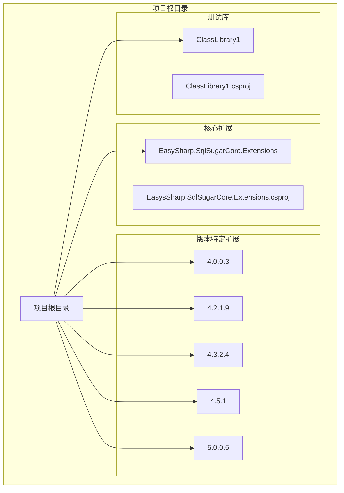
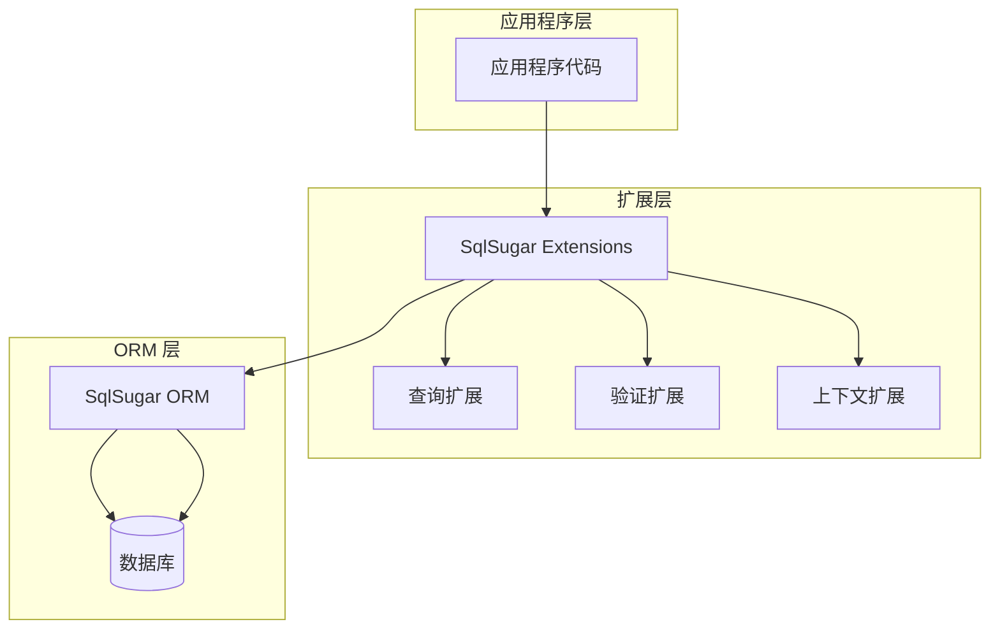
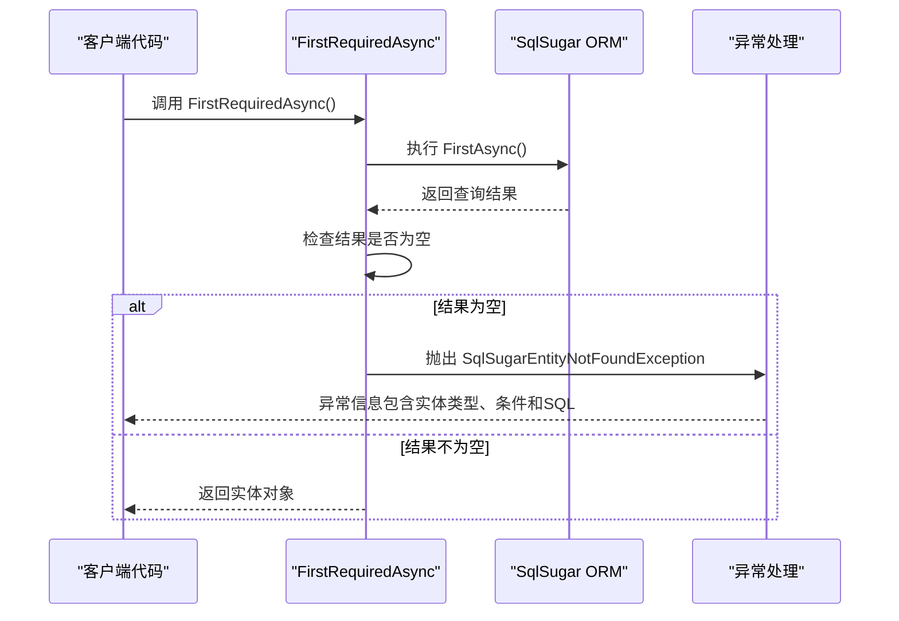
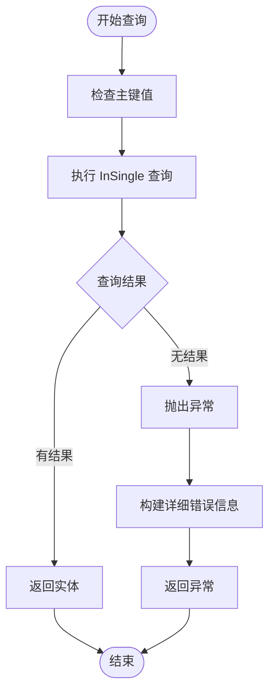
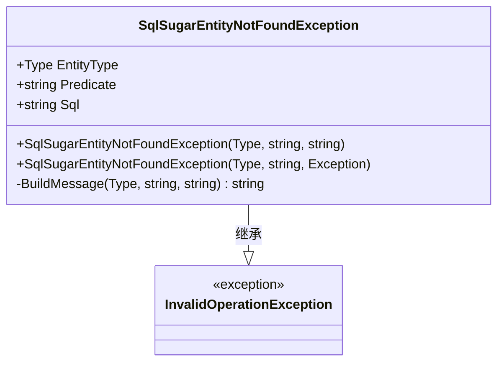
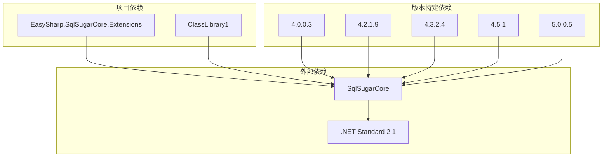

# 示例教程

<cite>
**本文档引用的文件**
- [README.md](file://README.md)
- [SugarQueryableExtensions.cs](file://ClassLibrary1/SugarQueryableExtensions.cs)
- [EntityNotFoundException.cs](file://ClassLibrary1/EntityNotFoundException.cs)
- [SqlSugarClientExtensions.cs](file://ClassLibrary1/SqlSugarClientExtensions.cs)
- [ValidateExtensions.cs](file://ClassLibrary1/ValidateExtensions.cs)
- [SugarQueryableExtensions.cs](file://EasySharp.SqlSugarCore.Extensions.4.5.1/SugarQueryableExtensions.cs)
- [SugarQueryableExtensions.cs](file://EasySharp.SqlSugarCore.Extensions.4.0.0.3/SugarQueryableExtensions.cs)
- [SugarQueryableExtensions.cs](file://EasySharp.SqlSugarCore.Extensions.5.0.0.5/SugarQueryableExtensions.cs)
- [EasySharp.SqlSugarCore.Extensions.csproj](file://EasySharp.SqlSugarCore.Extensions/EasySharp.SqlSugarCore.Extensions.csproj)
- [ClassLibrary1.csproj](file://ClassLibrary1/ClassLibrary1.csproj)
</cite>

## 目录
1. [简介](#简介)
2. [项目结构](#项目结构)
3. [核心组件](#核心组件)
4. [架构概览](#架构概览)
5. [详细组件分析](#详细组件分析)
6. [基础使用示例](#基础使用示例)
7. [高级使用场景](#高级使用场景)
8. [实际项目应用案例](#实际项目应用案例)
9. [依赖分析](#依赖分析)
10. [性能考虑](#性能考虑)
11. [故障排除指南](#故障排除指南)
12. [结论](#结论)

## 简介

EasySharp.SqlSugarCore.Extensions 是一个专门为 SqlSugar ORM 提供扩展功能的 .NET 库。该项目的核心目标是提供一组强类型的查询扩展方法，用于简化数据库查询操作并增强错误处理能力。

### 主要特性

- **强类型查询**：提供 `FirstRequiredAsync` 和 `InSingleRequired` 等扩展方法，确保查询结果存在
- **详细的异常信息**：当实体未找到时，抛出包含实体类型、查询条件和 SQL 语句的详细异常
- **支持异步操作**：所有方法都提供异步版本
- **多版本支持**：针对不同 SqlSugar 版本提供兼容包

### 版本兼容性

项目支持多个 SqlSugar 版本，从 4.0.0.3 到 5.0.8.2+，确保与不同版本的 SqlSugar ORM 兼容。

**章节来源**
- [README.md:1-117](file://README.md#L1-L117)

## 项目结构

项目采用多版本支持的结构设计，为不同版本的 SqlSugar 提供专门的扩展实现：



**图表来源**
- [EasySharp.SqlSugarCore.Extensions.csproj:1-13](file://EasySharp.SqlSugarCore.Extensions/EasySharp.SqlSugarCore.Extensions.csproj#L1-L13)
- [ClassLibrary1.csproj:1-15](file://ClassLibrary1/ClassLibrary1.csproj#L1-L15)

**章节来源**
- [README.md:28-38](file://README.md#L28-L38)

## 核心组件

### SugarQueryableExtensions 类

这是项目的核心扩展类，提供了所有主要的查询扩展方法：

- `FirstRequiredAsync<T>()` - 异步获取第一条记录，不存在则抛出异常
- `FirstRequiredAsync<T>(Expression<Func<T, bool>>)` - 根据条件异步获取第一条记录，不存在则抛出异常
- `InSingleRequired<T>(object pkValue)` - 根据主键获取记录，不存在则抛出异常
- `InSingleRequiredAsync<T>(object pkValue)` - 异步根据主键获取记录，不存在则抛出异常

### SqlSugarEntityNotFoundException 类

自定义异常类，提供详细的错误信息：

- `EntityType` - 实体类型
- `Predicate` - 查询条件
- `Sql` - 执行的 SQL 语句

**章节来源**
- [SugarQueryableExtensions.cs:10-161](file://ClassLibrary1/SugarQueryableExtensions.cs#L10-L161)
- [EntityNotFoundException.cs:5-60](file://ClassLibrary1/EntityNotFoundException.cs#L5-L60)

## 架构概览

项目采用分层架构设计，通过扩展方法的形式增强 SqlSugar ORM 的功能：



**图表来源**
- [SugarQueryableExtensions.cs:1-161](file://ClassLibrary1/SugarQueryableExtensions.cs#L1-L161)
- [SqlSugarClientExtensions.cs:1-15](file://ClassLibrary1/SqlSugarClientExtensions.cs#L1-L15)

## 详细组件分析

### 查询扩展方法分析

#### FirstRequiredAsync 方法族

这些方法确保查询结果的存在性，提供强类型的安全访问：



**图表来源**
- [SugarQueryableExtensions.cs:13-33](file://ClassLibrary1/SugarQueryableExtensions.cs#L13-L33)

#### InSingleRequired 方法族

专门用于主键查询的扩展方法：



**图表来源**
- [SugarQueryableExtensions.cs:36-56](file://ClassLibrary1/SugarQueryableExtensions.cs#L36-L56)

**章节来源**
- [SugarQueryableExtensions.cs:13-56](file://ClassLibrary1/SugarQueryableExtensions.cs#L13-L56)

### 异常处理机制

#### SqlSugarEntityNotFoundException 设计

该异常类提供了丰富的调试信息：



**图表来源**
- [EntityNotFoundException.cs:5-60](file://ClassLibrary1/EntityNotFoundException.cs#L5-L60)

**章节来源**
- [EntityNotFoundException.cs:5-60](file://ClassLibrary1/EntityNotFoundException.cs#L5-L60)

### 版本兼容性分析

项目为不同版本的 SqlSugar 提供了相应的扩展实现：

| 版本 | 文件数量 | 主要差异 | 目标框架 |
|------|----------|----------|----------|
| 4.0.0.3 | 4个文件 | 基础功能实现 | netstandard1.6 |
| 4.2.1.9 | 4个文件 | 功能增强 | netstandard1.6 |
| 4.3.2.4 | 4个文件 | 性能优化 | netstandard2.0 |
| 4.5.1 | 4个文件 | 稳定版本 | netstandard2.0 |
| 5.0.0.5 | 3个文件 | 最新版本 | netstandard2.1 |
| 5.0.8.2+ | 3个文件 | 生产环境 | netstandard2.1 |

**章节来源**
- [README.md:30-37](file://README.md#L30-L37)

## 基础使用示例

### 安装和配置

首先需要安装相应的 NuGet 包：

```csharp
// 使用包管理器控制台
Install-Package EasySharp.SqlSugarCore.Extensions

// 或使用 .NET CLI
dotnet add package EasySharp.SqlSugarCore.Extensions
```

### 基础查询示例

#### 使用 FirstRequiredAsync 查询单条记录

```csharp
// 根据条件查询
var user = await db.Queryable<User>()
    .Where(u => u.Id == 1)
    .FirstRequiredAsync();

// 带业务键的查询
var order = await db.Queryable<Order>()
    .FirstRequiredAsync("Order-2024-001");
```

#### 使用 InSingleRequired 根据主键查询

```csharp
// 同步版本
var user = db.Queryable<User>().InSingleRequired(1);

// 异步版本
var user = await db.Queryable<User>().InSingleRequiredAsync(1);
```

### 异常处理示例

当实体未找到时，会抛出 `SqlSugarEntityNotFoundException`：

```csharp
try
{
    var user = await db.Queryable<User>()
        .FirstRequiredAsync(u => u.Id == 999);
}
catch (SqlSugarEntityNotFoundException ex)
{
    Console.WriteLine($"实体类型: {ex.EntityType}");
    Console.WriteLine($"查询条件: {ex.Predicate}");
    Console.WriteLine($"SQL: {ex.Sql}");
}
```

**章节来源**
- [README.md:41-90](file://README.md#L41-L90)

## 高级使用场景

### 复杂查询场景

#### 组合查询条件

```csharp
// 多条件组合查询
var user = await db.Queryable<User>()
    .Where(u => u.Age >= 18)
    .Where(u => u.IsActive)
    .Where(u => u.Email.Contains("@company.com"))
    .FirstRequiredAsync();

// 使用表达式组合
Expression<Func<User, bool>> condition = u => u.Age >= 18;
condition = condition.And(u => u.IsActive);
condition = condition.And(u => u.Email.Contains("@company.com"));

var user = await db.Queryable<User>()
    .Where(condition)
    .FirstRequiredAsync();
```

#### 分页查询与强类型保证

```csharp
// 获取第一页数据
var pageUsers = await db.Queryable<User>()
    .OrderBy(u => u.CreateTime)
    .Skip(0)
    .Take(10)
    .ToListAsync();

// 确保至少有一条记录
if (pageUsers.Count == 0)
{
    throw new SqlSugarEntityNotFoundException(typeof(User));
}
```

### 批量操作场景

#### 批量插入和更新

```csharp
// 批量插入用户
var newUsers = new List<User>
{
    new User { Name = "User1", Email = "user1@example.com" },
    new User { Name = "User2", Email = "user2@example.com" }
};

await db.Insertable(newUsers).ExecuteCommandAsync();

// 批量更新用户状态
await db.Updateable(users)
    .SetColumns(u => u.Status == "Active")
    .Where(u => u.LastLoginTime < DateTime.Now.AddDays(-30))
    .ExecuteCommandAsync();
```

### 事务处理场景

#### 使用事务确保数据一致性

```csharp
using var transaction = db.Ado.BeginTransaction();
try
{
    // 创建订单
    var order = new Order { UserId = 1, Amount = 100 };
    await db.Insertable(order).ExecuteCommandAsync();
    
    // 更新用户积分
    await db.Updateable<User>()
        .SetColumns(u => u.Points + 10)
        .Where(u => u.Id == 1)
        .ExecuteCommandAsync();
    
    // 提交事务
    transaction.Commit();
}
catch (Exception)
{
    // 回滚事务
    transaction.Rollback();
    throw;
}
```

## 实际项目应用案例

### 用户管理系统示例

#### 用户认证流程

```csharp
public async Task<UserDto> AuthenticateUser(string email, string password)
{
    try
    {
        // 强类型查询用户
        var user = await db.Queryable<User>()
            .Where(u => u.Email == email)
            .FirstRequiredAsync();
            
        // 验证密码（此处省略具体实现）
        if (!VerifyPassword(password, user.PasswordHash))
        {
            throw new AuthenticationException("密码错误");
        }
        
        return MapToDto(user);
    }
    catch (SqlSugarEntityNotFoundException ex)
    {
        // 记录安全事件
        LogSecurityEvent("用户登录失败", email);
        throw new AuthenticationException("用户名或密码错误");
    }
}
```

#### 用户资料更新流程

```csharp
public async Task<UserDto> UpdateUserProfile(int userId, UserProfileUpdate model)
{
    try
    {
        // 使用主键查询确保用户存在
        var user = db.Queryable<User>()
            .InSingleRequired(userId);
            
        // 更新用户信息
        user.Name = model.Name;
        user.Phone = model.Phone;
        user.UpdatedAt = DateTime.UtcNow;
        
        await db.Updateable(user).ExecuteCommandAsync();
        
        return MapToDto(user);
    }
    catch (SqlSugarEntityNotFoundException ex)
    {
        throw new UserNotFoundException($"用户 {userId} 不存在");
    }
}
```

### 订单处理系统示例

#### 订单状态管理

```csharp
public async Task<OrderDto> ProcessOrder(int orderId)
{
    using var transaction = db.Ado.BeginTransaction();
    try
    {
        // 强类型查询订单
        var order = await db.Queryable<Order>()
            .Where(o => o.Id == orderId)
            .FirstRequiredAsync();
            
        // 检查订单状态
        if (order.Status != OrderStatus.Pending)
        {
            throw new InvalidOperationException($"订单状态不允许处理: {order.Status}");
        }
        
        // 更新订单状态
        order.Status = OrderStatus.Processing;
        order.ProcessedAt = DateTime.UtcNow;
        
        await db.Updateable(order).ExecuteCommandAsync();
        
        // 记录订单历史
        var history = new OrderHistory 
        { 
            OrderId = orderId, 
            Status = OrderStatus.Processing,
            ActionBy = "System"
        };
        
        await db.Insertable(history).ExecuteCommandAsync();
        
        transaction.Commit();
        
        return MapToDto(order);
    }
    catch (SqlSugarEntityNotFoundException ex)
    {
        throw new OrderNotFoundException($"订单 {orderId} 不存在");
    }
    catch (Exception)
    {
        transaction.Rollback();
        throw;
    }
}
```

## 依赖分析

### 依赖关系图



**图表来源**
- [EasySharp.SqlSugarCore.Extensions.csproj:9-11](file://EasySharp.SqlSugarCore.Extensions/EasySharp.SqlSugarCore.Extensions.csproj#L9-L11)
- [ClassLibrary1.csproj:10-12](file://ClassLibrary1/ClassLibrary1.csproj#L10-L12)

### 版本兼容性矩阵

| 功能 | 4.0.0.3 | 4.2.1.9 | 4.3.2.4 | 4.5.1 | 5.0.0.5 | 5.0.8.2+ |
|------|---------|---------|---------|-------|---------|----------|
| FirstRequiredAsync | ✅ | ✅ | ✅ | ✅ | ✅ | ✅ |
| InSingleRequired | ✅ | ✅ | ✅ | ✅ | ✅ | ✅ |
| 异步ToList | ❌ | ❌ | ✅ | ✅ | ✅ | ✅ |
| 异步First | ❌ | ❌ | ✅ | ✅ | ✅ | ✅ |
| 错误信息优化 | ❌ | ❌ | ❌ | ✅ | ✅ | ✅ |

**章节来源**
- [README.md:28-38](file://README.md#L28-L38)

## 性能考虑

### 查询性能优化

1. **索引优化**：确保常用查询字段建立适当的数据库索引
2. **选择性查询**：使用精确的 WHERE 条件减少数据扫描
3. **分页查询**：对于大数据集使用 Skip/Take 进行分页
4. **连接查询**：避免 N+1 查询问题，使用 Include 或 Join

### 内存和资源管理

1. **及时释放**：使用 using 语句确保数据库连接正确释放
2. **批量操作**：对于大量数据使用批量插入/更新
3. **异步操作**：充分利用异步方法避免阻塞线程

### 缓存策略

```csharp
// 对于频繁访问但不经常变化的数据
public async Task<User> GetUserWithCache(int userId)
{
    var cacheKey = $"user_{userId}";
    var cachedUser = await cache.GetAsync<User>(cacheKey);
    
    if (cachedUser == null)
    {
        cachedUser = await db.Queryable<User>()
            .InSingleRequiredAsync(userId);
        await cache.SetAsync(cacheKey, cachedUser, TimeSpan.FromMinutes(10));
    }
    
    return cachedUser;
}
```

## 故障排除指南

### 常见问题及解决方案

#### 1. 实体未找到异常

**问题**：使用 FirstRequiredAsync 或 InSingleRequired 时抛出异常

**解决方案**：
```csharp
try
{
    var user = await db.Queryable<User>()
        .Where(u => u.Id == userId)
        .FirstRequiredAsync();
}
catch (SqlSugarEntityNotFoundException ex)
{
    // 记录详细日志
    logger.LogError($"查询失败 - 实体: {ex.EntityType}, 条件: {ex.Predicate}, SQL: {ex.Sql}");
    
    // 返回适当的错误响应
    return NotFound($"用户 {userId} 不存在");
}
```

#### 2. SQL 注入防护

**问题**：动态拼接 SQL 字符串导致的安全风险

**解决方案**：
```csharp
// 不推荐
var sql = $"SELECT * FROM Users WHERE Id = {userId}";
var user = await db.Ado.SqlQueryAsync<User>(sql);

// 推荐
var user = await db.Queryable<User>()
    .Where(u => u.Id == userId)
    .FirstAsync();
```

#### 3. 连接池问题

**问题**：数据库连接超时或连接池耗尽

**解决方案**：
```csharp
// 使用 using 语句确保连接正确释放
using var db = new SqlSugarClient(connectionConfig);
var users = await db.Queryable<User>()
    .Where(u => u.IsActive)
    .ToListAsync();
```

### 调试技巧

#### 1. 启用 SQL 日志

```csharp
db.Ado.IsEnableLogEvent = true;
db.Ado.LogEventStarting = (sql, param) => 
{
    Console.WriteLine($"执行SQL: {sql}");
    Console.WriteLine($"参数: {string.Join(", ", param)}");
};
```

#### 2. 错误信息分析

```csharp
catch (SqlSugarEntityNotFoundException ex)
{
    // 分析异常信息
    Console.WriteLine($"实体类型: {ex.EntityType.FullName}");
    Console.WriteLine($"查询条件: {ex.Predicate}");
    Console.WriteLine($"执行SQL: {ex.Sql}");
    
    // 记录到监控系统
    telemetry.TrackException(ex);
}
```

#### 3. 性能监控

```csharp
var stopwatch = Stopwatch.StartNew();
try
{
    var result = await db.Queryable<User>()
        .Where(u => u.IsActive)
        .ToListAsync();
    stopwatch.Stop();
    
    if (stopwatch.ElapsedMilliseconds > 1000)
    {
        logger.LogWarning($"查询耗时过长: {stopwatch.ElapsedMilliseconds}ms");
    }
}
finally
{
    stopwatch.Stop();
}
```

**章节来源**
- [README.md:70-90](file://README.md#L70-L90)

## 结论

EasySharp.SqlSugarCore.Extensions 为 SqlSugar ORM 提供了强大的扩展功能，特别是在强类型查询和异常处理方面。通过提供 `FirstRequiredAsync` 和 `InSingleRequired` 等方法，开发者可以编写更加健壮和易维护的数据库访问代码。

### 主要优势

1. **强类型安全性**：编译时检查确保查询结果的存在性
2. **详细的错误信息**：包含实体类型、查询条件和 SQL 语句的完整异常信息
3. **多版本支持**：覆盖从 4.0.0.3 到 5.0.8.2+ 的所有主要版本
4. **异步支持**：充分利用现代 .NET 的异步编程模型

### 最佳实践建议

1. **始终使用强类型查询方法**：优先使用 `FirstRequiredAsync` 和 `InSingleRequired`
2. **合理处理异常**：为 `SqlSugarEntityNotFoundException` 准备适当的错误处理逻辑
3. **关注性能**：使用适当的索引和查询优化技术
4. **启用日志**：在开发和生产环境中启用 SQL 日志以便调试和监控

通过遵循这些指导原则和使用示例，开发者可以充分利用 EasySharp.SqlSugarCore.Extensions 的功能，构建高质量的数据库访问层。