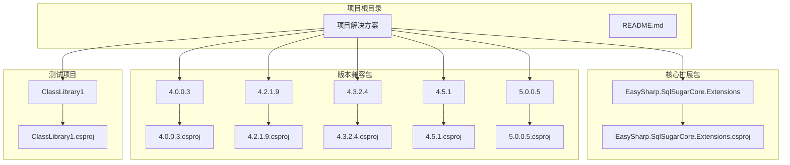
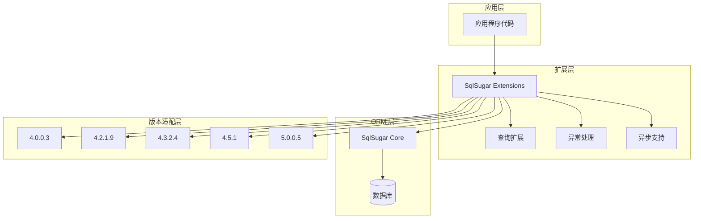
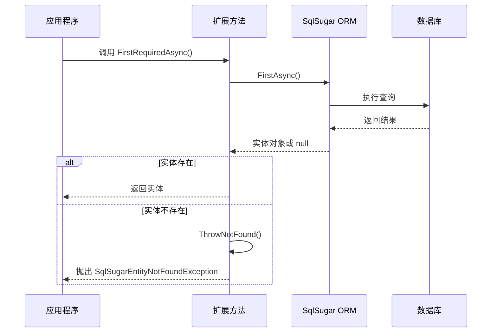
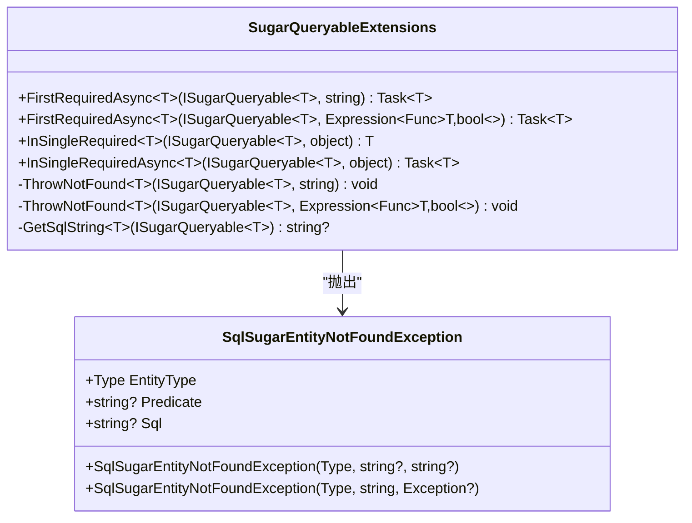
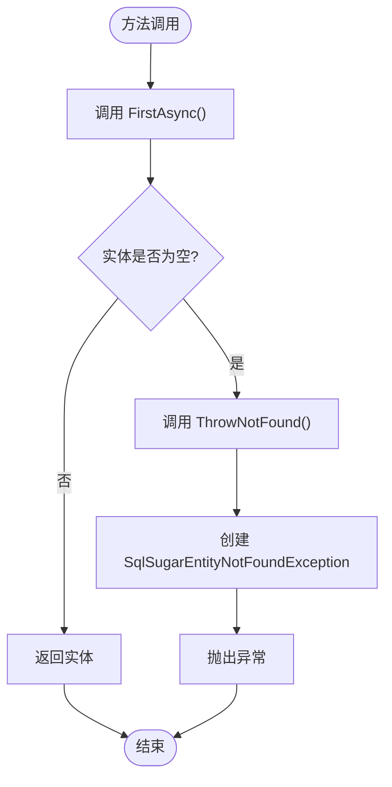
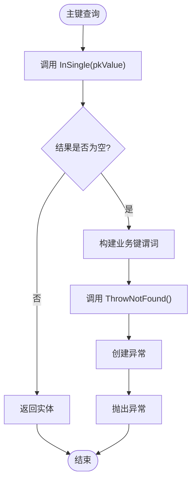
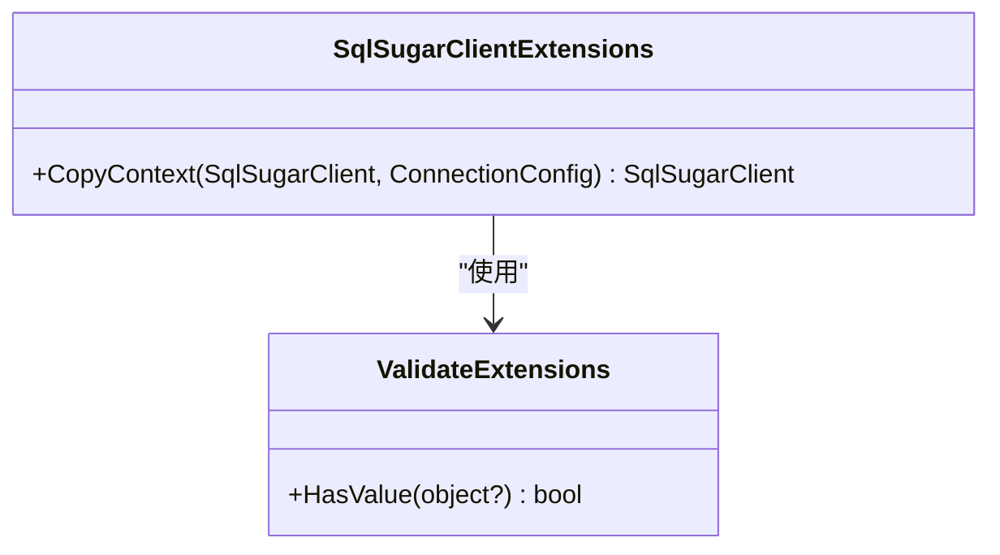
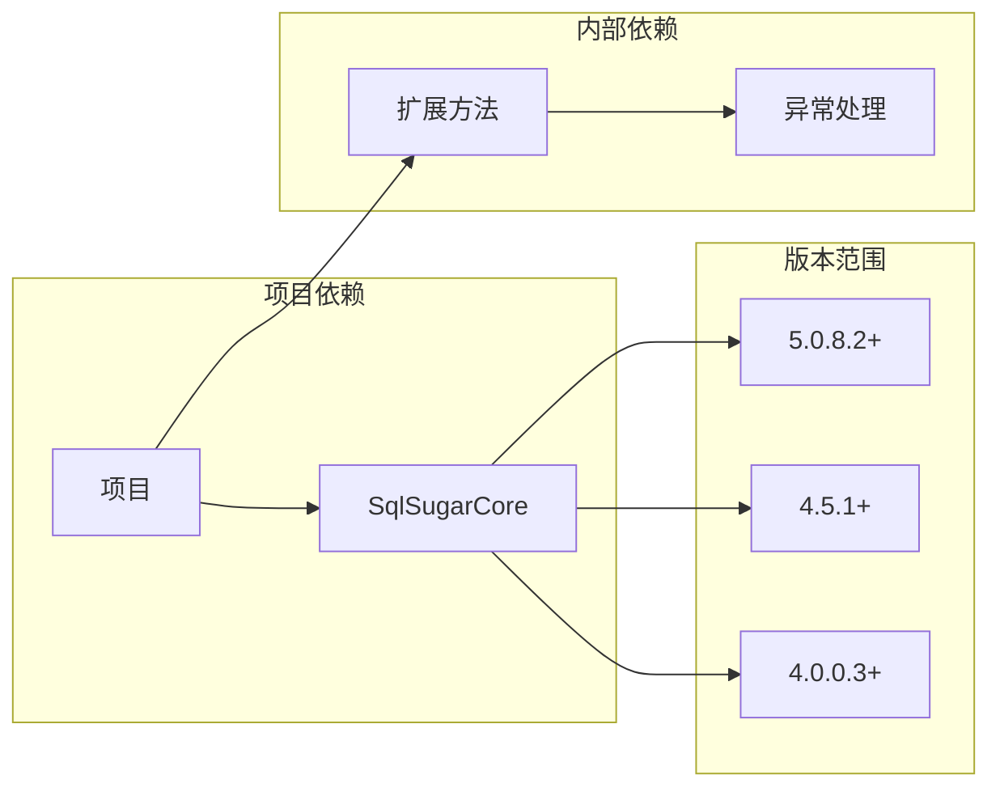

# EasySharp.SqlSugarCore.Extensions 项目概述

<cite>
**本文档中引用的文件**
- [README.md](file://README.md)
- [SugarQueryableExtensions.cs](file://EasySharp.SqlSugarCore.Extensions/SugarQueryableExtensions.cs)
- [EntityNotFoundException.cs](file://EasySharp.SqlSugarCore.Extensions/EntityNotFoundException.cs)
- [SqlSugarClientExtensions.cs](file://EasySharp.SqlSugarCore.Extensions.4.0.0.3/SqlSugarClientExtensions.cs)
- [SugarQueryableExtensions.cs](file://EasySharp.SqlSugarCore.Extensions.4.2.1.9/SugarQueryableExtensions.cs)
- [ValidateExtensions.cs](file://EasySharp.SqlSugarCore.Extensions.4.5.1/ValidateExtensions.cs)
- [Class1.cs](file://ClassLibrary1/Class1.cs)
- [EasySharp.SqlSugarCore.Extensions.csproj](file://EasySharp.SqlSugarCore.Extensions/EasySharp.SqlSugarCore.Extensions.csproj)
- [EasySharp.SqlSugarCore.Extensions.4.0.0.3.csproj](file://EasySharp.SqlSugarCore.Extensions.4.0.0.3/EasySharp.SqlSugarCore.Extensions.4.0.0.3.csproj)
- [EasySharp.SqlSugarCore.Extensions.4.5.1.csproj](file://EasySharp.SqlSugarCore.Extensions.4.5.1/EasySharp.SqlSugarCore.Extensions.4.5.1.csproj)
</cite>

## 目录
1. [简介](#简介)
2. [项目结构](#项目结构)
3. [核心组件](#核心组件)
4. [架构概览](#架构概览)
5. [详细组件分析](#详细组件分析)
6. [依赖关系分析](#依赖关系分析)
7. [性能考虑](#性能考虑)
8. [故障排除指南](#故障排除指南)
9. [结论](#结论)

## 简介

EasySharp.SqlSugarCore.Extensions 是一个专门为 SqlSugar ORM 提供扩展功能的 .NET 库。该项目的核心价值在于通过提供强类型的查询扩展方法，显著简化了数据库查询操作并增强了错误处理能力。

### 主要设计理念

- **强类型安全**：所有扩展方法都保持编译时类型安全，避免运行时类型转换错误
- **明确的契约**：通过 `FirstRequiredAsync` 和 `InSingleRequired` 等方法明确表达查询意图
- **丰富的异常信息**：当实体未找到时，提供包含实体类型、查询条件和 SQL 语句的详细异常信息
- **异步优先**：所有核心方法都提供异步版本，支持现代异步编程模式
- **向后兼容**：针对不同版本的 SqlSugar 提供兼容包，确保广泛的适用性

### 核心优势

1. **简化查询逻辑**：避免重复编写空值检查和异常处理代码
2. **增强错误诊断**：提供详细的上下文信息帮助快速定位问题
3. **类型安全保障**：编译时检查确保查询结果的确定性
4. **异步性能优化**：充分利用异步 I/O 提升应用响应性

## 项目结构

项目采用多版本兼容的目录结构设计，每个版本都有独立的实现和配置文件：



**图表来源**
- [README.md:1-117](file://README.md#L1-L117)
- [EasySharp.SqlSugarCore.Extensions.csproj:1-13](file://EasySharp.SqlSugarCore.Extensions/EasySharp.SqlSugarCore.Extensions.csproj#L1-L13)

### 版本兼容性矩阵

| 包名 | SqlSugar 版本 | 目标框架 | 特性 |
|------|--------------|----------|------|
| EasySharp.SqlSugarCore.Extensions | 5.0.8.2+ | netstandard2.1 | 最新功能，完整支持 |
| EasySharp.SqlSugarCore.Extensions.5.0.0.5 | 5.0.0.5 | netstandard2.1 | 稳定版本支持 |
| EasySharp.SqlSugarCore.Extensions.4.5.1 | 4.5.1 | netstandard2.0 | 中等版本支持 |
| EasySharp.SqlSugarCore.Extensions.4.3.2.4 | 4.3.2.4 | netstandard2.0 | 传统版本支持 |
| EasySharp.SqlSugarCore.Extensions.4.2.1.9 | 4.2.1.9 | netstandard1.6 | 老版本支持 |
| EasySharp.SqlSugarCore.Extensions.4.0.0.3 | 4.0.0.3 | netstandard1.6 | 最老版本支持 |

**章节来源**
- [README.md:28-38](file://README.md#L28-L38)
- [EasySharp.SqlSugarCore.Extensions.4.0.0.3.csproj:1-15](file://EasySharp.SqlSugarCore.Extensions.4.0.0.3/EasySharp.SqlSugarCore.Extensions.4.0.0.3.csproj#L1-L15)

## 核心组件

### 查询扩展方法

项目的核心是 `SugarQueryableExtensions` 类，提供了以下关键扩展方法：

#### 强类型查询方法

1. **FirstRequiredAsync<T>()** - 获取第一条记录，不存在则抛出异常
2. **FirstRequiredAsync<T>(Expression)** - 根据条件获取第一条记录，不存在则抛出异常  
3. **InSingleRequired<T>(object)** - 根据主键获取记录，不存在则抛出异常
4. **InSingleRequiredAsync<T>(object)** - 异步根据主键获取记录，不存在则抛出异常

#### 异常处理机制

项目实现了专门的异常类 `SqlSugarEntityNotFoundException`，提供以下信息：
- **EntityType**: 实体类型信息
- **Predicate**: 查询条件表达式
- **Sql**: 执行的 SQL 语句

**章节来源**
- [SugarQueryableExtensions.cs:7-94](file://EasySharp.SqlSugarCore.Extensions/SugarQueryableExtensions.cs#L7-L94)
- [EntityNotFoundException.cs:6-79](file://EasySharp.SqlSugarCore.Extensions/EntityNotFoundException.cs#L6-L79)

## 架构概览

项目采用分层架构设计，通过扩展方法的方式增强 SqlSugar ORM 的功能：



**图表来源**
- [SugarQueryableExtensions.cs:1-94](file://EasySharp.SqlSugarCore.Extensions/SugarQueryableExtensions.cs#L1-L94)
- [EntityNotFoundException.cs:1-79](file://EasySharp.SqlSugarCore.Extensions/EntityNotFoundException.cs#L1-L79)

### 数据流架构



**图表来源**
- [SugarQueryableExtensions.cs:9-52](file://EasySharp.SqlSugarCore.Extensions/SugarQueryableExtensions.cs#L9-L52)

## 详细组件分析

### SugarQueryableExtensions 类分析

该类是项目的核心组件，提供了所有扩展查询功能：

#### 类结构图



**图表来源**
- [SugarQueryableExtensions.cs:7-94](file://EasySharp.SqlSugarCore.Extensions/SugarQueryableExtensions.cs#L7-L94)
- [EntityNotFoundException.cs:6-79](file://EasySharp.SqlSugarCore.Extensions/EntityNotFoundException.cs#L6-L79)

#### 核心方法实现分析

##### FirstRequiredAsync 方法族

这些方法确保查询结果的存在性，提供强类型保证：



**图表来源**
- [SugarQueryableExtensions.cs:9-29](file://EasySharp.SqlSugarCore.Extensions/SugarQueryableExtensions.cs#L9-L29)

##### InSingleRequired 方法族

专门用于主键查询的扩展方法：



**图表来源**
- [SugarQueryableExtensions.cs:32-52](file://EasySharp.SqlSugarCore.Extensions/SugarQueryableExtensions.cs#L32-L52)

**章节来源**
- [SugarQueryableExtensions.cs:1-94](file://EasySharp.SqlSugarCore.Extensions/SugarQueryableExtensions.cs#L1-L94)

### SqlSugarEntityNotFoundException 异常类

这是一个专门设计的异常类，提供详细的错误信息：

#### 异常属性分析

| 属性名 | 类型 | 描述 | 用途 |
|--------|------|------|------|
| EntityType | Type | 发生错误的实体类型 | 帮助识别错误实体 |
| Predicate | string? | 导致错误的查询条件 | 快速定位查询问题 |
| Sql | string? | 实际执行的 SQL 语句 | 调试和性能分析 |

#### 异常消息构建机制

异常类实现了智能的消息构建逻辑，包含以下特性：

1. **长度限制**：查询条件最多 200 字符，SQL 语句最多 500 字符
2. **截断处理**：超过长度限制时自动截断并添加省略号
3. **格式化输出**：提供清晰的多行错误信息

**章节来源**
- [EntityNotFoundException.cs:1-79](file://EasySharp.SqlSugarCore.Extensions/EntityNotFoundException.cs#L1-L79)

### 版本兼容性扩展

不同版本的项目包含了特定的功能扩展：

#### SqlSugarClientExtensions

为早期版本提供客户端复制功能：



**图表来源**
- [SqlSugarClientExtensions.cs:3-12](file://EasySharp.SqlSugarCore.Extensions.4.0.0.3/SqlSugarClientExtensions.cs#L3-L12)
- [ValidateExtensions.cs:5-11](file://EasySharp.SqlSugarCore.Extensions.4.5.1/ValidateExtensions.cs#L5-L11)

**章节来源**
- [SqlSugarClientExtensions.cs:1-15](file://EasySharp.SqlSugarCore.Extensions.4.0.0.3/SqlSugarClientExtensions.cs#L1-L15)
- [ValidateExtensions.cs:1-13](file://EasySharp.SqlSugarCore.Extensions.4.5.1/ValidateExtensions.cs#L1-L13)

## 依赖关系分析

### 外部依赖

项目对外部依赖的管理体现了良好的软件工程实践：



**图表来源**
- [EasySharp.SqlSugarCore.Extensions.csproj:9-11](file://EasySharp.SqlSugarCore.Extensions/EasySharp.SqlSugarCore.Extensions.csproj#L9-L11)
- [EasySharp.SqlSugarCore.Extensions.4.0.0.3.csproj:10-12](file://EasySharp.SqlSugarCore.Extensions.4.0.0.3/EasySharp.SqlSugarCore.Extensions.4.0.0.3.csproj#L10-L12)

### 内部模块依赖

项目内部模块之间的依赖关系相对简单，主要体现为：

1. **核心扩展依赖异常处理**：扩展方法依赖专门的异常类
2. **版本兼容性**：不同版本项目相互独立，无直接依赖
3. **测试项目**：ClassLibrary1 作为简单的使用示例

**章节来源**
- [EasySharp.SqlSugarCore.Extensions.csproj:1-13](file://EasySharp.SqlSugarCore.Extensions/EasySharp.SqlSugarCore.Extensions.csproj#L1-L13)
- [Class1.cs:1-15](file://ClassLibrary1/Class1.cs#L1-L15)

## 性能考虑

### 异步操作优化

项目充分考虑了异步编程的性能优势：

1. **非阻塞 I/O**：所有核心查询方法都提供异步版本
2. **连接池利用**：异步操作充分利用 SqlSugar 的连接池机制
3. **内存效率**：避免不必要的对象创建和字符串拼接

### SQL 生成安全性

项目在生成 SQL 语句时采用了安全措施：

1. **异常容错**：`GetSqlString` 方法包含 try-catch 保护
2. **参数化查询**：通过 SqlSugar 的内置机制防止 SQL 注入
3. **查询优化**：避免重复的 SQL 生成调用

### 内存管理

异常类实现了序列化支持，便于跨应用域传递：

1. **Serializable 特性**：支持异常对象的序列化
2. **资源清理**：正确处理异常对象的生命周期
3. **性能影响最小化**：仅在需要时才生成详细的 SQL 信息

## 故障排除指南

### 常见问题及解决方案

#### 1. 实体未找到异常

**症状**：调用 `FirstRequiredAsync` 或 `InSingleRequired` 时抛出 `SqlSugarEntityNotFoundException`

**诊断步骤**：
1. 检查查询条件是否正确
2. 验证数据库中是否存在匹配的记录
3. 查看异常中的 SQL 语句进行调试

**解决方案**：
```csharp
try
{
    var user = await db.Queryable<User>()
        .FirstRequiredAsync(u => u.Id == 999);
}
catch (SqlSugarEntityNotFoundException ex)
{
    // 记录详细日志
    Console.WriteLine($"实体类型: {ex.EntityType}");
    Console.WriteLine($"查询条件: {ex.Predicate}");
    Console.WriteLine($"SQL: {ex.Sql}");
}
```

#### 2. 版本兼容性问题

**症状**：在特定版本的 SqlSugar 中无法使用某些功能

**解决方案**：
- 选择与目标 SqlSugar 版本匹配的扩展包
- 检查项目文件中的版本范围配置

#### 3. 异步操作超时

**症状**：异步查询长时间无响应

**诊断方法**：
1. 检查数据库连接状态
2. 验证网络连接稳定性
3. 监控数据库服务器性能

**章节来源**
- [README.md:70-90](file://README.md#L70-L90)
- [EntityNotFoundException.cs:53-77](file://EasySharp.SqlSugarCore.Extensions/EntityNotFoundException.cs#L53-L77)

## 结论

EasySharp.SqlSugarCore.Extensions 是一个设计精良的 ORM 扩展库，它通过以下方式为开发者提供了显著的价值：

### 技术优势

1. **强类型安全**：编译时保证查询结果的存在性
2. **丰富的错误信息**：详细的异常上下文帮助快速定位问题
3. **异步优先**：现代化的异步编程支持
4. **版本兼容**：覆盖从 SqlSugar 4.0 到 5.0 的广泛版本范围

### 适用场景

- **企业级应用开发**：需要强类型安全和详细错误处理的大型项目
- **微服务架构**：异步查询提升服务间通信效率
- **高并发系统**：优化的异步操作支持高负载场景
- **遗留系统升级**：渐进式采用现代异步编程模式

### 设计哲学

项目体现了现代 .NET 开发的最佳实践：
- **关注点分离**：扩展功能与核心 ORM 解耦
- **接口一致性**：提供统一的 API 设计
- **向后兼容**：确保长期可用性
- **性能优先**：在功能性和性能之间取得平衡

对于初学者，该项目提供了清晰的使用模式和丰富的示例；对于有经验的开发者，它提供了足够的灵活性和性能优化空间。通过合理使用这些扩展方法，可以显著提升数据访问层的代码质量和开发效率。