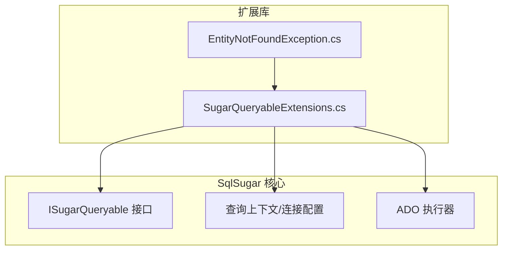
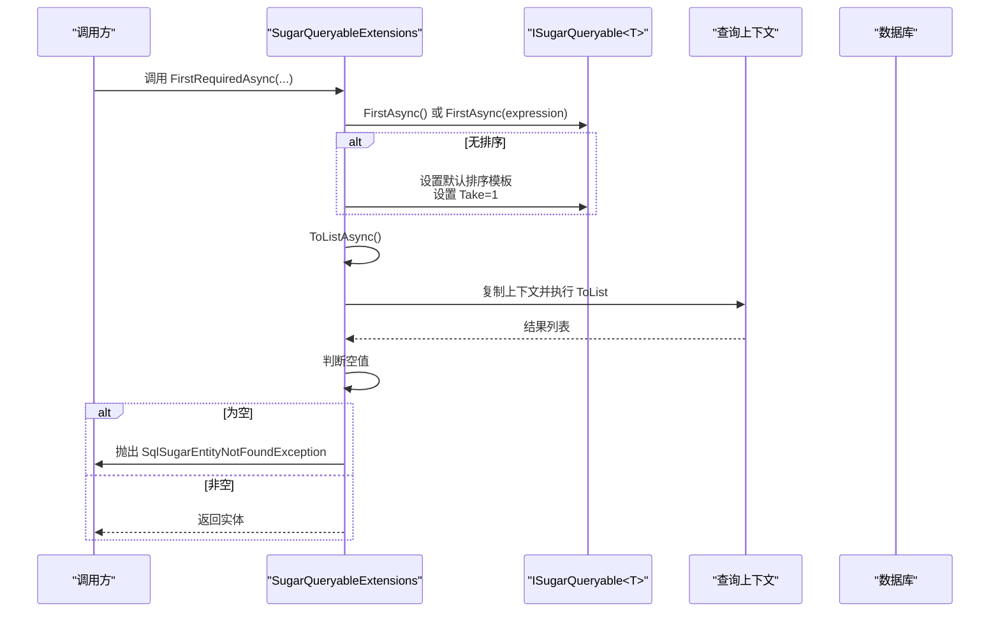
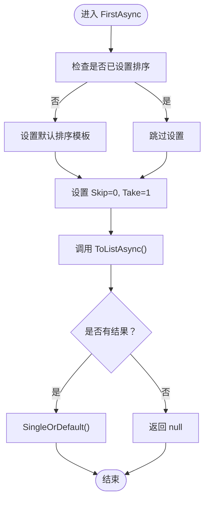
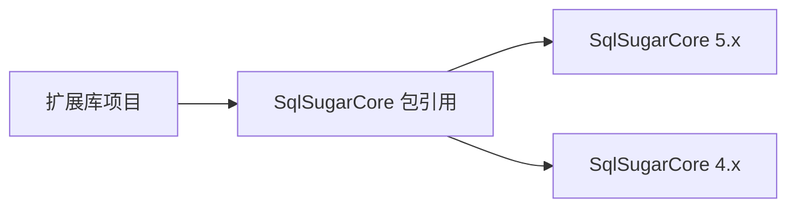

# 性能优化

<cite>
**本文引用的文件**   
- [SugarQueryableExtensions.cs](file://EasySharp.SqlSugarCore.Extensions/SugarQueryableExtensions.cs)
- [EntityNotFoundException.cs](file://EasySharp.SqlSugarCore.Extensions/EntityNotFoundException.cs)
- [SugarQueryableExtensions.cs（4.0.0.3）](file://EasySharp.SqlSugarCore.Extensions.4.0.0.3/SugarQueryableExtensions.cs)
- [EntityNotFoundException.cs（4.0.0.3）](file://EasySharp.SqlSugarCore.Extensions.4.0.0.3/EntityNotFoundException.cs)
- [SugarQueryableExtensions.cs（4.2.1.9）](file://EasySharp.SqlSugarCore.Extensions.4.2.1.9/SugarQueryableExtensions.cs)
- [EntityNotFoundException.cs（4.2.1.9）](file://EasySharp.SqlSugarCore.Extensions.4.2.1.9/EntityNotFoundException.cs)
- [SugarQueryableExtensions.cs（4.3.2.4）](file://EasySharp.SqlSugarCore.Extensions.4.3.2.4/SugarQueryableExtensions.cs)
- [EntityNotFoundException.cs（4.3.2.4）](file://EasySharp.SqlSugarCore.Extensions.4.3.2.4/EntityNotFoundException.cs)
- [SugarQueryableExtensions.cs（4.5.1）](file://EasySharp.SqlSugarCore.Extensions.4.5.1/SugarQueryableExtensions.cs)
- [EntityNotFoundException.cs（4.5.1）](file://EasySharp.SqlSugarCore.Extensions.4.5.1/EntityNotFoundException.cs)
- [README.md](file://README.md)
- [EasySharp.SqlSugarCore.Extensions.csproj](file://EasySharp.SqlSugarCore.Extensions/EasySharp.SqlSugarCore.Extensions.csproj)
- [EasySharp.SqlSugarCore.Extensions.4.5.1.csproj](file://EasySharp.SqlSugarCore.Extensions.4.5.1/EasySharp.SqlSugarCore.Extensions.4.5.1.csproj)
</cite>

## 目录
1. [简介](#简介)
2. [项目结构](#项目结构)
3. [核心组件](#核心组件)
4. [架构总览](#架构总览)
5. [详细组件分析](#详细组件分析)
6. [依赖分析](#依赖分析)
7. [性能考虑](#性能考虑)
8. [故障排查指南](#故障排查指南)
9. [结论](#结论)
10. [附录](#附录)

## 简介
本指南聚焦于 EasySharp.SqlSugarCore.Extensions 在查询性能方面的优化策略与最佳实践，围绕异步查询、查询构建器优化、内存与垃圾回收、缓存策略、性能监控与调优以及不同查询模式的对比展开。文档以仓库中的扩展方法实现为依据，结合 SqlSugar ORM 的查询执行机制，给出可操作的优化建议与流程图示。

## 项目结构
该项目为 SqlSugar ORM 的扩展库，提供强类型扩展方法，增强查询健壮性与可观测性，并在多个 SqlSugar 版本上保持兼容。核心扩展集中在查询扩展类中，异常类型用于统一未命中场景的错误信息输出。

图表来源
- [SugarQueryableExtensions.cs:1-94](file://EasySharp.SqlSugarCore.Extensions/SugarQueryableExtensions.cs#L1-L94)
- [EntityNotFoundException.cs:1-79](file://EasySharp.SqlSugarCore.Extensions/EntityNotFoundException.cs#L1-L79)

章节来源
- [README.md:1-117](file://README.md#L1-L117)
- [EasySharp.SqlSugarCore.Extensions.csproj:1-13](file://EasySharp.SqlSugarCore.Extensions/EasySharp.SqlSugarCore.Extensions.csproj#L1-L13)
- [EasySharp.SqlSugarCore.Extensions.4.5.1.csproj:1-14](file://EasySharp.SqlSugarCore.Extensions.4.5.1/EasySharp.SqlSugarCore.Extensions.4.5.1.csproj#L1-L14)

## 核心组件
- 异步查询扩展
  - FirstAsync：在无排序时自动设置默认排序模板、限制返回条数为 1，再通过 ToListAsync 获取首条记录；适合“只取一条”的场景，避免全表扫描。
  - FirstAsync(Expression)：基于 Where 条件后委托给 FirstAsync。
  - InSingleAsync：先 In 过滤，再 ToListAsync，最后 SingleOrDefault，适合主键或唯一键定位。
  - ToListAsync：内部复制查询上下文，启动独立任务执行 ToList，避免阻塞当前线程。
- 强约束查询
  - FirstRequiredAsync / FirstRequiredAsync(Expression)：若查询为空，抛出包含实体类型、谓词与 SQL 的详细异常。
  - InSingleRequired / InSingleRequiredAsync：主键约束查询，空值即抛异常。
- 异常信息
  - SqlSugarEntityNotFoundException：包含 EntityType、Predicate、Sql 字段，便于快速定位问题。

章节来源
- [SugarQueryableExtensions.cs:9-52](file://EasySharp.SqlSugarCore.Extensions/SugarQueryableExtensions.cs#L9-L52)
- [SugarQueryableExtensions.cs:76-90](file://EasySharp.SqlSugarCore.Extensions/SugarQueryableExtensions.cs#L76-L90)
- [EntityNotFoundException.cs:13-22](file://EasySharp.SqlSugarCore.Extensions/EntityNotFoundException.cs#L13-L22)
- [README.md:92-110](file://README.md#L92-L110)

## 架构总览
下图展示了扩展方法在查询链路中的位置与调用关系，以及异常信息的生成路径。

图表来源
- [SugarQueryableExtensions.cs:9-52](file://EasySharp.SqlSugarCore.Extensions/SugarQueryableExtensions.cs#L9-L52)
- [SugarQueryableExtensions.cs:108-157](file://EasySharp.SqlSugarCore.Extensions/SugarQueryableExtensions.cs#L108-L157)
- [EntityNotFoundException.cs:53-77](file://EasySharp.SqlSugarCore.Extensions/EntityNotFoundException.cs#L53-L77)

## 详细组件分析

### 组件一：异步查询与执行机制
- FirstAsync
  - 自动设置排序与分页参数，仅取一条，减少网络与内存开销。
  - 通过 ToListAsync 获取集合，再取单一元素，保证一致性。
- FirstAsync(Expression)
  - 先 Where 再 FirstAsync，逻辑清晰且可复用。
- InSingleAsync
  - 先 In 过滤，再 ToListAsync，最后 SingleOrDefault，避免 N+1 场景下的重复查询。
- ToListAsync
  - 复制查询上下文，启用独立任务执行 ToList，避免阻塞当前线程，提升并发吞吐。

图表来源
- [SugarQueryableExtensions.cs:149-157](file://EasySharp.SqlSugarCore.Extensions/SugarQueryableExtensions.cs#L149-L157)

章节来源
- [SugarQueryableExtensions.cs:144-157](file://EasySharp.SqlSugarCore.Extensions/SugarQueryableExtensions.cs#L144-L157)
- [SugarQueryableExtensions.cs:108-117](file://EasySharp.SqlSugarCore.Extensions/SugarQueryableExtensions.cs#L108-L117)
- [SugarQueryableExtensions.cs:119-142](file://EasySharp.SqlSugarCore.Extensions/SugarQueryableExtensions.cs#L119-L142)

### 组件二：查询构建器优化技巧
- 合理使用 Where 条件
  - 将过滤条件前置到 Where，避免在应用层二次筛选，减少网络与内存压力。
  - 对高频过滤字段建立索引，配合 FirstAsync/InSingleAsync 提升命中率。
- 避免 N+1 查询
  - 使用 InSingleAsync 对主键批量查询，减少循环逐条查询带来的多次往返。
  - 对关联数据使用 Join 或子查询一次性拉取，降低查询次数。
- 控制返回列
  - 优先使用 Select 指定必要字段，减少序列化与传输开销。
- 分页与排序
  - 明确排序键，避免 FirstAsync 在无序情况下产生额外排序成本。
  - 合理设置 Take/ Skip，避免一次性拉取大量数据。

章节来源
- [SugarQueryableExtensions.cs:144-157](file://EasySharp.SqlSugarCore.Extensions/SugarQueryableExtensions.cs#L144-L157)
- [SugarQueryableExtensions.cs（4.0.0.3）:101-106](file://EasySharp.SqlSugarCore.Extensions.4.0.0.3/SugarQueryableExtensions.cs#L101-L106)
- [SugarQueryableExtensions.cs（4.2.1.9）:101-106](file://EasySharp.SqlSugarCore.Extensions.4.2.1.9/SugarQueryableExtensions.cs#L101-L106)
- [SugarQueryableExtensions.cs（4.3.2.4）:101-106](file://EasySharp.SqlSugarCore.Extensions.4.3.2.4/SugarQueryableExtensions.cs#L101-L106)
- [SugarQueryableExtensions.cs（4.5.1）:99-104](file://EasySharp.SqlSugarCore.Extensions.4.5.1/SugarQueryableExtensions.cs#L99-L104)

### 组件三：内存使用与垃圾回收优化
- 控制结果集大小
  - 使用 Take=1 或明确的 Top/limit，避免一次性加载整表。
  - 对大对象字段按需选择，减少序列化与 GC 压力。
- 减少中间对象
  - 避免在查询链中频繁创建临时集合，尽量使用流式或分页方式。
- 异步执行降低阻塞
  - ToListAsync 通过独立任务执行，释放主线程，降低阻塞与上下文切换成本。
- 上下文复制的代价
  - CopyQueryable 会复制查询构建器与参数，适用于并发场景；在高并发下应评估上下文复制的开销与连接池容量。

章节来源
- [SugarQueryableExtensions.cs:108-117](file://EasySharp.SqlSugarCore.Extensions/SugarQueryableExtensions.cs#L108-L117)
- [SugarQueryableExtensions.cs:119-142](file://EasySharp.SqlSugarCore.Extensions/SugarQueryableExtensions.cs#L119-L142)

### 组件四：缓存策略（扩展库不内置，可结合外部技术）
- 应用层缓存
  - 对热点查询结果进行短期缓存（如内存缓存），结合缓存失效策略与并发更新。
- 数据库侧缓存
  - 使用查询缓存或计划缓存（取决于数据库能力），减少重复解析与执行成本。
- 缓存键设计
  - 基于完整查询参数（含排序、过滤、分页）生成稳定键，避免误命中。
- 注意事项
  - 缓存穿透：对空结果也做短时缓存。
  - 缓存雪崩：加入随机抖动，分散过期时间。
  - 缓存一致性：写操作后主动失效相关缓存键。

（本节为通用实践，不直接对应具体源码）

### 组件五：性能监控与调优
- SQL 观察
  - 使用 ToSqlString 输出实际执行 SQL，核对索引使用与过滤条件是否生效。
- 日志与事件
  - 启用 SqlSugar 的日志事件，观察执行耗时与参数绑定情况。
- 基准测试建议
  - 测试场景
    - 单条查询（FirstAsync vs InSingleAsync）
    - 大结果集分页（ToListAsync 与分页参数）
    - 主键批量查询（InSingleAsync 批量 vs 循环逐条）
  - 指标
    - 平均/99 分位延迟、吞吐、CPU/内存占用、GC 次数与暂停时间。
- 回归验证
  - 在每次变更后运行相同场景的基准测试，确保性能不退化。

章节来源
- [SugarQueryableExtensions.cs:76-90](file://EasySharp.SqlSugarCore.Extensions/SugarQueryableExtensions.cs#L76-L90)
- [EntityNotFoundException.cs:53-77](file://EasySharp.SqlSugarCore.Extensions/EntityNotFoundException.cs#L53-L77)

### 组件六：不同查询模式的性能对比与适用场景
- FirstAsync（无表达式）
  - 适用：仅需取一条记录，且无需复杂条件。
  - 优势：自动限制返回数量，减少网络与内存。
- FirstAsync（带表达式）
  - 适用：需要根据条件精确筛选。
  - 优势：先 Where 再 First，逻辑清晰。
- InSingleAsync
  - 适用：主键或唯一键定位，避免 N+1。
  - 优势：先 In 过滤，再一次性获取。
- ToListAsync
  - 适用：需要批量结果或后续应用层处理。
  - 优势：异步执行，避免阻塞；注意控制结果集大小。

章节来源
- [SugarQueryableExtensions.cs:144-157](file://EasySharp.SqlSugarCore.Extensions/SugarQueryableExtensions.cs#L144-L157)
- [SugarQueryableExtensions.cs:108-117](file://EasySharp.SqlSugarCore.Extensions/SugarQueryableExtensions.cs#L108-L117)
- [SugarQueryableExtensions.cs:101-106](file://EasySharp.SqlSugarCore.Extensions/SugarQueryableExtensions.cs#L101-L106)

## 依赖分析
- 直接依赖
  - SqlSugarCore：扩展方法基于 ISugarQueryable<T> 与查询上下文工作。
- 版本兼容
  - 不同版本的扩展文件在 API 表面保持一致，内部实现略有差异（如日志事件字段名等）。
- 项目目标框架
  - 5.x 扩展包面向 netstandard2.1，4.5.1 扩展包面向 netstandard2.0。

图表来源
- [EasySharp.SqlSugarCore.Extensions.csproj:9-11](file://EasySharp.SqlSugarCore.Extensions/EasySharp.SqlSugarCore.Extensions.csproj#L9-L11)
- [EasySharp.SqlSugarCore.Extensions.4.5.1.csproj:10-12](file://EasySharp.SqlSugarCore.Extensions.4.5.1/EasySharp.SqlSugarCore.Extensions.4.5.1.csproj#L10-L12)

章节来源
- [EasySharp.SqlSugarCore.Extensions.csproj:1-13](file://EasySharp.SqlSugarCore.Extensions/EasySharp.SqlSugarCore.Extensions.csproj#L1-L13)
- [EasySharp.SqlSugarCore.Extensions.4.5.1.csproj:1-14](file://EasySharp.SqlSugarCore.Extensions.4.5.1/EasySharp.SqlSugarCore.Extensions.4.5.1.csproj#L1-L14)

## 性能考虑
- 异步优先
  - 使用 FirstAsync/InSingleAsync/ToListAsync 替代同步版本，提高并发与响应性。
- 查询裁剪
  - 仅选择必要字段，减少序列化与网络传输。
- 索引与过滤
  - 在高频过滤字段上建立索引，配合 Where 条件提升命中率。
- 批量查询
  - 使用 InSingleAsync 批量主键查询，避免循环逐条导致的 N+1。
- 结果集控制
  - 明确 Take/ Skip，避免一次性加载过多数据。
- 上下文与连接
  - 合理利用 CopyQueryable 的异步上下文，注意连接池与日志事件对性能的影响。

（本节为通用指导，不直接引用具体源码片段）

## 故障排查指南
- 未找到实体异常
  - 当 FirstRequiredAsync/InSingleRequired 等方法查询为空时，抛出包含实体类型、谓词与 SQL 的异常，便于快速定位问题。
- SQL 观察
  - 使用 ToSqlString 获取实际执行 SQL，核对过滤条件与排序是否符合预期。
- 日志事件
  - 启用日志事件，观察执行耗时与参数绑定，辅助定位慢查询。

章节来源
- [EntityNotFoundException.cs:53-77](file://EasySharp.SqlSugarCore.Extensions/EntityNotFoundException.cs#L53-L77)
- [SugarQueryableExtensions.cs:76-90](file://EasySharp.SqlSugarCore.Extensions/SugarQueryableExtensions.cs#L76-L90)
- [README.md:70-90](file://README.md#L70-L90)

## 结论
通过合理运用异步查询扩展、优化查询构建器、控制结果集大小与内存占用、结合外部缓存与监控手段，可以在保证正确性的前提下显著提升查询性能。建议在生产环境中持续进行基准测试与监控，形成性能回归保障机制。

## 附录
- 快速参考
  - 异步单条查询：FirstAsync / FirstAsync(Expression) / FirstRequiredAsync
  - 异步主键查询：InSingleAsync / InSingleRequiredAsync / InSingleRequired
  - 异步批量查询：ToListAsync
  - SQL 观察：ToSqlString
  - 未命中异常：SqlSugarEntityNotFoundException（包含 EntityType/Predicate/Sql）

章节来源
- [README.md:92-110](file://README.md#L92-L110)
- [SugarQueryableExtensions.cs:9-52](file://EasySharp.SqlSugarCore.Extensions/SugarQueryableExtensions.cs#L9-L52)
- [SugarQueryableExtensions.cs:76-90](file://EasySharp.SqlSugarCore.Extensions/SugarQueryableExtensions.cs#L76-L90)