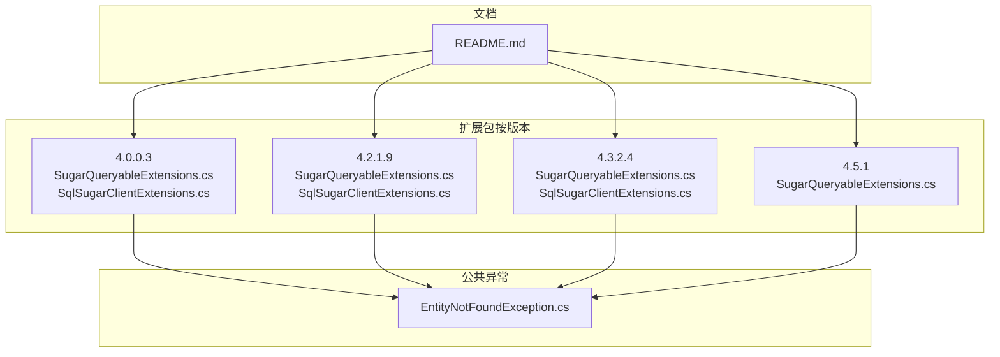
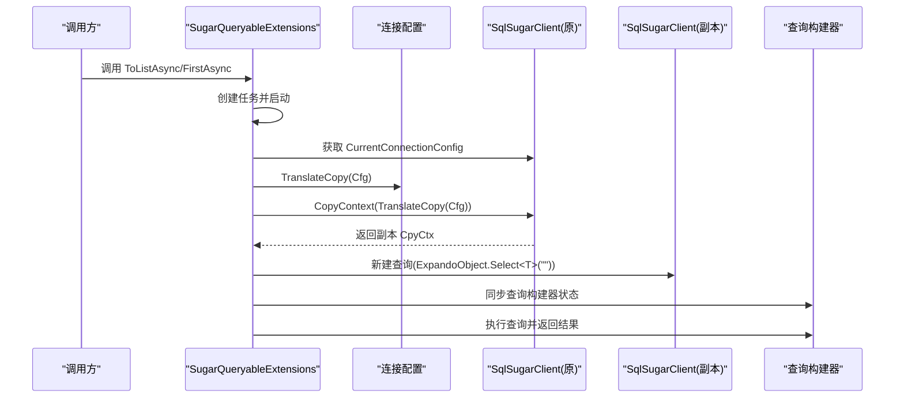
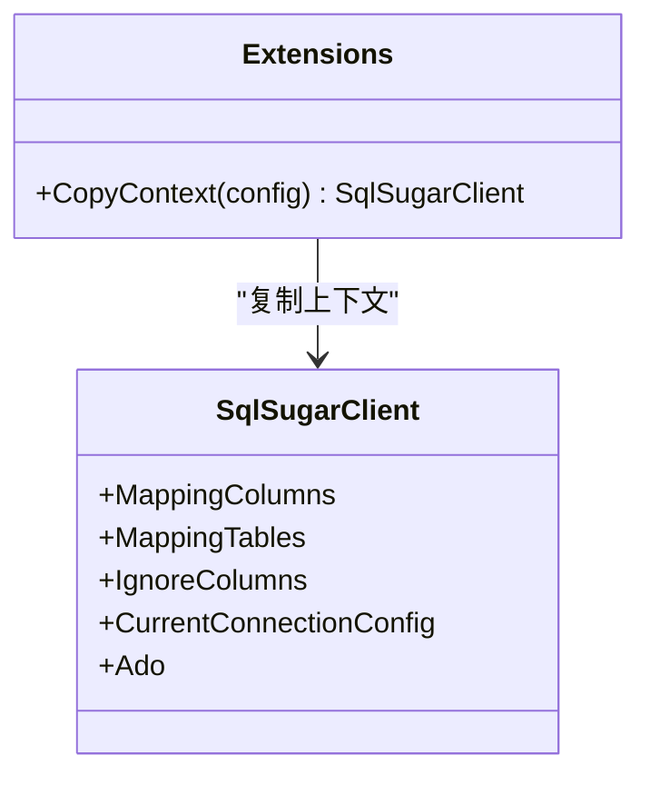
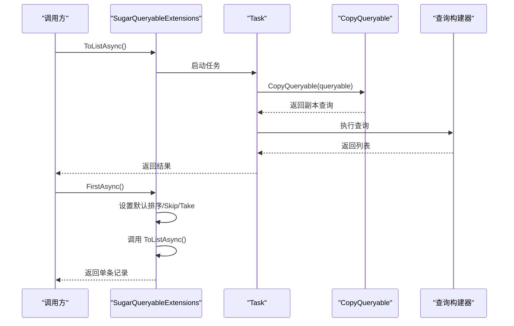
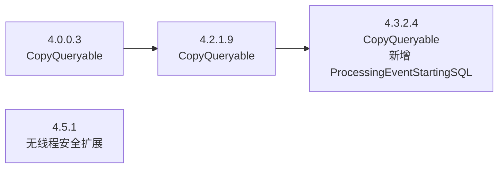

# 线程安全查询

<cite>
**本文引用的文件**
- [SugarQueryableExtensions.cs（4.0.0.3）](file://EasySharp.SqlSugarCore.Extensions.4.0.0.3/SugarQueryableExtensions.cs)
- [SqlSugarClientExtensions.cs（4.0.0.3）](file://EasySharp.SqlSugarCore.Extensions.4.0.0.3/SqlSugarClientExtensions.cs)
- [SugarQueryableExtensions.cs（4.2.1.9）](file://EasySharp.SqlSugarCore.Extensions.4.2.1.9/SugarQueryableExtensions.cs)
- [SqlSugarClientExtensions.cs（4.2.1.9）](file://EasySharp.SqlSugarCore.Extensions.4.2.1.9/SqlSugarClientExtensions.cs)
- [SugarQueryableExtensions.cs（4.3.2.4）](file://EasySharp.SqlSugarCore.Extensions.4.3.2.4/SugarQueryableExtensions.cs)
- [SqlSugarClientExtensions.cs（4.3.2.4）](file://EasySharp.SqlSugarCore.Extensions.4.3.2.4/SqlSugarClientExtensions.cs)
- [SugarQueryableExtensions.cs（4.5.1）](file://EasySharp.SqlSugarCore.Extensions.4.5.1/SugarQueryableExtensions.cs)
- [EntityNotFoundException.cs](file://EasySharp.SqlSugarCore.Extensions/EntityNotFoundException.cs)
- [README.md](file://README.md)
</cite>

## 目录
1. [简介](#简介)
2. [项目结构](#项目结构)
3. [核心组件](#核心组件)
4. [架构总览](#架构总览)
5. [详细组件分析](#详细组件分析)
6. [依赖关系分析](#依赖关系分析)
7. [性能考量](#性能考量)
8. [故障排查指南](#故障排查指南)
9. [结论](#结论)
10. [附录](#附录)

## 简介
本指南聚焦于 EasySharp.SqlSugarCore.Extensions 中的线程安全查询机制，系统阐述如何在多线程环境下安全地执行查询，避免并发冲突。重点包括：
- CopyQueryable 方法的工作原理：上下文复制、查询构建器状态同步、连接配置管理
- 通过 CopyContext 方法实现线程隔离，避免并发查询冲突
- 多线程环境下的最佳实践：查询上下文生命周期与资源清理
- 高并发场景下的使用示例路径与性能优化建议

## 项目结构
该仓库为 SqlSugar ORM 的扩展包，按版本分目录提供兼容实现；核心线程安全逻辑集中在 SugarQueryableExtensions 与 SqlSugarClientExtensions 中。



图表来源
- [README.md:1-117](file://README.md#L1-L117)
- [SugarQueryableExtensions.cs（4.0.0.3）:1-161](file://EasySharp.SqlSugarCore.Extensions.4.0.0.3/SugarQueryableExtensions.cs#L1-L161)
- [SqlSugarClientExtensions.cs（4.0.0.3）:1-15](file://EasySharp.SqlSugarCore.Extensions.4.0.0.3/SqlSugarClientExtensions.cs#L1-L15)
- [SugarQueryableExtensions.cs（4.2.1.9）:1-161](file://EasySharp.SqlSugarCore.Extensions.4.2.1.9/SugarQueryableExtensions.cs#L1-L161)
- [SqlSugarClientExtensions.cs（4.2.1.9）:1-15](file://EasySharp.SqlSugarCore.Extensions.4.2.1.9/SqlSugarClientExtensions.cs#L1-L15)
- [SugarQueryableExtensions.cs（4.3.2.4）:1-162](file://EasySharp.SqlSugarCore.Extensions.4.3.2.4/SugarQueryableExtensions.cs#L1-L162)
- [SqlSugarClientExtensions.cs（4.3.2.4）:1-15](file://EasySharp.SqlSugarCore.Extensions.4.3.2.4/SqlSugarClientExtensions.cs#L1-L15)
- [SugarQueryableExtensions.cs（4.5.1）:1-108](file://EasySharp.SqlSugarCore.Extensions.4.5.1/SugarQueryableExtensions.cs#L1-L108)
- [EntityNotFoundException.cs:1-79](file://EasySharp.SqlSugarCore.Extensions/EntityNotFoundException.cs#L1-L79)

章节来源
- [README.md:1-117](file://README.md#L1-L117)

## 核心组件
- 线程安全查询扩展：在多个版本中提供 ToListAsync、FirstAsync 等方法，内部通过复制查询上下文与查询构建器状态，确保并发安全。
- 上下文复制扩展：CopyContext 将连接配置与映射元数据复制到新客户端实例，避免共享状态导致的竞态。
- 异常增强：未找到实体时抛出包含实体类型、谓词与 SQL 的详细异常，便于定位问题。

章节来源
- [SugarQueryableExtensions.cs（4.0.0.3）:108-157](file://EasySharp.SqlSugarCore.Extensions.4.0.0.3/SugarQueryableExtensions.cs#L108-L157)
- [SugarQueryableExtensions.cs（4.2.1.9）:108-157](file://EasySharp.SqlSugarCore.Extensions.4.2.1.9/SugarQueryableExtensions.cs#L108-L157)
- [SugarQueryableExtensions.cs（4.3.2.4）:108-158](file://EasySharp.SqlSugarCore.Extensions.4.3.2.4/SugarQueryableExtensions.cs#L108-L158)
- [SqlSugarClientExtensions.cs（4.0.0.3）:5-12](file://EasySharp.SqlSugarCore.Extensions.4.0.0.3/SqlSugarClientExtensions.cs#L5-L12)
- [EntityNotFoundException.cs:13-51](file://EasySharp.SqlSugarCore.Extensions/EntityNotFoundException.cs#L13-L51)

## 架构总览
线程安全查询的关键流程如下：调用 ToListAsync/FirstAsync 时，内部启动一个任务，在该任务内复制当前查询上下文与查询构建器状态，然后在独立的上下文中执行查询，从而避免与其他线程共享状态引发的并发问题。



图表来源
- [SugarQueryableExtensions.cs（4.0.0.3）:108-157](file://EasySharp.SqlSugarCore.Extensions.4.0.0.3/SugarQueryableExtensions.cs#L108-L157)
- [SugarQueryableExtensions.cs（4.2.1.9）:108-157](file://EasySharp.SqlSugarCore.Extensions.4.2.1.9/SugarQueryableExtensions.cs#L108-L157)
- [SugarQueryableExtensions.cs（4.3.2.4）:108-158](file://EasySharp.SqlSugarCore.Extensions.4.3.2.4/SugarQueryableExtensions.cs#L108-L158)
- [SqlSugarClientExtensions.cs（4.0.0.3）:5-12](file://EasySharp.SqlSugarCore.Extensions.4.0.0.3/SqlSugarClientExtensions.cs#L5-L12)

## 详细组件分析

### CopyQueryable 方法工作原理
- 上下文复制：通过 CopyContext 将当前连接配置与映射元数据复制到新的 SqlSugarClient 实例，确保查询在独立上下文中执行。
- 查询构建器状态同步：将原查询构建器中的 Take、Skip、SelectValue、WhereInfos、JoinQueryInfos、Parameters 等状态复制到副本查询构建器，保证查询语义一致。
- 连接配置管理：设置 IsAutoCloseConnection 为 true，确保查询完成后自动关闭连接；同时复制日志事件开关与回调，保持日志一致性。

```mermaid
flowchart TD
Start(["进入 CopyQueryable"]) --> CfgCopy["复制连接配置<br/>TranslateCopy(CurrentConnectionConfig)"]
CfgCopy --> NewCtx["创建副本上下文<br/>CopyContext(cfg)"]
NewCtx --> SetFlags["设置 IsAutoCloseConnection=true<br/>复制日志事件配置"]
SetFlags --> NewQuery["新建查询<br/>Query(ExpandoObject).Select<T>(\"\")"]
NewQuery --> SyncState["同步查询构建器状态<br/>Take/Skip/Select/Where/Joins/Params"]
SyncState --> Done(["返回副本查询"])
```

图表来源
- [SugarQueryableExtensions.cs（4.0.0.3）:119-142](file://EasySharp.SqlSugarCore.Extensions.4.0.0.3/SugarQueryableExtensions.cs#L119-L142)
- [SugarQueryableExtensions.cs（4.2.1.9）:119-142](file://EasySharp.SqlSugarCore.Extensions.4.2.1.9/SugarQueryableExtensions.cs#L119-L142)
- [SugarQueryableExtensions.cs（4.3.2.4）:119-143](file://EasySharp.SqlSugarCore.Extensions.4.3.2.4/SugarQueryableExtensions.cs#L119-L143)

章节来源
- [SugarQueryableExtensions.cs（4.0.0.3）:119-142](file://EasySharp.SqlSugarCore.Extensions.4.0.0.3/SugarQueryableExtensions.cs#L119-L142)
- [SugarQueryableExtensions.cs（4.2.1.9）:119-142](file://EasySharp.SqlSugarCore.Extensions.4.2.1.9/SugarQueryableExtensions.cs#L119-L142)
- [SugarQueryableExtensions.cs（4.3.2.4）:119-143](file://EasySharp.SqlSugarCore.Extensions.4.3.2.4/SugarQueryableExtensions.cs#L119-L143)

### CopyContext 方法与线程隔离
- 作用：将当前客户端的连接配置、映射列、映射表、忽略列等元数据复制到新的 SqlSugarClient 实例，实现查询上下文的线程隔离。
- 关键点：副本上下文拥有独立的连接配置与日志事件设置，避免与其他线程共享状态造成竞态。



图表来源
- [SqlSugarClientExtensions.cs（4.0.0.3）:5-12](file://EasySharp.SqlSugarCore.Extensions.4.0.0.3/SqlSugarClientExtensions.cs#L5-L12)
- [SqlSugarClientExtensions.cs（4.2.1.9）:5-12](file://EasySharp.SqlSugarCore.Extensions.4.2.1.9/SqlSugarClientExtensions.cs#L5-L12)
- [SqlSugarClientExtensions.cs（4.3.2.4）:5-12](file://EasySharp.SqlSugarCore.Extensions.4.3.2.4/SqlSugarClientExtensions.cs#L5-L12)

章节来源
- [SqlSugarClientExtensions.cs（4.0.0.3）:5-12](file://EasySharp.SqlSugarCore.Extensions.4.0.0.3/SqlSugarClientExtensions.cs#L5-L12)
- [SqlSugarClientExtensions.cs（4.2.1.9）:5-12](file://EasySharp.SqlSugarCore.Extensions.4.2.1.9/SqlSugarClientExtensions.cs#L5-L12)
- [SqlSugarClientExtensions.cs（4.3.2.4）:5-12](file://EasySharp.SqlSugarCore.Extensions.4.3.2.4/SqlSugarClientExtensions.cs#L5-L12)

### 查询执行流程（ToListAsync/FirstAsync）
- ToListAsync：创建任务并在任务内调用 CopyQueryable，随后执行查询，最后返回结果。
- FirstAsync：若未设置排序，默认添加默认排序模板，设置 Skip=0、Take=1，再委托 ToListAsync 获取单条记录。



图表来源
- [SugarQueryableExtensions.cs（4.0.0.3）:108-157](file://EasySharp.SqlSugarCore.Extensions.4.0.0.3/SugarQueryableExtensions.cs#L108-L157)
- [SugarQueryableExtensions.cs（4.2.1.9）:108-157](file://EasySharp.SqlSugarCore.Extensions.4.2.1.9/SugarQueryableExtensions.cs#L108-L157)
- [SugarQueryableExtensions.cs（4.3.2.4）:108-158](file://EasySharp.SqlSugarCore.Extensions.4.3.2.4/SugarQueryableExtensions.cs#L108-L158)

章节来源
- [SugarQueryableExtensions.cs（4.0.0.3）:108-157](file://EasySharp.SqlSugarCore.Extensions.4.0.0.3/SugarQueryableExtensions.cs#L108-L157)
- [SugarQueryableExtensions.cs（4.2.1.9）:108-157](file://EasySharp.SqlSugarCore.Extensions.4.2.1.9/SugarQueryableExtensions.cs#L108-L157)
- [SugarQueryableExtensions.cs（4.3.2.4）:108-158](file://EasySharp.SqlSugarCore.Extensions.4.3.2.4/SugarQueryableExtensions.cs#L108-L158)

### 异常增强与诊断
- 未找到实体时抛出 SqlSugarEntityNotFoundException，包含实体类型、谓词与 SQL，便于快速定位问题。
- GetSqlString 在某些场景下 ToSql 可能失败时进行容错处理，避免影响主线程。

章节来源
- [EntityNotFoundException.cs:13-77](file://EasySharp.SqlSugarCore.Extensions/EntityNotFoundException.cs#L13-L77)
- [SugarQueryableExtensions.cs（4.0.0.3）:76-94](file://EasySharp.SqlSugarCore.Extensions.4.0.0.3/SugarQueryableExtensions.cs#L76-L94)
- [SugarQueryableExtensions.cs（4.2.1.9）:78-94](file://EasySharp.SqlSugarCore.Extensions.4.2.1.9/SugarQueryableExtensions.cs#L78-L94)
- [SugarQueryableExtensions.cs（4.3.2.4）:78-94](file://EasySharp.SqlSugarCore.Extensions.4.3.2.4/SugarQueryableExtensions.cs#L78-L94)

## 依赖关系分析
- 版本演进：从 4.0.0.3 到 4.3.2.4，CopyQueryable 中逐步增加对 ProcessingEventStartingSQL 的复制，以更好地隔离日志事件。
- 共享状态风险：若不复制上下文或查询构建器状态，多个线程可能共享同一上下文，导致查询状态互相覆盖，引发并发冲突。
- 生命周期管理：IsAutoCloseConnection=true 确保查询完成后自动释放连接，降低资源泄漏风险。



图表来源
- [SugarQueryableExtensions.cs（4.0.0.3）:119-142](file://EasySharp.SqlSugarCore.Extensions.4.0.0.3/SugarQueryableExtensions.cs#L119-L142)
- [SugarQueryableExtensions.cs（4.2.1.9）:119-142](file://EasySharp.SqlSugarCore.Extensions.4.2.1.9/SugarQueryableExtensions.cs#L119-L142)
- [SugarQueryableExtensions.cs（4.3.2.4）:119-143](file://EasySharp.SqlSugarCore.Extensions.4.3.2.4/SugarQueryableExtensions.cs#L119-L143)
- [SugarQueryableExtensions.cs（4.5.1）:1-108](file://EasySharp.SqlSugarCore.Extensions.4.5.1/SugarQueryableExtensions.cs#L1-L108)

章节来源
- [SugarQueryableExtensions.cs（4.0.0.3）:119-142](file://EasySharp.SqlSugarCore.Extensions.4.0.0.3/SugarQueryableExtensions.cs#L119-L142)
- [SugarQueryableExtensions.cs（4.2.1.9）:119-142](file://EasySharp.SqlSugarCore.Extensions.4.2.1.9/SugarQueryableExtensions.cs#L119-L142)
- [SugarQueryableExtensions.cs（4.3.2.4）:119-143](file://EasySharp.SqlSugarCore.Extensions.4.3.2.4/SugarQueryableExtensions.cs#L119-L143)
- [SugarQueryableExtensions.cs（4.5.1）:1-108](file://EasySharp.SqlSugarCore.Extensions.4.5.1/SugarQueryableExtensions.cs#L1-L108)

## 性能考量
- 线程隔离成本：每次查询都会复制上下文与查询构建器状态，带来额外的对象分配与拷贝开销。在高并发场景下应结合连接池与复用策略，减少频繁复制。
- 日志事件：复制日志事件开关与回调会增加少量 CPU 开销，若不需要日志可关闭以提升性能。
- 连接管理：启用 IsAutoCloseConnection=true 可避免连接泄漏，但频繁创建/销毁连接也会带来成本，需结合连接池参数调优。
- 查询优化：尽量避免在高频路径上重复构造复杂查询，可通过缓存常用查询片段或预编译查询减少构建时间。

## 故障排查指南
- 未找到实体异常：检查谓词与 SQL 是否符合预期，确认实体是否存在；异常对象包含实体类型、谓词与 SQL，便于定位。
- 并发冲突症状：若出现查询结果互相覆盖或状态异常，确认是否使用了线程安全的 ToListAsync/FirstAsync 扩展方法。
- 日志与诊断：开启日志事件有助于定位问题，但需权衡性能；必要时仅在调试阶段启用。

章节来源
- [EntityNotFoundException.cs:13-77](file://EasySharp.SqlSugarCore.Extensions/EntityNotFoundException.cs#L13-L77)
- [SugarQueryableExtensions.cs（4.0.0.3）:54-74](file://EasySharp.SqlSugarCore.Extensions.4.0.0.3/SugarQueryableExtensions.cs#L54-L74)
- [SugarQueryableExtensions.cs（4.2.1.9）:58-78](file://EasySharp.SqlSugarCore.Extensions.4.2.1.9/SugarQueryableExtensions.cs#L58-L78)
- [SugarQueryableExtensions.cs（4.3.2.4）:58-78](file://EasySharp.SqlSugarCore.Extensions.4.3.2.4/SugarQueryableExtensions.cs#L58-L78)

## 结论
通过 CopyQueryable 与 CopyContext 的组合，EasySharp.SqlSugarCore.Extensions 在多线程环境下提供了可靠的查询隔离机制。正确使用 ToListAsync/FirstAsync 等线程安全扩展，并配合连接池与日志策略，可在保证线程安全的前提下获得更佳的性能表现。

## 附录
- 使用示例参考路径（不含具体代码内容）：
  - [README.md:45-68](file://README.md#L45-L68)
- API 参考路径（不含具体代码内容）：
  - [README.md:96-101](file://README.md#L96-L101)