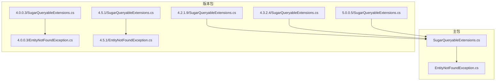
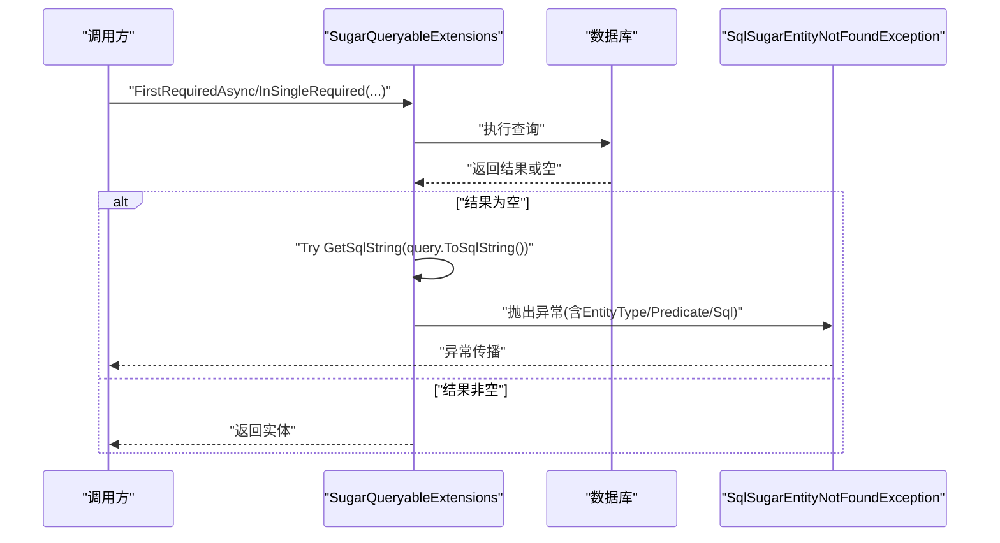
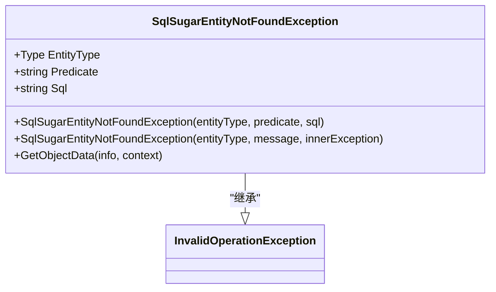
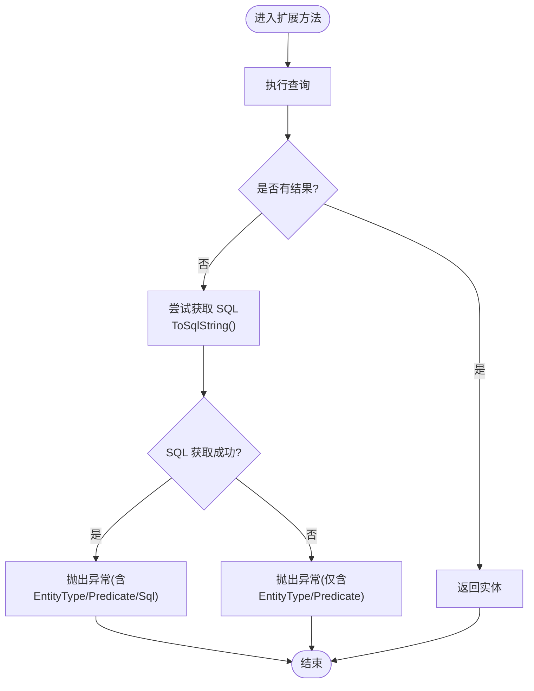
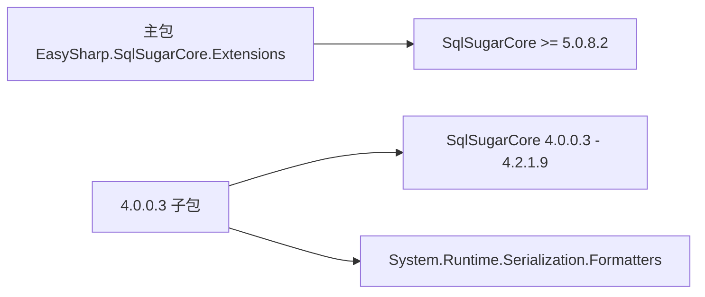
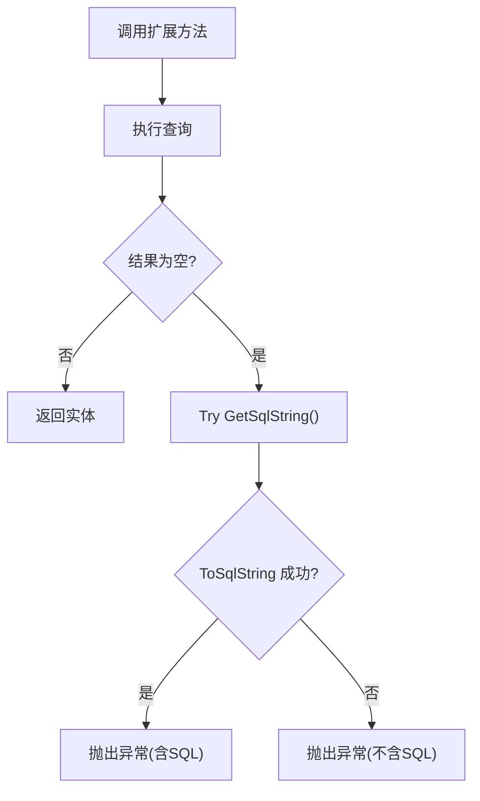

# 调试与故障排除

<cite>
**本文引用的文件**
- [README.md](file://README.md)
- [EntityNotFoundException.cs](file://EasySharp.SqlSugarCore.Extensions/EntityNotFoundException.cs)
- [SugarQueryableExtensions.cs](file://EasySharp.SqlSugarCore.Extensions/SugarQueryableExtensions.cs)
- [EntityNotFoundException.cs](file://EasySharp.SqlSugarCore.Extensions.4.0.0.3/EntityNotFoundException.cs)
- [SugarQueryableExtensions.cs](file://EasySharp.SqlSugarCore.Extensions.4.0.0.3/SugarQueryableExtensions.cs)
- [ValidateExtensions.cs](file://EasySharp.SqlSugarCore.Extensions.4.0.0.3/ValidateExtensions.cs)
- [EntityNotFoundException.cs](file://EasySharp.SqlSugarCore.Extensions.4.5.1/EntityNotFoundException.cs)
- [SugarQueryableExtensions.cs](file://EasySharp.SqlSugarCore.Extensions.4.5.1/SugarQueryableExtensions.cs)
- [SugarQueryableExtensions.cs](file://EasySharp.SqlSugarCore.Extensions.4.2.1.9/SugarQueryableExtensions.cs)
- [SugarQueryableExtensions.cs](file://EasySharp.SqlSugarCore.Extensions.4.3.2.4/SugarQueryableExtensions.cs)
- [SugarQueryableExtensions.cs](file://EasySharp.SqlSugarCore.Extensions.5.0.0.5/SugarQueryableExtensions.cs)
- [EasySharp.SqlSugarCore.Extensions.csproj](file://EasySharp.SqlSugarCore.Extensions/EasySharp.SqlSugarCore.Extensions.csproj)
- [EasySharp.SqlSugarCore.Extensions.4.0.0.3.csproj](file://EasySharp.SqlSugarCore.Extensions.4.0.0.3/EasySharp.SqlSugarCore.Extensions.4.0.0.3.csproj)
</cite>

## 目录
1. [简介](#简介)
2. [项目结构](#项目结构)
3. [核心组件](#核心组件)
4. [架构总览](#架构总览)
5. [详细组件分析](#详细组件分析)
6. [依赖分析](#依赖分析)
7. [性能考虑](#性能考虑)
8. [故障排除指南](#故障排除指南)
9. [结论](#结论)
10. [附录](#附录)

## 简介
本指南面向使用 EasySharp.SqlSugarCore.Extensions 的开发者，聚焦于调试与故障排除。内容涵盖：
- 如何通过 ToSqlString 获取执行 SQL 进行调试，以及 SQL 生成失败的容错处理
- SqlSugarEntityNotFoundException 异常的解读与定位技巧
- 常见问题（查询超时、内存泄漏、并发冲突）的排查步骤
- 日志记录与监控最佳实践（含 SqlSugarCore 日志开关）
- 调试工具与技巧（如 SQL Profiler、性能分析工具）
- 问题报告的标准格式与信息收集清单

## 项目结构
该项目为 SqlSugar ORM 的扩展库，提供强类型查询扩展方法与更友好的异常信息，并对多个 SqlSugar 版本提供兼容包。核心文件位于主包与各版本子包中，均包含异常定义与查询扩展方法。

图表来源
- [SugarQueryableExtensions.cs:1-94](file://EasySharp.SqlSugarCore.Extensions/SugarQueryableExtensions.cs#L1-L94)
- [EntityNotFoundException.cs:1-79](file://EasySharp.SqlSugarCore.Extensions/EntityNotFoundException.cs#L1-L79)
- [SugarQueryableExtensions.cs:1-161](file://EasySharp.SqlSugarCore.Extensions.4.0.0.3/SugarQueryableExtensions.cs#L1-L161)
- [EntityNotFoundException.cs:1-60](file://EasySharp.SqlSugarCore.Extensions.4.0.0.3/EntityNotFoundException.cs#L1-L60)
- [SugarQueryableExtensions.cs:1-161](file://EasySharp.SqlSugarCore.Extensions.4.2.1.9/SugarQueryableExtensions.cs#L1-L161)
- [SugarQueryableExtensions.cs:1-161](file://EasySharp.SqlSugarCore.Extensions.4.3.2.4/SugarQueryableExtensions.cs#L1-L161)
- [SugarQueryableExtensions.cs:1-108](file://EasySharp.SqlSugarCore.Extensions.4.5.1/SugarQueryableExtensions.cs#L1-L108)
- [EntityNotFoundException.cs:1-79](file://EasySharp.SqlSugarCore.Extensions.4.5.1/EntityNotFoundException.cs#L1-L79)
- [SugarQueryableExtensions.cs:1-99](file://EasySharp.SqlSugarCore.Extensions.5.0.0.5/SugarQueryableExtensions.cs#L1-L99)

章节来源
- [README.md:1-117](file://README.md#L1-L117)
- [EasySharp.SqlSugarCore.Extensions.csproj:1-13](file://EasySharp.SqlSugarCore.Extensions/EasySharp.SqlSugarCore.Extensions.csproj#L1-L13)
- [EasySharp.SqlSugarCore.Extensions.4.0.0.3.csproj:1-15](file://EasySharp.SqlSugarCore.Extensions.4.0.0.3/EasySharp.SqlSugarCore.Extensions.4.0.0.3.csproj#L1-L15)

## 核心组件
- 强类型查询扩展：提供 FirstRequiredAsync、InSingleRequired 等方法，确保查询结果存在；若不存在则抛出包含实体类型、查询条件与 SQL 的异常。
- 异常类型：SqlSugarEntityNotFoundException，包含 EntityType、Predicate、Sql 三个关键属性，便于快速定位问题。
- ToSqlString：在异常构造时尝试获取最终 SQL 字符串，作为调试依据；若生成失败则静默忽略，保证调用链稳定。

章节来源
- [README.md:39-110](file://README.md#L39-L110)
- [SugarQueryableExtensions.cs:9-94](file://EasySharp.SqlSugarCore.Extensions/SugarQueryableExtensions.cs#L9-L94)
- [EntityNotFoundException.cs:7-79](file://EasySharp.SqlSugarCore.Extensions/EntityNotFoundException.cs#L7-L79)

## 架构总览
下图展示异常抛出与 SQL 获取的关键流程，体现“查询 -> 判断 -> 异常 -> SQL 获取”的闭环。

图表来源
- [SugarQueryableExtensions.cs:9-94](file://EasySharp.SqlSugarCore.Extensions/SugarQueryableExtensions.cs#L9-L94)
- [EntityNotFoundException.cs:13-79](file://EasySharp.SqlSugarCore.Extensions/EntityNotFoundException.cs#L13-L79)

## 详细组件分析

### 组件一：异常类型 SqlSugarEntityNotFoundException
- 设计要点
  - 继承自 InvalidOperationException，语义明确
  - 提供两个构造函数：带详细上下文（实体类型、谓词、SQL）与带消息/内部异常
  - 支持序列化，便于跨边界传递
  - 内置消息截断策略，避免过长文本影响日志与显示
- 调试价值
  - 通过 EntityType 快速确认实体归属
  - 通过 Predicate 识别查询条件是否符合预期
  - 通过 Sql 定位具体 SQL 语句，结合数据库端执行计划分析

图表来源
- [EntityNotFoundException.cs:7-79](file://EasySharp.SqlSugarCore.Extensions/EntityNotFoundException.cs#L7-L79)
- [EntityNotFoundException.cs:6-60](file://EasySharp.SqlSugarCore.Extensions.4.0.0.3/EntityNotFoundException.cs#L6-L60)
- [EntityNotFoundException.cs:7-79](file://EasySharp.SqlSugarCore.Extensions.4.5.1/EntityNotFoundException.cs#L7-L79)

章节来源
- [EntityNotFoundException.cs:1-79](file://EasySharp.SqlSugarCore.Extensions/EntityNotFoundException.cs#L1-L79)
- [README.md:70-90](file://README.md#L70-L90)

### 组件二：查询扩展与 SQL 获取
- 关键方法
  - FirstRequiredAsync / FirstRequiredAsync(predicate)
  - InSingleRequired / InSingleRequiredAsync
  - 内部通过 TryGetSqlString 调用 query.ToSqlString() 获取 SQL
- 容错机制
  - ToSqlString 失败时捕获异常并忽略，保证异常抛出逻辑不受 SQL 生成失败影响
- 使用建议
  - 在开发环境开启日志，配合异常中的 SQL 字段进行核验
  - 对复杂表达式先拆分条件，缩小问题范围

图表来源
- [SugarQueryableExtensions.cs:9-94](file://EasySharp.SqlSugarCore.Extensions/SugarQueryableExtensions.cs#L9-L94)

章节来源
- [SugarQueryableExtensions.cs:1-94](file://EasySharp.SqlSugarCore.Extensions/SugarQueryableExtensions.cs#L1-L94)
- [README.md:39-90](file://README.md#L39-L90)

### 组件三：版本差异与演进
- 4.x 系列
  - 保留 ToSqlString 与 CopyQueryable 等实现细节
  - 异常类在 4.0 与 4.5 中略有字符串截断实现差异
- 5.x 系列
  - 简化了实现，保持 ToSqlString 与异常抛出逻辑一致
  - 依赖 SqlSugarCore 5.0.8.2+，目标框架 netstandard2.1

章节来源
- [SugarQueryableExtensions.cs:96-99](file://EasySharp.SqlSugarCore.Extensions.4.0.0.3/SugarQueryableExtensions.cs#L96-L99)
- [EntityNotFoundException.cs:34-58](file://EasySharp.SqlSugarCore.Extensions.4.0.0.3/EntityNotFoundException.cs#L34-L58)
- [EntityNotFoundException.cs:53-77](file://EasySharp.SqlSugarCore.Extensions.4.5.1/EntityNotFoundException.cs#L53-L77)
- [SugarQueryableExtensions.cs:92-95](file://EasySharp.SqlSugarCore.Extensions.5.0.0.5/SugarQueryableExtensions.cs#L92-L95)
- [EasySharp.SqlSugarCore.Extensions.csproj:10-10](file://EasySharp.SqlSugarCore.Extensions/EasySharp.SqlSugarCore.Extensions.csproj#L10-L10)
- [EasySharp.SqlSugarCore.Extensions.4.0.0.3.csproj:11-11](file://EasySharp.SqlSugarCore.Extensions.4.0.0.3/EasySharp.SqlSugarCore.Extensions.4.0.0.3.csproj#L11-L11)

## 依赖分析
- 主包依赖 SqlSugarCore >= 5.0.8.2，目标框架 netstandard2.1
- 4.0.0.3 版本包依赖 SqlSugarCore 在 4.0.0.3 到 4.2.1.9 之间，并引入序列化相关包
- 版本选择建议
  - 新项目优先使用 5.x 主包
  - 需要兼容旧版 SqlSugar 的项目可选择对应 4.x 子包

图表来源
- [EasySharp.SqlSugarCore.Extensions.csproj:10-10](file://EasySharp.SqlSugarCore.Extensions/EasySharp.SqlSugarCore.Extensions.csproj#L10-L10)
- [EasySharp.SqlSugarCore.Extensions.4.0.0.3.csproj:11-12](file://EasySharp.SqlSugarCore.Extensions.4.0.0.3/EasySharp.SqlSugarCore.Extensions.4.0.0.3.csproj#L11-L12)

章节来源
- [EasySharp.SqlSugarCore.Extensions.csproj:1-13](file://EasySharp.SqlSugarCore.Extensions/EasySharp.SqlSugarCore.Extensions.csproj#L1-L13)
- [EasySharp.SqlSugarCore.Extensions.4.0.0.3.csproj:1-15](file://EasySharp.SqlSugarCore.Extensions.4.0.0.3/EasySharp.SqlSugarCore.Extensions.4.0.0.3.csproj#L1-L15)

## 性能考虑
- SQL 生成开销
  - ToSqlString 会在异常路径触发，频繁抛出异常会带来额外成本。建议在开发阶段开启日志，生产阶段谨慎依赖异常路径输出 SQL
- 查询优化
  - 使用 FirstRequiredAsync 时尽量提供明确的过滤条件，避免全表扫描
  - 对高并发场景，结合数据库索引与连接池配置，减少锁竞争
- 日志与监控
  - 开启 SqlSugarCore 日志事件，观察实际执行 SQL 与耗时
  - 结合应用日志与 APM 工具（如 Application Insights、Prometheus+Grafana），建立端到端监控

## 故障排除指南

### 1. 如何使用 ToSqlString 获取执行 SQL 并进行调试
- 触发时机
  - 当查询无结果时，扩展方法会尝试调用 ToSqlString 获取 SQL 字符串，作为异常信息的一部分
- 容错机制
  - 若 SQL 生成失败（例如某些复杂表达式），会捕获异常并忽略，保证异常抛出逻辑不受影响
- 实操建议
  - 在开发环境开启 SqlSugarCore 日志事件，观察最终执行 SQL
  - 将异常中的 SQL 与本地缓存的 SQL 对比，确认是否因表达式转换导致差异

章节来源
- [SugarQueryableExtensions.cs:76-90](file://EasySharp.SqlSugarCore.Extensions/SugarQueryableExtensions.cs#L76-L90)
- [README.md:70-90](file://README.md#L70-L90)

### 2. SqlSugarEntityNotFoundException 异常调试技巧
- 异常信息解读
  - EntityType：实体类型，帮助确认查询对象
  - Predicate：查询条件（表达式或业务键），帮助确认筛选逻辑
  - Sql：最终 SQL 文本，用于核对生成是否正确
- 定位方法
  - 先核对 Predicate 是否与数据状态一致
  - 再核对 Sql 与数据库执行计划，检查索引、参数化、排序等
  - 若异常未携带 Sql，说明 SQL 生成失败，需简化表达式或改用显式条件

章节来源
- [EntityNotFoundException.cs:9-11](file://EasySharp.SqlSugarCore.Extensions/EntityNotFoundException.cs#L9-L11)
- [README.md:70-90](file://README.md#L70-L90)

### 3. 常见问题与排查步骤

- 查询超时
  - 现象：异常或超时日志频繁出现
  - 排查步骤
    - 检查 SQL 是否命中索引，必要时添加/调整索引
    - 分析 SQL 执行计划，关注大表扫描、隐式转换
    - 限制返回字段与分页，避免一次性加载过多数据
    - 调整数据库连接超时与命令超时设置
  - 监控建议：结合数据库性能视图与应用日志，定位慢查询

- 内存泄漏
  - 现象：长时间运行后内存持续增长
  - 排查步骤
    - 确认未持有大量查询结果集的引用
    - 检查是否存在未释放的 SqlSugar 上下文或连接
    - 使用内存分析工具（如 dotMemory、PerfView）定位热点对象
  - 防护建议：及时 Dispose SqlSugarClient，避免闭包捕获大对象

- 并发冲突
  - 现象：更新/删除失败或死锁
  - 排查步骤
    - 检查事务隔离级别与锁粒度
    - 使用乐观锁版本号或悲观锁策略
    - 减少事务范围，避免长事务
  - 监控建议：开启数据库锁等待与阻塞监控

### 4. 日志记录与监控最佳实践
- 启用 SqlSugarCore 日志
  - 在应用启动时配置日志事件开关与回调，记录 SQL、参数、耗时
  - 建议将日志输出到结构化日志系统（如 Serilog、Application Insights）
- 应用层日志
  - 在关键业务点记录请求上下文（TraceId）、实体类型、查询条件
  - 对异常统一包装，保留异常链路与上下文信息
- 监控指标
  - SQL 执行时间分布、错误率、超时率
  - 数据库连接池使用情况、队列等待时间

章节来源
- [SugarQueryableExtensions.cs:76-90](file://EasySharp.SqlSugarCore.Extensions/SugarQueryableExtensions.cs#L76-L90)

### 5. 调试工具与技巧
- SQL Profiler/Extended Events
  - 捕获真实 SQL 与参数，对比 ToSqlString 输出
  - 分析锁等待、阻塞与统计信息
- 性能分析工具
  - .NET Trace/PerfView：定位 CPU、GC、线程瓶颈
  - JetBrains dotMemory：排查内存泄漏与对象生命周期
- 单元测试与集成测试
  - 编写最小可复现用例，固定种子数据，验证异常路径
  - 使用测试数据库快照，确保环境一致性

### 6. 问题报告标准格式
- 基本信息
  - 包版本、SqlSugarCore 版本、目标框架
  - .NET 版本、数据库类型与版本
- 复现步骤
  - 最小化代码片段（不包含业务无关代码）
  - 明确输入条件与期望结果
- 日志与证据
  - 应用日志（含时间戳、TraceId）
  - 异常堆栈与异常属性（EntityType、Predicate、Sql）
  - 数据库端 SQL 与执行计划
- 补充信息
  - 索引列表、表统计信息
  - 连接字符串与环境配置节选

## 结论
通过 ToSqlString 与 SqlSugarEntityNotFoundException 的组合，可以快速定位查询问题。建议在开发阶段充分利用日志与 SQL Profiler，在生产阶段建立完善的监控与告警体系。遵循本文提供的排查步骤与报告模板，能够显著提升问题定位效率与修复质量。

## 附录

### A. ToSqlString 获取流程（代码级）

图表来源
- [SugarQueryableExtensions.cs:76-90](file://EasySharp.SqlSugarCore.Extensions/SugarQueryableExtensions.cs#L76-L90)

### B. 版本选择对照
- 主包（5.0.0.5+）：推荐新项目使用，依赖 SqlSugarCore >= 5.0.8.2
- 4.x 子包：按需兼容旧版 SqlSugar，注意依赖范围与序列化差异

章节来源
- [EasySharp.SqlSugarCore.Extensions.csproj:10-10](file://EasySharp.SqlSugarCore.Extensions/EasySharp.SqlSugarCore.Extensions.csproj#L10-L10)
- [EasySharp.SqlSugarCore.Extensions.4.0.0.3.csproj:11-11](file://EasySharp.SqlSugarCore.Extensions.4.0.0.3/EasySharp.SqlSugarCore.Extensions.4.0.0.3.csproj#L11-L11)