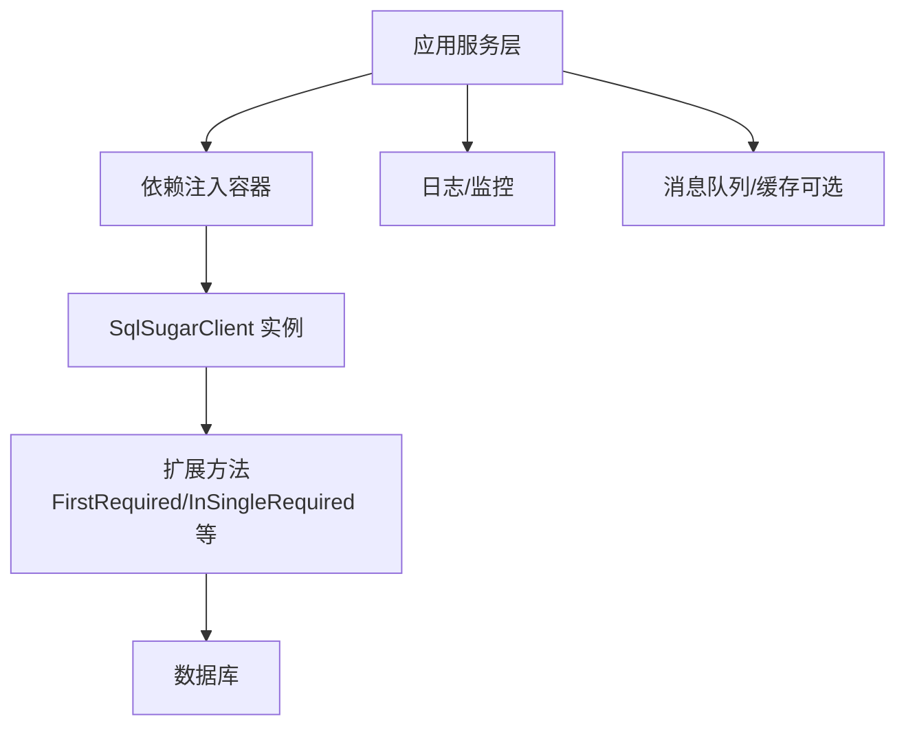
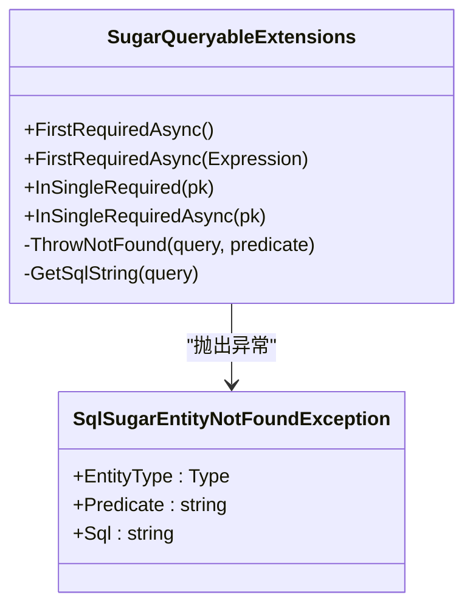
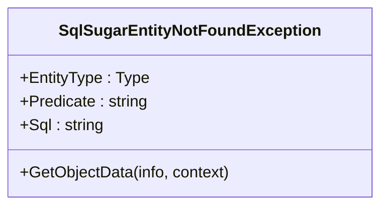
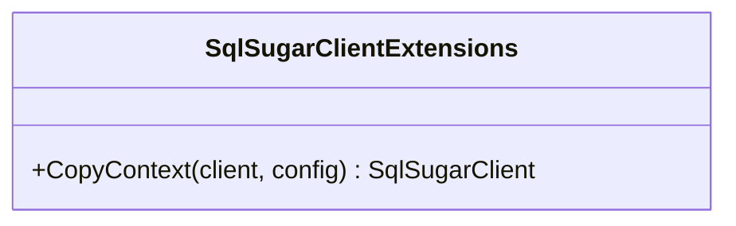
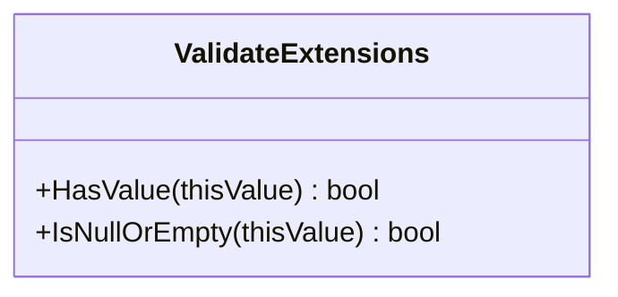
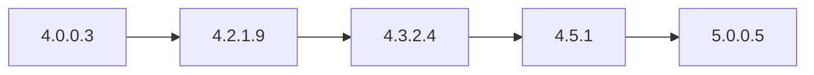
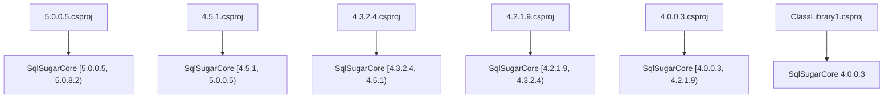

# 集成模式

<cite>
**本文引用的文件**
- [README.md](file://README.md)
- [SugarQueryableExtensions.cs](file://EasySharp.SqlSugarCore.Extensions/SugarQueryableExtensions.cs)
- [EntityNotFoundException.cs](file://EasySharp.SqlSugarCore.Extensions/EntityNotFoundException.cs)
- [SqlSugarClientExtensions.cs](file://ClassLibrary1/SqlSugarClientExtensions.cs)
- [ValidateExtensions.cs](file://ClassLibrary1/ValidateExtensions.cs)
- [SugarQueryableExtensions.cs（4.5.1）](file://EasySharp.SqlSugarCore.Extensions.4.5.1/SugarQueryableExtensions.cs)
- [EntityNotFoundException.cs（4.5.1）](file://EasySharp.SqlSugarCore.Extensions.4.5.1/EntityNotFoundException.cs)
- [ValidateExtensions.cs（4.5.1）](file://EasySharp.SqlSugarCore.Extensions.4.5.1/ValidateExtensions.cs)
- [SugarQueryableExtensions.cs（4.3.2.4）](file://EasySharp.SqlSugarCore.Extensions.4.3.2.4/SugarQueryableExtensions.cs)
- [EntityNotFoundException.cs（4.3.2.4）](file://EasySharp.SqlSugarCore.Extensions.4.3.2.4/EntityNotFoundException.cs)
- [SugarQueryableExtensions.cs（4.2.1.9）](file://EasySharp.SqlSugarCore.Extensions.4.2.1.9/SugarQueryableExtensions.cs)
- [SugarQueryableExtensions.cs（4.0.0.3）](file://EasySharp.SqlSugarCore.Extensions.4.0.0.3/SugarQueryableExtensions.cs)
- [SqlSugarClientExtensions.cs（4.0.0.3）](file://EasySharp.SqlSugarCore.Extensions.4.0.0.3/SqlSugarClientExtensions.cs)
- [EasySharp.SqlSugarCore.Extensions.csproj](file://EasySharp.SqlSugarCore.Extensions/EasySharp.SqlSugarCore.Extensions.csproj)
- [EasySharp.SqlSugarCore.Extensions.4.5.1.csproj](file://EasySharp.SqlSugarCore.Extensions.4.5.1/EasySharp.SqlSugarCore.Extensions.4.5.1.csproj)
- [EasySharp.SqlSugarCore.Extensions.4.3.2.4.csproj](file://EasySharp.SqlSugarCore.Extensions.4.3.2.4/EasySharp.SqlSugarCore.Extensions.4.3.2.4.csproj)
- [EasySharp.SqlSugarCore.Extensions.4.2.1.9.csproj](file://EasySharp.SqlSugarCore.Extensions.4.2.1.9/EasySharp.SqlSugarCore.Extensions.4.2.1.9.csproj)
- [EasySharp.SqlSugarCore.Extensions.4.0.0.3.csproj](file://EasySharp.SqlSugarCore.Extensions.4.0.0.3/EasySharp.SqlSugarCore.Extensions.4.0.0.3.csproj)
- [ClassLibrary1.csproj](file://ClassLibrary1/ClassLibrary1.csproj)
- [EasySharp.SqlSugar.Extensions.sln](file://EasySharp.SqlSugar.Extensions.sln)
</cite>

## 目录
1. [简介](#简介)
2. [项目结构](#项目结构)
3. [核心组件](#核心组件)
4. [架构总览](#架构总览)
5. [详细组件分析](#详细组件分析)
6. [依赖关系分析](#依赖关系分析)
7. [性能考量](#性能考量)
8. [故障排查指南](#故障排查指南)
9. [结论](#结论)
10. [附录](#附录)

## 简介
本指南面向在复杂系统中集成 EasySharp.SqlSugarCore.Extensions 的开发者，围绕以下目标展开：
- 与 ASP.NET Core 框架的集成：依赖注入配置、中间件集成与生命周期管理
- 与依赖注入容器的集成模式：注册方式与最佳实践
- 与单元测试框架的集成：测试数据库、Mock 对象与测试数据管理
- 微服务架构中的使用模式：分布式查询、服务间通信与一致性保障
- 与消息队列、缓存系统等基础设施的集成示例
- 版本兼容性与升级策略：如何在不同 SqlSugar 版本下安全演进

## 项目结构
该仓库包含多个版本的扩展包工程，以及一个核心扩展库与若干历史版本适配层。核心扩展库提供强类型查询扩展与异常增强；历史版本工程提供与旧版 SqlSugar 的兼容能力；另有工具类扩展与验证扩展。

```mermaid
graph TB
subgraph "核心扩展库"
CoreProj["EasySharp.SqlSugarCore.Extensions.csproj"]
CoreExt["SugarQueryableExtensions.cs"]
CoreEx["EntityNotFoundException.cs"]
CoreCli["SqlSugarClientExtensions.cs"]
CoreVal["ValidateExtensions.cs"]
end
subgraph "版本适配层"
V40["4.0.0.3.csproj<br/>SugarQueryableExtensions.cs<br/>SqlSugarClientExtensions.cs<br/>EntityNotFoundException.cs"]
V42["4.2.1.9.csproj<br/>SugarQueryableExtensions.cs"]
V43["4.3.2.4.csproj<br/>SugarQueryableExtensions.cs<br/>EntityNotFoundException.cs"]
V45["4.5.1.csproj<br/>SugarQueryableExtensions.cs<br/>EntityNotFoundException.cs<br/>ValidateExtensions.cs"]
V50["5.0.0.5.csproj<br/>SugarQueryableExtensions.cs<br/>EntityNotFoundException.cs"]
end
subgraph "工具与示例"
CL1["ClassLibrary1.csproj<br/>SqlSugarClientExtensions.cs<br/>ValidateExtensions.cs"]
SLN["EasySharp.SqlSugar.Extensions.sln"]
README["README.md"]
end
CoreProj --> CoreExt
CoreProj --> CoreEx
CoreProj --> CoreCli
CoreProj --> CoreVal
V40 --> V40Ext["SugarQueryableExtensions.cs"]
V40 --> V40Cli["SqlSugarClientExtensions.cs"]
V40 --> V40Ex["EntityNotFoundException.cs"]
V42 --> V42Ext["SugarQueryableExtensions.cs"]
V43 --> V43Ext["SugarQueryableExtensions.cs"]
V43 --> V43Ex["EntityNotFoundException.cs"]
V45 --> V45Ext["SugarQueryableExtensions.cs"]
V45 --> V45Ex["EntityNotFoundException.cs"]
V45 --> V45Val["ValidateExtensions.cs"]
V50 --> V50Ext["SugarQueryableExtensions.cs"]
V50 --> V50Ex["EntityNotFoundException.cs"]
CL1 --> CL1Cli["SqlSugarClientExtensions.cs"]
CL1 --> CL1Val["ValidateExtensions.cs"]
```

图表来源
- [EasySharp.SqlSugarCore.Extensions.csproj:1-13](file://EasySharp.SqlSugarCore.Extensions/EasySharp.SqlSugarCore.Extensions.csproj#L1-L13)
- [SugarQueryableExtensions.cs:1-94](file://EasySharp.SqlSugarCore.Extensions/SugarQueryableExtensions.cs#L1-L94)
- [EntityNotFoundException.cs:1-79](file://EasySharp.SqlSugarCore.Extensions/EntityNotFoundException.cs#L1-L79)
- [SqlSugarClientExtensions.cs:1-15](file://ClassLibrary1/SqlSugarClientExtensions.cs#L1-L15)
- [ValidateExtensions.cs:1-18](file://ClassLibrary1/ValidateExtensions.cs#L1-L18)
- [EasySharp.SqlSugarCore.Extensions.4.5.1.csproj:1-14](file://EasySharp.SqlSugarCore.Extensions.4.5.1/EasySharp.SqlSugarCore.Extensions.4.5.1.csproj#L1-L14)
- [EasySharp.SqlSugarCore.Extensions.4.3.2.4.csproj:1-14](file://EasySharp.SqlSugarCore.Extensions.4.3.2.4/EasySharp.SqlSugarCore.Extensions.4.3.2.4.csproj#L1-L14)
- [EasySharp.SqlSugarCore.Extensions.4.2.1.9.csproj:1-15](file://EasySharp.SqlSugarCore.Extensions.4.2.1.9/EasySharp.SqlSugarCore.Extensions.4.2.1.9.csproj#L1-L15)
- [EasySharp.SqlSugarCore.Extensions.4.0.0.3.csproj:1-15](file://EasySharp.SqlSugarCore.Extensions.4.0.0.3/EasySharp.SqlSugarCore.Extensions.4.0.0.3.csproj#L1-L15)
- [ClassLibrary1.csproj:1-15](file://ClassLibrary1/ClassLibrary1.csproj#L1-L15)
- [EasySharp.SqlSugar.Extensions.sln:1-17](file://EasySharp.SqlSugar.Extensions.sln#L1-L17)

章节来源
- [EasySharp.SqlSugar.Extensions.sln:1-17](file://EasySharp.SqlSugar.Extensions.sln#L1-L17)
- [README.md:1-117](file://README.md#L1-L117)

## 核心组件
- 强类型查询扩展：提供 FirstRequiredAsync、FirstRequiredAsync(带表达式)、InSingleRequired、InSingleRequiredAsync 等方法，确保查询结果存在，否则抛出包含实体类型、谓词与 SQL 的异常。
- 异常增强：SqlSugarEntityNotFoundException 提供 EntityType、Predicate、Sql 等属性，便于定位问题。
- 工具扩展：SqlSugarClientExtensions.CopyContext 用于复制上下文映射；ValidateExtensions 提供 HasValue/IsNullOrEmpty 等验证辅助。
- 多版本适配：为 SqlSugar 4.x 与 5.x 提供对应扩展与异常定义，保证在不同版本下的可用性。

章节来源
- [SugarQueryableExtensions.cs:1-94](file://EasySharp.SqlSugarCore.Extensions/SugarQueryableExtensions.cs#L1-L94)
- [EntityNotFoundException.cs:1-79](file://EasySharp.SqlSugarCore.Extensions/EntityNotFoundException.cs#L1-L79)
- [SqlSugarClientExtensions.cs:1-15](file://ClassLibrary1/SqlSugarClientExtensions.cs#L1-L15)
- [ValidateExtensions.cs:1-18](file://ClassLibrary1/ValidateExtensions.cs#L1-L18)
- [README.md:7-12](file://README.md#L7-L12)

## 架构总览
从集成视角看，扩展库通过 NuGet 包形式提供，核心扩展位于 netstandard 平台，配合不同 SqlSugar 版本的适配层。应用侧通常以依赖注入容器管理 SqlSugarClient 生命周期，并在服务层调用扩展方法进行强类型查询。

## 详细组件分析

### 组件一：强类型查询扩展（SugarQueryableExtensions）
- 能力概览
  - 异步首条查询：FirstRequiredAsync<T>()、FirstRequiredAsync<T>(Expression)
  - 主键查询：InSingleRequired<T>(object)、InSingleRequiredAsync<T>(object)
  - 异常增强：未命中时抛出 SqlSugarEntityNotFoundException，携带实体类型、谓词与 SQL
- 设计要点
  - 通过 ToSqlString 获取 SQL 字符串，便于异常信息输出
  - 在无法获取 SQL 的场景下进行容错处理
- 使用建议
  - 在需要“必须存在”的业务场景优先使用扩展方法
  - 结合异常捕获与日志记录，快速定位问题

图表来源
- [SugarQueryableExtensions.cs:1-94](file://EasySharp.SqlSugarCore.Extensions/SugarQueryableExtensions.cs#L1-L94)
- [EntityNotFoundException.cs:1-79](file://EasySharp.SqlSugarCore.Extensions/EntityNotFoundException.cs#L1-L79)

章节来源
- [SugarQueryableExtensions.cs:9-52](file://EasySharp.SqlSugarCore.Extensions/SugarQueryableExtensions.cs#L9-L52)
- [EntityNotFoundException.cs:9-22](file://EasySharp.SqlSugarCore.Extensions/EntityNotFoundException.cs#L9-L22)

### 组件二：异常增强（SqlSugarEntityNotFoundException）
- 属性与行为
  - 提供 EntityType、Predicate、Sql 三要素，便于诊断
  - 支持序列化，便于跨进程传播
  - 对过长的谓词与 SQL 进行截断，避免日志膨胀
- 最佳实践
  - 在全局异常处理中读取异常属性，统一记录到监控平台
  - 将异常信息与追踪 ID 关联，便于端到端排查

图表来源
- [EntityNotFoundException.cs:7-51](file://EasySharp.SqlSugarCore.Extensions/EntityNotFoundException.cs#L7-L51)

章节来源
- [EntityNotFoundException.cs:53-77](file://EasySharp.SqlSugarCore.Extensions/EntityNotFoundException.cs#L53-L77)

### 组件三：客户端上下文复制（SqlSugarClientExtensions）
- 能力概览
  - CopyContext：基于新连接配置复制客户端上下文，保留映射与忽略设置
- 使用场景
  - 在需要隔离或切换连接配置时，复制现有客户端上下文
  - 与多租户、分库分表等场景结合使用

图表来源
- [SqlSugarClientExtensions.cs:3-12](file://ClassLibrary1/SqlSugarClientExtensions.cs#L3-L12)

章节来源
- [SqlSugarClientExtensions.cs:5-11](file://ClassLibrary1/SqlSugarClientExtensions.cs#L5-L11)

### 组件四：验证扩展（ValidateExtensions）
- HasValue/IsNullOrEmpty：提供对象值的空值判断，兼容 DBNull 与空字符串
- 使用场景
  - 在查询前对输入参数进行预校验，减少无效请求

图表来源
- [ValidateExtensions.cs:5-15](file://ClassLibrary1/ValidateExtensions.cs#L5-L15)

章节来源
- [ValidateExtensions.cs:7-15](file://ClassLibrary1/ValidateExtensions.cs#L7-L15)

### 组件五：多版本适配（4.x 与 5.x）
- 版本矩阵
  - 4.0.0.3/4.2.1.9/4.3.2.4/4.5.1：适配 SqlSugar 4.x 不同小版本
  - 5.0.0.5：适配 SqlSugar 5.x
- 差异点
  - 4.x 版本中部分扩展方法（如 ToSqlString、InSingleAsync、ToListAsync）在后续版本中被移除或调整
  - 4.5.1/4.3.2.4/4.2.1.9/4.0.0.3 中的异常类与扩展类结构略有差异，需按版本选择对应包

图表来源
- [EasySharp.SqlSugarCore.Extensions.4.0.0.3.csproj:1-15](file://EasySharp.SqlSugarCore.Extensions.4.0.0.3/EasySharp.SqlSugarCore.Extensions.4.0.0.3.csproj#L1-L15)
- [EasySharp.SqlSugarCore.Extensions.4.2.1.9.csproj:1-15](file://EasySharp.SqlSugarCore.Extensions.4.2.1.9/EasySharp.SqlSugarCore.Extensions.4.2.1.9.csproj#L1-L15)
- [EasySharp.SqlSugarCore.Extensions.4.3.2.4.csproj:1-14](file://EasySharp.SqlSugarCore.Extensions.4.3.2.4/EasySharp.SqlSugarCore.Extensions.4.3.2.4.csproj#L1-L14)
- [EasySharp.SqlSugarCore.Extensions.4.5.1.csproj:1-14](file://EasySharp.SqlSugarCore.Extensions.4.5.1/EasySharp.SqlSugarCore.Extensions.4.5.1.csproj#L1-L14)
- [EasySharp.SqlSugarCore.Extensions.5.0.0.5.csproj:1-13](file://EasySharp.SqlSugarCore.Extensions.5.0.0.5/EasySharp.SqlSugarCore.Extensions.5.0.0.5.csproj#L1-L13)

章节来源
- [README.md:28-37](file://README.md#L28-L37)
- [SugarQueryableExtensions.cs（4.5.1）:94-105](file://EasySharp.SqlSugarCore.Extensions.4.5.1/SugarQueryableExtensions.cs#L94-L105)
- [EntityNotFoundException.cs（4.5.1）:45-51](file://EasySharp.SqlSugarCore.Extensions.4.5.1/EntityNotFoundException.cs#L45-L51)
- [ValidateExtensions.cs（4.5.1）:5-11](file://EasySharp.SqlSugarCore.Extensions.4.5.1/ValidateExtensions.cs#L5-L11)

## 依赖关系分析
- 核心依赖
  - SqlSugarCore：扩展库依赖 SqlSugarCore，版本范围在各工程文件中声明
- 版本约束
  - 5.0.0.5：SqlSugarCore 版本区间 [5.0.0.5, 5.0.8.2)
  - 4.5.1：SqlSugarCore 版本区间 [4.5.1, 5.0.0.5)
  - 4.3.2.4：SqlSugarCore 版本区间 [4.3.2.4, 4.5.1)
  - 4.2.1.9：SqlSugarCore 版本区间 [4.2.1.9, 4.3.2.4)
  - 4.0.0.3：SqlSugarCore 版本区间 [4.0.0.3, 4.2.1.9)
  - 4.0.0.3（ClassLibrary1）：SqlSugarCore 固定为 4.0.0.3
- 解决方案与工程组织
  - 解决方案文件包含多个工程，便于在不同版本间切换与对比

图表来源
- [EasySharp.SqlSugarCore.Extensions.5.0.0.5.csproj:9-11](file://EasySharp.SqlSugarCore.Extensions.5.0.0.5/EasySharp.SqlSugarCore.Extensions.5.0.0.5.csproj#L9-L11)
- [EasySharp.SqlSugarCore.Extensions.4.5.1.csproj:10-11](file://EasySharp.SqlSugarCore.Extensions.4.5.1/EasySharp.SqlSugarCore.Extensions.4.5.1.csproj#L10-L11)
- [EasySharp.SqlSugarCore.Extensions.4.3.2.4.csproj:10-11](file://EasySharp.SqlSugarCore.Extensions.4.3.2.4/EasySharp.SqlSugarCore.Extensions.4.3.2.4.csproj#L10-L11)
- [EasySharp.SqlSugarCore.Extensions.4.2.1.9.csproj:10-11](file://EasySharp.SqlSugarCore.Extensions.4.2.1.9/EasySharp.SqlSugarCore.Extensions.4.2.1.9.csproj#L10-L11)
- [EasySharp.SqlSugarCore.Extensions.4.0.0.3.csproj:10-11](file://EasySharp.SqlSugarCore.Extensions.4.0.0.3/EasySharp.SqlSugarCore.Extensions.4.0.0.3.csproj#L10-L11)
- [ClassLibrary1.csproj:10-12](file://ClassLibrary1/ClassLibrary1.csproj#L10-L12)

章节来源
- [EasySharp.SqlSugarCore.Extensions.csproj:9-11](file://EasySharp.SqlSugarCore.Extensions/EasySharp.SqlSugarCore.Extensions.csproj#L9-L11)
- [EasySharp.SqlSugar.Extensions.sln:6-16](file://EasySharp.SqlSugar.Extensions.sln#L6-L16)

## 性能考量
- 异步查询与上下文复制
  - 扩展方法均提供异步版本，建议在高并发场景优先使用异步 API
  - 上下文复制会带来额外开销，仅在必要时使用
- SQL 输出与异常信息
  - ToSqlString 用于异常信息输出，若查询构建复杂可能影响性能，建议在开发环境启用，生产环境谨慎使用
- 日志与监控
  - 建议将异常信息与追踪 ID 关联，避免重复日志与性能抖动

## 故障排查指南
- 常见问题
  - 未找到实体：捕获 SqlSugarEntityNotFoundException，检查 EntityType、Predicate、Sql 三要素
  - 版本不匹配：确认所选扩展包与 SqlSugarCore 版本范围一致
  - 查询构建冲突：4.x 某些扩展方法组合可能导致异常，参考对应版本的扩展定义
- 排查步骤
  - 开启日志，记录 SQL 与异常堆栈
  - 使用异常属性定位具体实体与条件
  - 在测试环境复现，逐步缩小范围

章节来源
- [EntityNotFoundException.cs:53-77](file://EasySharp.SqlSugarCore.Extensions/EntityNotFoundException.cs#L53-L77)
- [SugarQueryableExtensions.cs（4.5.1）:99-105](file://EasySharp.SqlSugarCore.Extensions.4.5.1/SugarQueryableExtensions.cs#L99-L105)

## 结论
本指南提供了 EasySharp.SqlSugarCore.Extensions 在多版本、多场景下的集成路径与最佳实践。通过强类型查询扩展与异常增强，开发者可以在保证业务正确性的同时提升可观测性与可维护性。在实际项目中，应结合自身 SqlSugar 版本与运行环境，选择合适的扩展包并遵循依赖注入与异常处理规范。

## 附录

### ASP.NET Core 集成要点
- 依赖注入配置
  - 将 SqlSugarClient 注册为单例或作用域实例，依据应用生命周期与连接池策略决定
  - 在服务层注入 ISugarQueryable<T> 或直接使用 db.Queryable<T>() 扩展方法
- 中间件集成
  - 可在中间件中记录请求与 SQL 执行时间，结合异常处理统一上报
- 生命周期管理
  - 避免在请求作用域内频繁创建/销毁客户端实例
  - 对于多租户或多数据库场景，使用 SqlSugarClientExtensions.CopyContext 进行上下文隔离

### 与依赖注入容器的集成模式
- 注册方式
  - 单例注册：适用于静态配置的单一数据库
  - 作用域注册：适用于多租户或动态连接配置
- 最佳实践
  - 将扩展方法封装为仓储接口，便于替换与测试
  - 使用工厂模式按需创建不同上下文实例

### 与单元测试框架的集成
- 测试数据库配置
  - 使用内存数据库或专用测试库（如 SQLite 内存模式）进行隔离测试
- Mock 对象使用
  - Mock SqlSugarClient 或扩展方法返回值，验证业务逻辑分支
- 测试数据管理
  - 使用迁移脚本或种子数据初始化测试环境，确保可重复性

### 微服务架构中的使用模式
- 分布式查询
  - 通过仓储接口抽象查询逻辑，避免直接暴露底层 ORM
- 服务间通信
  - 在事件驱动架构中，使用消息队列传递变更事件，触发本地缓存更新
- 一致性保证
  - 使用 Saga 模式或补偿事务，结合幂等设计与重试机制

### 与消息队列、缓存系统的集成示例
- 缓存集成
  - 在查询前尝试命中缓存，未命中再访问数据库；写入时同步清理缓存
- 消息队列
  - 将写操作产生的事件发布到消息队列，下游服务订阅并更新本地索引或缓存

### 版本兼容性与升级策略
- 版本选择
  - 优先选择与 SqlSugarCore 版本范围匹配的扩展包
  - 对于 4.x 场景，注意扩展方法的可用性差异（如 ToSqlString、InSingleAsync、ToListAsync）
- 升级策略
  - 先在测试环境验证扩展方法行为一致性
  - 渐进式替换旧版本包，逐步清理历史适配代码
  - 对异常信息与日志格式进行回归测试，确保可观测性不受影响

章节来源
- [README.md:28-37](file://README.md#L28-L37)
- [SugarQueryableExtensions.cs（4.5.1）:94-105](file://EasySharp.SqlSugarCore.Extensions.4.5.1/SugarQueryableExtensions.cs#L94-L105)
- [EntityNotFoundException.cs（4.5.1）:45-51](file://EasySharp.SqlSugarCore.Extensions.4.5.1/EntityNotFoundException.cs#L45-L51)
- [ValidateExtensions.cs（4.5.1）:5-11](file://EasySharp.SqlSugarCore.Extensions.4.5.1/ValidateExtensions.cs#L5-L11)