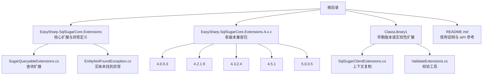
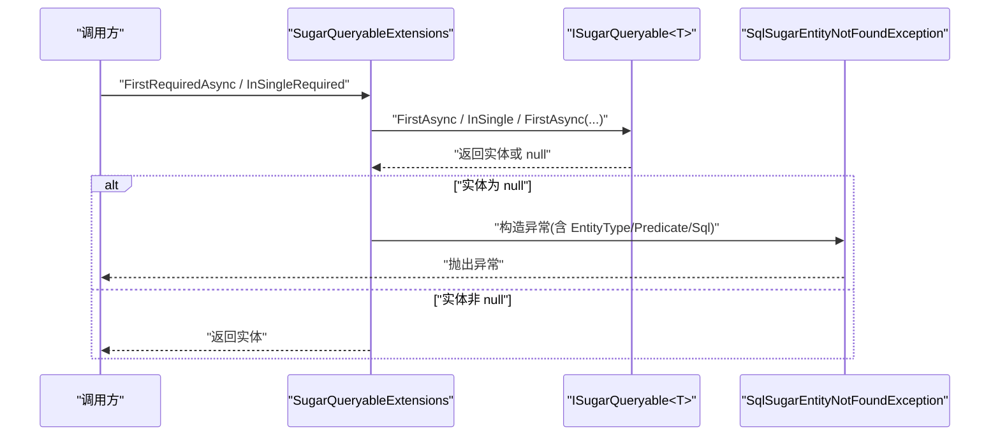
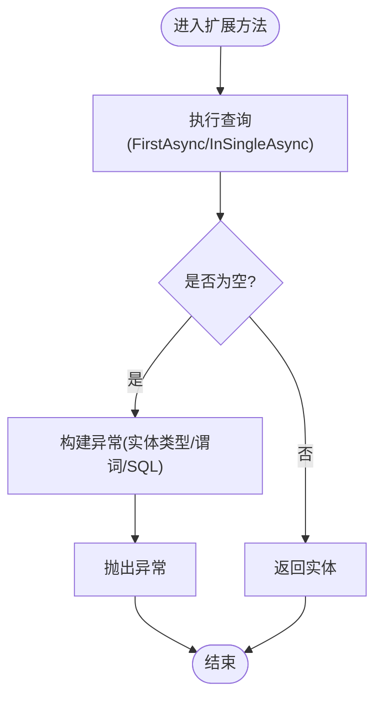
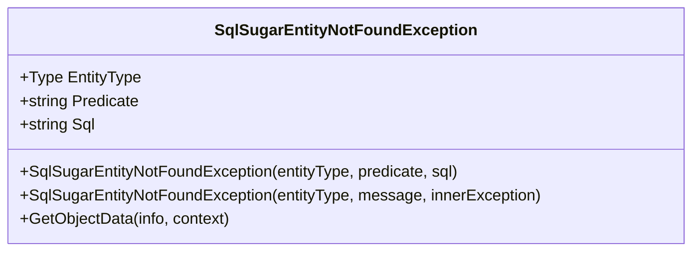
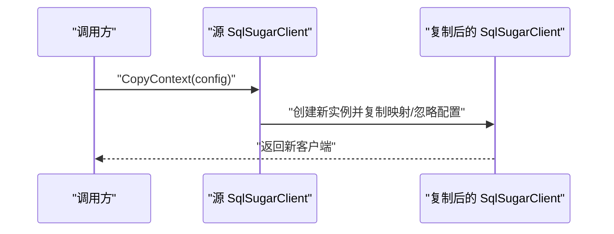
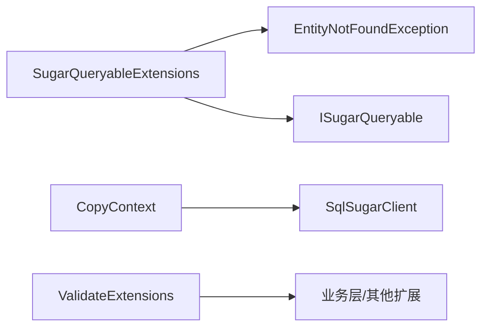
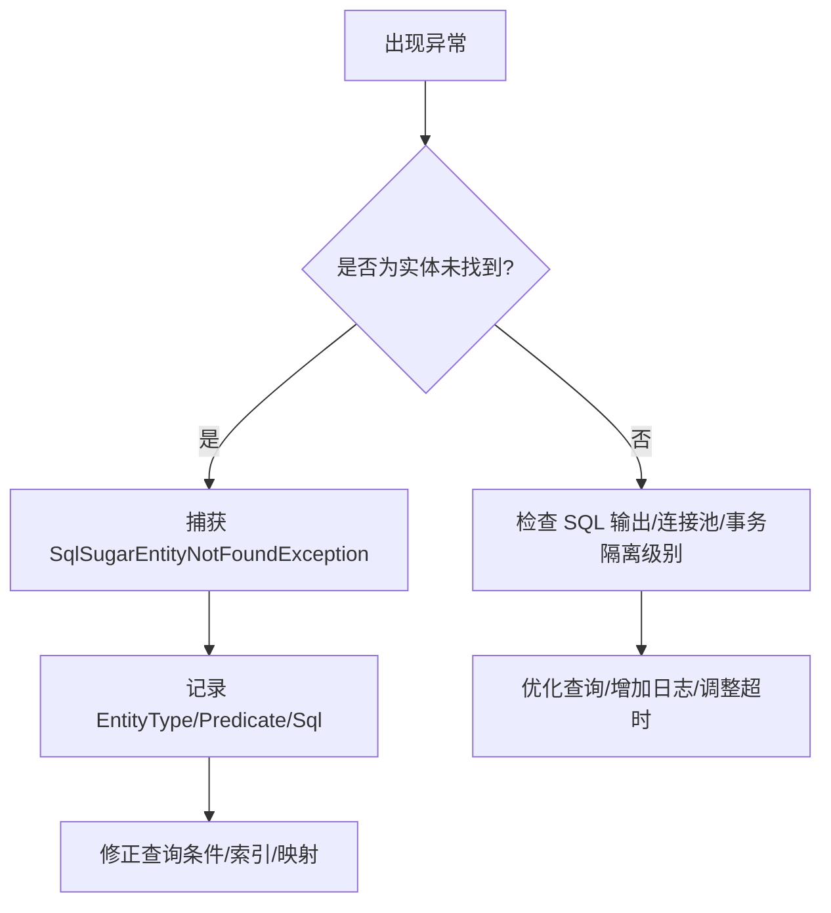

# 高级用法

<cite>
**本文引用的文件**
- [README.md](file://README.md)
- [SugarQueryableExtensions.cs](file://EasySharp.SqlSugarCore.Extensions/SugarQueryableExtensions.cs)
- [EntityNotFoundException.cs](file://EasySharp.SqlSugarCore.Extensions/EntityNotFoundException.cs)
- [SqlSugarClientExtensions.cs（ClassLibrary1）](file://ClassLibrary1/SqlSugarClientExtensions.cs)
- [ValidateExtensions.cs（ClassLibrary1）](file://ClassLibrary1/ValidateExtensions.cs)
- [SugarQueryableExtensions.cs（4.5.1）](file://EasySharp.SqlSugarCore.Extensions.4.5.1/SugarQueryableExtensions.cs)
- [ValidateExtensions.cs（4.5.1）](file://EasySharp.SqlSugarCore.Extensions.4.5.1/ValidateExtensions.cs)
- [SqlSugarClientExtensions.cs（4.0.0.3）](file://EasySharp.SqlSugarCore.Extensions.4.0.0.3/SqlSugarClientExtensions.cs)
- [SqlSugarClientExtensions.cs（4.2.1.9）](file://EasySharp.SqlSugarCore.Extensions.4.2.1.9/SqlSugarClientExtensions.cs)
- [SqlSugarClientExtensions.cs（4.3.2.4）](file://EasySharp.SqlSugarCore.Extensions.4.3.2.4/SqlSugarClientExtensions.cs)
</cite>

## 目录
1. [简介](#简介)
2. [项目结构](#项目结构)
3. [核心组件](#核心组件)
4. [架构总览](#架构总览)
5. [详细组件分析](#详细组件分析)
6. [依赖关系分析](#依赖关系分析)
7. [性能考量](#性能考量)
8. [故障排除指南](#故障排除指南)
9. [结论](#结论)
10. [附录](#附录)

## 简介
本指南聚焦于 EasySharp.SqlSugarCore.Extensions 的高级用法与最佳实践，围绕以下主题展开：
- 线程安全查询与上下文复制：如何通过复制 SqlSugarClient 上下文实现并发查询隔离，避免共享状态引发的竞态问题。
- 性能优化策略：查询性能、内存使用与缓存策略的权衡与落地建议。
- 复杂查询场景：批量操作、事务处理、连接池管理等工程化实践。
- 调试技巧与故障排除：利用扩展异常类与 SQL 输出能力快速定位问题。
- 与其他库/框架的集成模式：在实际项目中如何组合使用以提升开发效率与稳定性。

本指南基于仓库中各版本扩展文件与文档进行系统梳理，并结合 README 的使用说明给出可操作的实践建议。

## 项目结构
该仓库采用“按版本分包”的组织方式，便于对不同 SqlSugar 版本提供兼容支持；同时保留了核心扩展文件与异常定义，形成清晰的功能边界与演进轨迹。

图表来源
- [README.md:1-117](file://README.md#L1-L117)
- [SugarQueryableExtensions.cs（4.5.1）:1-108](file://EasySharp.SqlSugarCore.Extensions.4.5.1/SugarQueryableExtensions.cs#L1-L108)
- [SqlSugarClientExtensions.cs（ClassLibrary1）:1-15](file://ClassLibrary1/SqlSugarClientExtensions.cs#L1-L15)

章节来源
- [README.md:1-117](file://README.md#L1-L117)

## 核心组件
- 查询扩展（SugarQueryableExtensions）
  - 提供强类型、带业务键的查询扩展，确保查询结果存在，否则抛出包含实体类型、谓词与 SQL 的异常。
  - 支持同步与异步两种形态，覆盖 FirstRequired 与 InSingleRequired 场景。
- 实体未找到异常（SqlSugarEntityNotFoundException）
  - 继承自 InvalidOperationException，携带 EntityType、Predicate、Sql 等诊断信息，便于快速定位问题。
- 上下文复制（SqlSugarClientExtensions.CopyContext）
  - 在并发场景下复制 SqlSugarClient，复制映射列、表与忽略列配置，降低共享状态带来的风险。
- 校验工具（ValidateExtensions）
  - HasValue/IsNullOrEmpty 等辅助方法，统一空值与 DBNull 判断逻辑，减少重复代码。

章节来源
- [SugarQueryableExtensions.cs:1-94](file://EasySharp.SqlSugarCore.Extensions/SugarQueryableExtensions.cs#L1-L94)
- [EntityNotFoundException.cs:1-79](file://EasySharp.SqlSugarCore.Extensions/EntityNotFoundException.cs#L1-L79)
- [SqlSugarClientExtensions.cs（ClassLibrary1）:1-15](file://ClassLibrary1/SqlSugarClientExtensions.cs#L1-L15)
- [ValidateExtensions.cs（ClassLibrary1）:1-18](file://ClassLibrary1/ValidateExtensions.cs#L1-L18)

## 架构总览
从调用链路看，扩展方法围绕 ISugarQueryable<T> 进行封装，内部通过异步查询与异常抛出实现“强约束”的查询行为；在并发场景下，通过复制 SqlSugarClient 上下文实现隔离，避免跨请求/线程共享状态导致的不确定性。

图表来源
- [SugarQueryableExtensions.cs:9-52](file://EasySharp.SqlSugarCore.Extensions/SugarQueryableExtensions.cs#L9-L52)
- [EntityNotFoundException.cs:13-33](file://EasySharp.SqlSugarCore.Extensions/EntityNotFoundException.cs#L13-L33)

## 详细组件分析

### 查询扩展组件（SugarQueryableExtensions）
- 设计要点
  - 以 ISugarQueryable<T> 为扩展目标，提供 FirstRequiredAsync 与 InSingleRequired 的同步/异步变体，保证“必须存在”这一契约。
  - 当查询结果为空时，调用内部 ThrowNotFound 并尝试输出 ToSqlString 作为诊断依据。
- 关键流程
  - 先执行 FirstAsync/InSingleAsync 获取实体。
  - 若为空，构造异常对象并附带实体类型、谓词表达式或业务键、以及 SQL 字符串。
  - 返回非空实体，确保调用方无需再次判空。

图表来源
- [SugarQueryableExtensions.cs:9-52](file://EasySharp.SqlSugarCore.Extensions/SugarQueryableExtensions.cs#L9-L52)
- [SugarQueryableExtensions.cs:54-90](file://EasySharp.SqlSugarCore.Extensions/SugarQueryableExtensions.cs#L54-L90)

章节来源
- [SugarQueryableExtensions.cs:1-94](file://EasySharp.SqlSugarCore.Extensions/SugarQueryableExtensions.cs#L1-L94)

### 异常组件（SqlSugarEntityNotFoundException）
- 设计要点
  - 通过 BuildMessage 组合实体类型、谓词与 SQL，限制最大长度避免日志膨胀。
  - 支持序列化构造与反序列化，便于在分布式/跨进程场景传递异常信息。
- 使用建议
  - 在中间件或全局异常处理器中捕获该异常，提取 EntityType/Predicate/Sql 用于审计与告警。
  - 对于生产环境，建议将 SQL 截断后的摘要写入可观测性平台，避免敏感信息泄露。

图表来源
- [EntityNotFoundException.cs:6-51](file://EasySharp.SqlSugarCore.Extensions/EntityNotFoundException.cs#L6-L51)

章节来源
- [EntityNotFoundException.cs:1-79](file://EasySharp.SqlSugarCore.Extensions/EntityNotFoundException.cs#L1-L79)

### 上下文复制组件（SqlSugarClientExtensions.CopyContext）
- 设计要点
  - 将源客户端的 MappingColumns、MappingTables、IgnoreColumns 等配置复制到新客户端实例，确保查询映射与忽略规则一致。
  - 适用于高并发场景：每个线程/请求持有独立的 SqlSugarClient 实例，避免共享状态竞争。
- 注意事项
  - 复制仅限于配置层面，不包含连接池与底层连接；连接池管理仍需遵循 SqlSugar 的默认策略。
  - 若业务需要跨请求共享连接，请评估事务一致性与并发控制。

图表来源
- [SqlSugarClientExtensions.cs（ClassLibrary1）:5-12](file://ClassLibrary1/SqlSugarClientExtensions.cs#L5-L12)

章节来源
- [SqlSugarClientExtensions.cs（ClassLibrary1）:1-15](file://ClassLibrary1/SqlSugarClientExtensions.cs#L1-L15)

### 校验工具组件（ValidateExtensions）
- 设计要点
  - HasValue/IsNullOrEmpty 统一处理 null、DBNull 与空字符串，减少重复判断逻辑。
  - 适合在数据清洗、参数校验与条件拼接前使用，提高代码一致性与可维护性。

章节来源
- [ValidateExtensions.cs（ClassLibrary1）:1-18](file://ClassLibrary1/ValidateExtensions.cs#L1-L18)

### 版本演进与差异
- 4.5.1 版本新增
  - ToSqlString 扩展：直接输出 SQL 字符串，便于日志与诊断。
  - InSingleAsync 扩展：在 InSingle 基础上增加 Select 冲突检查与异步列表转单实体逻辑。
- 早期版本（4.0.0.3/4.2.1.9/4.3.2.4）
  - 保持 CopyContext 与 ValidateExtensions 的一致性，确保跨版本可用性。

章节来源
- [SugarQueryableExtensions.cs（4.5.1）:94-104](file://EasySharp.SqlSugarCore.Extensions.4.5.1/SugarQueryableExtensions.cs#L94-L104)
- [ValidateExtensions.cs（4.5.1）:1-13](file://EasySharp.SqlSugarCore.Extensions.4.5.1/ValidateExtensions.cs#L1-L13)
- [SqlSugarClientExtensions.cs（4.0.0.3）:1-15](file://EasySharp.SqlSugarCore.Extensions.4.0.0.3/SqlSugarClientExtensions.cs#L1-L15)
- [SqlSugarClientExtensions.cs（4.2.1.9）:1-15](file://EasySharp.SqlSugarCore.Extensions.4.2.1.9/SqlSugarClientExtensions.cs#L1-L15)
- [SqlSugarClientExtensions.cs（4.3.2.4）:1-15](file://EasySharp.SqlSugarCore.Extensions.4.3.2.4/SqlSugarClientExtensions.cs#L1-L15)

## 依赖关系分析
- 组件耦合
  - SugarQueryableExtensions 依赖 EntityNotFoundException 与 ISugarQueryable<T> 的异步接口。
  - CopyContext 依赖 SqlSugarClient 与 ConnectionConfig，复制其配置集合。
  - ValidateExtensions 为内部工具，被其他扩展或业务层复用。
- 外部依赖
  - 依赖 SqlSugarCore（5.0.8.2+），通过 ToSql/ToSqlString 获取 SQL 文本。
- 版本兼容
  - 不同版本包提供相同 API 名称，但实现细节可能有差异（如 4.5.1 新增 ToSqlString/InSingleAsync）。

图表来源
- [SugarQueryableExtensions.cs:1-94](file://EasySharp.SqlSugarCore.Extensions/SugarQueryableExtensions.cs#L1-L94)
- [EntityNotFoundException.cs:1-79](file://EasySharp.SqlSugarCore.Extensions/EntityNotFoundException.cs#L1-L79)
- [SqlSugarClientExtensions.cs（ClassLibrary1）:1-15](file://ClassLibrary1/SqlSugarClientExtensions.cs#L1-L15)
- [ValidateExtensions.cs（ClassLibrary1）:1-18](file://ClassLibrary1/ValidateExtensions.cs#L1-L18)

章节来源
- [README.md:111-117](file://README.md#L111-L117)

## 性能考量
- 查询性能
  - 使用 FirstRequiredAsync/InSingleRequiredAsync 替代先查询后判空的模式，减少一次显式 null 判定开销。
  - 对高频查询建立合适的索引，避免全表扫描；必要时使用 ToSqlString 输出 SQL 进行 EXPLAIN 分析。
- 内存使用
  - 避免一次性加载大结果集，优先使用分页或投影查询；在 4.5.1 中可借助 InSingleAsync 的单实体返回策略降低中间集合占用。
  - 合理使用 Select 投影，减少不必要的字段传输与序列化成本。
- 缓存策略
  - 对热点只读数据可引入应用层缓存（如 MemoryCache），结合弱一致性与 TTL 控制。
  - 对于频繁变更的数据，避免缓存命中导致脏读；可采用“读写锁/乐观并发”策略。
- 并发与上下文隔离
  - 使用 CopyContext 为每个线程/请求创建独立 SqlSugarClient 实例，避免共享状态竞争。
  - 在高并发场景下，结合连接池配置与超时设置，防止阻塞与资源耗尽。

## 故障排除指南
- 常见问题与定位
  - 实体未找到：捕获 SqlSugarEntityNotFoundException，查看 EntityType/Predicate/Sql 字段，确认查询条件与 SQL 是否符合预期。
  - SQL 输出失败：GetSqlString 中已做容错处理，若 ToSqlString 抛异常可忽略，但仍可通过日志定位问题。
  - 查询冲突：在 4.5.1 的 InSingleAsync 中，若同时使用 Select 会触发异常提示，应调整查询链路。
- 调试技巧
  - 在开发环境启用详细日志，记录 ToSqlString 与异常堆栈。
  - 使用单元测试/集成测试验证 FirstRequiredAsync/InSingleRequiredAsync 的边界条件（空结果、多结果、异常路径）。
  - 结合 ValidateExtensions 的 HasValue/IsNullOrEmpty 统一空值处理，减少因空值导致的隐性错误。
- 排障流程图

图表来源
- [EntityNotFoundException.cs:53-77](file://EasySharp.SqlSugarCore.Extensions/EntityNotFoundException.cs#L53-L77)
- [SugarQueryableExtensions.cs:76-90](file://EasySharp.SqlSugarCore.Extensions/SugarQueryableExtensions.cs#L76-L90)
- [SugarQueryableExtensions.cs（4.5.1）:99-104](file://EasySharp.SqlSugarCore.Extensions.4.5.1/SugarQueryableExtensions.cs#L99-L104)

章节来源
- [EntityNotFoundException.cs:1-79](file://EasySharp.SqlSugarCore.Extensions/EntityNotFoundException.cs#L1-L79)
- [SugarQueryableExtensions.cs:76-90](file://EasySharp.SqlSugarCore.Extensions/SugarQueryableExtensions.cs#L76-L90)
- [SugarQueryableExtensions.cs（4.5.1）:99-104](file://EasySharp.SqlSugarCore.Extensions.4.5.1/SugarQueryableExtensions.cs#L99-L104)

## 结论
EasySharp.SqlSugarCore.Extensions 通过强约束的查询扩展与完善的异常信息，显著提升了数据库访问的确定性与可观测性；配合上下文复制与校验工具，可在高并发与复杂业务场景下获得更好的稳定性与可维护性。建议在实际项目中：
- 将 FirstRequiredAsync/InSingleRequiredAsync 作为默认查询模式，减少空值分支。
- 使用 CopyContext 实现并发隔离，避免共享状态引发的竞态。
- 借助 ToSqlString 与异常诊断信息持续优化查询与索引。
- 在热点数据上引入应用层缓存，并结合版本/时间戳策略保证一致性。

## 附录
- 快速参考
  - 查询扩展 API：FirstRequiredAsync、FirstRequiredAsync(条件)、InSingleRequired、InSingleRequiredAsync。
  - 异常类型：SqlSugarEntityNotFoundException，包含 EntityType、Predicate、Sql。
  - 上下文复制：CopyContext(config)，复制映射与忽略配置。
  - 校验工具：HasValue、IsNullOrEmpty。
- 版本对照
  - 4.5.1：新增 ToSqlString、InSingleAsync。
  - 4.0.0.3/4.2.1.9/4.3.2.4：保持 CopyContext 与 ValidateExtensions 一致。

章节来源
- [README.md:92-117](file://README.md#L92-L117)
- [SugarQueryableExtensions.cs（4.5.1）:94-104](file://EasySharp.SqlSugarCore.Extensions.4.5.1/SugarQueryableExtensions.cs#L94-L104)
- [ValidateExtensions.cs（4.5.1）:1-13](file://EasySharp.SqlSugarCore.Extensions.4.5.1/ValidateExtensions.cs#L1-L13)
- [SqlSugarClientExtensions.cs（ClassLibrary1）:1-15](file://ClassLibrary1/SqlSugarClientExtensions.cs#L1-L15)
- [ValidateExtensions.cs（ClassLibrary1）:1-18](file://ClassLibrary1/ValidateExtensions.cs#L1-L18)